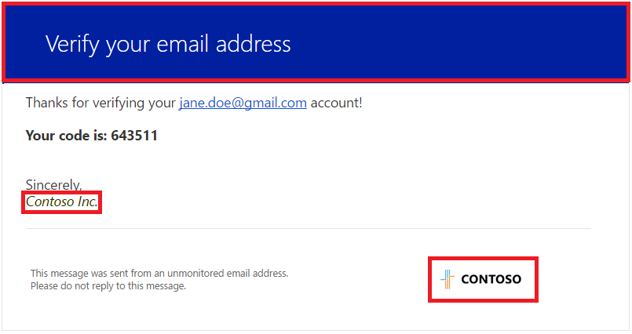

<properties
    pageTitle="Azure-Active Directory-B2C: Häufig gestellte Fragen | Microsoft Azure"
    description="Häufig gestellte Fragen zur Azure Active Directory B2C"
    services="active-directory-b2c"
    documentationCenter=""
    authors="swkrish"
    manager="mbaldwin"
    editor="bryanla"/>

<tags
    ms.service="active-directory-b2c"
    ms.workload="identity"
    ms.tgt_pltfrm="na"
    ms.devlang="na"
    ms.topic="article"
    ms.date="08/09/2016"
    ms.author="swkrish"/>

# Azure-Active Directory B2C: häufig gestellte Fragen

Auf dieser Seite finden Sie Antworten auf häufig gestellte Fragen zu den B2C Azure Active Directory (Azure AD). Aktivieren Sie behalten wieder nach Updates suchen.

### Kann ich in meinem vorhandenen, Mitarbeiter-basierten Azure AD-Mandanten Azure AD B2C Features verwenden?

Zurzeit können keine Azure AD B2C-Features in Ihrem vorhandenen Azure AD-Mandanten aktiviert werden. Es empfiehlt sich, dass Sie einen separaten Mandanten zum Verwenden von Azure AD B2C-Features zum Verwalten Ihrer Nutzer erstellen.

### Kann ich Azure AD B2C mithilfe bereitstellen für soziale Netzwerke Login (Facebook und Google +) in Office 365?

Azure AD B2C kann nicht mit Microsoft Office 365 verwendet werden. In der Regel kann verwendet werden, für die Authentifizierung auf alle apps SaaS (Office 365, Vertrieb, Arbeitstag usw.). Es bietet Identität und Access Management nur für Consumer zugänglichen Web- und Windows-Dienste und gilt nicht für Mitarbeiter oder Partner Szenarien.

### Was sind lokale Konten in Azure AD B2C? Wie sie sich von geschäftlichen oder schulnotizbücher Konten in Azure AD unterscheiden?

In einem Azure AD-Mandanten jeder Benutzer in den Mandanten (außer Benutzer mit einem vorhandenen Microsoft-Konto), die mit einer e-Mail-Adresse des Formulars signiert `<xyz>@<tenant domain>`, wobei `<tenant domain>` ist eine der überprüften Domänen in den Mandanten oder den ursprünglichen `<...>.onmicrosoft.com` Domäne. Diese Art von Konto ist ein geschäftlichen oder schulnotizbücher-Konto an.

In einem B2C von Azure AD-Mandanten die meisten apps soll der Benutzer melden Sie sich mit jeder beliebigen e-Mail-Adresse (beispielsweise joe@comcast.net, bob@gmail.com, sarah@contoso.com, oder jim@live.com). Diese Art von Konto ist ein lokales Konto an. Heute unterstützen wir zufällige Benutzernamen (nur einfarbigen Zeichenfolgen) auch als lokale Konten (z. B. Helmut, Bob, Saskia oder Jim). Sie können eine der folgenden beiden lokalen Kontotypen Azure AD B2C Dienst auswählen.

### Welche sozialen Identitätsanbieter unterstützen Sie jetzt? Planen welche Sie in Zukunft zu unterstützen?

Wir unterstützen derzeit Facebook, Google +, LinkedIn und Amazon. Wir fügen Sie Unterstützung für andere beliebte sozialen Identitätsanbieter basierend auf Kunden bei Bedarf.

### Kann ich die Bereiche, um weitere Informationen zu Nutzer von verschiedenen sozialen Identitätsanbieter sammeln konfigurieren?

Nein, aber dieses Feature ist in unseren Wegweiser. Die Standard-Bereiche für unsere unterstützte Gruppe von sozialen Identitätsanbieter verwendet werden:

- Facebook: e-Mail
- Google +: e-Mail
- Microsoft-Konto: Openid e-Mail-Profil
- Amazon: Profil
- LinkedIn: R_emailaddress, r_basicprofile

### Hat meine Anwendung für sie arbeiten mit Azure AD B2C auf Azure ausgeführt werden soll

Nein, können Sie die Anwendung an einer beliebigen Stelle (in der Cloud oder lokal) hosten. Es muss Interaktion mit Azure AD B2C lediglich die Möglichkeit zum Senden und Empfangen von HTTP-Anfragen auf öffentlich zugängliche Endpunkte.

### Ich habe mehrere B2C von Azure AD-Mandanten. Wie kann ich diese Azure-Portal verwalten?

Jede Azure AD B2C Mandanten weist einen eigenen B2C Features Blade Azure-Portal. Finden Sie unter [Azure AD B2C: Registrieren Ihrer Anwendung](active-directory-b2c-app-registration.md#navigate-to-the-b2c-features-blade) , wenn Sie wissen, wie Sie zu einem bestimmten Mandanten B2C Features Blade Azure-Portal navigieren können. Umschalten zwischen Azure AD B2C Verzeichnisse Azure-Portal werden nicht beibehalten Ihre B2C Features Blade in den meisten Browsern öffnen.

### Wie kann ich die Überprüfung e-Mails anpassen (den Inhalt und das "von:" Feld) von Azure AD B2C gesendet?

Das [Unternehmen branding Feature](../active-directory/active-directory-add-company-branding.md) können Sie den Inhalt der Überprüfung e-Mails anpassen. Insbesondere können diese zwei Elemente der e-Mail angepasst werden:

- **Banner Logo**: auf der rechten unteren Ecke angezeigt wird.
- **Hintergrundfarbe**: oben angezeigt.

    

Die e-Mail-Signatur enthält den B2C-Mandanten Namen, den Sie bei der Erstellung des B2C-Mandanten. Sie können den Namen anhand der folgenden Schritte ändern:

- Melden Sie sich bei der [Azure klassischen Portal](https://manage.windowsazure.com/) als Abonnement-Administrator.
- Navigieren Sie zu Ihrem Mandanten B2C.
- Klicken Sie auf die Registerkarte **Konfigurieren** .
- Ändern Sie das Feld **Name** , klicken Sie im Abschnitt **Directory-Eigenschaften** an.
- Klicken Sie auf **Speichern** , am unteren Rand der Seite.

Derzeit gibt es keine Möglichkeit zum Ändern der "von:" auf die e-Mail-Feld. Wenn Sie diese Funktion und vollständig anpassbaren Hauptteil der Überprüfung e-Mail interessiert sind, stimmen Sie gehen Sie wie folgt für das Feature für [UserVoice](https://feedback.azure.com/forums/169401-azure-active-directory/suggestions/15334335-fully-customizable-verification-emails)auf.

### Wie kann ich meine vorhandene Benutzernamen, Kennwörter und Profile aus einer Datenbank zur Azure AD B2C migrieren?

Die Azure AD Graph-API können Sie Ihre aktuellen Migrationstools für schreiben. Finden Sie in der [Stichprobe Graph-API](active-directory-b2c-devquickstarts-graph-dotnet.md) Details. Wir werden verschiedene Optionen für die Migration – und Tools Out-of-the-Box in der Zukunft bieten.

### Welche Kennwortrichtlinien für lokale Konten in Azure AD B2C verwendet wird?

Der Azure AD B2C Kennwortrichtlinien für lokale Konten basiert auf die Richtlinie für Azure AD. Azure AD B2C der Anmeldung, Anmeldung oder Anmeldung und das Kennwort zurücksetzen Richtlinien verwendet die Stärke der "sicheren" Kennwort und keine Kennwörter ablaufen. Lesen Sie die [Kennwortrichtlinien Azure AD-](https://msdn.microsoft.com/library/azure/jj943764.aspx) Weitere Details an.

### Kann ich mithilfe von Azure AD verbinden Consumer Identitäten migrieren, die auf meinem lokalen Active Directory zu Azure AD B2C gespeichert werden?

Nein, Azure AD verbinden ist nicht für die Arbeit mit Azure AD B2C konzipiert. Wir werden verschiedene Optionen für die Migration – und Tools Out-of-the-Box in der Zukunft bieten.

### Funktioniert Azure AD B2C mit wie Microsoft Dynamics CRM-Systemen?

Zurzeit nicht. Diese Systeme integrieren, unsere Roadmap ist.

### Unterstützt Azure AD B2C mit SharePoint lokal 2016 oder einer früheren Version?

Zurzeit nicht. Azure AD B2C verfügen keine Unterstützung für SAML 1.1 Token, die communityportalen und e-Commerce-Applikationen auf SharePoint lokal müssen. Beachten Sie, dass Azure AD B2C nicht für die SharePoint externe Partner Freigabe Szenario bestimmt ist; Lesen Sie stattdessen [Azure AD B2B](http://blogs.technet.com/b/ad/archive/2015/09/15/learn-all-about-the-azure-ad-b2b-collaboration-preview.aspx) .

### Sollte ich zum Verwalten von externer Identitäten Azure AD B2C oder B2B verwenden?

Lesen Sie diesen Artikel über [externe Identitäten](../active-directory/active-directory-b2b-compare-external-identities.md) erfahren Sie mehr über die entsprechenden Features für Ihre externe Identität Szenarios anwenden.

### Welche Berichterstattung und Überwachungsfunktionen bietet Azure AD B2C? Sind sie dieselben wie in Azure AD Premium?

Nein, unterstützt Azure AD B2C demselben Satz von Berichten als Azure AD Premium nicht. Grundlegende Berichterstattung und APIs bald Überwachung wird Azure AD B2C veröffentlichen.

### Kann ich die Benutzeroberfläche von Azure AD B2C verarbeiteten Seiten lokalisiert? Welche Sprachen werden unterstützt?

Derzeit ist Azure AD B2C nur für Englisch optimiert. Wir planen Lokalisierungsfeatures so früh wie möglich bereit.

### Kann ich eigene URLs auf Meine Anmeldung und-Anmeldung Seiten verwenden, die Azure AD B2C realisiert werden? Ändern ich kann beispielsweise die URL aus login.microsoftonline.com in login.contoso.com?

Zurzeit nicht. Dieses Feature ist in unseren Wegweiser. Beachten Sie auch, dass die Überprüfung Ihrer Domäne in Ihrem Mandanten im klassischen Azure-Portal die Registerkarte **Domänen** dies nicht vorgesehen ist.

### Wie kann ich meine B2C von Azure AD-Mandanten löschen?

Wie folgt vor, um Ihre B2C von Azure AD-Mandanten zu löschen:

- Wie folgt vor, [Navigieren Sie zu dem B2C Features Blade](active-directory-b2c-app-registration.md#navigate-to-the-b2c-features-blade) Azure-Portal an.
- Navigieren Sie zu der Blades **Applications**, **Identitätsanbieter** und **alle Richtlinien** , und löschen Sie alle Einträge in jeder von ihnen.
- Jetzt melden Sie sich bei der [Azure klassischen Portal](https://manage.windowsazure.com/) als Abonnement-Administrator. (Dies ist die gleiche Arbeit oder Schule Konto oder dem Microsoft-Konto, das Sie zur Anmeldung bei Azure verwendet).
- Navigieren Sie zu der Active Directory-Erweiterung auf der linken Seite, und klicken Sie auf Ihrem Mandanten B2C.
- Klicken Sie auf die Registerkarte **Benutzer** .
- Wählen Sie jeden Benutzer im Gegenzug (Ausschließen der Benutzer, die Sie zurzeit als, d. h. Abonnement-Administrator angemeldet sind). Klicken Sie auf **Löschen** , am unteren Rand der Seite, und klicken Sie auf **Ja,** Wenn Sie dazu aufgefordert werden.
- Klicken Sie auf die Registerkarte **Applications** .
- Wählen Sie im Feld Dropdown- **Anzeigen von** **Applications wurde von meiner Firma zugegriffen** aus, und klicken Sie auf das Häkchen.
- Eine Anwendung namens **b2c-Erweiterungen-app** aufgeführten wird angezeigt. Klicken Sie auf **Löschen** , am unteren Rand der Seite, und klicken Sie auf **Ja,** Wenn Sie dazu aufgefordert werden.
- Navigieren Sie zu der Active Directory-Erweiterung erneut, und wählen Sie Ihre B2C-Mandanten.
- Klicken Sie auf am unteren Rand der Seite **Löschen** . Folgen Sie den Anweisungen auf dem Bildschirm, um den Vorgang abzuschließen.

### Kann ich Azure AD B2C als Teil des Enterprise Mobilität Suite erhalten?

Nein, Azure AD B2C ist eine nutzungsbasierte Azure Service und nicht Teil Enterprise Mobilität Suite ist.

### Wie melde ich Probleme mit Azure AD B2C?

Finden Sie unter [Datei Anfragen für Azure Active Directory B2C zu unterstützen](active-directory-b2c-support.md).

## Weitere Informationen

Sie möchten möglicherweise auch aktuelle [diensteinschränkungen, Einschränkungen, und Einschränkungen](active-directory-b2c-limitations.md)zu überprüfen.
