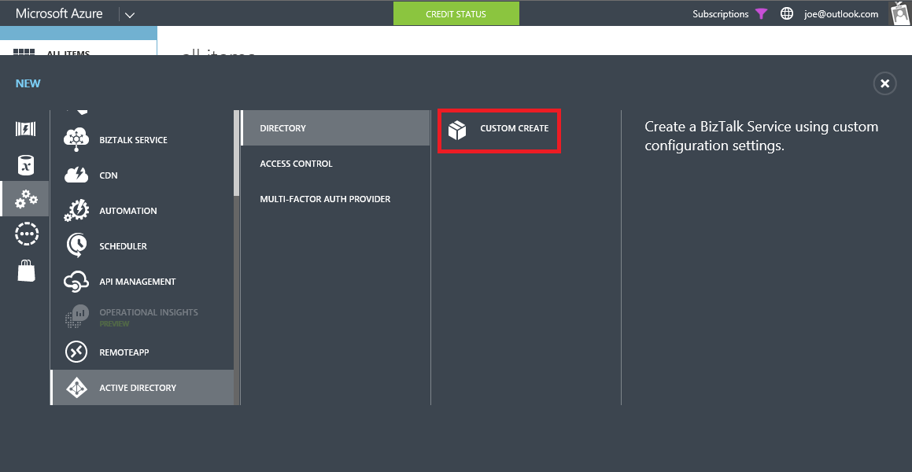
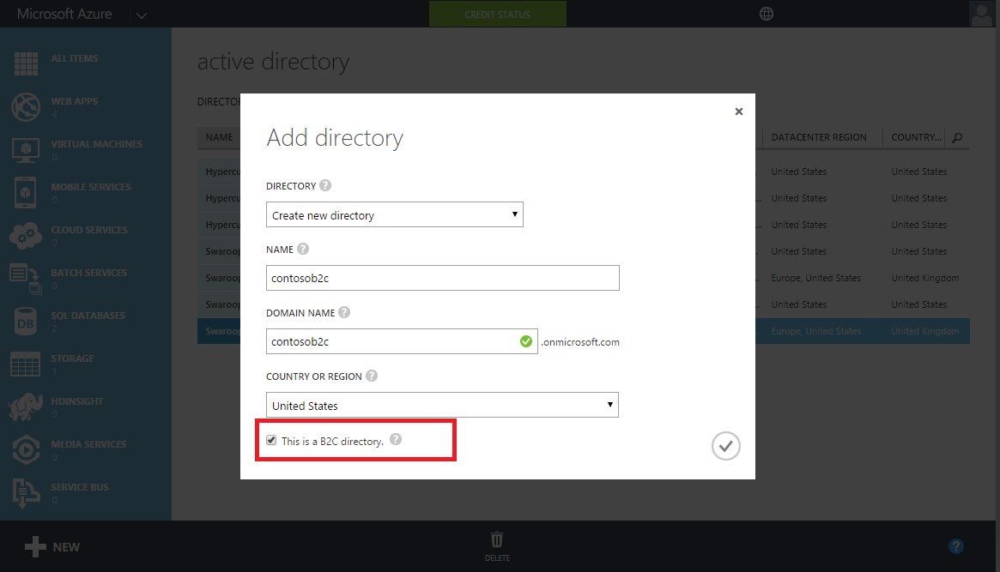
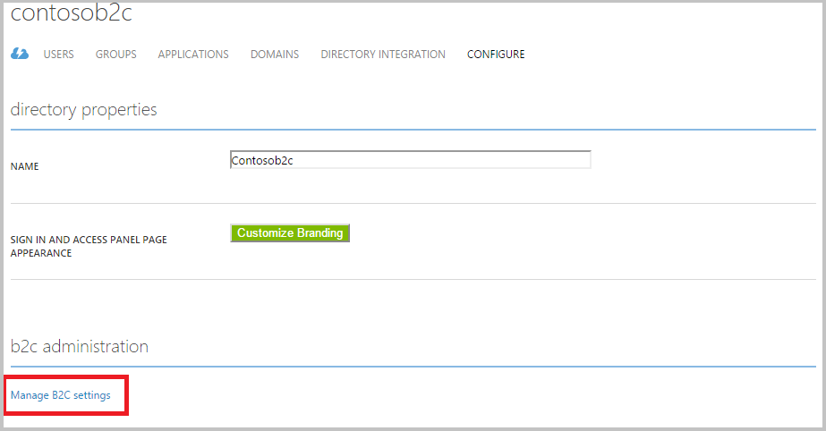
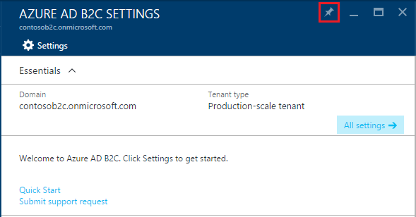
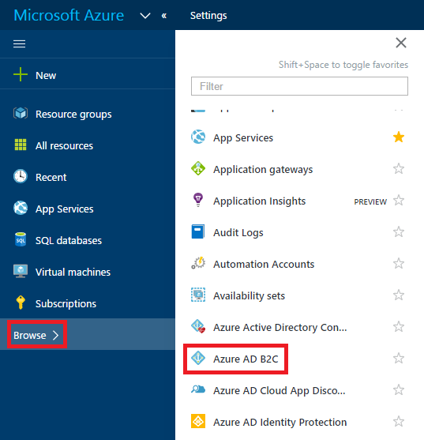

<properties
    pageTitle="Azure Active Directory B2C: Erstellen einer Azure Active Directory B2C Mandanten | Microsoft Azure"
    description="Ein Thema zum Erstellen einer Azure Active Directory B2C-Mandanten"
    services="active-directory-b2c"
    documentationCenter=""
    authors="swkrish"
    manager="mbaldwin"
    editor="bryanla"/>

<tags
    ms.service="active-directory-b2c"
    ms.workload="identity"
    ms.tgt_pltfrm="na"
    ms.topic="article"
    ms.devlang="na"
    ms.date="08/30/2016"
    ms.author="swkrish"/>

# Azure Active Directory B2C: Erstellen einer B2C von Azure AD-Mandanten

Führen Sie zum Verwenden von Microsoft Azure-Active Directory (Azure AD) B2C, die in diesem Artikel beschriebenen drei Schritte aus.

## Schritt 1: Melden Sie für ein Azure-Abonnement an

Wenn Sie bereits ein Azure-Abonnement verfügen, überspringen Sie diesen Schritt. Wenn dies nicht der Fall ist, melden Sie sich bei einem [Azure-Abonnement](../active-directory/sign-up-organization.md) und Zugriff auf Azure AD B2C.

## Schritt 2: Erstellen einer B2C von Azure AD-Mandanten

Gehen Sie folgendermaßen vor, um einen neuen B2C von Azure AD-Mandanten zu erstellen. Zurzeit können keine B2C-Features in Ihrer vorhandenen Mandanten aktiviert werden.

1. Melden Sie sich bei der [Azure klassischen Portal](https://manage.windowsazure.com/) als Abonnement-Administrator. Dies ist die gleiche Arbeit oder Schule Konto oder dem Microsoft-Konto, das Sie zur Anmeldung bei Azure verwendet.
2. Klicken Sie auf **neue** > **App Services** > **Active Directory** > **Verzeichnis** > **benutzerdefinierte erstellen**.

    

3. Wählen Sie den **Namen**, **Domänennamen** und **Land / Region** des Mandanten aus.
4. Aktivieren Sie die Option, die besagt **Dies ist ein B2C-Verzeichnis**ein.
5. Klicken Sie auf das Häkchen, um die Aktion abzuschließen.

    

6. Ihrem Mandanten ist nun erstellt und in der Active Directory-Erweiterung angezeigt wird. Sie werden außerdem ein globaler Administrator für den Mandanten erstellt. Sie können andere globale Administratoren nach Bedarf hinzufügen.

    > [AZURE.IMPORTANT]
    Wenn Sie beabsichtigen, einen Mandanten B2C für eine app Herstellung verwenden, lesen Sie den Artikel auf [Herstellung-Skala im Vergleich zu Vorschau B2C Mandanten](active-directory-b2c-reference-tenant-type.md). Notiz, bei denen es Probleme beim Löschen einer vorhandenen B2C Mandanten und mit dem gleichen Domänennamen neu erstellen. Sie müssen einen Mandanten B2C mit einem anderen Domänennamen zu erstellen.

## Schritt 3: Navigieren Sie zu dem B2C Features Blade Azure-Portal

1. Navigieren Sie zu der Active Directory-Erweiterung auf der Navigationsleiste auf der linken Seite.
2. Suchen nach Ihrem Mandanten unter der Registerkarte **Verzeichnis** aus, und klicken Sie darauf.
3. Klicken Sie auf die Registerkarte **Konfigurieren** .
4. Klicken Sie auf den Link **Verwalten B2C Einstellungen** im Abschnitt **B2C-Verwaltung** .

    

5. Das Azure-Portal mit B2C Features Falz mit wird in eine neue Browserregisterkarte oder Fenster geöffnet.

    > [AZURE.IMPORTANT]
    Es kann bis zu 2-3 Minuten für Ihren Mandanten Azure-Portal zugänglich sein dauern. Wiederholen diese Schritte aus, nachdem einige Zeit dieses Problem behoben werden. Wenn dies nicht der Fall ist, wenden Sie sich an Support.

6. Heften Sie diese Blade in Ihrem Startboard Zugriff zu erleichtern an. (Das Tool Pin wird in der oberen rechten Ecke des Features Blades roter markiert.)

    

    > [AZURE.NOTE]
    Sie können Benutzer und Gruppen, Self-service-Kennwort zurücksetzen Konfiguration und Unternehmen branding Features von Ihrem Mandanten in [Azure klassischen Portal](https://manage.windowsazure.com/)verwalten.

## Den einfachen Zugriff auf das B2C Features Blade Azure-Portal

Um die Auffindbarkeit zu verbessern, haben wir eine Verknüpfung zu der B2C Features Blade Azure-Portal hinzugefügt.

1. Melden Sie sich in der Azure-Portal als globaler Administrator von Ihrem Mandanten B2C an. Wenn Sie bereits in einem anderen Mandanten angemeldet sind, wechseln Sie Mandanten (in der oberen rechten Ecke).
2. Klicken Sie in der linken Navigationsleiste auf **Durchsuchen** .
3. Klicken Sie auf **Azure AD B2C** , um das B2C Features Blade zuzugreifen.

    

## Nächste Schritte

Erfahren Sie, wie eine Anwendung mit Azure AD B2C registrieren und erstellen eine Anwendung Schnellstart durch Lesen [Azure Active Directory B2C: Registrieren Ihrer Anwendung](active-directory-b2c-app-registration.md).
