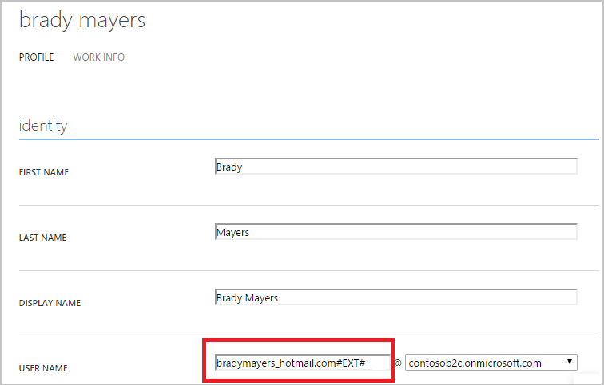

<properties
    pageTitle="Azure Active Directory B2C: Einschränkungen und Einschränkungen | Microsoft Azure"
    description="Eine Liste der Einschränkungen und Einschränkungen mit Azure Active Directory B2C"
    services="active-directory-b2c"
    documentationCenter=""
    authors="swkrish"
    manager="mbaldwin"
    editor="bryanla"/>

<tags
    ms.service="active-directory-b2c"
    ms.workload="identity"
    ms.tgt_pltfrm="na"
    ms.devlang="na"
    ms.topic="article"
    ms.date="07/24/2016"
    ms.author="swkrish"/>

# Azure Active Directory B2C: Einschränkungen und Einschränkungen

Es gibt verschiedene Features und Funktionen von B2C Azure Active Directory (Azure AD), die noch nicht unterstützt werden. Viele dieser bekannte Probleme und Einschränkungen werden vorwärts berücksichtigt werden, aber Sie sollten sie stets bewusst sein, wenn Sie Consumer zugänglichen Applikationen mit Azure AD B2C erstellen.

## Probleme bei der Erstellung des B2C von Azure AD-Mandanten

Wenn Sie während der [Erstellung von einem Mandanten Azure AD B2C](active-directory-b2c-get-started.md)Probleme auftreten, finden Sie unter [Erstellen einer Azure AD-Mandanten oder einem B2C von Azure AD-Mandanten – Probleme und Lösungen](active-directory-b2c-support-create-directory.md) für Anleitungen.

Notiz, bei denen es Probleme beim Löschen einer vorhandenen B2C Mandanten und mit dem gleichen Domänennamen neu erstellen. Sie müssen einen Mandanten B2C mit einem anderen Domänennamen zu erstellen.

## Hinweis zu B2C Mandanten Kontingenten

Standardmäßig ist die Anzahl der Benutzer in einen Mandanten B2C auf 50.000 Benutzer beschränkt. Wenn Sie das Kontingent von Ihrem Mandanten B2C auslösen müssen, sollten Sie Support wenden.

## Klicken Sie auf Überprüfung e-Mail brandingproblemen

Die standardmäßige Überprüfung e-Mail enthält Microsoft branding. Wir werden es in Zukunft entfernt. Jetzt können Sie es mit dem [Unternehmen branding Features](../active-directory/active-directory-add-company-branding.md)entfernen.

## Einschränkungen Applikationen

Die folgenden Arten von Applications wurde, werden in Azure AD B2C derzeit nicht unterstützt. Eine Beschreibung der unterstützten Typen von Applications, finden Sie unter [Azure AD B2C: Typen von Applications](active-directory-b2c-apps.md).

### Einzelseite Applikationen (JavaScript)

Viele moderne Clientanwendungen haben eine einzelne Seite Anwendung (gesicherte KENNWORTAUTHENTIFIZIERUNG) Front-End-, die hauptsächlich in JavaScript geschrieben ist und häufig verwendet eine gesicherte KENNWORTAUTHENTIFIZIERUNG Framework wie AngularJS, Ember.js, Durandal. Dieser Fluss ist noch nicht in Azure AD B2C verfügbar.

### Daemons / serverseitigen Applikationen

Anwendungen, die lange Prozesse enthalten oder bearbeitet werden ohne die Anwesenheitsinformationen eines Benutzers, benötigen ferner eine Möglichkeit zum Zugreifen auf gesicherte Ressourcen, wie z. B. Web-APIs. Diese Anwendungen können authentifizieren und Token mithilfe der Anwendung Identität (anstelle eines Consumer delegierten Identität) im [OAuth 2.0 Client Anmeldeinformationen Fluss](active-directory-b2c-reference-protocols.md#oauth2-client-credentials-grant-flow)abrufen. Dieser Fluss ist noch nicht verfügbar in Azure AD B2C, damit jetzt Applications Token erst nach einer interaktiven Consumer Anmeldung Fluss aufgetreten ist abrufen können.

### Eigenständige Web-APIs

In der Azure AD B2C haben Sie die Möglichkeit, [Erstellen Sie eine Web-API, die mithilfe von OAuth 2.0 Token gesichert wird](active-directory-b2c-apps.md#web-apis). Die Web-API nur werden jedoch Token von einem Client empfangen, das die gleiche Anwendung ID teilt Erstellen eine Web-API, die aus unterschiedlichen Clients zugegriffen werden kann, wird nicht unterstützt.

### Web-API Ketten (im Auftrag von)

Viele Architekturen enthalten eine Web-API, die eine andere untergeordneten Web-API, beide durch Azure AD B2C gesicherte anrufen muss. Dieses Szenario wird häufig in einer systemeigenen-Clients, die ein Web-API Back-End aufweisen, wodurch wiederum ein Microsoft-Onlinedienst wie die Azure AD Graph-API aufgerufen.

Dieses Szenario der verketteten Web-API kann mithilfe der OAuth 2.0 Jwt Person Anmeldeinformationen erteilen, andernfalls bekannt als fortlaufendes auf Auftrag von unterstützt werden. Auf Auftrag von illustrieren ist jedoch nicht derzeit in der Azure AD B2C implementiert.

## Einschränkung auf Bibliotheken und SDKs

Festlegen von Microsoft unterstützte Bibliotheken, die Azure AD B2C arbeiten ist zu diesem Zeitpunkt sehr beschränkt. Wir haben Support für .NET Framework-basierte Web apps und Dienste als auch NodeJS Web apps und Dienste.  Wir haben auch eine Vorschau .NET Clientbibliothek bekannt als MSAL, die mit Azure AD B2C in Windows und andere apps .NET verwendet werden kann.

Wir haben derzeit keine Unterstützung für andere Sprachen oder Plattformen, einschließlich iOS und Android Bibliothek.  Wenn Sie auf einer anderen Plattform als den oben genannten erstellen möchten, empfehlen wir ein offener Quelle SDK, verweisen auf unsere [OAuth 2.0 und OpenID verbinden Protokoll verweisen](active-directory-b2c-reference-protocols.md) nach Bedarf.  Azure AD B2C implementiert OAuth & OpenID verbinden, wodurch es möglich, eine generische OAuth oder Verbinden OpenID Bibliothek zur Integration von verwendet wird.

Unsere iOS und Android Schnellstart-Lernprogramme verwenden Kompatibilität mit Azure AD B2C Open Source-Bibliotheken, die wir getestet haben.  Alle unsere Schnellstart-Lernprogramme stehen unseren Bereich [Erste Schritte](active-directory-b2c-overview.md#getting-started) .

## Klicken Sie auf Protokolle Einschränkung

Azure AD B2C unterstützt OpenID verbinden und OAuth 2.0. Jedoch nicht alle Features und Funktionen für die verschiedenen Protokolle implementiert wurden. Zum besseren Verständnis des Gültigkeitsbereichs von unterstützte Protokoll-Funktionalität in Azure AD B2C, lesen Sie unseren [OpenID verbinden und OAuth 2.0-Protokoll Bezug](active-directory-b2c-reference-protocols.md). Unterstützung von SAML und WS-eingezogen Protokolle ist nicht verfügbar.

## Einschränkung auf Token

Viele der Token ausgestellt von Azure AD B2C werden als JSON Web Token oder JWTs implementiert. Es ist jedoch in JWTs (als "Ansprüche" bezeichnet) enthaltenen Informationen werden nicht alle ganz wie es sollten oder nicht vorhanden ist. Einige Beispiele für die "Sub" und "Preferred_username" Claims.  Als Werte, Format oder Bedeutung der Ansprüche Änderung über einen Zeitraum bleibt Token für Ihre vorhandenen Richtlinien nicht betroffen: Sie können auf ihre Werte in der Herstellung apps verlassen.  Wie Werte ändern, werden wir Sie die Möglichkeit, diese Änderungen für jede Ihrer Richtlinien konfigurieren können.  Lesen Sie zum besseren Verständnis die zurzeit vom Dienst Azure AD B2C ausgegeben Token durch unsere [token Bezug](active-directory-b2c-reference-tokens.md).

## Einschränkung auf geschachtelte Gruppen

Geschachtelte Gruppenmitgliedschaften werden nicht in Azure AD B2C Mandanten unterstützt. Wir planen nicht, um diese Funktion hinzuzufügen.

## Einschränkung Differenz Abfrage Feature zur Azure AD Graph-API

Die [Differenz Abfrage Feature zur Azure AD Graph-API](https://msdn.microsoft.com/library/azure/ad/graph/howto/azure-ad-graph-api-differential-query) wird in Azure AD B2C Mandanten nicht unterstützt. Dies ist auf unsere langfristiges Wegweiser.

## Probleme bei der Verwaltung der Benutzer im klassischen Azure-Portal

B2C-Features werden im Azure-Portal zugegriffen. Im klassische Azure-Portal können Sie jedoch andere Mandanten-Features, einschließlich der Benutzermanagement zuzugreifen. Es gibt derzeit verschiedene bekannte Probleme mit dem Benutzermanagement (die Registerkarte **Benutzer** ) im klassischen Azure-Portal:

- Für einen Benutzer lokales Konto (d. h., die mit einer e-Mail-Adresse und Ihr Kennwort ein, oder einen Benutzernamen und Kennwort anmeldet Consumer) wird nicht das Feld **User Name** der Anmeldung Bezeichner (e-Mail-Adresse oder Benutzername) entsprechen, die bei der Anmeldung verwendet wurde. Dies ist, da das Feld im klassischen Azure-Portal angezeigt tatsächlich die wichtigsten UPN (User Name), die nicht in B2C Szenarien verwendet wird. Zum Anzeigen des Anmeldung Bezeichner des lokalen Kontos finden Sie das Objekt im [Diagramm-Explorer](https://graphexplorer.cloudapp.net/). Finden Sie das gleiche Problem mit einem sozialen Konto Benutzer (d. h., ein Consumer, wer mit Facebook, Google + usw. anmeldet), aber in diesem Fall kein Bezeichner Anmeldung, zu der sprechen vorhanden ist.

    

- Für einen Benutzer lokales Konto werden Sie nicht für alle Felder bearbeiten und Speichern der Änderungen auf der Registerkarte **Profil** .

## Probleme bei der Administrator initiiert Kennwortrücksetzung im klassischen Azure-Portal

Zurücksetzen des Kennworts für eine lokale Konto-basierten Consumer im Azure klassischen-Portal (auf der Registerkarte **Benutzer** den Befehl " **Kennwort zurücksetzen** "), die Consumer ist nicht möglich, vertretene Kennwort Klicken Sie auf der nächsten Anmeldung zu ändern, wenn Sie bei der Anmeldung von verwenden, oder melden Sie sich die Richtlinie, und gesperrt wird Ihre Applikationen. Verwenden Sie die [Azure AD Graph-API](active-directory-b2c-devquickstarts-graph-dotnet.md) Zurücksetzen der Consumer des Kennworts (ohne Kennwortablauf) oder verwenden in der Richtlinie statt bei der Anmeldung bei der Anmeldung von oder Richtlinie anmelden, Problem zu umgehen.

## Probleme bei der Erstellung eines benutzerdefinierten Attributs

Ein [benutzerdefiniertes Attribut Azure-Portal hinzugefügt](active-directory-b2c-reference-custom-attr.md) wird in Ihrem Mandanten B2C nicht sofort erstellt. Sie müssen das benutzerdefinierte Attribut in mindestens eines der Richtlinien dafür verwenden, in Ihrem Mandanten B2C erstellt abrufen und über Graph-API verfügbar sind.

## Probleme bei der Überprüfung einer Domäne im klassischen Azure-Portal

Zurzeit können Sie eine Domäne erfolgreich in [Azure klassischen Portal](https://manage.windowsazure.com/)nicht überprüfen.

## Probleme beim Anmelden mit MFA Richtlinie auf Safari-Browser

Anfragen zur Anmeldung Richtlinien (mit MFA aktiviert) Fail zeitweise in Safari Browsern mit Fehlern HTTP 400 (Ungültige Anforderung). Dies ist Fälligkeitsdatum des Safari niedrig Cookie Größengrenzwerte. Es gibt verschiedene Methoden zur Umgehung dieses Problem des aus:

- Verwenden Sie die "Anmeldung oder Anmeldung Richtlinie" anstelle der "Richtlinie Anmeldung".
- Verringern Sie die Anzahl der **Anwendung Ansprüche** in Ihrer Richtlinie angefordert wird.
