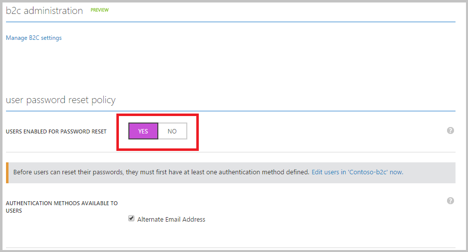

<properties
    pageTitle="Azure Active Directory B2C: Self-service-Kennwort zurücksetzen | Microsoft Azure"
    description="Ein Thema darstellen, wie die Self-service Kennwortrücksetzung für Ihre Nutzer in Azure Active Directory B2C einrichten"
    services="active-directory-b2c"
    documentationCenter=""
    authors="swkrish"
    manager="mbaldwin"
    editor="curtand"/>

<tags
    ms.service="active-directory-b2c"
    ms.workload="identity"
    ms.tgt_pltfrm="na"
    ms.devlang="na"
    ms.topic="article"
    ms.date="07/24/2016"
    ms.author="swkrish"/>

# Azure Active Directory B2C: Einrichten von Self-service Kennwortrücksetzung für Ihre Nutzer

Mithilfe des Features Self-service-Kennwort zurücksetzen können Ihre Nutzer (, die für lokale Konten angemeldet haben), ihre Kennwörter für ihre eigenen zurücksetzen. Dadurch wird die Belastung für die Supportmitarbeiter erheblich reduziert, insbesondere dann, wenn die Anwendung Millionen von Arbeiten in regelmäßigen Abständen Nutzer verfügt. Derzeit unterstützen wir nur eine überprüft e-Mail-Adresse als eine Wiederherstellungsmethode verwenden. Wir werden in der Zukunft zusätzliche Wiederherstellungsmethoden (überprüft Telefonnummer, Fragen zur Sicherheit usw.) hinzufügen.

> [AZURE.NOTE]
In diesem Artikel gilt für Self-service-Kennwort zurücksetzen im Kontext einer Richtlinie Anmeldung verwendet werden. Wenn Sie vollständig anpassbaren Kennwort zurücksetzen Richtlinien aus der app aufgerufen, lesen Sie [diesen Artikel](./active-directory-b2c-reference-policies.md#create-a-password-reset-policy).

Standardmäßig Ihr Verzeichnis hat keinen Self-service-Kennwort zurücksetzen aktiviert ist. Gehen Sie folgendermaßen vor, um es zu aktivieren:

1. Melden Sie sich bei der [Azure klassischen Portal](https://manage.windowsazure.com/) als Abonnement-Administrator. Dies ist die gleiche Arbeit oder Schule Konto oder dem gleichen Microsoft-Konto, mit dem Sie Ihr Verzeichnis zu erstellen.
2. Navigieren Sie zu der Active Directory-Erweiterung auf der Navigationsleiste auf der linken Seite.
3. Suchen nach Ihrem Verzeichnis unter der Registerkarte **Verzeichnis** aus, und klicken Sie darauf.
4. Klicken Sie auf die Registerkarte **Konfigurieren** .
5. Führen Sie einen Bildlauf nach unten bis zum Abschnitt **Kennwort zurücksetzen Richtlinie** und schalten Sie die Option **Benutzer aktiviert Kennwort zurücksetzen** auf **Ja**. Beachten Sie, dass die Option **Alternative e-Mail-Adresse** aktiviert ist. Lassen Sie sie aus, wie es ist.

    

6. Klicken Sie auf **Speichern** , am unteren Rand der Seite. Schon!

Klicken Sie zum Testen verwenden Sie die Funktion "Jetzt ausführen" auf alle, die lokale Konten als Identitätsanbieter weist Richtlinie aus. Klicken Sie auf die lokale Konto-Anmeldung Seite (Stelle, an der Sie eine e-Mail-Adresse und Ihr Kennwort ein, oder einen Benutzernamen und Kennwort eingeben), klicken Sie auf **kann nicht auf Ihr Konto zugreifen?** zur Überprüfung Benutzerfunktionen.

> [AZURE.NOTE]
Self-service-Kennwort zurücksetzen Seiten können mithilfe des [Unternehmens branding Feature](../active-directory/active-directory-add-company-branding.md)angepasst werden.
