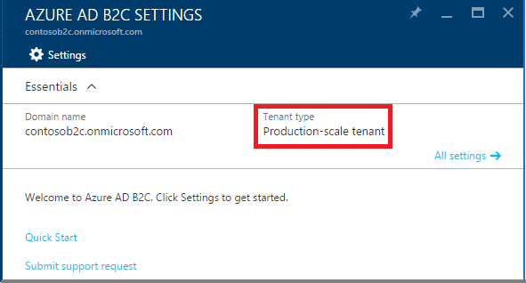
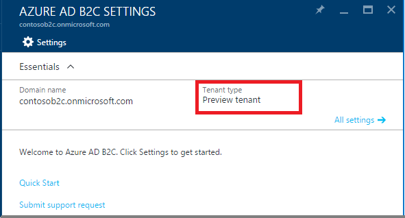

<properties
    pageTitle="Azure Active Directory B2C: Herstellung-Skala im Vergleich zu Vorschau B2C Mandanten | Microsoft Azure"
    description="Ein Thema zu den vorstehend beschriebenen Azure Active Directory B2C Mandanten"
    services="active-directory-b2c"
    documentationCenter=""
    authors="swkrish"
    manager="mbaldwin"
    editor="bryanla"/>

<tags
    ms.service="active-directory-b2c"
    ms.workload="identity"
    ms.tgt_pltfrm="na"
    ms.devlang="na"
    ms.topic="article"
    ms.date="08/30/2016"
    ms.author="swkrish"/>

# Azure Active Directory B2C: Die Herstellung-Skala im Vergleich zu Vorschau B2C Mandanten

Wenn Sie beabsichtigen, eine app Herstellung auf B2C Azure Active Directory (Azure AD) schreiben, müssen Sie Vergewissern Sie sich, dass Sie den richtigen Mandanten "Typ", klicken Sie auf live zu gehen haben. Was sehen, wie folgt vor, [Navigieren Sie zu dem B2C Features Blade](active-directory-b2c-app-registration.md#navigate-to-the-b2c-features-blade) Azure-Portal, und Suchen klicken Sie unter **Typ des Mandanten**.

## Zusammenfassung

Azure AD B2C unterstützt Herstellung apps nur auf **Herstellung-Farben-Skala** B2C in Nordamerika Mandanten.

| Typ des Mandanten | Länder/Regionen zurück | Im Allgemeinen – verfügbar? |
| ----------- | -------------- | --------------------- |
| **Herstellung-Skala Mandanten** | Nordamerika Länder/Regionen zurück | Ja |
| **Herstellung-Skala Mandanten** | Alle Länder/Regionen außer Nordamerika | Nein |
| **Vorschau-Mandanten** | Alle Länder/Regionen zurück | Nein |

> [AZURE.NOTE]
Azure AD B2C-Mandanten (für Verbraucher) sind derzeit nicht verfügbar in wenigen Ländern oder Regionen, wenn Azure AD-Mandanten (für Mitarbeiter) verfügbar sind. Lesen Sie in den folgenden Abschnitten für weitere Details an.

## Herstellung-Skala B2C Mandanten in Nordamerika

Wenn Sie [Ihre B2C Mandanten erstellt](active-directory-b2c-get-started.md) in Nordamerika, d. h., in einem der folgenden Länder oder Regionen: Vereinigte Staaten, Kanada, Costa Rica, Dominikanische Republik, El Salvador, Guatemala, Mexiko, Panama, Puerto Rico und Trinidad und Tobago, und den **Typ des Mandanten** auf Ihrem Administrator-Benutzeroberfläche B2C besagt **Herstellung-Farben-Skala**, Ihrem Mandanten für Herstellung apps verwendet werden kann.

> [AZURE.NOTE]
Herstellung-Skala Mandanten sind in der Lage der Skalierung zu 100 s von Millionen von Consumer Identitäten pro Mandant.

## Anzeigen einer Vorschau B2C Mandanten in einem beliebigen Land/region

Wenn Sie einen Mandanten B2C Zeitraum Vorschau Azure AD B2C erstellt haben, ist es wahrscheinlich, dass es sich bei Ihrem **Mandanten geben** besagt **Vorschau des Mandanten**. Wenn dies der Fall ist, müssen Sie Ihrem Mandanten nur für die Entwicklung und Testzwecken und nicht für die Herstellung apps verwenden.

> [AZURE.IMPORTANT]
Es ist keine Migrationspfad aus eine Vorschau B2C Mandanten auf einen Herstellung-Skala B2C-Mandanten. Notiz, bei denen es Probleme, wenn Sie einen Vorschau B2C Mandanten löschen und neu einen Zeitachse Herstellung B2C Mandanten mit dem gleichen Domänennamen erstellen. Sie müssen einen Herstellung-Skala B2C-Mandanten mit einem anderen Domänennamen zu erstellen.

## Herstellung-Maßstab B2C Mandanten außerhalb von Nordamerika

Azure AD B2C gibt es zurzeit nicht im Allgemeinen – verfügbar außerhalb von Nordamerika. Sie können jedoch erstellen und Verwenden der Herstellung-Skala Mandanten, für Test- und Zwecke in einem der folgenden Länder oder Regionen: Algerien, Österreich, Aserbaidschan, Bahrain, Belarus, Belgien, Bulgarien, Kroatien, Zypern, Tschechische Republik, Dänemark, Ägypten, Estland, Finnland, Frankreich, Deutschland, Griechenland, Ungarn, Island, Irland, Israel, Italien, Jordanien, Kasachstan, Kenia, Kuwait, in Lettland, Libanon, Liechtenstein, Lituania, Luxemburg, die ehemalige jugoslawische Republik Mazedonien, Malta, Montenegro, Marokko, Niederlande, Nigeria, Norwegen , Oman, Pakistan, Polen, Portugal, Katar, Rumänien, Russische Föderation, Saudi-Arabien, Serbien, Slowakei, Slowenien, Südafrika, Spanien, Schweden, Schweiz, Tunesien, Türkei, Ukraine, Vereinigte Arabische Emirate und Großbritannien.

Nachdem Azure AD B2C allgemeinen Verfügbarkeit in Länder oder Regionen bekannt gibt, können Sie weiterhin verwenden diese Herstellung-Skala Mandanten und mit der Herstellung apps ohne Datenverlust Go live.

## Verfügbarkeit von B2C Mandanten

B2C Mandanten derzeit nicht verfügbar sind, in die folgenden Länder oder Regionen: Afghanistan, Argentinien, Australien, Brasilien, Chile, Kolumbien, Ecuador, Hongkong SAR, Indien, Indonesien, Irak, Japan, Korea, Malaysia, Neuseeland, Paraguay, Peru, Philippinen, Singapur, Südkorea, Taiwan, Thailand, Uruguay und Venezuela. Wir möchten diese in der Zukunft einbeziehen.
