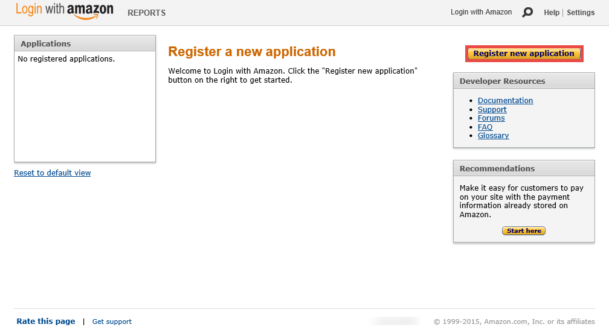
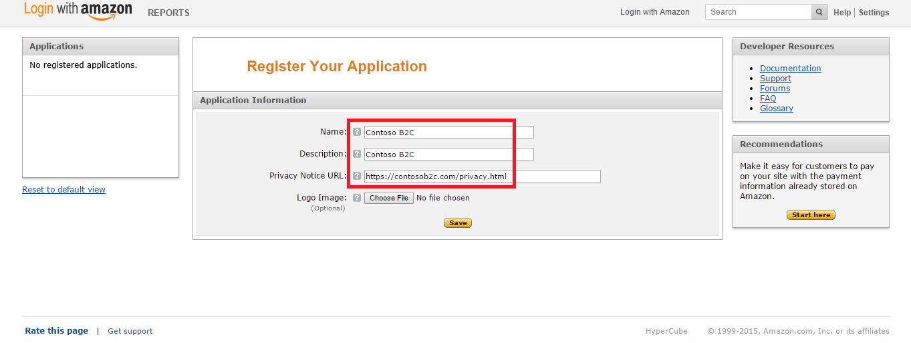
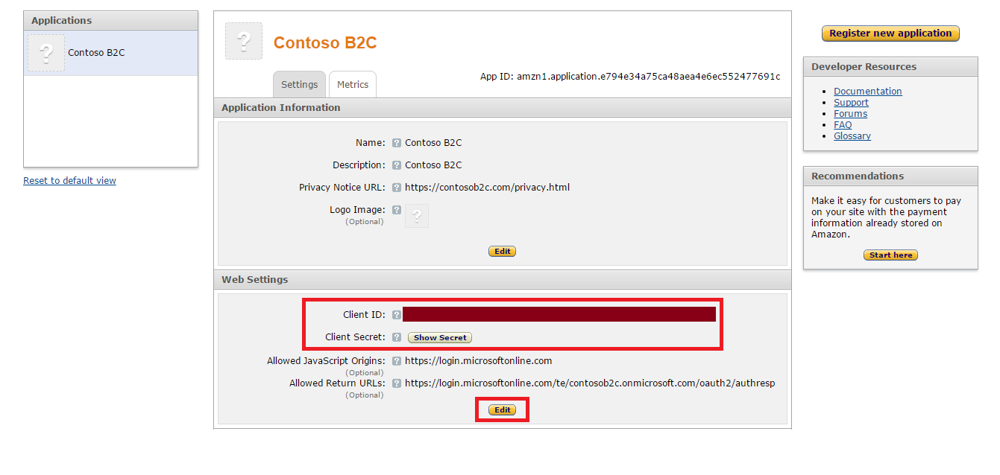
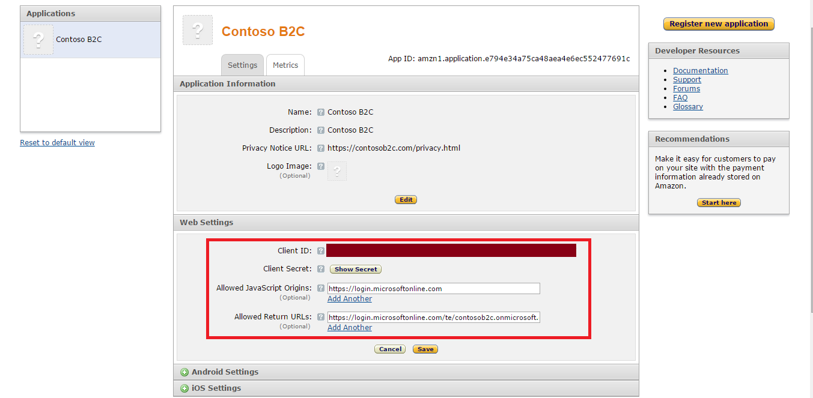

<properties
    pageTitle="Azure Active Directory B2C: Konfiguration Amazon | Microsoft Azure"
    description="Stellen Sie Anmeldung und-Anmeldung Nutzer mit Amazon-Konten in Ihrer Anwendung, die durch Azure Active Directory B2C gesichert werden."
    services="active-directory-b2c"
    documentationCenter=""
    authors="swkrish"
    manager="mbaldwin"
    editor="bryanla"/>

<tags
    ms.service="active-directory-b2c"
    ms.workload="identity"
    ms.tgt_pltfrm="na"
    ms.devlang="na"
    ms.topic="article"
    ms.date="07/24/2016"
    ms.author="swkrish"/>

# Azure Active Directory B2C: Stellen Sie Anmeldung und-Anmeldung Nutzer mit Amazon-Konten

## Erstellen einer Amazon-Anwendung

Wenn als Identitätsanbieter in Azure Active Directory (Azure AD) B2C Amazon verwenden möchten, müssen Sie eine Amazon-Anwendung zu erstellen, und geben sie die richtigen Parameter. Benötigen Sie ein Konto Amazon Aktion. Wenn Sie eine besitzen, können Sie es am [http://www.amazon.com/](http://www.amazon.com/)erhalten.

1. Wechseln Sie zum [Amazon Developer Center](https://login.amazon.com/) , und melden Sie sich mit Ihrer Amazon-Konto-Anmeldeinformationen.
2. Wenn Sie dies nicht bereits getan haben, klicken Sie auf **Registrieren**, führen Sie die Schritte zur Registrierung Entwicklertools, und übernehmen Sie die Richtlinie zu.
3. Klicken Sie auf **neue Anwendung zu registrieren**.

    

4. Bereitstellen von Anwendungsinformationen (**Name**, **Beschreibung**und **Datenschutz Mitteilung URL**), und klicken Sie auf **Speichern**.

    

5. Kopieren Sie die Werte von **Client-ID** und **Client geheim**, im Abschnitt **Web-Einstellungen** . (Sie müssen die **Geheim anzeigen** klicken, um dies zu sehen.) Sie benötigen beide Amazon als Identitätsanbieter in Ihrem Mandanten zu konfigurieren. Klicken Sie unten im Abschnitt **Bearbeiten** aus. **Client-Schlüssel** ist eine wichtige Sicherheitsanmeldeinformationen.

    

6. Geben Sie ein `https://login.microsoftonline.com` im Feld **Zulässige JavaScript Ursprung** und `https://login.microsoftonline.com/te/{tenant}/oauth2/authresp` im Feld **Zurückgeben URLs zulässig** . Ersetzen Sie **{Mandanten}** mit des Mandanten Namen (beispielsweise contoso.onmicrosoft.com). Klicken Sie auf **Speichern**. Der Wert **{Mandanten}** beachtet werden.

    

## Konfigurieren von Amazon als Identitätsanbieter in Ihrem Mandanten

1. Wie folgt vor, [Navigieren Sie zu dem B2C Features Blade](active-directory-b2c-app-registration.md#navigate-to-the-b2c-features-blade) Azure-Portal an.
2. Klicken Sie auf das B2C Features Blade **Identitätsanbieter**aus.
3. Klicken Sie auf **+ Add** am oberen Rand der Blade.
4. Bieten Sie einen benutzerfreundlichen **Namen** für die Konfiguration des Anbieters Identität. Geben Sie zum Beispiel "Amzn" ein.
5. Klicken Sie auf **Identität Anbietertyp**, wählen Sie **Amazon aus**, und klicken Sie auf **OK**.
6. Klicken Sie auf **diese Identitätsanbieter einrichten** , und geben Sie die Client-ID und Client geheim der Amazon-Anwendung, die Sie zuvor erstellt haben.
7. Klicken Sie auf **OK** , und klicken Sie dann auf **Erstellen** , um die Amazon-Konfiguration zu speichern.
