<properties
    pageTitle="Azure Active Directory B2C: Facebook-Konfiguration | Microsoft Azure"
    description="Stellen Sie Anmeldung und-Anmeldung Nutzer mit Facebook-Konten in Ihrer Anwendung, die durch Azure Active Directory B2C gesichert werden."
    services="active-directory-b2c"
    documentationCenter=""
    authors="swkrish"
    manager="mbaldwin"
    editor="bryanla"/>

<tags
    ms.service="active-directory-b2c"
    ms.workload="identity"
    ms.tgt_pltfrm="na"
    ms.devlang="na"
    ms.topic="article"
    ms.date="07/24/2016"
    ms.author="swkrish"/>

# Azure Active Directory B2C: Stellen Sie Anmeldung und-Anmeldung Nutzer mit Facebook-Konten

## Erstellen Sie eine Facebook-Anwendung

Um Facebook als Identitätsanbieter in B2C Azure Active Directory (Azure AD) verwenden, müssen Sie zum Erstellen einer Facebook-Anwendungs, und geben sie die richtigen Parameter aus. Sie benötigen eine Aktion Facebook-Konto. Wenn Sie eine besitzen, können Sie es am [https://www.facebook.com/](https://www.facebook.com/)erhalten.

1. Wechseln Sie zu der Website [Facebook für Entwickler](https://developers.facebook.com/) , und melden Sie sich mit Ihren Facebook-Konto.
2. Wenn Sie dies nicht bereits getan haben, müssen Sie als ein Facebook-Entwickler zu registrieren. Hierzu (in der oberen rechten Ecke der Seite) klicken Sie auf **Registrieren** , akzeptieren Facebooks-Richtlinien, und führen Sie die Schritte zur Registrierung.
3. Klicken Sie auf **Meine Apps** , und klicken Sie dann auf **Hinzufügen, eine neue App**. Wählen Sie die **Website** als Plattform aus, und klicken Sie dann auf **überspringen und Erstellen von App-ID**.

    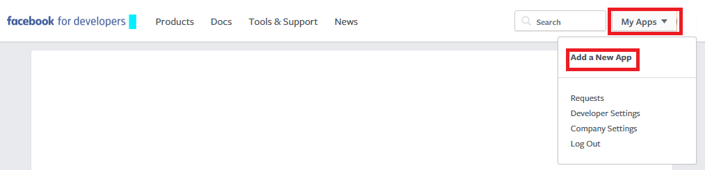

    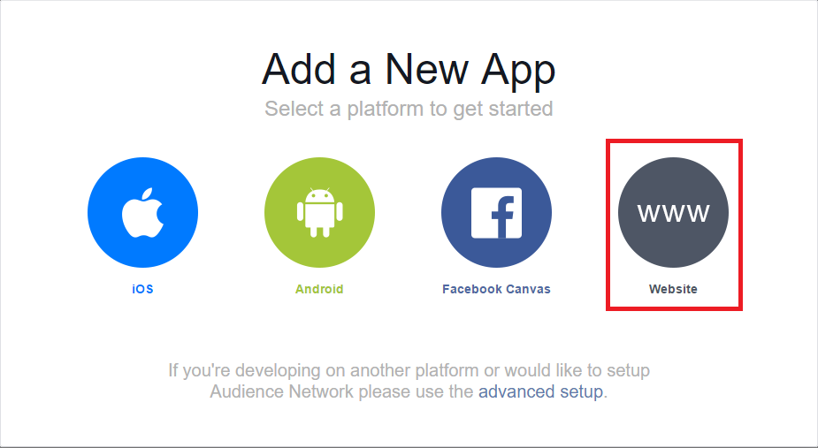

    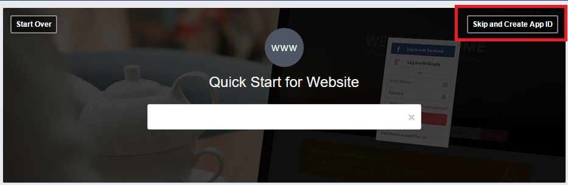

4. Klicken Sie auf das Formular Geben Sie einen **Anzeigenamen ein**, die eine gültige **Kontakt-e-Mail**, die entsprechende **Kategorie**, und klicken Sie auf **App-ID erstellen**. Dazu müssen Sie Facebook-Plattform Richtlinien akzeptieren, und führen Sie eine Prüfung auf online-Sicherheit.

    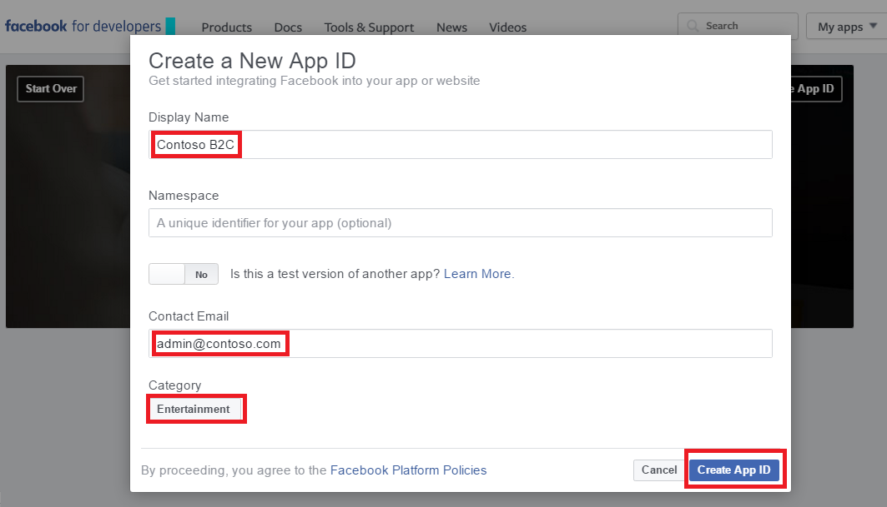

5. Klicken Sie in der linken Navigationsleiste auf **Einstellungen** .
6. Klicken Sie auf **+ Plattform hinzufügen** , und wählen Sie dann auf **Website**.

    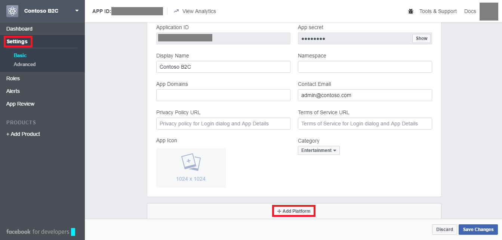

    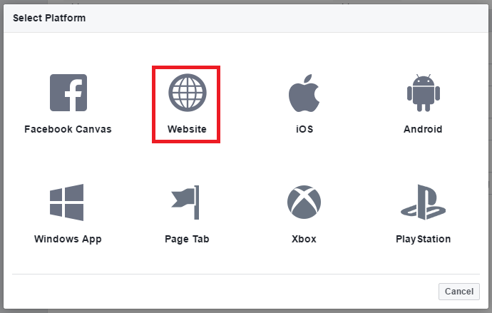

7. Geben Sie in das Feld **Website-URL** [https://login.microsoftonline.com/](https://login.microsoftonline.com/) ein, und klicken Sie dann auf **Save Changes**.

    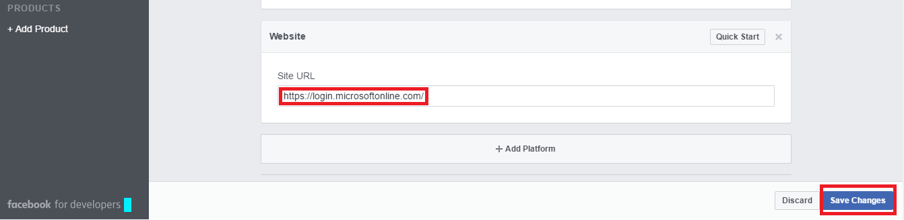

8. Kopieren Sie den Wert der **App-ID**an. Klicken Sie auf **Anzeigen** , und kopieren Sie den Wert der **App geheim**. Sie benötigen beide Facebook als Identitätsanbieter in Ihrem Mandanten zu konfigurieren. **App-Schlüssel** ist eine wichtige Sicherheitsanmeldeinformationen.

    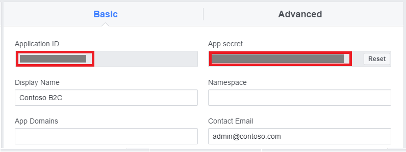

9. Klicken Sie auf **+ Add Product** auf der linken Navigationsleiste und dann auf die **Erste Schritte** -Schaltfläche neben **Facebook-Anmeldung**.

    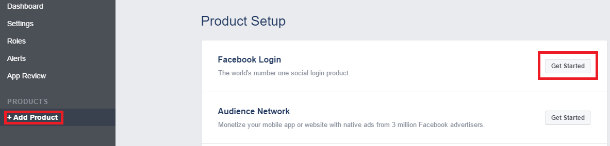

10. Geben Sie ein `https://login.microsoftonline.com/te/{tenant}/oauth2/authresp` im Feld **gültige OAuth umleiten URIs** im Abschnitt **OAuth Clienteinstellungen** . Ersetzen Sie **{Mandanten}** mit des Mandanten Namen (beispielsweise contosob2c.onmicrosoft.com). Klicken Sie auf **Save Changes** am unteren Rand der Seite.

    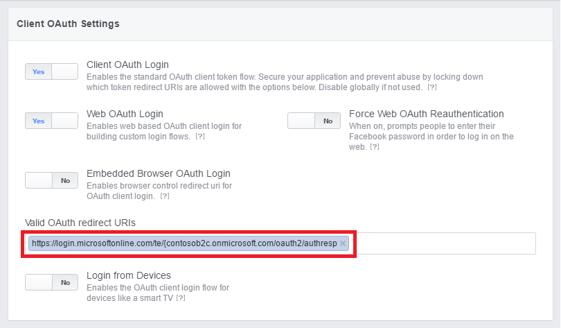

11. Um die Facebook-Anwendung von Azure AD B2C verwenden zu können, müssen Sie es öffentlich verfügbar machen. Sie können, indem Sie die **App überprüfen** in der linken Navigationsleiste und durch Umwandlung in den Schalter am oberen Rand der Seite auf **Ja** , und dann auf **bestätigen**ausführen.

    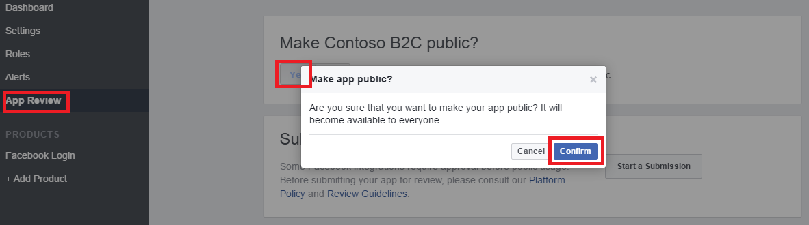

## Konfigurieren von Facebook als Identitätsanbieter in Ihrem Mandanten

1. Wie folgt vor, [Navigieren Sie zu dem B2C Features Blade](active-directory-b2c-app-registration.md#navigate-to-the-b2c-features-blade) Azure-Portal an.
2. Klicken Sie auf das B2C Features Blade **Identitätsanbieter**aus.
3. Klicken Sie auf **+ Add** am oberen Rand der Blade.
4. Geben Sie einen angezeigten **Namen** für die Identität Anbieter-Konfiguration. Geben Sie zum Beispiel "FB" ein.
5. Klicken Sie auf **Identität Anbietertyp**, wählen Sie **Facebook**, und klicken Sie auf **OK**.
6. Klicken Sie auf **diese Identitätsanbieter einrichten** , und geben Sie die app-ID und app geheim (der Facebook-Anwendung, die Sie zuvor erstellt haben) in der **Client-ID** und **Client geheim** Felder Hilfethemas.
7. Klicken Sie auf **OK**, und klicken Sie dann auf **Erstellen** , um die Facebook-Konfiguration zu speichern.
