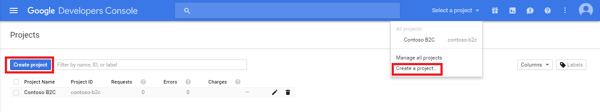
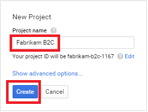
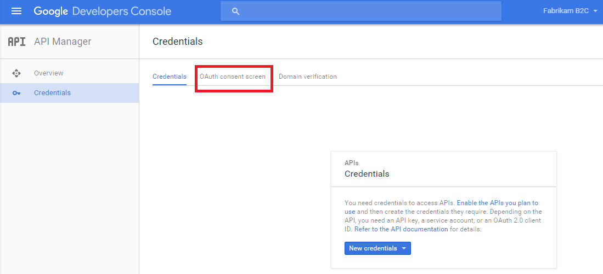
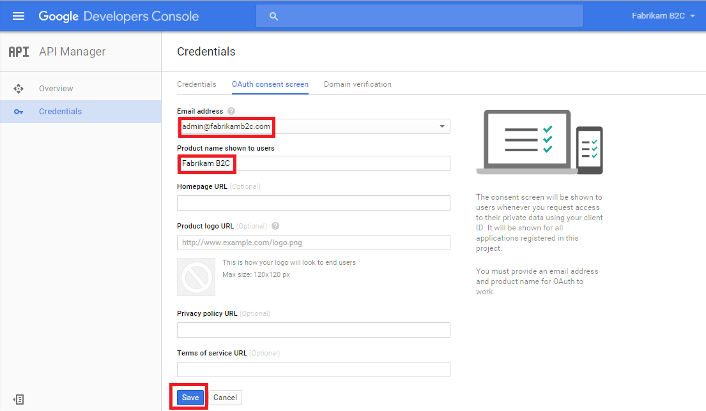
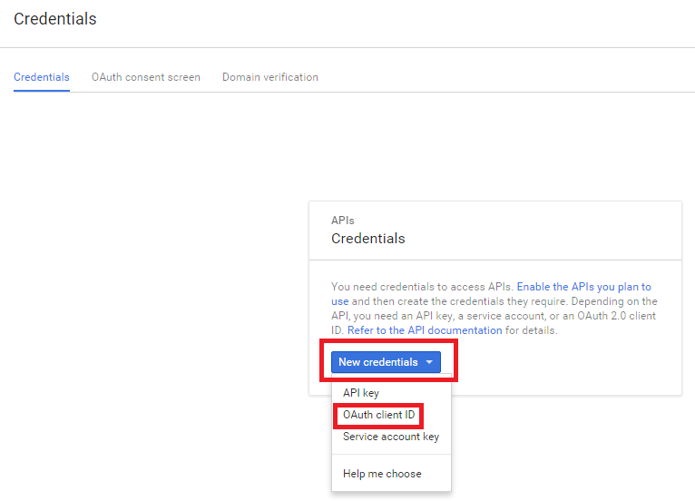
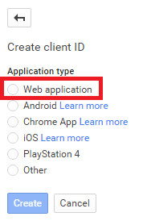
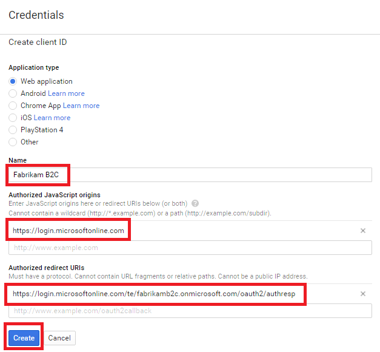
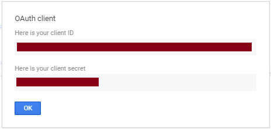

<properties
    pageTitle="Azure Active Directory B2C: Google + Konfiguration | Microsoft Azure"
    description="Stellen Sie Anmeldung und-Anmeldung Nutzer mit Google + Konten in Ihrer Anwendung, die durch Azure Active Directory B2C gesichert werden."
    services="active-directory-b2c"
    documentationCenter=""
    authors="swkrish"
    manager="mbaldwin"
    editor="bryanla"/>

<tags
    ms.service="active-directory-b2c"
    ms.workload="identity"
    ms.tgt_pltfrm="na"
    ms.devlang="na"
    ms.topic="article"
    ms.date="07/24/2016"
    ms.author="swkrish"/>

# Azure Active Directory B2C: Stellen Sie Anmeldung und-Anmeldung Nutzer mit Google + Konten

## Erstellen Sie eine Anwendung Google +

Wenn Sie Google + als Identitätsanbieter in B2C Azure Active Directory (Azure AD) verwenden, müssen Sie eine Anwendung Google + erstellen, und geben sie die richtigen Parameter. Benötigen Sie ein Konto Google + Aktion. Wenn Sie eine besitzen, können Sie es am [https://accounts.google.com/SignUp](https://accounts.google.com/SignUp)erhalten.

1. Wechseln Sie zu der [Google Entwickler Console](https://console.developers.google.com/) , und melden Sie sich mit Ihrem Google + Anmeldeinformationen.
2. Klicken Sie auf **Projekt erstellen**, geben Sie einen **Projektnamen ein**, und klicken Sie dann auf **Erstellen**.

    

    

3. Klicken Sie auf **API-Manager** , und klicken Sie dann im linken Navigationsbereich auf **Anmeldeinformationen** .
4. Klicken Sie auf der Registerkarte **OAuth Zustimmung Bildschirm** oben.

    

5. Wählen Sie aus oder geben Sie eine gültige **e-Mail-Adresse**, geben Sie einen **Produktnamen**, und klicken Sie auf **Speichern**.

    

6. Klicken Sie auf **neue Anmeldeinformationen** ein, und wählen Sie dann **OAuth-Client-ID**.

    

7. Wählen Sie unter **Anwendungstyp** **Webanwendung**ein.

    

8. Geben Sie einen **Namen** für die Anwendung, geben Sie `https://login.microsoftonline.com` im Feld **berechtigt JavaScript Ursprung** und `https://login.microsoftonline.com/te/{tenant}/oauth2/authresp` im Feld **autorisierte umleiten URIs** . Ersetzen Sie **{Mandanten}** mit des Mandanten Namen (beispielsweise contosob2c.onmicrosoft.com). Der Wert **{Mandanten}** beachtet werden. Klicken Sie auf **Erstellen**.

    

9. Kopieren Sie die Werte von **Client-ID** und **Client geheim**. Sie benötigen beide Google + als Identitätsanbieter in Ihrem Mandanten konfigurieren. **Client-Schlüssel** ist eine wichtige Sicherheitsanmeldeinformationen.

    

## Konfigurieren von Google + als Identitätsanbieter in Ihrem Mandanten

1. Wie folgt vor, [um das B2C Features Blade navigiert](active-directory-b2c-app-registration.md#navigate-to-the-b2c-features-blade) Azure-Portal an.
2. Klicken Sie auf das B2C Features Blade **Identitätsanbieter**aus.
3. Klicken Sie auf **+ Add** am oberen Rand der Blade.
4. Bieten Sie einen benutzerfreundlichen **Namen** für die Konfiguration des Anbieters Identität. Geben Sie beispielsweise "G +" ein.
5. Klicken Sie auf **Identität Anbietertyp**, wählen Sie aus **Google**, und klicken Sie auf **OK**.
6. Klicken Sie auf **diese Identitätsanbieter einrichten** , und geben Sie die Client-ID und Client geheim Google +-Anwendung, die Sie zuvor erstellt haben.
7. Klicken Sie auf **OK** , und klicken Sie dann auf **Erstellen** , um die Konfiguration von Google + zu speichern.
