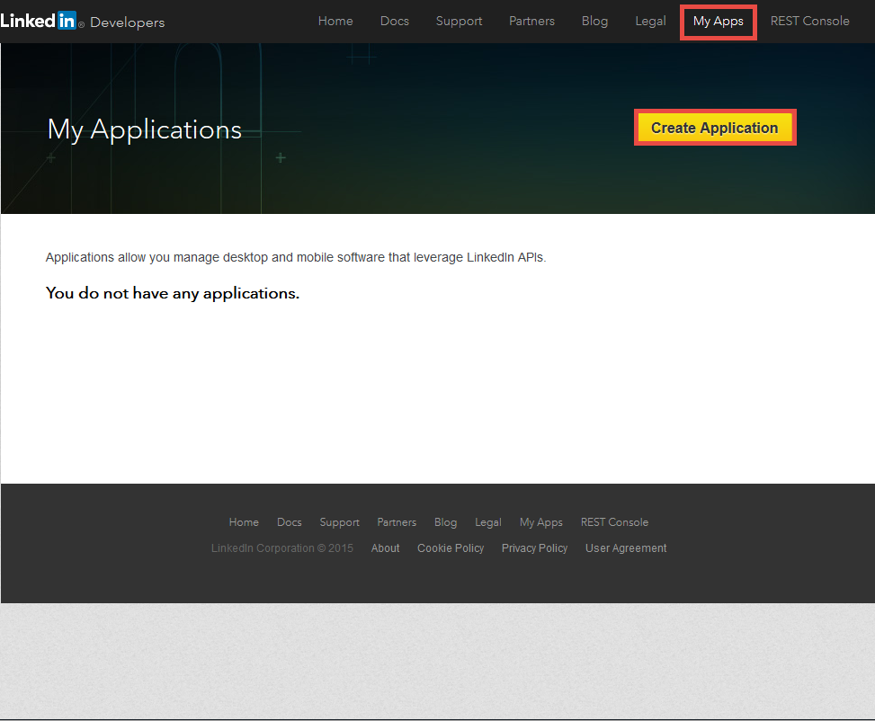
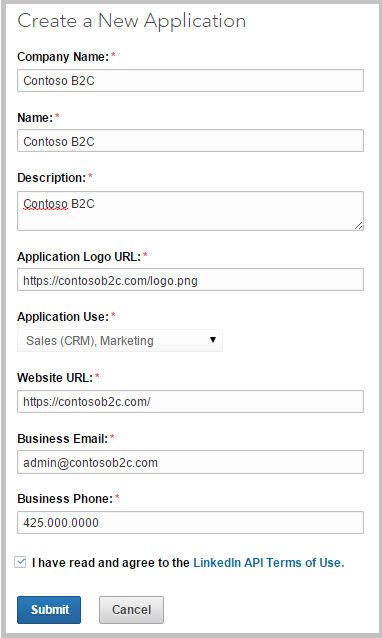
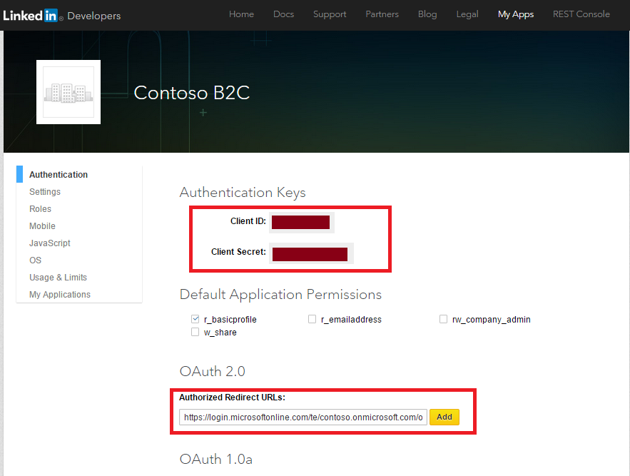

<properties
    pageTitle="Azure Active Directory B2C: Konfiguration LinkedIn | Microsoft Azure"
    description="Stellen Sie Anmeldung und-Anmeldung Nutzer mit LinkedIn-Konten in Ihrer Anwendung, die durch Azure Active Directory B2C gesichert werden"
    services="active-directory-b2c"
    documentationCenter=""
    authors="swkrish"
    manager="mbaldwin"
    editor="bryanla"/>

<tags
    ms.service="active-directory-b2c"
    ms.workload="identity"
    ms.tgt_pltfrm="na"
    ms.devlang="na"
    ms.topic="article"
    ms.date="07/24/2016"
    ms.author="swkrish"/>

# Azure Active Directory B2C: Stellen Sie Anmeldung und-Anmeldung Nutzer mit LinkedIn-Konten

## Erstellen Sie eine Anwendung LinkedIn

Wenn als Identitätsanbieter in Azure Active Directory (Azure AD) B2C LinkedIn verwenden möchten, müssen Sie eine LinkedIn-Anwendung zu erstellen, und geben sie die richtigen Parameter. Sie benötigen ein LinkedIn-Konto, um die Aktion aus. Wenn Sie eine besitzen, können Sie es bei [https://www.linkedin.com/](https://www.linkedin.com/)abrufen.

1. Wechseln Sie zur [Website der LinkedIn-Entwickler](https://www.developer.linkedin.com/) , und melden Sie sich mit Ihrer LinkedIn-Konto-Anmeldeinformationen.
2. Klicken Sie in der oberen Menüleiste auf **Meine Apps** , und klicken Sie dann auf **Anwendung erstellen**.

    

3. Füllen Sie das Formular **Erstellen einer neuen Anwendung** die relevanten Informationen (**Company Name**, **Name**, **Beschreibung**, **Anwendung Logo-URL**, **Anwendung verwenden**, **Website-URL**, **Geschäftliche e-Mail-Adresse** und **Telefon (geschäftlich)**) aus.
4. Stimmen Sie die **LinkedIn API Ausdrücken verwenden** , und klicken Sie auf **Absenden**.

    

5. Kopieren Sie die Werte von **Client-ID** und **Client geheim**. (Sie können unter **Authentifizierung Tasten**fündig.) Sie benötigen beide LinkedIn als Identitätsanbieter in Ihrem Mandanten zu konfigurieren.

    >[AZURE.NOTE] **Client-Schlüssel** ist eine wichtige Sicherheitsanmeldeinformationen.

6. Geben Sie ein `https://login.microsoftonline.com/te/{tenant}/oauth2/authresp` im Feld **Umleiten URLs autorisiert** (unter **OAuth 2.0**). Ersetzen Sie **{Mandanten}** mit des Mandanten Namen (beispielsweise contoso.onmicrosoft.com). Klicken Sie auf **Hinzufügen**, und klicken Sie dann auf **Aktualisieren**. Der Wert **{Mandanten}** beachtet werden.

    

## Konfigurieren von LinkedIn als Identitätsanbieter in Ihrem Mandanten

1. Wie folgt vor, [Navigieren Sie zu dem B2C Features Blade](active-directory-b2c-app-registration.md#navigate-to-the-b2c-features-blade) Azure-Portal an.
2. Klicken Sie auf das B2C Features Blade **Identitätsanbieter**aus.
3. Klicken Sie auf **+ Add** am oberen Rand der Blade.
4. Geben Sie einen angezeigten **Namen** für die Identität Anbieter-Konfiguration. Geben Sie zum Beispiel "LI" ein.
5. Klicken Sie auf **Identität Anbietertyp**, wählen Sie **LinkedIn**, und klicken Sie auf **OK**.
6. Klicken Sie auf **diese Identitätsanbieter einrichten** , und geben Sie die Client-ID und Client geheim der LinkedIn-Anwendung, die Sie zuvor erstellt haben.
7. Klicken Sie auf **OK** , und klicken Sie dann auf **Erstellen** , um Ihre LinkedIn-Konfiguration zu speichern.
