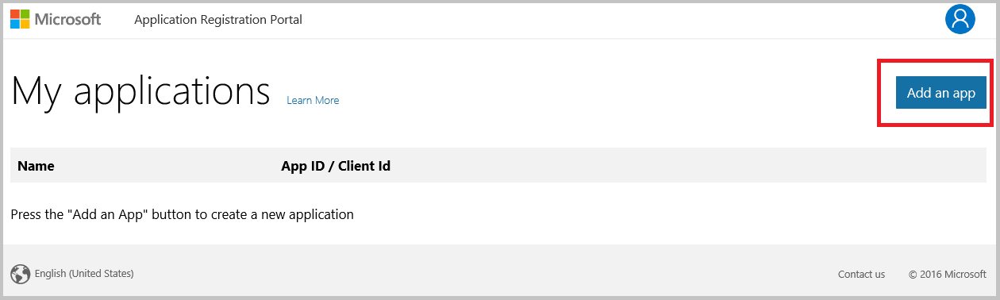
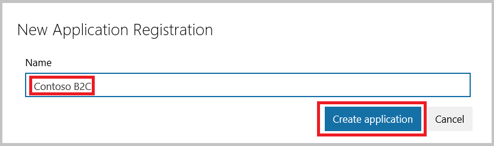
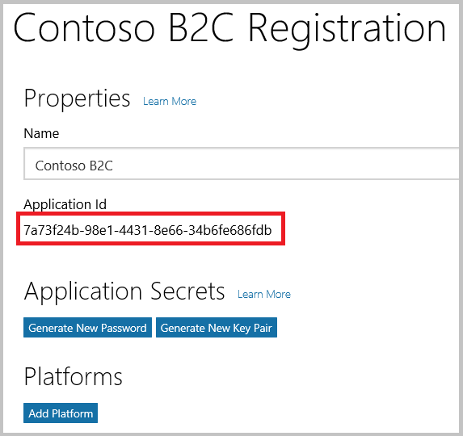
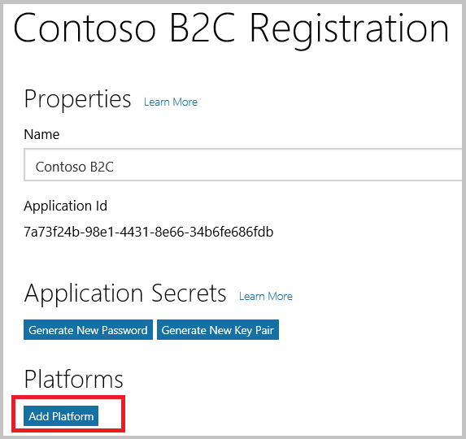
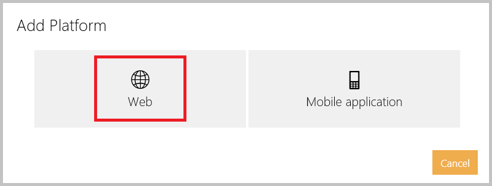
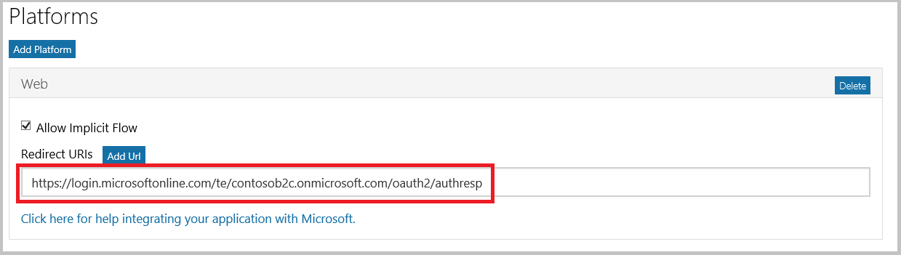
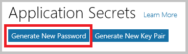
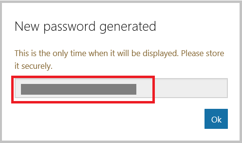
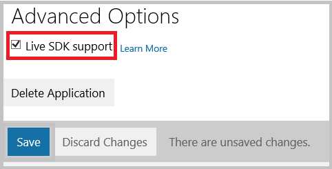

<properties
    pageTitle="Azure Active Directory B2C: Konfiguration Microsoft-Konto | Microsoft Azure"
    description="Stellen Sie Anmeldung und-Anmeldung Nutzer mit Microsoft-Konten in Ihrer Anwendung, die durch Azure Active Directory B2C gesichert werden."
    services="active-directory-b2c"
    documentationCenter=""
    authors="swkrish"
    manager="mbaldwin"
    editor="bryanla"/>

<tags
    ms.service="active-directory-b2c"
    ms.workload="identity"
    ms.tgt_pltfrm="na"
    ms.devlang="na"
    ms.topic="article"
    ms.date="07/24/2016"
    ms.author="swkrish"/>

# Azure Active Directory B2C: Stellen Sie Anmeldung und-Anmeldung Nutzer mit Microsoft-Konten

## Erstellen Sie eine Microsoft-Konto-Anwendung

Wenn Microsoft-Konto als Identitätsanbieter in B2C Azure Active Directory (Azure AD) verwenden möchten, müssen Sie eine Microsoft-Konto-Anwendung zu erstellen, und geben sie die richtigen Parameter. Sie benötigen dazu ein Microsoft-Konto. Wenn Sie eine besitzen, können Sie es bei [https://www.live.com/](https://www.live.com/)abrufen.

1. Wechseln Sie zum [Microsoft Anwendung Registrierung Portal](https://apps.dev.microsoft.com/?referrer=https://azure.microsoft.com/documentation/articles&deeplink=/appList) , und melden Sie sich mit Ihrem Microsoft-Konto-Anmeldeinformationen.
2. Klicken Sie auf **app hinzufügen**.

    

3. Geben Sie einen **Namen** für die Anwendung, und klicken Sie auf die **Anwendung erstellen**.

    

4. Kopieren Sie den Wert der **Anwendung-Id**an. Sie benötigen diese zum Konfigurieren des Microsoft-Konto als Identitätsanbieter in Ihrem Mandanten.

    

5. Klicken Sie auf **Plattform hinzufügen** , und wählen Sie **Web**aus.

    

    

6. Geben Sie ein `https://login.microsoftonline.com/te/{tenant}/oauth2/authresp` im Feld **URIs umleiten** . Ersetzen Sie **{Mandanten}** mit des Mandanten Namen (beispielsweise contosob2c.onmicrosoft.com).

    

7. Klicken Sie auf **Neues Kennwort generieren** unter dem Abschnitt **Anwendung Kennwörter** . Kopieren Sie das neue Kennwort ein, die auf dem Bildschirm angezeigt. Sie benötigen sie Microsoft-Konto als Identitätsanbieter in Ihrem Mandanten zu konfigurieren. Dieses Kennwort ist ein wichtiger Sicherheitsanmeldeinformationen.

    

    

8. Aktivieren der Schaltfläche von **Live SDK unterstützen** klicken Sie im Abschnitt **Erweiterte Optionen** . Klicken Sie auf **Speichern**.

    

## Konfigurieren des Microsoft-Konto als Identitätsanbieter in Ihrem Mandanten

1. Wie folgt vor, [Navigieren Sie zu dem B2C Features Blade](active-directory-b2c-app-registration.md#navigate-to-the-b2c-features-blade) Azure-Portal an.
2. Klicken Sie auf das B2C Features Blade **Identitätsanbieter**aus.
3. Klicken Sie auf **+ Add** am oberen Rand der Blade.
4. Geben Sie einen angezeigten **Namen** für die Identität Anbieter-Konfiguration. Geben Sie zum Beispiel "MSA" ein.
5. Klicken Sie auf **Identität Anbietertyp**, wählen Sie **Microsoft-Konto**aus, und klicken Sie auf **OK**.
6. Klicken Sie auf **diese Identitätsanbieter einrichten** , und geben Sie die Anwendung-Id und das Kennwort für die Microsoft-Konto-Anwendung, die Sie zuvor erstellt haben.
7. Klicken Sie auf **OK** , und klicken Sie dann auf **Erstellen** , um die Konfiguration des Microsoft-Kontos zu speichern.
