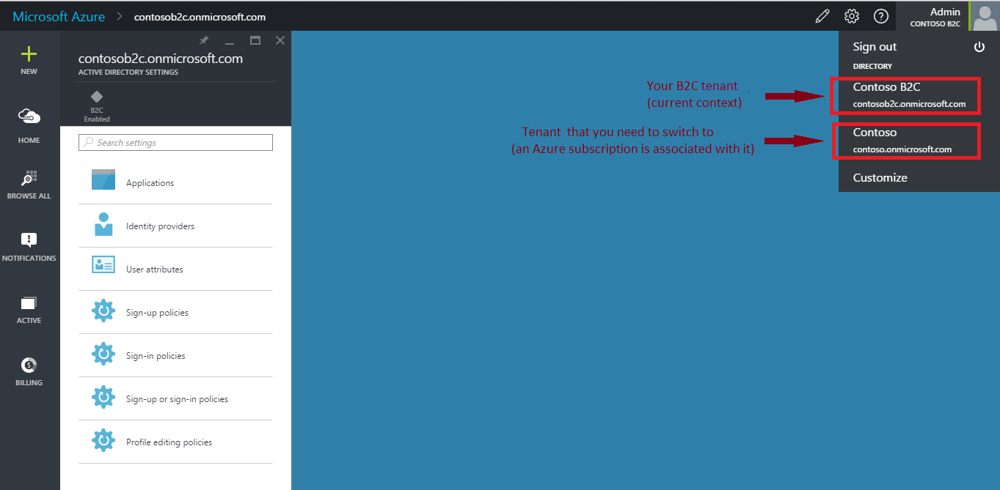
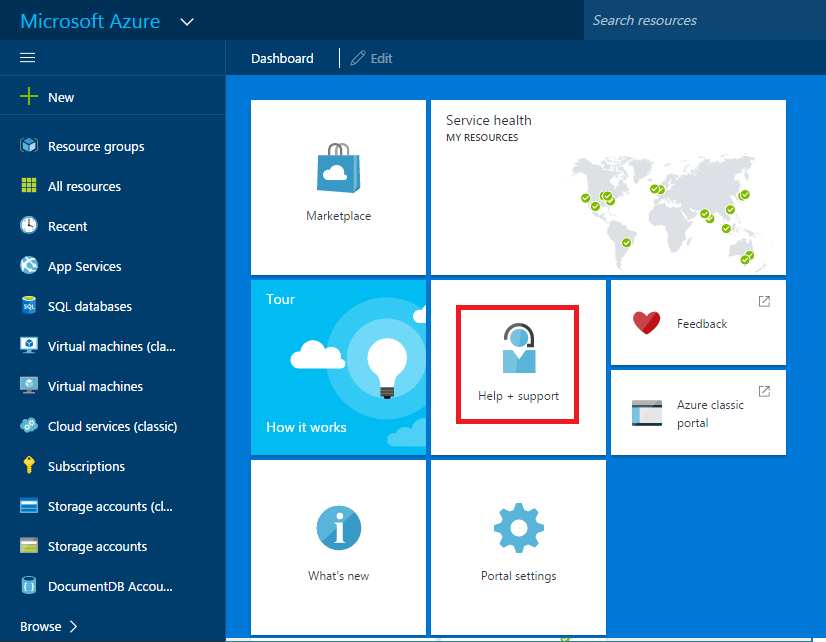
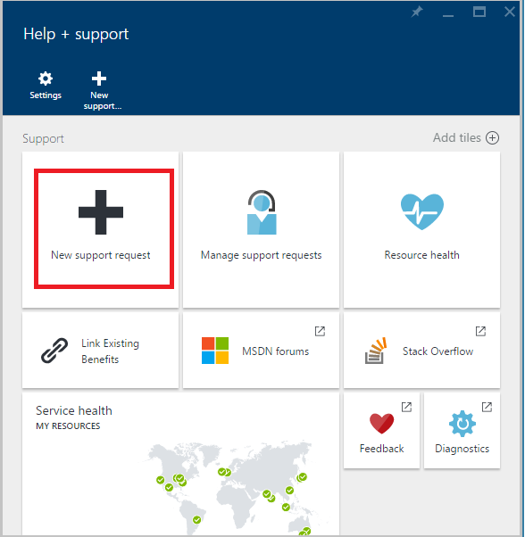
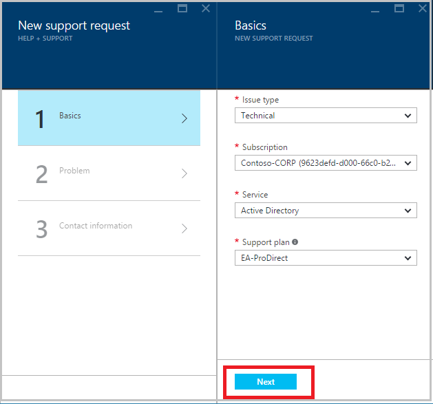
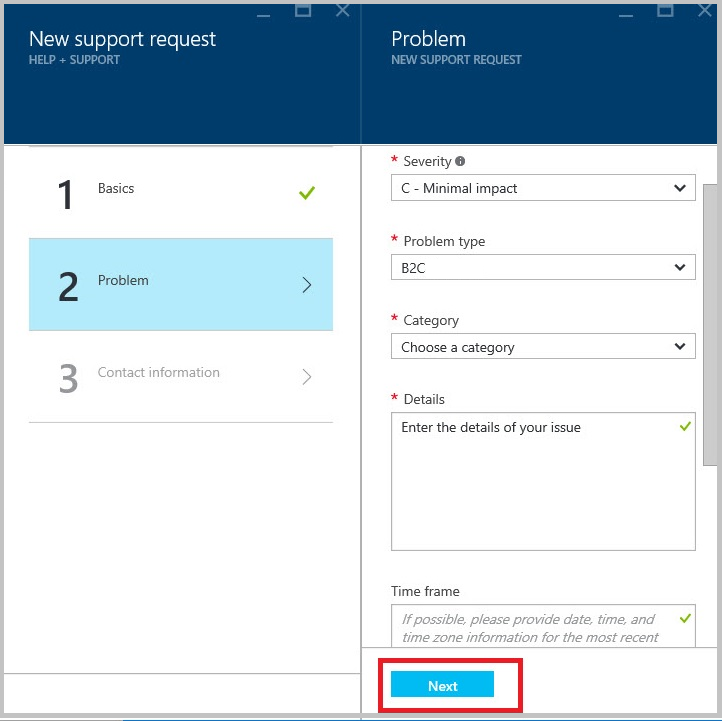
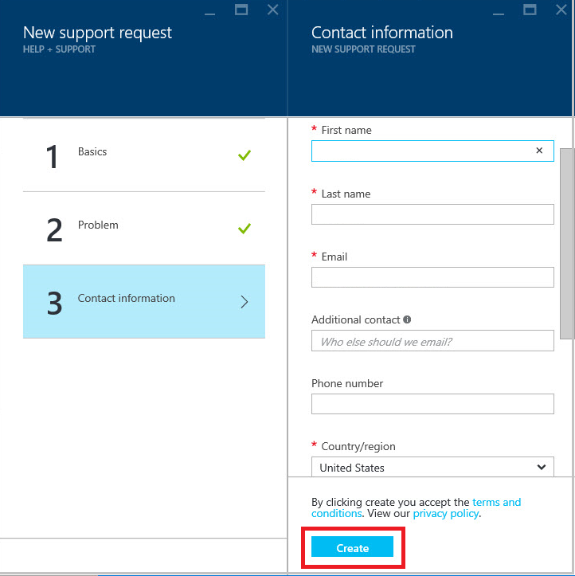
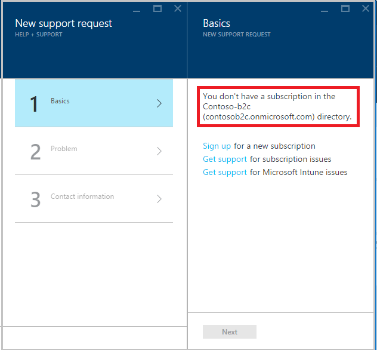

<properties
    pageTitle="Azure-Active Directory-B2C: Unterstützung | Microsoft Azure"
    description="So Kundendienstanfragen für Azure Active Directory B2C-Datei"
    services="active-directory-b2c"
    documentationCenter=""
    authors="swkrish"
    manager="msmbaldwin"
    editor="bryanla"/>

<tags
    ms.service="active-directory-b2c"
    ms.workload="identity"
    ms.tgt_pltfrm="na"
    ms.devlang="na"
    ms.topic="article"
    ms.date="07/24/2016"
    ms.author="swkrish"/>

# Azure-Active Directory-B2C: Datei Kundendienstanfragen

Sie können für Azure Active Directory (Azure AD) B2C im Azure-Portal mit den folgenden Schritten Kundendienstanfragen Datei:

1. [Gehen Sie folgendermaßen vor, um das B2C Features Blade Azure-Portal zu navigieren](active-directory-b2c-app-registration.md#navigate-to-the-b2c-features-blade).
2. Wechseln Sie von Ihrem Mandanten B2C auf einem anderen Mandanten, die ein Azure-Abonnement zugeordnet wurde. In der Regel ist letztere Ihre Mitarbeiter Mandanten oder den für Sie erstellt, wenn Sie sich für ein Abonnement Azure registriert Standard-Mandanten. Weitere Informationen finden Sie unter [wie Azure AD ein Azure-Abonnement verknüpft ist](active-directory-how-subscriptions-associated-directory.md#how-an-azure-subscription-is-related-to-azure-ad).

    

3. Nach dem Wechsel Mandanten, klicken Sie auf **Hilfe + Support**.

    

4. Klicken Sie auf **neu support-Anfragen**.

    

5. Verwenden Sie in der Blade- **Grundlagen** die folgenden Details, und klicken Sie auf **Weiter**.

    - **Problemtyp** ist **technische**.
    - Wählen Sie das entsprechende **Abonnement**aus.
    - **Dienst** wird **Active Directory**.
    - Wählen Sie den entsprechenden **Support-Plan**aus. Wenn Sie eine besitzen, können Sie für eine [hier](https://azure.microsoft.com/en-us/support/plans/)registrieren.

    

6. Verwenden Sie diese Details das **Problem** Blade und klicken Sie auf **Weiter**.

    - Wählen Sie die entsprechende Zugriffsebene für **schwere** aus.
    - **Problemtyp** ist **B2C**.
    - Wählen Sie die entsprechende **Kategorie**aus.
    - Beschreiben Sie Ihr Problem in das Feld " **Details** " ein. Bereitstellen von Details wie B2C Mandanten Name, Beschreibung des Problems, Fehlermeldungen, Korrelations-IDs (falls vorhanden), und So weiter.
    - Im Feld **Zeitrahmens** bieten Sie Datum und Uhrzeit (einschließlich Zeitzone), die das Problem aufgetreten sind.
    - Klicken Sie unter **Datei hochladen**Laden Sie alle Screenshots und Dateien, die Sie der Meinung sind Lösung des Problems unterstützen würde hoch.

    

7. Fügen Sie Ihre Kontaktinformationen in das Blade **Kontaktinformationen** hinzu. Klicken Sie auf **Erstellen**.

    

8. Nachdem Sie Ihre Supportanfrage abgesendet, können Sie es überwachen, indem Sie auf **Hilfe + Support** auf die Startboard, und klicken Sie dann **Management Support anfordert**.

## Bekanntes Problem: eine Supportanfrage im Zusammenhang mit einem Mandanten B2C Ablage

Wenn Sie Schritt 2 oben beschriebenen verpasste und versuchen, eine Supportanfrage im Zusammenhang mit Ihrem Mandanten B2C zu erstellen, wird den folgenden Fehler angezeigt.

> [AZURE.IMPORTANT]
> Versuchen Sie nicht, die für ein neues Azure-Abonnement in Ihrem Mandanten B2C registrieren.  

