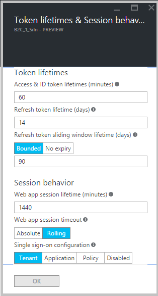

<properties
    pageTitle="Azure Active Directory B2C: Token, Sitzung und Konfiguration für einzelne Zeichen | Microsoft Azure"
    description="Token, Sitzung und melden Sie sich auf eine Konfiguration für einzelne in Azure Active Directory B2C"
    services="active-directory-b2c"
    documentationCenter=""
    authors="swkrish"
    manager="mbaldwin"
    editor="bryanla"/>

<tags
    ms.service="active-directory-b2c"
    ms.workload="identity"
    ms.tgt_pltfrm="na"
    ms.devlang="na"
    ms.topic="article"
    ms.date="07/24/2016"
    ms.author="swkrish"/>

# Azure Active Directory B2C: Token, Sitzung und Konfiguration für einzelne Zeichen

Dieses Feature können Sie abgestimmte kontrollieren, auf [Basis pro Richtlinie](active-directory-b2c-reference-policies.md), der:
 
1. Gültigkeitsdauer des Sicherheitstokens von Azure Active Directory (Azure AD) B2C ausgegeben.
2. Lebensdauer der Web-Anwendung Sitzungen von Azure AD B2C verwaltet werden.
3. Einmaliges Anmelden (SSO) Verhalten apps und Richtlinien in Ihrem Mandanten B2C hinweg.

Sie können dieses Feature in Ihrem Mandanten B2C wie folgt verwenden:

1. Wie folgt vor, [um das B2C Features Blade navigiert](active-directory-b2c-app-registration.md#navigate-to-the-b2c-features-blade) Azure-Portal an.
2. Klicken Sie auf **Anmeldung Richtlinien**. *Hinweis: Sie können dieses Feature auf einem beliebigen Richtlinie, darf sich nicht auf* *Anmeldung Richtlinien***.
3. Öffnen Sie eine Richtlinie, indem Sie darauf. Klicken Sie beispielsweise auf **B2C_1_SiIn**.
4. Klicken Sie auf die am oberen Rand der Blade **Bearbeiten** .
5. Klicken Sie auf **Token, Sitzung und einzelne Config anmelden**.
6. Stellen Sie die gewünschten Änderungen vor. Informationen Sie zu verfügbaren Eigenschaften in den folgenden Abschnitten.
7. Klicken Sie auf **OK**.
8. Klicken Sie am oberen Rand der Blade auf **Speichern** .

## Token Lebensdauer Konfiguration

Azure AD B2C unterstützt das [OAuth 2.0 Autorisierungsprotokoll](active-directory-b2c-reference-protocols.md) zum Aktivieren der sicheren Zugriffs auf geschützte Ressourcen. Um diese Unterstützung zu implementieren, gibt Azure AD B2C verschiedene [Sicherheitstokens](active-directory-b2c-reference-tokens.md)aus. Dies sind die Eigenschaften, die Sie zum Verwalten der Lebensdauer des Sicherheitstokens von Azure AD B2C ausgegeben verwenden können:

- **Access & ID token Gültigkeitsdauer (Minuten)**: die Gültigkeitsdauer des das OAuth 2.0 Person Token verwendet, den Zugriff auf eine geschützte Ressource. Azure AD B2C Probleme nur ID Token zu diesem Zeitpunkt an. Dieser Wert würde zu Access Token auch angewendet werden, wenn wir Unterstützung für diese hinzufügen.
   - Standard = 60 Minuten.
   - Minimum (einschließlich) = 5 Minuten.
   - Maximum (einschließlich) = 1440 Minuten.
- **Token Lebensdauer aktualisieren (Tage)**: den maximalen Zeitraum vor dem ein Token aktualisieren kann verwendet werden, um eine neue Access- oder Token-ID erwerben (und optional eine neue aktualisieren Token, wenn eine Anwendung gewährt wurde die `offline_access` Umfang).
   - Standard = 14 Tage.
   - Minimum (einschließlich) = 1 Tag.
   - Maximum (einschließlich) = 90 Tage.
- **Aktualisieren Token gleitende Fenster Gültigkeitsdauer (Tage)**: nach dieses Zeitraums des Benutzers abläuft, wird Ihre Anmeldeinformationen erneut eingeben, ohne Rücksicht auf die Gültigkeitsdauer der letzten Aktualisierung Token erworben haben, indem Sie die Anwendung erzwungen. Es kann nur bereitgestellt werden, wenn die Option **Bounded**festgelegt ist. Es muss größer als oder gleich werden die **token Lebensdauer aktualisieren (Tage)** Wert. Wenn Sie der Schalter **Unbounded**festgelegt ist, können nicht Sie einen bestimmten Wert angeben.
   - Standard = 90 Tage.
   - Minimum (einschließlich) = 1 Tag.
   - Maximum (einschließlich) = 365 Tage.

Dies sind einige der bestellten verwenden, die Sie aktivieren können, verwenden die folgenden Eigenschaften:

- Ermöglichen Sie einem Benutzer, endlos, in einer mobilen Anwendung angemeldet bleiben, solange er oder sie auf die Anwendung ständig aktiv ist. Hierzu können Sie festlegen der **Aktualisieren token verschiebbaren Fenster Gültigkeitsdauer (Tage)** wechseln Sie in Ihrer Richtlinie Anmeldung **Unbounded** .
- Entsprechen der Branche Sicherheit und Einhaltung von Vorschriften durch die entsprechenden Zugriff token Lebensdauer festlegen.

## Sitzungskonfiguration

Azure AD B2C unterstützt das [Verbinden OpenID Authentication-Protokoll](active-directory-b2c-reference-oidc.md) für das sichere anmelden Webanwendungen aktivieren. Dies sind die Eigenschaften, die Sie zum Verwalten von Web-Anwendung Sitzungen verwenden können:

- **Web app Gültigkeitsdauer (Minuten)**: die Gültigkeitsdauer des Azure AD B2C Sitzung Cookies auf Browser nach der erfolgreichen Authentifizierung des Benutzers gespeichert.
   - Standard = 1440 Minuten.
   - Minimum (einschließlich) = 15 Minuten.
   - Maximum (einschließlich) = 1440 Minuten.
- **Web app Sitzungstimeout**: Wenn dieser Schalter in **Absolute**festgelegt ist, wird nach der von verstrichen ist die **Web app Gültigkeitsdauer (Minuten)** angegebenen Zeitraums erneut authentifizieren des Benutzers erzwungen. Wenn dieser Schalter **parallelen** (Standardeinstellung) festgelegt ist, bleibt der Benutzer Anmeldung bei, solange der Benutzer in Ihrer Webanwendung ständig aktiv ist.

Dies sind einige der bestellten verwenden, die Sie aktivieren können, verwenden die folgenden Eigenschaften:

- Ihre Branche Sicherheits- und Compliance-Anforderungen entsprechen, durch Festlegen der entsprechenden Web-Anwendung Sitzung Lebensdauer.
- Erzwingen, dass eine erneute Authentifizierung nach einem festgelegten Zeitraum während des Benutzers Interaktion mit hoher Sicherheit Bestandteil Ihrer Webanwendung. 

## Einmaliges Anmelden (SSO) Konfiguration

Wenn Sie mehrere Anwendungen und Richtlinien in Ihrem Mandanten B2C verfügen, können Sie über diese mithilfe der Eigenschaft **Konfiguration für einzelne Zeichen** Interaktionen des Benutzers verwalten. Sie können die Eigenschaft auf eine der folgenden Einstellungen festlegen:

- **Mandanten**: Dies ist die Standardeinstellung. Mit dieser Einstellung können mehrere Anwendungen und Richtlinien in Ihrem Mandanten B2C derselben Sitzung Benutzer freigeben. Angenommen, sobald sich der Benutzer in einer Anwendung anmeldet, können Contoso Einkaufs-, hingegen auch nahtlos in ein anderes ein, Contoso-Apotheke nach darauf zugreifen anmelden.
- **Anwendung**: So können Sie eine Sitzung Benutzer ausschließlich für eine Anwendung, unabhängig von anderen Anwendungen verwalten. Angenommen, wenn den Benutzer (mit den gleichen Anmeldeinformationen), bei Contoso Pharma anmelden soll, auch wenn er sich in Contoso Einkaufs-angemeldet ist, eine andere Anwendung auf dem gleichen B2C Mandanten. 
- **Richtlinie**: So können Sie eine Sitzung Benutzer ausschließlich für eine Richtlinie, unabhängig von der genutzte verwalten. Angenommen, wenn der Benutzer bereits angemeldet und einen Multi-Faktor-Authentifizierung (MFA) Schritt abgeschlossen hat, können hingegen Access höhere Sicherheit Teile mehrere angegeben sein, solange die Sitzung auf die Richtlinie verknüpft ablaufen nicht.
- **Deaktiviert**: Dies zwingt Benutzer ausführen, bis der gesamte Benutzer Weg bei jeder Ausführung der Richtlinie. Beispielsweise können mehrere Benutzer zum Anmelden bei der Anwendungs (in einem freigegebenen desktop-Szenario), während eines einzelnen Benutzers gerade bleibt Anmeldung bei während der gesamten Zeit.
