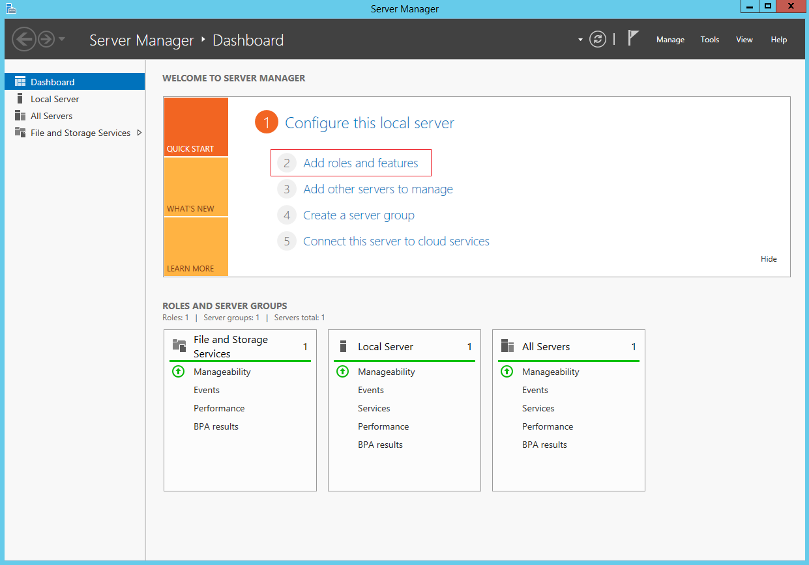
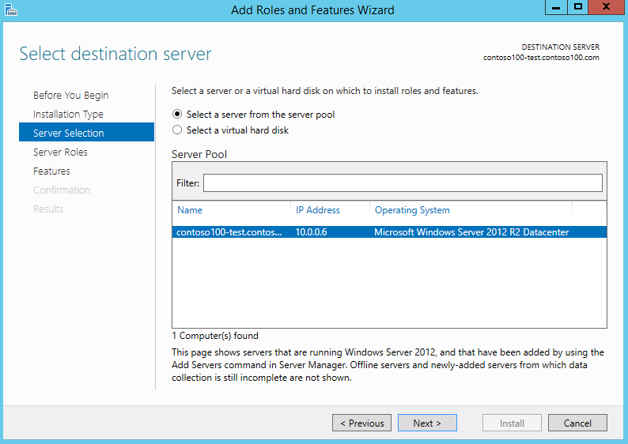

<properties
    pageTitle="Azure Active Directory-Domänendiensten: Verwalten von DNS auf verwalteten Domains | Microsoft Azure"
    description="Verwalten von DNS auf Azure Active Directory-Domänendiensten verwalteten Domänen"
    services="active-directory-ds"
    documentationCenter=""
    authors="mahesh-unnikrishnan"
    manager="stevenpo"
    editor="curtand"/>

<tags
    ms.service="active-directory-ds"
    ms.workload="identity"
    ms.tgt_pltfrm="na"
    ms.devlang="na"
    ms.topic="article"
    ms.date="10/03/2016"
    ms.author="maheshu"/>

# Verwalten von DNS-Einträge in einer verwalteten Azure Active Directory-Domänendiensten-Domäne
Azure Active Directory-Domänendiensten enthält einen DNS (Domain namensauflösung)-Server, der mit einer Auflösung von DNS-Einträge für die verwaltete Domäne enthält. Es kann vorkommen, müssen Sie möglicherweise zum Konfigurieren von DNS auf der verwalteten Domäne. Möglicherweise müssen zum Erstellen von DNS-Einträge für Maschinen, die nicht Teil der Domäne sind, virtuelle IP-Adressen für Lastenausgleich konfigurieren oder externen DNS-Weiterleitung für die Einrichtung. Aus diesem Grund werden Benutzer der Gruppe 'AAD DC Administratoren' angehören DNS-Verwaltung erforderlich auf die verwaltete Domäne erteilt.

## Vorbemerkung
Wenn Sie die in diesem Artikel beschriebenen Aufgaben ausführen zu können, müssen Sie folgende Aktionen ausführen:

1. Ein gültiges **Azure-Abonnement**.

2. Ein **Verzeichnis Azure AD** - synchronisiert entweder mit einem lokalen Verzeichnis oder ein Verzeichnis Cloud nur an.

3. **Azure-Active Directory-Domänendiensten** muss für das Azure AD-Verzeichnis aktiviert sein. Wenn Sie dies nicht erfolgt noch, führen Sie alle Aufgaben, die in den [Leitfaden für erste Schritte](./active-directory-ds-getting-started.md)erläutert.

4. Eine **Domäne virtuellen Computern** Azure Active Directory-Domänendiensten verwaltete Domäne verwalten. Wenn Sie einem solchen virtuellen Computer besitzen, führen Sie alle Aufgaben, die in den folgenden Artikel: [Teilnehmen an einem Windows-Computer mit einer verwalteten Domäne](./active-directory-ds-admin-guide-join-windows-vm.md)beschrieben.

5. Sie benötigen die Anmeldeinformationen eines **Benutzerkontos zur Gruppe "AAD DC Administratoren"** in Ihrem Verzeichnis, DNS-Einträge für Ihre Domäne verwalteten verwalten.

 

## Aufgabe 1: Bereitstellen eines Domänenverbund virtuellen Computers Remote DNS-Einträge für die verwaltete Domäne verwalten
Azure Active Directory-Domänendiensten verwaltete Domänen können mit den vertrauten Active Directory-Verwaltung wie Active Directory Administrative Center (ADAC) AD PowerShell remote verwaltet werden. DNS-Einträge für die Domäne, die verwaltete kann auf ähnliche Weise verwenden die DNS-Server-Verwaltungstools remote verwaltet werden.

Administratoren in Ihrem Verzeichnis Azure AD-haben keine Berechtigungen, um die Verbindung mit Domänencontroller auf die verwaltete Domäne über Remote Desktop. Mitglieder der Gruppe 'AAD DC Administratoren' können DNS-Einträge verwalten, für verwaltete Domänen Remote mithilfe der DNS-Server Tools aus einem Windows Server/Client-Computer, der die verwaltete Domäne hinzugefügt wird. Tools für DNS-Server können als Teil der Remote Server-Verwaltungstools (RSAT) optionales Feature unter Windows Server und der verwalteten Domäne Clientcomputer installiert werden.

Der erste Vorgang ist auf einem Windows Server-virtuellen Computern bereitstellen, die die verwaltete Domäne hinzugefügt wird. Anweisungen finden Sie im folgenden Artikel: [Teilnehmen an einer Windows Server virtuellen Computers zu einer Domäne Azure Active Directory-Domänendiensten verwaltet](active-directory-ds-admin-guide-join-windows-vm.md).

## Aufgabe 2: Installieren von DNS-Server-Tools des virtuellen Computers
Führen Sie die folgenden Schritte aus, um die DNS-Verwaltung-Tools auf dem Beitritt zu Domäne virtuellen Computer installieren. Weitere Informationen zum [Installieren und Verwenden von Remoteserver-Verwaltungstools](https://technet.microsoft.com/library/hh831501.aspx)finden Sie im Technet.

1. Navigieren Sie zum **virtuellen Computern** -Knoten in der klassischen Azure-Portal an. Wählen Sie die virtuellen Computern, die Sie in Aufgabe 1 erstellt haben, und klicken Sie auf der Befehlsleiste am unteren Rand des Fensters auf **Verbinden** .

    

2. Das klassische Portal fordert Sie zum Öffnen oder Speichern einer Datei mit der Erweiterung 'RDP-', die Verbindung zu des virtuellen Computers verwendet wird. Klicken Sie auf die Datei, wenn der Download abgeschlossen ist.

3. Login dazu aufgefordert werden verwenden Sie die Anmeldeinformationen eines Benutzers zur Gruppe "AAD DC Administratoren" ein. Beispielsweise verwenden wir 'bob@domainservicespreview.onmicrosoft.com' in diesem Fall.

4. Öffnen Sie den Startbildschirm **Server-Manager**. Klicken Sie im mittleren Bereich des Fensters Server-Manager **Hinzufügen von Rollen und Features** auf.

    

5. Klicken Sie auf der Seite **Vorbereitung** **Hinzufügen von Rollen und Features-Assistenten**auf **Weiter**.

    

6. Klicken Sie auf der Seite **Installation Type** lassen Sie die **Rolle oder Feature-basierten** Installationsoption aktiviert, und klicken Sie auf **Weiter**.

    

7. Klicken Sie auf der Seite **Auswahl** wählen Sie aus dem Serverpool des aktuellen virtuellen Computers aus, und klicken Sie auf **Weiter**.

    

8. Klicken Sie auf der Seite **Serverrollen** auf **Weiter**. Diese Seite überspringen wir, da wir alle Rollen auf dem Server nicht installiert werden.

9. Klicken Sie auf der Seite **Features** klicken Sie auf, um die **Remoteserver-Verwaltungstools** Knoten zu erweitern, und klicken Sie dann auf Erweitern Sie den Knoten **Rolle-Verwaltungstools** . Wählen Sie aus der Liste der Rolle-Verwaltungstools Feature **DNS-Server-Tools** aus.

    

10. Klicken Sie auf der Seite **Bestätigung** auf **Installieren** , um das Feature der DNS-Server-Tools auf dem virtuellen Computer installieren. Wenn der Featureinstallation erfolgreich abgeschlossen ist, klicken Sie auf **Schließen** zum Beenden des Assistenten zum **Hinzufügen von Rollen und Features** .

    

## Aufgabe 3: Launch die DNS-Verwaltungskonsole DNS verwalten
Nachdem Sie nun das Feature DNS-Server-Tools installiert ist, klicken Sie auf der Domäne beigetreten virtuellen Computern, können wir die DNS-Tools zum Verwalten von DNS-Einträge in der verwalteten Domäne verwenden.

> [AZURE.NOTE] Sie müssen ein Mitglied der Gruppe 'AAD DC Administratoren' zum Verwalten von DNS-Einträge in der verwalteten Domäne sein.

1. Vom Startbildschirm klicken Sie auf **Verwaltung**. Es sollte die **DNS-** Konsole auf dem virtuellen Computer installiert angezeigt.

    

2. Klicken Sie auf **DNS-Einträge** , um die DNS-Verwaltungskonsole zu starten.

3. Klicken Sie auf die Option mit dem Namen **der folgenden Computer**, und geben Sie den DNS-Domänennamen der verwalteten Domäne (beispielsweise ' contoso100.com'), klicken Sie im Dialogfeld **Verbindung mit DNS-Server herstellen** .

    

4. Der DNS-Konsole eine Verbindung mit der verwalteten Domäne.

    

5. Die DNS-Konsole können jetzt DNS-Einträge für Computern innerhalb des virtuellen Netzwerks hinzufügen, in dem Sie AAD Domänendiensten aktiviert haben.

> [AZURE.WARNING] Achten Sie bei der Verwaltung von DNS-Einträge für die DNS-Verwaltungstools mit verwalteten Domäne. Vergewissern Sie sich diese Sie **nicht löschen oder ändern Sie die integrierten DNS-Datensätze, die von den Domänendiensten in der Domäne verwendet werden**. Integrierte DNS-Einträge sind DNS-Einträge, Namenservereinträge und anderen Datensätzen für DC Speicherort verwendet. Wenn Sie diese Datensätze zu ändern, werden auf das virtuelle Netzwerk Domänendiensten gestört.

Finden Sie weitere Informationen zum Verwalten von DNS die [DNS-Tools Artikel auf Technet](https://technet.microsoft.com/library/cc753579.aspx) .

## Siehe auch

- [Azure Active Directory-Domänendiensten - Leitfaden für erste Schritte](./active-directory-ds-getting-started.md)

- [Teilnehmen an einer Windows Server-virtuellen Computern zu einer verwalteten Azure Active Directory-Domänendiensten-Domäne](active-directory-ds-admin-guide-join-windows-vm.md)

- [Verwalten einer verwalteten Azure Active Directory-Domänendiensten-Domäne](active-directory-ds-admin-guide-administer-domain.md)

- [DNS-Verwaltungstools](https://technet.microsoft.com/library/cc753579.aspx)
