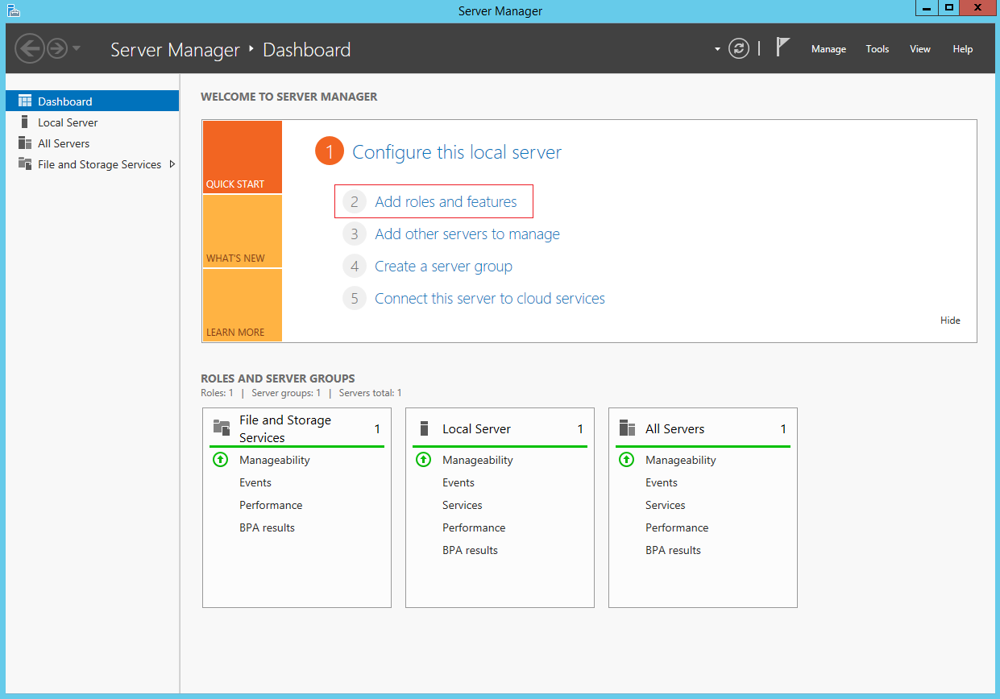
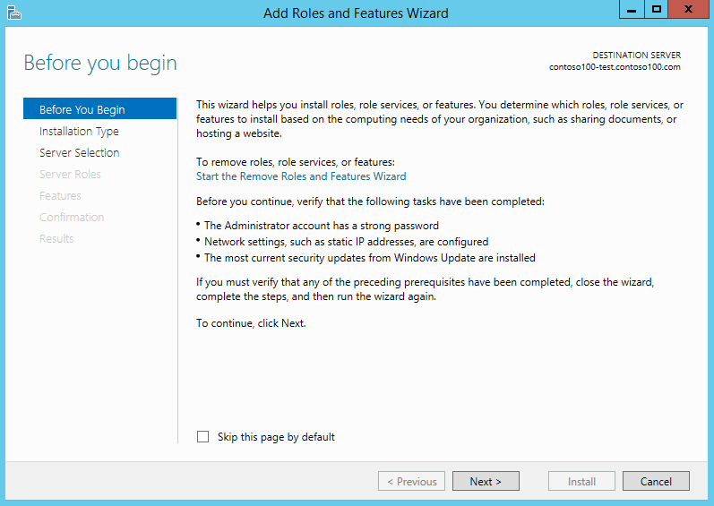
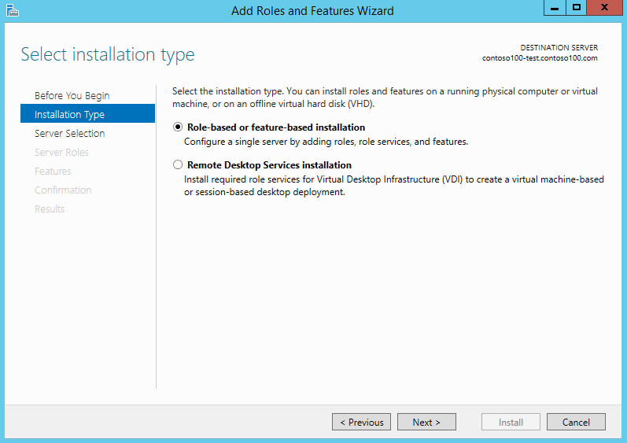
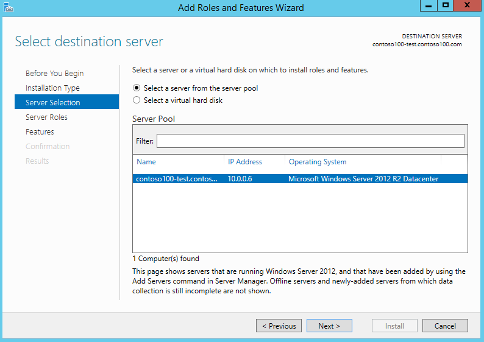
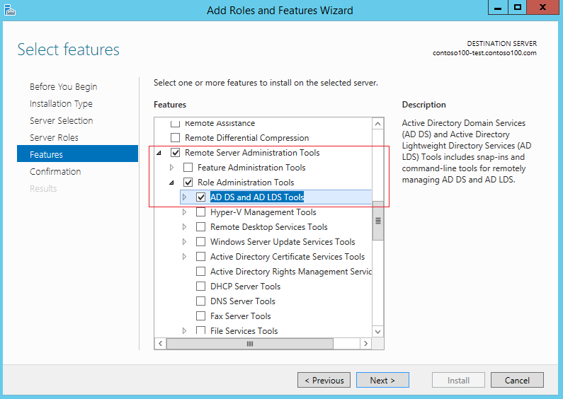
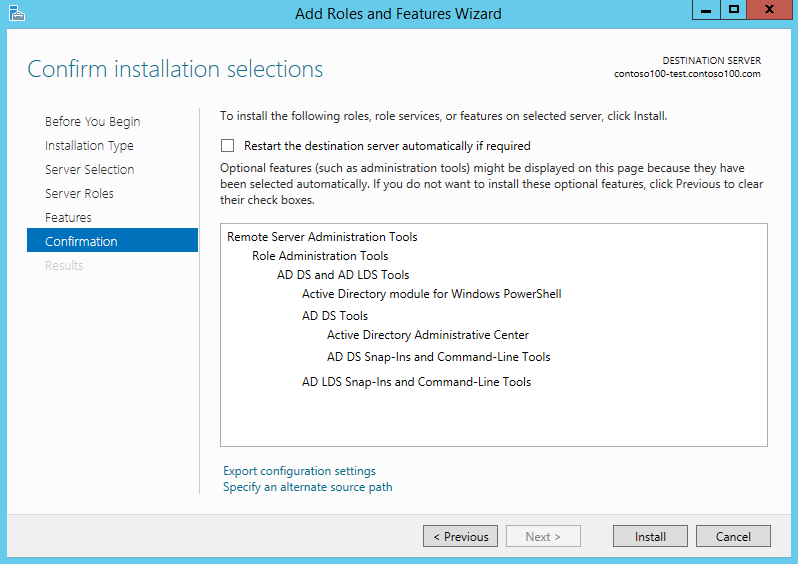
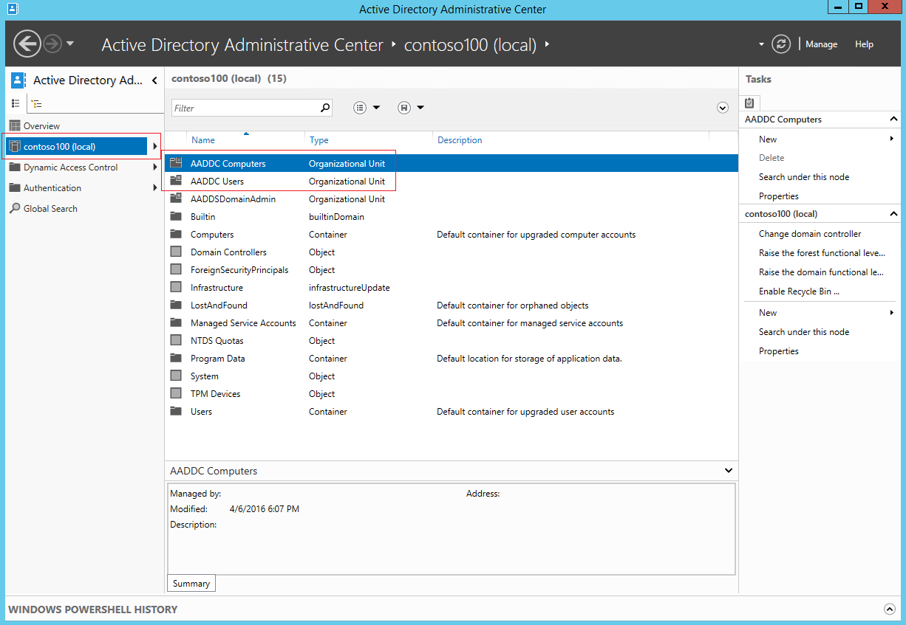
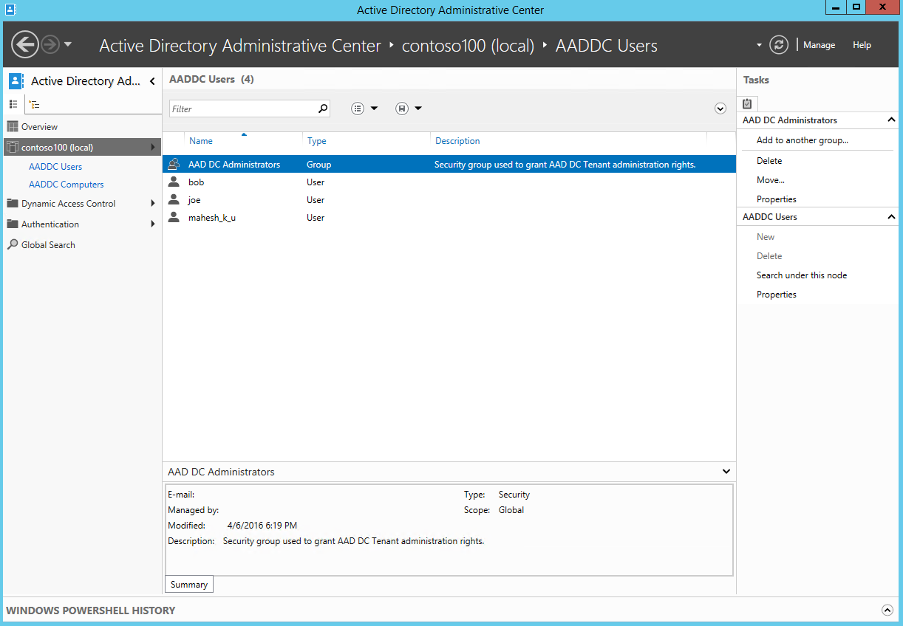
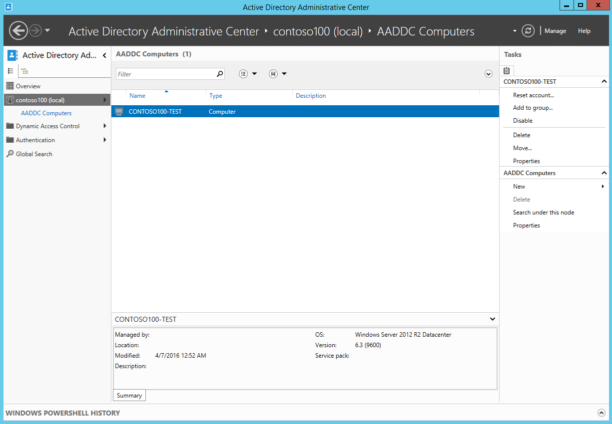

<properties
    pageTitle="Azure Active Directory-Domänendiensten: Verwalten eine verwaltete Domäne | Microsoft Azure"
    description="Verwaltete Azure Active Directory-Domänendienste-Domänen verwalten"
    services="active-directory-ds"
    documentationCenter=""
    authors="mahesh-unnikrishnan"
    manager="stevenpo"
    editor="curtand"/>

<tags
    ms.service="active-directory-ds"
    ms.workload="identity"
    ms.tgt_pltfrm="na"
    ms.devlang="na"
    ms.topic="article"
    ms.date="10/02/2016"
    ms.author="maheshu"/>

# Verwalten einer verwalteten Azure Active Directory-Domänendienste-Domäne
In diesem Artikel wird gezeigt, wie eine verwaltete Azure Active Directory (AD)-Domänendienste-Domäne verwalten.

## Vorbemerkung
Wenn Sie die in diesem Artikel beschriebenen Aufgaben ausführen zu können, müssen Sie folgende Aktionen ausführen:

1. Ein gültiges **Azure-Abonnement**.

2. Ein **Verzeichnis Azure AD** - synchronisiert entweder mit einem lokalen Verzeichnis oder ein Verzeichnis Cloud nur an.

3. **Azure-Active Directory-Domänendiensten** muss für das Azure AD-Verzeichnis aktiviert sein. Wenn Sie dies nicht erfolgt noch, führen Sie alle Aufgaben, die in den [Leitfaden für erste Schritte](./active-directory-ds-getting-started.md)erläutert.

4. Eine **Domäne virtuellen Computern** Azure Active Directory-Domänendiensten verwaltete Domäne verwalten. Wenn Sie einem solchen virtuellen Computer besitzen, führen Sie alle Aufgaben, die in den folgenden Artikel: [Teilnehmen an einem Windows-Computer mit einer verwalteten Domäne](./active-directory-ds-admin-guide-join-windows-vm.md)beschrieben.

5. Sie benötigen die Anmeldeinformationen eines **Benutzerkontos zur Gruppe "AAD DC Administratoren"** in Ihrem Verzeichnis, zum Verwalten Ihrer verwalteten Domäne aus.

 

## Administrativen Aufgaben, die Sie in einer verwalteten Domäne ausführen können
Mitglieder der Gruppe 'AAD DC Administratoren' werden Berechtigungen für die verwaltete Domäne erteilt hat, mit die sie, wie die folgenden Aufgaben ausführen können:

- Fügen Sie Computern zur verwalteten Domäne aus.

- Konfigurieren Sie das integrierte Gruppenrichtlinienobjekt für den Container 'AADDC Computern' und 'AADDC Benutzer' in der verwalteten Domäne aus.

- Verwalten von DNS-Einträge in der verwalteten Domäne.

- Erstellen und Verwalten von benutzerdefinierten organisationsinterne Einheiten der verwalteten Domäne.

- Gewinn Administratorzugriff auf den Computern der verwalteten Domäne hinzugefügt.

## Administratorrechte müssen Sie nicht in einer verwalteten Domäne
Die Domäne wird von Microsoft, einschließlich Aktivitäten wie Patch, für die Überwachung und Erstellen von Sicherungskopien verwaltet. Daher die Domäne gesperrt ist, und Sie verfügen nicht über die Berechtigungen für bestimmte Verwaltungsaufgaben auf die Domäne. Einige Beispiele für Aufgaben, die Sie ausführen können, sind unter.

- Sie sind nicht Domain-Administrator oder Unternehmensadministrator Berechtigungen für die verwaltete Domäne erteilt.

- Sie können das Schema der verwalteten Domäne nicht erweitern.

- Sie können keine Domänencontroller für die Verwendung von Remotedesktop verwalteten Domäne verbinden.

- Sie können keine Domänencontroller verwalteten Domäne hinzufügen.

## Aufgabe 1: Bereitstellen eines Domänenverbund Windows Server virtuellen Computers Remote verwaltete Domäne verwalten
Azure Active Directory-Domänendiensten verwalteten Domains können mit vertrauten Active Directory-Verwaltungstools wie AD PowerShell Active Directory Administrative Center (ADAC) verwaltet werden. Mandantenadministratoren haben keine Berechtigungen, um die Verbindung mit Domänencontroller auf die verwaltete Domäne über Remote Desktop. Daher können Mitglieder der Gruppe 'AAD DC Administratoren' verwalteten Domains mit Remote AD-Verwaltung von einem Windows Server/Client-Computer, der Mitglied der verwalteten Domäne ist verwalten. Active Directory-Verwaltungstools können als Teil der Remote Server-Verwaltungstools (RSAT) optionales Feature unter Windows Server und der verwalteten Domäne Clientcomputer installiert sein.

Dieser erste Schritt besteht eine Windows Server-virtuellen Computern einrichten, die die verwaltete Domäne hinzugefügt wird. Anweisungen finden Sie im folgenden Artikel: [Teilnehmen an einer Windows Server virtuellen Computers zu einer Domäne Azure Active Directory-Domänendiensten verwaltet](active-directory-ds-admin-guide-join-windows-vm.md).

### Remote verwalten Sie verwaltete Domäne, von einem Clientcomputer (beispielsweise Windows 10)
Die Anweisungen in diesem Artikel verwenden eines Windows Server virtuellen Computers AAD-Verzeichnisdienst verwalten verwaltet die Domäne. Sie können jedoch auch Client (beispielsweise Windows 10) einen Windows-Computer verwenden können.

Sie können auf einem Windows-Client-Computer [installieren (Remote Server Administration Tools RSAT)](http://social.technet.microsoft.com/wiki/contents/articles/2202.remote-server-administration-tools-rsat-for-windows-client-and-windows-server-dsforum2wiki.aspx) anhand der Anweisungen auf TechNet.

## Aufgabe 2: installieren Active Directory-Verwaltungstools des virtuellen Computers
Führen Sie die folgenden Schritte aus, um die Verwaltung von Active Directory-Tools auf dem Beitritt zu Domäne virtuellen Computer installieren. Weitere [Informationen zum Installieren und Verwenden von Remoteserver-Verwaltungstools](https://technet.microsoft.com/library/hh831501.aspx)finden Sie im Technet.

1. Navigieren Sie zum **virtuellen Computern** -Knoten in der klassischen Azure-Portal an. Wählen Sie die virtuellen Computern, die Sie in Aufgabe 1 erstellt haben, und klicken Sie auf der Befehlsleiste am unteren Rand des Fensters auf **Verbinden** .

    

2. Das klassische Portal fordert Sie zum Öffnen oder Speichern einer Datei mit der Erweiterung 'RDP-', die Verbindung zu des virtuellen Computers verwendet wird. Klicken Sie auf diese Option, um die Datei zu öffnen, wenn der Download abgeschlossen ist.

3. Login dazu aufgefordert werden verwenden Sie die Anmeldeinformationen eines Benutzers zur Gruppe "AAD DC Administratoren" ein. Beispielsweise verwenden wir 'bob@domainservicespreview.onmicrosoft.com' in diesem Fall.

4. Öffnen Sie den Startbildschirm **Server-Manager**. Klicken Sie im mittleren Bereich des Fensters Server-Manager **Hinzufügen von Rollen und Features** auf.

    

5. Klicken Sie auf der Seite **Vorbereitung** **Hinzufügen von Rollen und Features-Assistenten**auf **Weiter**.

    

6. Klicken Sie auf der Seite **Installation Type** lassen Sie die **Rolle oder Feature-basierten** Installationsoption aktiviert, und klicken Sie auf **Weiter**.

    

7. Klicken Sie auf der Seite **Auswahl** wählen Sie aus dem Serverpool des aktuellen virtuellen Computers aus, und klicken Sie auf **Weiter**.

    

8. Klicken Sie auf der Seite **Serverrollen** auf **Weiter**. Diese Seite überspringen wir, da wir alle Rollen auf dem Server nicht installiert werden.

9. Klicken Sie auf der Seite **Features** klicken Sie auf, um die **Remoteserver-Verwaltungstools** Knoten zu erweitern, und klicken Sie dann auf Erweitern Sie den Knoten **Rolle-Verwaltungstools** . Wählen Sie aus der Liste der Rolle-Verwaltungstools **AD DS und AD LDS Tools** Feature aus.

    

10. Klicken Sie auf der Seite **Bestätigung** AD LDS Toolsfeature des virtuellen Computers zu installieren der AD auf **Installieren** . Wenn der Featureinstallation erfolgreich abgeschlossen ist, klicken Sie auf **Schließen** zum Beenden des Assistenten zum **Hinzufügen von Rollen und Features** .

    

## Aufgabe 3: Herstellen einer Verbindung mit und Untersuchen von verwalteten Domäne
Jetzt, da die AD-Verwaltung installiert sind, klicken Sie auf der Domäne beigetreten virtuellen Computern, wir können diese Tools verwenden, um das Durchsuchen und Verwalten der verwalteten Domäne.

> [AZURE.NOTE] Sie müssen ein Mitglied der Gruppe 'AAD DC Administratoren' zum Verwalten der verwalteten Domäne sein.

1. Vom Startbildschirm klicken Sie auf **Verwaltung**. Es sollte die AD-Verwaltung des virtuellen Computers installiert angezeigt.

    

2. Klicken Sie auf **Active Directory Administrative Center**.

    

3. Um die Domäne durchsuchen möchten, klicken Sie auf den Domänennamen im linken Bereich (beispielsweise ' contoso100.com'). Beachten Sie die zwei Notizencontainern als "AADDC Computern" und "AADDC Users" bezeichnet.

    

4. Klicken Sie auf den Container mit dem Namen **AADDC Benutzer** , um alle Benutzer und Gruppen in der verwalteten Domäne anzuzeigen. Folgendes sollte angezeigt werden Benutzerkonten und Gruppen aus Ihrer Azure AD-Mandanten anzeigen oben in diesem Container. In diesem Beispiel Mitteilung, ein Benutzerkonto für Benutzer mit dem Namen 'bob' und eine Gruppe namens 'AAD DC Administratoren' stehen in diesem Container.

    

5. Klicken Sie auf den Container aufgerufen **AADDC Computer** , um den Computern haben, diese verwalteten Domäne anzuzeigen. Sie sollten die Domäne hinzugefügt wird einen Eintrag für den aktuellen virtuellen Computern angezeigt werden Computerkonten für alle Computer, die zur Azure-Active Directory-Domänendiensten verwalteten Domäne hinzugefügt werden, werden in diesem Container 'AADDC Computern' gespeichert.

    

 

## Siehe auch

- [Azure Active Directory-Domänendiensten - Leitfaden für erste Schritte](./active-directory-ds-getting-started.md)

- [Teilnehmen an einer Windows Server-virtuellen Computern zu einer verwalteten Azure Active Directory-Domänendiensten-Domäne](active-directory-ds-admin-guide-join-windows-vm.md)

- [Bereitstellen von Remoteserver-Verwaltungstools](https://technet.microsoft.com/library/hh831501.aspx)
