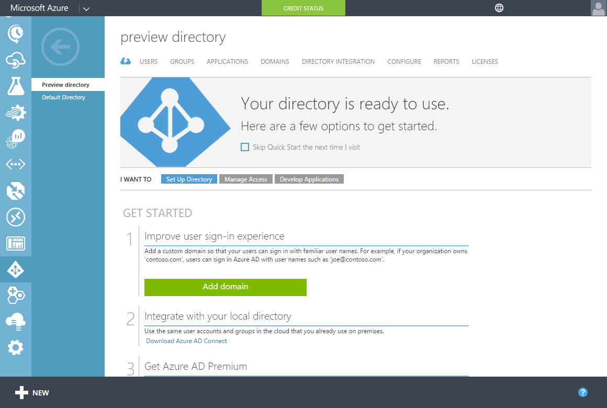

<properties
    pageTitle="Konfigurieren der Azure-Active Directory-Domänendiensten sicheres LDAP (LDAPS) | Microsoft Azure"
    description="Konfigurieren von Secure LDAP (LDAPS) für eine verwaltete Azure Active Directory-Domänendiensten-Domäne"
    services="active-directory-ds"
    documentationCenter=""
    authors="mahesh-unnikrishnan"
    manager="stevenpo"
    editor="curtand"/>

<tags
    ms.service="active-directory-ds"
    ms.workload="identity"
    ms.tgt_pltfrm="na"
    ms.devlang="na"
    ms.topic="article"
    ms.date="09/21/2016"
    ms.author="maheshu"/>

# Konfigurieren von Secure LDAP (LDAPS) für eine verwaltete Azure Active Directory-Domänendiensten-Domäne
Dieser Artikel beschreibt, wie Sie für Ihre Azure-Active Directory-Domänendiensten verwalteten Domäne Secure Lightweight Directory Access Protocol (LDAPS) aktivieren können. Sicheres LDAP ist auch bekannt als "Lightweight Directory Access Protocol (LDAP) über Secure Sockets Layer (SSL) / Transport Layer Security (TLS)'.

## Vorbemerkung
Wenn Sie die in diesem Artikel beschriebenen Aufgaben ausführen zu können, müssen Sie folgende Aktionen ausführen:

1. Ein gültiges **Azure-Abonnement**.

2. Ein **Verzeichnis Azure AD** - synchronisiert entweder mit einem lokalen Verzeichnis oder ein Verzeichnis Cloud nur an.

3. **Azure-Active Directory-Domänendiensten** muss für das Azure AD-Verzeichnis aktiviert sein. Wenn Sie dies nicht erfolgt noch, führen Sie alle Aufgaben, die in den [Leitfaden für erste Schritte](./active-directory-ds-getting-started.md)erläutert.

4. Ein **Zertifikat verwendet werden soll, aktivieren sicheres LDAP**.
    - **Empfohlen** – ein Zertifikat von Ihrer Zertifizierungsstelle des Unternehmens oder einer öffentlichen Zertifizierungsstelle erhalten. Diese Konfigurationsoption ist sicherer.
    - Alternativ können Sie auch zum [Erstellen eines selbstsignierten Zertifikats](#task-1---obtain-a-certificate-for-secure-ldap) auswählen, wie weiter unten in diesem Artikel dargestellt.

 

### Anforderungen für das sichere LDAP-Zertifikat
Erwerben Sie ein gültiges Zertifikat pro die folgenden Richtlinien, bevor Sie sicheres LDAP aktivieren. Wenn Sie versuchen, sicheres LDAP für Ihre verwalteten Domäne mit einem ungültigen/falsche Zertifikat aktivieren auftreten Fehler.

1. **Vertrauenswürdige Herausgeber** – das Zertifikat von einer Zertifizierungsstelle von Computern, die Verbindung zu der Domäne sicheres LDAP verwenden müssen vertrauenswürdige ausgestellt werden muss. Diese Zertifizierungsstelle möglicherweise Ihrer Organisation Enterprise-Zertifizierungsstelle oder einer öffentlichen Zertifizierungsstelle vertrauenswürdig für diese Computer.

2. **Lebensdauer** – das Zertifikat muss mindestens die nächsten 3 bis 6 Monate gültig sein. Sicherer LDAP-Zugriff auf Ihre verwalteten Domäne ist unterbrochen, wenn das Zertifikat abgelaufen ist.

3. **Betreff Namen** - Betreff der Name des Zertifikats muss einen Platzhalter für Ihre Domäne verwalteten sein. Beispielsweise wenn den Namen Ihrer Domäne 'contoso100.com' wird der Name des Zertifikats Betreff muss ' *. contoso100.com'. Legen Sie den DNS-Namen (Betreff alternativen Namen) auf diesem Namen Platzhalterzeichen.

3. **Key Usage** - das Zertifikat muss für Folgendes verwendet - digitalen Signaturen als auch Key Verschlüsselung konfiguriert werden.

4. **Zwecks Zertifikat** - das Zertifikat muss für SSL-Serverauthentifizierung gültig sein.

 

## Aufgabe 1: Abrufen eines Zertifikats für sicheres LDAP
Der erste Vorgang umfasst, erhalten ein Zertifikat für sichere LDAP-Zugriff auf die verwaltete Domäne verwendet. Sie haben zwei Optionen:

- Rufen Sie ein Zertifikat von einer Zertifizierungsstelle an. Die Zertifizierungsstelle möglicherweise Ihrer Organisation Enterprise Zertifizierungsstelle oder einer öffentlichen Zertifizierungsstelle.

- Erstellen Sie ein selbst signiertes Zertifikat.

### Option ein (empfohlen) – ein sicheres LDAP-Zertifikat von einer Zertifizierungsstelle erhalten
Wenn Ihre Organisation eine Enterprise öffentlichen Key Infrastruktur bereitstellt, müssen Sie ein Zertifikat aus der Enterprise-Zertifizierungsstelle (CA) für Ihre Organisation zu erhalten. Wenn Ihre Organisation ihre Zertifikate von einer öffentlichen Zertifizierungsstelle erhält, müssen Sie das sichere LDAP-Zertifikat von dieser öffentlichen Zertifizierungsstelle beziehen.

Wenn Sie ein Zertifikat anfordern, stellen Sie sicher, dass Sie die Anforderungen in [Vorbedingung für das sichere LDAP-Zertifikat](#requirements-for-the-secure-ldap-certificate)gegliederter folgen.

> [AZURE.NOTE] Clientcomputer, die Verbindung zu der verwalteten Domäne sicheres LDAP verwenden müssen, müssen der Herausgeber des Zertifikats LDAPS vertrauen.

### Option B – Erstellen eines selbstsignierten Zertifikats für sichere LDAP
Sie möglicherweise zum Erstellen eines selbstsignierten Zertifikats für sichere LDAP auswählen, wenn:

- Zertifikate in Ihrer Organisation werden nicht von einem Enterprise-Zertifizierungsstelle ausgestellt oder
- Sie erwarten kein Zertifikat einer öffentlichen Zertifizierungsstelle verwenden.

**Erstellen eines selbstsignierten Zertifikats mithilfe der PowerShell**

Öffnen Sie auf Ihrem Windows-Computer als **Administrator** ein neues PowerShell-Fenster zu, und geben Sie die folgenden Befehle zum Erstellen eines neuen selbstsignierten Zertifikats.

    $lifetime=Get-Date

    New-SelfSignedCertificate -Subject *.contoso100.com -NotAfter $lifetime.AddDays(365) -KeyUsage DigitalSignature, KeyEncipherment -Type SSLServerAuthentication -DnsName *.contoso100.com

Ersetzen Sie im vorhergehenden Beispiel 'contoso100.com' mit der DNS-Domänenname Ihrer Azure-Active Directory-Domänendiensten verwalteten Domäne aus.

Das neu erstellte selbst signierte Zertifikat wird dem lokalen Computer Zertifikat Store platziert.

## Aufgabe 2: Exportieren der sicheres LDAP Serverzertifikat für ein. PFX-Datei
Bevor Sie diesen Vorgang beginnen, stellen Sie sicher, dass Sie das sichere LDAP-Zertifikat von Ihrer Enterprise-Zertifizierungsstelle oder einer öffentlichen Zertifizierungsstelle erhalten haben oder ein selbst signiertes Zertifikat erstellt haben.

Gehen Sie folgendermaßen vor, um das Zertifikat LDAPS zum Exportieren einer. PFX-Datei.

1. Drücken Sie die Schaltfläche **Start** , und geben Sie **R**. Klicken Sie im Dialogfeld **Ausführen** Geben Sie **Mmc** ein, und klicken Sie auf **OK**.

    

2. **Benutzerkontensteuerung** dazu aufgefordert werden klicken Sie auf **Ja,** um MMC (Microsoft Management Console) als Administrator zu starten.

3. Klicken Sie im Menü **Datei** auf **Hinzufügen/Entfernen Snap-mit...**.

    

4. Wählen Sie im Dialogfeld **Hinzufügen oder Entfernen von Snap-ins** das **Zertifikate** -Snap-in, und klicken Sie auf die **Hinzufügen >** Schaltfläche.

    

5. Im **Zertifikat-Snap-in** -Assistenten **Computerkonto** wählen Sie aus, und klicken Sie auf **Weiter**.

    

6. Wählen Sie auf der Seite **Computer auswählen** **lokalen Computer: (der Computer, auf diese Konsole ausgeführt wird)** , und klicken Sie auf **Fertig stellen**.

    

7. Klicken Sie auf **OK** , um das Zertifikate-Snap-in MMC hinzuzufügen, klicken Sie im Dialogfeld **Hinzufügen oder Entfernen von Snap-ins** .

    

8. Klicken Sie im Fenster MMC **Console Root**erweitern Sie klicken. Das Zertifikat-Snap-in geladen sollte angezeigt werden. Klicken Sie auf **Zertifikate (lokaler Computer)** zu erweitern. Klicken Sie auf diese Option, um den Knoten **Eigene Zertifikate** , gefolgt von den Knoten **Zertifikate** zu erweitern.

    

9. Das selbst signierte Zertifikat, die, das wir erstellt haben, sollte angezeigt werden. Sie können die Eigenschaften des Zertifikats um sicherzustellen, dass der Fingerabdruck entspricht, die auf der Windows PowerShell gemeldet wird, wenn Sie das Zertifikat erstellt haben, untersuchen.

10. Wählen Sie die selbst signiertes Zertifikat, und **Klicken Sie mit der rechten Maustaste auf**ein. Klicken Sie im Menü mit der rechten Maustaste wählen Sie **Alle Vorgänge** aus, und wählen Sie **... exportieren**.

    

11. Klicken Sie im **Zertifikat Export-Assistenten**auf **Weiter**.

    

12. Klicken Sie auf der Seite **Privatschlüssel exportieren** wählen Sie **Ja, privaten Schlüssel exportieren**aus, und klicken Sie auf **Weiter**.

    

    > [AZURE.WARNING] Sie müssen den privaten Schlüssel sowie das Zertifikat exportieren. Wenn Sie eine PFX, die nicht den privaten Schlüssel für das Zertifikat enthält bereitstellen, schlägt fehl, sicheres LDAP für Ihre Domäne verwalteten aktivieren.

13. Wählen Sie auf der Seite **Format der zu exportierenden Datei** **Personal Information Exchange - PKCS #12 (. PFX)** als das Dateiformat für die exportierte Zertifikat.

    

    > [AZURE.NOTE] Nur die. PFX-Dateiformat wird unterstützt. Das Zertifikat, das nicht exportieren der. CER-Dateiformat.

14. Wählen Sie auf der Seite **Sicherheit** in ein Kennwort zum schützen die Option **Kennwort** und den Typ der. PFX-Datei. Speichern Sie dieses Kennwort, da es in der nächsten Aufgabe benötigt werden. Klicken Sie auf **Weiter** um den Vorgang fortzusetzen.

    

    > [AZURE.NOTE] Notieren Sie sich dieses Kennwort. Benötigt während der sicheres LDAP für diese verwalteten Domäne in [Aufgabe 3: sicheres LDAP für die verwaltete Domäne aktivieren](#task-3---enable-secure-ldap-for-the-managed-domain)

15. Geben Sie den Dateinamen und den Speicherort, wo Sie das Zertifikat exportieren möchten, klicken Sie auf der Seite **Exportdatei** .

    

16. Klicken Sie auf der folgenden Seite auf **Fertig stellen** , um das Zertifikat in eine PFX-Datei exportieren. Bestätigungsdialogfeld sollte angezeigt werden, wenn das Zertifikat exportiert wurde.

    

## Aufgabe 3: sicheres LDAP aktivieren, für die verwaltete Domäne
Wenn sicheres LDAP aktivieren möchten, führen Sie die folgenden Konfigurationsschritte aus:

1. Navigieren Sie zu der **[Azure klassischen Portal](https://manage.windowsazure.com)**.

2. Wählen Sie im linken Bereich **Active Directory** -Knotens.

3. Wählen Sie das Azure AD-Verzeichnis (auch als "Mandant" bezeichnet), für das Azure-Active Directory-Domänendiensten aktiviert haben.

    

4. Klicken Sie auf die Registerkarte **Konfigurieren** .

    

5. Führen Sie einen Bildlauf nach unten bis zum Abschnitt mit **Domänendiensten**. Finden Sie eine Option aus, mit dem Titel **Secure LDAP (LDAPS)** , wie im folgenden Screenshot gezeigt:

    

6. Klicken Sie auf die Schaltfläche **Konfigurieren Zertifikat...** , um das Dialogfeld **Konfigurieren Zertifikat für LDAP** anzuzeigen.

    

7. Klicken Sie auf das Ordnersymbol unter **PFX-Datei mit Zertifikat** , um anzugeben, die PFX-Datei, die das Zertifikat enthält, die, das Sie für sichere LDAP-Zugriff auf die verwaltete Domäne verwenden möchten. Geben Sie auch das Kennwort ein, das Sie angegeben haben, wenn das Zertifikat in der PFX-Datei exportieren. Klicken Sie dann auf die Schaltfläche unten auf Fertig.

    

8. Die Registerkarte **Konfigurieren** im Abschnitt **Domänendiensten** sollte abgeblendet abrufen und befindet sich in der **steht noch aus...** Bundesland ein paar Minuten. Während dieses Zeitraums wird das Zertifikat LDAPS Genauigkeit überprüft und sicheres LDAP für Ihre Domäne verwalteten konfiguriert ist.

    

    > [AZURE.NOTE] Es dauert ungefähr 10 bis 15 Minuten, sicheres LDAP für Ihre Domäne verwalteten aktivieren. Wenn Sie das bereitgestellte sichere LDAP-Zertifikat nicht die erforderlichen Kriterien entspricht, sicheres LDAP für Ihr Verzeichnis nicht aktiviert ist, und einen Fehler angezeigt. Beispielsweise der Domänennamen falsch ist, das Zertifikat ist abgelaufen oder ähnlichen bald abläuft.

9. Wenn sicheres LDAP erfolgreich für Ihre Domäne verwalteten aktiviert ist die **steht noch aus...** Meldung sollte verschwinden. Sie sollten finden Sie unter der Fingerabdruck des Zertifikats angezeigt.

    

 

## Aufgabe 4 - sicheren LDAP-Zugriff über das Internet aktivieren
**Optionale Aufgabe** – Wenn Sie nicht beabsichtigen, für den Zugriff auf die verwaltete Domäne über LDAPS über das Internet überspringen Sie diese Schritte für die Konfiguration.

Bevor Sie diesen Vorgang beginnen, stellen Sie sicher, dass Sie die Schritte in der [Aufgabe 3](#task-3---enable-secure-ldap-for-the-managed-domain)beendet haben.

1. Es sollte eine Option zum **Aktivieren von SECURE LDAP-Zugriff über das INTERNET** im Abschnitt **Domänendiensten** Seitenrand **Konfigurieren** angezeigt. Diese Option ist standardmäßig auf **Nein** festgelegt, da der Zugriff auf das Internet an den verwalteten Domäne über sicheres LDAP standardmäßig deaktiviert ist.

    

2. Umschaltfläche **SICHERES LDAP-Zugriff über das INTERNET aktivieren** auf **Ja**. Klicken Sie auf die Schaltfläche **Speichern** , klicken Sie auf den unteren Bereich.
    

3. Die Registerkarte **Konfigurieren** im Abschnitt **Domänendiensten** sollte abgeblendet abrufen und befindet sich in der **steht noch aus...** Bundesland ein paar Minuten. Nach einiger Zeit ist Zugriff auf das Internet an Ihre verwalteten Domäne über sicheres LDAP aktiviert.

    

    > [AZURE.NOTE] Es dauert ungefähr 10 Minuten zum Zugriff auf das Internet über sicheres LDAP für Ihre Domäne verwalteten aktivieren.

4. Wenn sicherer LDAP-Zugriff auf Ihre verwalteten Domäne über das Internet erfolgreich aktiviert ist, die **steht noch aus...** Meldung sollte verschwinden. Die externe IP-Adresse, die zum Zugreifen auf Ihr Verzeichnis über LDAPS im Feld **Externe IP-Adresse für LDAPS Zugriff**verwendet werden kann, sollte angezeigt werden.

    

 

## GUID des 5: Konfigurieren von DNS zum Zugriff auf die verwaltete Domäne aus dem internet
**Optionale Aufgabe** – Wenn Sie nicht beabsichtigen, für den Zugriff auf die verwaltete Domäne über LDAPS über das Internet überspringen Sie diese Schritte für die Konfiguration.

Bevor Sie diesen Vorgang beginnen, stellen Sie sicher, dass Sie die Schritte in [4 Vorgang](#task-4---enable-secure-ldap-access-over-the-internet)abgeschlossen haben.

Nachdem Sie für Ihre Domäne verwalteten sicheren LDAP-Zugriff über das Internet aktiviert haben, müssen Sie DNS-Einträge aktualisieren, damit Clientcomputer diese verwalteten Domäne suchen können. Am Ende des Vorgangs 4 wird eine externe IP-Adresse auf die Registerkarte **Externe IP-Adresse für LDAPS Zugriff** **Konfigurieren** angezeigt.

Konfigurieren Sie der externe DNS-Anbieter so, dass der DNS-Name der verwalteten Domäne (beispielsweise ' contoso100.com') in diesem externen IP-Adresse verweist. In diesem Beispiel müssen den folgenden DNS-Eintrag zu erstellen:

    contoso100.com  -> 52.165.38.113

Das war's auch – Sie können nun die Verbindung zu der verwalteten Domäne sicheres LDAP über das Internet verwenden.

> [AZURE.WARNING] Denken Sie daran, dass Clientcomputer müssen die Herausgeber des Zertifikats LDAPS, damit der verwalteten Domäne mit LDAPS hergestellt werden vertrauen. Wenn Sie eine Enterprise-Zertifizierungsstelle oder einer öffentlich vertrauenswürdigen Zertifizierungsstelle verwenden, müssen Sie nicht alles tun, da Clientcomputer diese Zertifikatsaussteller vertrauen. Wenn Sie ein selbst signiertes Zertifikat verwenden, müssen Sie den öffentlichen Teil des selbstsignierten Zertifikats im Speicher vertrauenswürdigen Zertifikat auf dem Clientcomputer zu installieren.

 

## Siehe auch

- [Verwalten einer verwalteten Azure Active Directory-Domänendiensten-Domäne](active-directory-ds-admin-guide-administer-domain.md)
