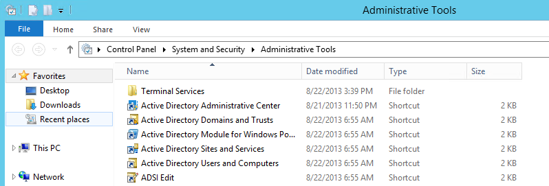
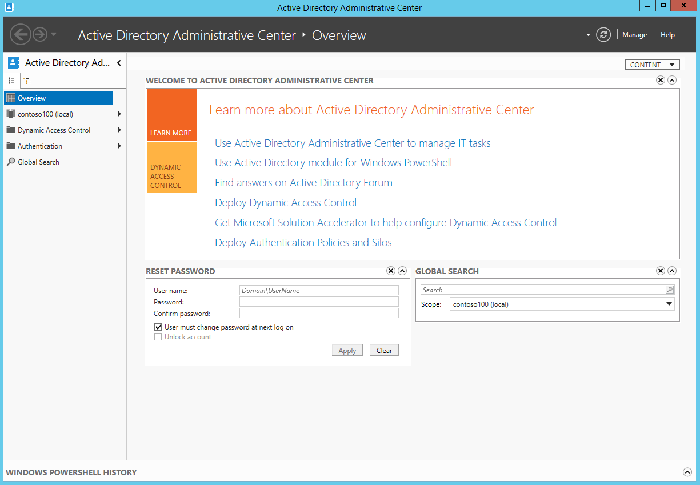
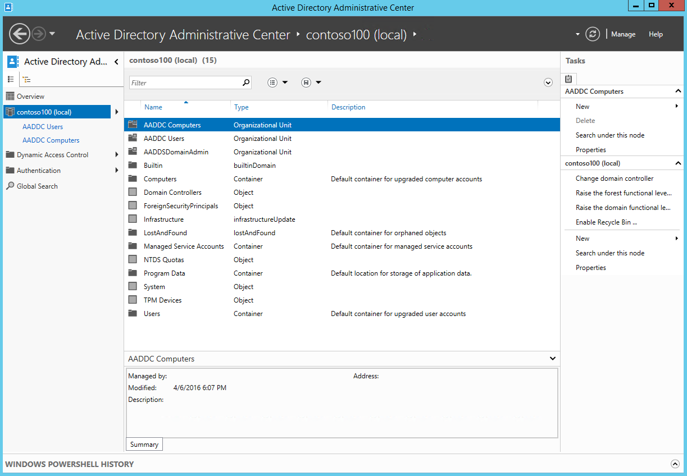
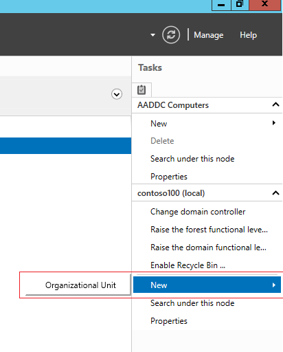
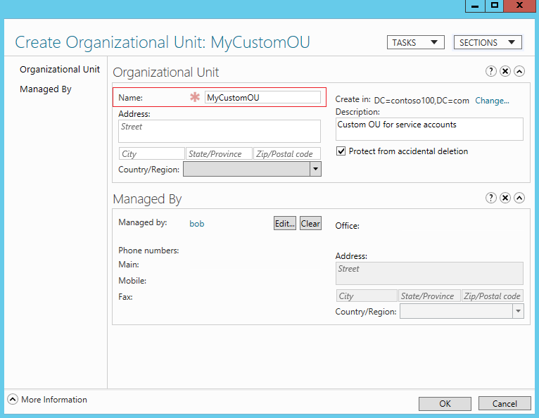
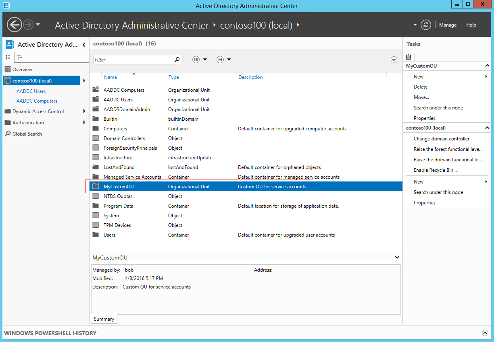
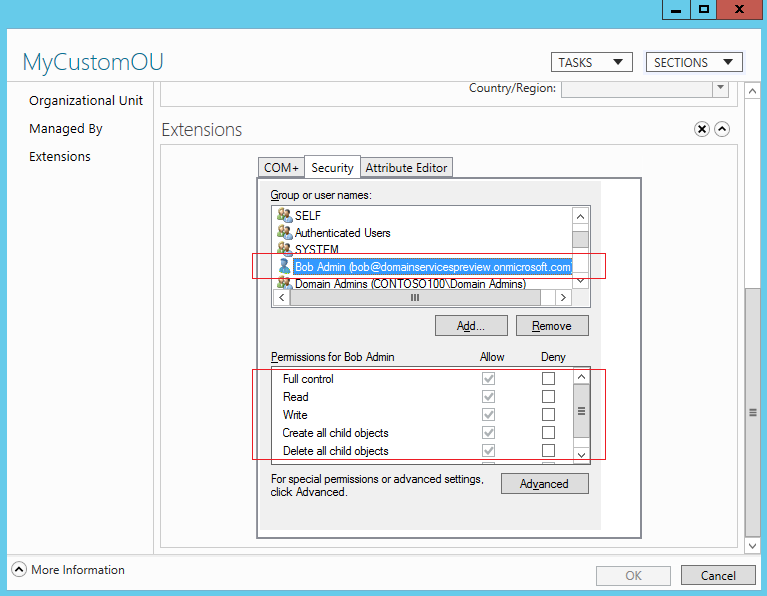

<properties
    pageTitle="Azure-Active Directory-Domänendiensten: Administration Guide | Microsoft Azure"
    description="Erstellen Sie eine Organisationseinheit (OU) auf Azure Active Directory-Domänendiensten verwaltete Domänen"
    services="active-directory-ds"
    documentationCenter=""
    authors="mahesh-unnikrishnan"
    manager="stevenpo"
    editor="curtand"/>

<tags
    ms.service="active-directory-ds"
    ms.workload="identity"
    ms.tgt_pltfrm="na"
    ms.devlang="na"
    ms.topic="article"
    ms.date="09/21/2016"
    ms.author="maheshu"/>

# Erstellen einer Organisationseinheit (OU) auf eine Azure-Active Directory-Domänendiensten verwalteten Domäne
Azure Active Directory-Domänendiensten verwalteten Domains enthalten zwei integrierten Container als "AADDC Computern" und "AADDC Users" bezeichnet. Der Container ' AADDC' weist Computerobjekte für alle Computer, auf denen der verwalteten Domäne hinzugefügt werden. Container 'AADDC Benutzer' enthält Benutzer und Gruppen in den Azure AD-Mandanten. Es kann vorkommen, kann es erforderlich, Dienstkonten erstellen, mit der verwalteten Domäne Auslastung bereitgestellt sein. Zu diesem Zweck können Sie eine benutzerdefinierte Organisationseinheit (OU) auf verwalteten Domäne erstellen und Dienstkonten innerhalb dieser Organisationseinheit erstellen. In diesem Artikel wird gezeigt, wie eine Organisationseinheit in Ihrer Domäne verwalteten erstellen werden kann.

## Installieren von AD-Verwaltungstools auf einem Domänenverbund virtuellen Computern für remote-administration
Azure Active Directory-Domänendiensten verwaltete Domänen können mit den vertrauten Active Directory-Verwaltung wie Active Directory Administrative Center (ADAC) AD PowerShell remote verwaltet werden. Mandantenadministratoren haben keine Berechtigungen, um die Verbindung mit Domänencontroller auf die verwaltete Domäne über Remote Desktop. Installieren Sie das Feature AD Administration Tools zum Verwalten von verwalteten Domäne auf einem virtuellen Computer der verwalteten Domäne hinzugefügt. Finden Sie im Artikel mit dem Titel Anweisungen [eine Azure Active Directory-Domänendiensten verwaltete Domäne verwalten](active-directory-ds-admin-guide-administer-domain.md) .

## Erstellen einer Organisationseinheit der verwalteten Domäne
Jetzt, da die AD-Verwaltung installiert sind, klicken Sie auf der Domäne beigetreten virtuellen Computern, wir können diese Tools verwenden, um die Erstellung einer Organisationseinheit der verwalteten Domäne. Führen Sie die folgenden Schritte aus:

> [AZURE.NOTE] Nur Mitglieder der Gruppe 'AAD DC Administratoren' über die erforderlichen Berechtigungen zum Erstellen einer benutzerdefinierten Organisationseinheit verfügen. Stellen Sie sicher, dass Sie als Benutzer die folgenden Schritte ausführen, die dieser Gruppe gehört.

1. Vom Startbildschirm klicken Sie auf **Verwaltung**. Es sollte die AD-Verwaltung des virtuellen Computers installiert angezeigt.

    

2. Klicken Sie auf **Active Directory Administrative Center**.

    

3. Wenn Sie die Domäne anzeigen möchten, klicken Sie auf den Domänennamen im linken Bereich (beispielsweise ' contoso100.com').

    

4. Klicken Sie rechts im Bereich **Aufgaben** unter dem Namen-Domänenknoten auf **neu** . Klicken Sie in diesem Beispiel auf wir **neu** unter dem Knoten 'contoso100(local)' im **Aufgabenbereich rechts** auf.

    

5. Die Option zum Erstellen einer Organisationseinheit sollte angezeigt werden. Klicken Sie auf **Organisationseinheit** , um das Dialogfeld **Organisationseinheit erstellen** zu starten.

6. Geben Sie im Dialogfeld **Organisationseinheit erstellen** einen **Namen** für die neue Organisationseinheit ein. Geben Sie eine kurze Beschreibung für die Organisationseinheit ein. Sie können auch das Feld " **Verwaltet von** " für die Organisationseinheit festlegen. Um die benutzerdefinierten Organisationseinheit zu erstellen, klicken Sie auf **OK**.

    

7. Die neu erstellte Organisationseinheit wird jetzt in der Active Directory Administrative Center (ADAC) angezeigt.

    

## Sicherheit/Berechtigungen für den neu erstellten Organisationseinheiten
Standardmäßig wird der Benutzer (Mitglied der Gruppe 'AAD DC Administratoren'), der die benutzerdefinierte Organisationseinheit erstellt, Administratorberechtigungen (Vollzugriff) über die Organisationseinheit gewährt. Der Benutzer kann dann fortfahren und Erteilen von Berechtigungen für andere Benutzer oder der Gruppe 'AAD DC Administratoren' wie gewünscht. Wie im folgenden Screenshot, der Benutzer gesehen 'bob@domainservicespreview.onmicrosoft.com' vollständige Steuerung gewährt wird, wer die neue Organisationseinheit 'MyCustomOU' erstellt hat.

 

## Verwalten von benutzerdefinierten Organisationseinheiten Notizen
Jetzt, da Sie eine benutzerdefinierte Organisationseinheit erstellt haben, können Sie fortfahren und Erstellen von Benutzern, Gruppen, Computern und Dienstkonten in dieser Organisationseinheit. Sie können keine Benutzer oder Gruppen aus 'AAD DC Benutzer' Organisationseinheit mit benutzerdefinierten Organisationseinheiten verschieben.

> [AZURE.WARNING] Benutzerkonten, Gruppen, Dienstkonten und Computerobjekte, die Sie, klicken Sie unter benutzerdefinierte Organisationseinheiten erstellen sind nicht verfügbar in Ihrem Azure AD-Mandanten. Kurzum, Anzeigen dieser Objekte nicht mithilfe der Azure AD Graph-API oder der Azure AD-Benutzeroberfläche. Diese Objekte stehen nur in Ihrer Azure-Active Directory-Domänendiensten verwalteten Domäne.

## Siehe auch

- [Verwalten einer verwalteten Azure Active Directory-Domänendiensten-Domäne](active-directory-ds-admin-guide-administer-domain.md)

- [Active Directory Administrative Center: Erste Schritte](https://technet.microsoft.com/library/dd560651.aspx)

- [Schrittweise Anleitung für Dienst Konten](https://technet.microsoft.com/library/dd548356.aspx)
