<properties
    pageTitle="Azure Active Directory-Domänendiensten: Teilnehmen an einer RHEL VM zu einer verwalteten Domäne | Microsoft Azure"
    description="Teilnehmen an einer Red Hat Enterprise Linux virtuellen Computers zu Azure Active Directory-Domänendiensten"
    services="active-directory-ds"
    documentationCenter=""
    authors="mahesh-unnikrishnan"
    manager="stevenpo"
    editor="curtand"/>

<tags
    ms.service="active-directory-ds"
    ms.workload="identity"
    ms.tgt_pltfrm="na"
    ms.devlang="na"
    ms.topic="article"
    ms.date="10/02/2016"
    ms.author="maheshu"/>

# Teilnehmen an einer Red Hat Enterprise Linux 7 virtuellen Computers zu einer verwalteten Domäne
In diesem Artikel wird gezeigt, wie eine Red Hat Enterprise Linux (RHEL) 7 virtuellen Computern einer Azure Active Directory-Domänendiensten verwalteten Domäne hinzuzufügen.

## Bereitstellen einer Red Hat Enterprise Linux virtuellen Computern
Führen Sie die folgenden Schritte aus, um eine RHEL 7 virtuellen Computern, die über das Azure-Portal bereitstellen.

1. Melden Sie sich mit dem [Azure-Portal](https://portal.azure.com)aus.

    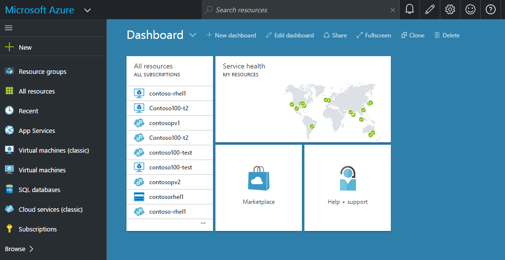

2. Klicken Sie im linken Bereich auf **neu** , und geben Sie in der Suchleiste **Red Hat** , wie im folgenden Screenshot dargestellt. Einträge für Red Hat Enterprise Linux werden in den Suchergebnissen angezeigt. Klicken Sie auf **Red Hat Enterprise Linux 7.2**.

    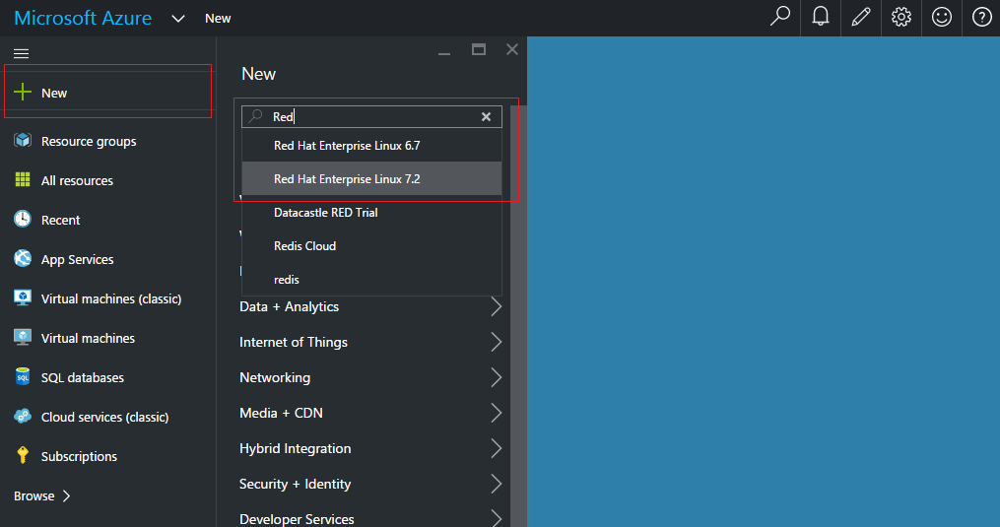

3. Die Suchergebnisse im Bereich **Alles** sollte das Bild Red Hat Enterprise Linux 7.2 angegeben werden. Klicken Sie auf **Red Hat Enterprise Linux 7.2** , um weitere Informationen zu den virtuellen Computerabbild anzuzeigen.

    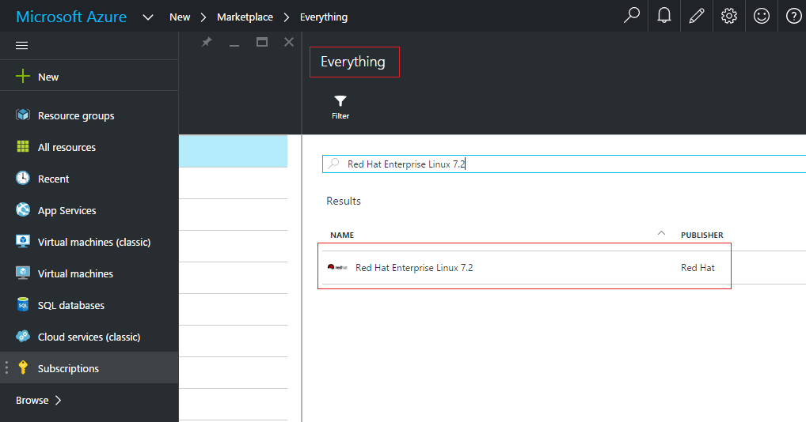

4. Klicken Sie im Bereich **Red Hat Enterprise Linux 7.2** sollte Weitere Informationen zu den virtuellen Computerabbild angezeigt werden. Wählen Sie in der Dropdownliste **Wählen Sie ein Bereitstellungsmodell** **klassischen**ein. Klicken Sie dann auf die Schaltfläche **Erstellen** .

    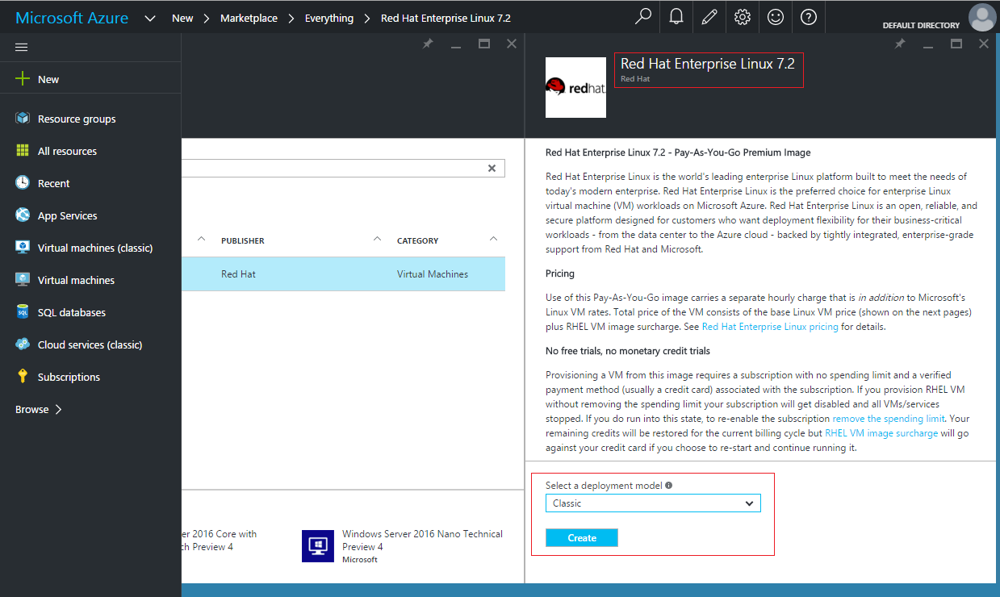

5. Geben Sie im Bereich **Erstellen virtueller Computer** den **Host Name** für den neuen virtuellen Computer ein. Auch angeben einer lokalen Administratorbenutzernamen im Feld **Benutzername** und ein **Kennwort**ein. Sie können auch einen SSH Schlüssel zum Authentifizieren des Benutzers lokaler Administrator verwenden auswählen. Wählen Sie auch eine **Ebene Preise** für den virtuellen Computer an.

    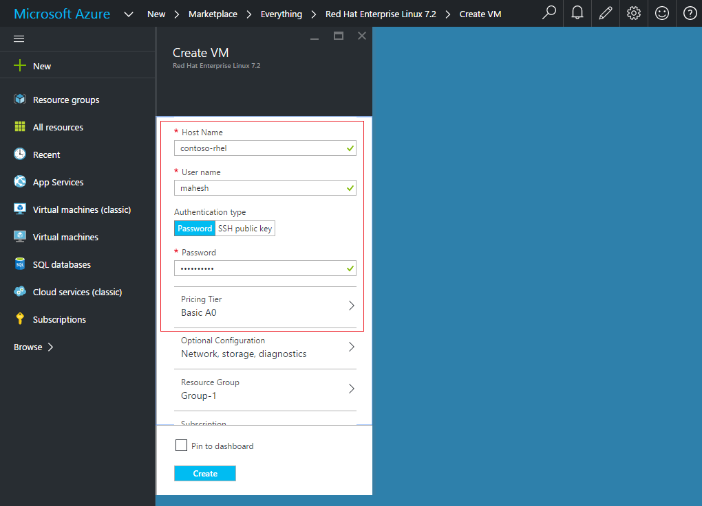

6. Klicken Sie auf **optionale Konfiguration**. Klicken Sie im Bereich **Optional Config** auf **Netzwerk**.

    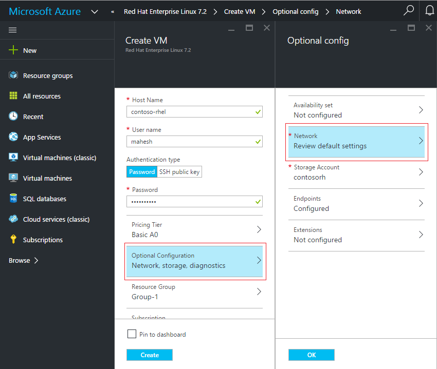

7. Dadurch wird ein Fenster mit dem Titel **Netzwerk**. Klicken Sie auf **Virtuellen Netzwerk** , um das virtuelle Netzwerk auszuwählen, das die Linux VM bereitgestellt werden sollen, klicken Sie im **Netzwerk** . Klicken Sie im Bereich **Virtuelles Netzwerk** wird geöffnet. Wählen Sie im Bereich **Virtuelles Netzwerk** **Verwenden Sie ein vorhandenes virtuelles Netzwerk** . Wählen Sie dann das virtuelle Netzwerk, in dem Azure Active Directory-Domänendiensten verfügbar ist. In diesem Beispiel wählen wir das 'MyPreviewVNet' virtuelle Netzwerk aus.

    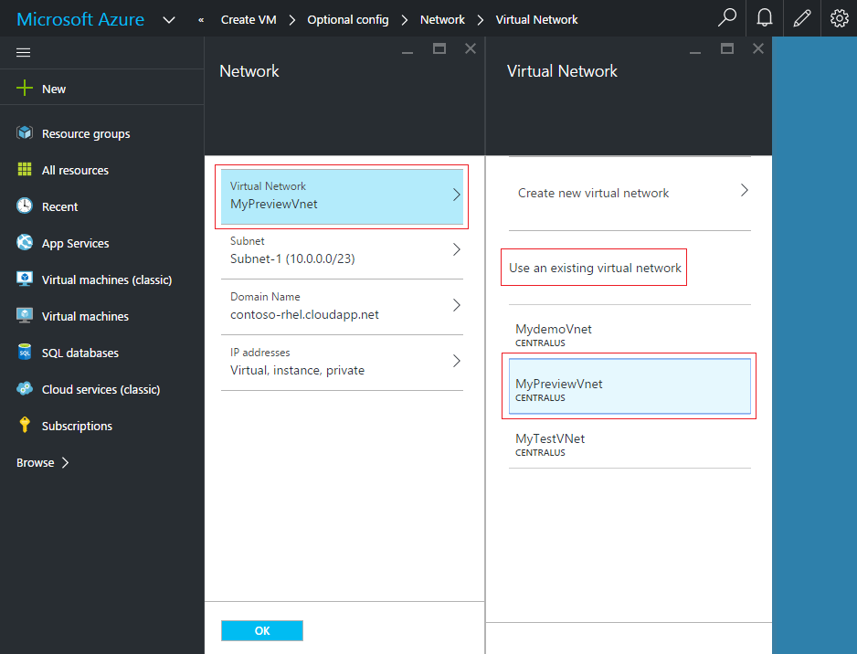

8. Klicken Sie im Bereich **Optional Config** auf die Schaltfläche **OK** .

    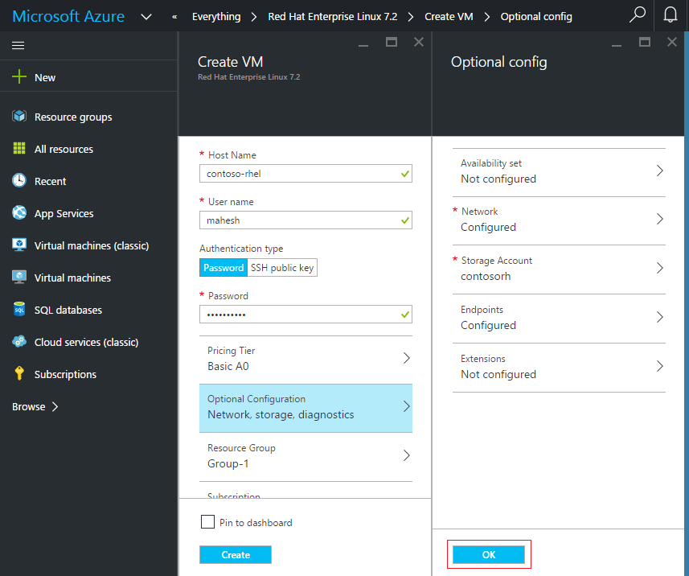

9. Sie können nun zum Erstellen des virtuellen Computers. Klicken Sie im Bereich **Erstellen virtueller Computer** auf die Schaltfläche **Erstellen** .

    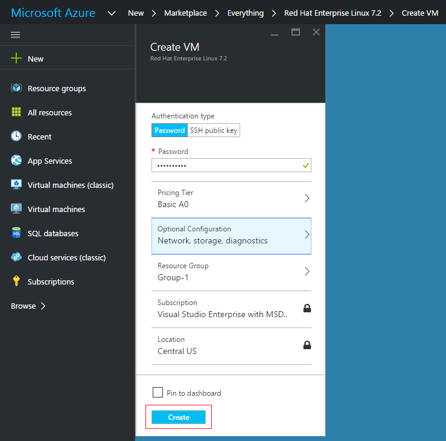

10. Bereitstellung des neuen virtuellen Computers basierend auf das Bild RHEL 7.2 sollte beginnen.

  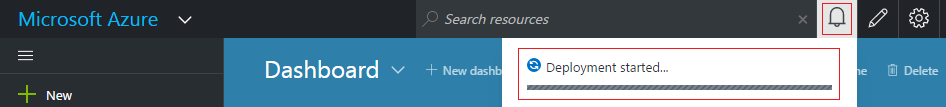

11. Nach ein paar Minuten sollten des virtuellen Computers erfolgreich und bereit zur Verwendung bereitgestellt werden.

  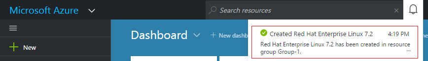

## Herstellen einer Verbindung neu eingerichtete Linux virtuellen Computers mit Remote
RHEL 7.2 virtuellen Computers wurde in Azure bereitgestellt. Die nächste Aufgabe ist des virtuellen Computers Remote-Verbindung.

**Verbinden mit RHEL 7.2 virtuellen Computers** Folgen Sie den Anweisungen im Artikel [zum Anmelden bei einer virtuellen Computern mit Linux](../virtual-machines/virtual-machines-linux-mac-create-ssh-keys.md).

Die restlichen Schritte angenommen, Sie kitten SSH-Client für die Verbindung zu RHEL virtuellen Computers. Weitere Informationen finden Sie unter der [Seite kitten herunterladen](http://www.chiark.greenend.org.uk/~sgtatham/putty/download.html).

1. Öffnen Sie das PuTTY Programm.

2. Geben Sie den **Host Name** für den neu erstellten RHEL virtuellen Computers. In diesem Beispiel hat unsere virtuellen Computern Hostnamen 'Contoso-rhel.cloudapp .net'. Wenn Sie den Hostnamen des Ihrer virtuellen Computer nicht kennen, finden Sie in dem Dashboard virtueller Computer Azure-Portal.

    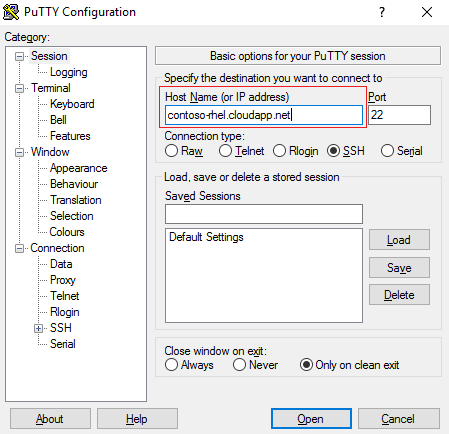

3. Melden Sie sich bei der virtuellen Computern mithilfe der Anmeldeinformationen für lokale Administratoren, die Sie angegeben haben, der Erstellung des virtuellen Computers. In diesem Beispiel verwendet wurde das lokale Administratorkonto "Mahesh".

    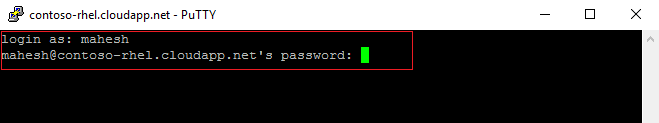

## Installieren Sie erforderliche Pakete auf die Linux virtuellen Computern
Nachdem Herstellen einer Verbindung mit dem virtuellen Computer, müssen Sie die nächste Aufgabe Pakete erforderlich für beitreten zu einer Domäne des virtuellen Computers zu installieren. Führen Sie die folgenden Schritte aus:

1. **Realmd installieren:** Beitreten zu einer Domäne wird das Paket Realmd verwendet. Geben Sie in Ihrem PuTTY Terminal den folgenden Befehl aus:

    Sudo Yum installieren realmd

    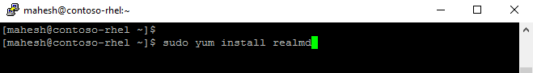

    Nach ein paar Minuten sollte das Paket Realmd auf dem virtuellen Computer installiert.

    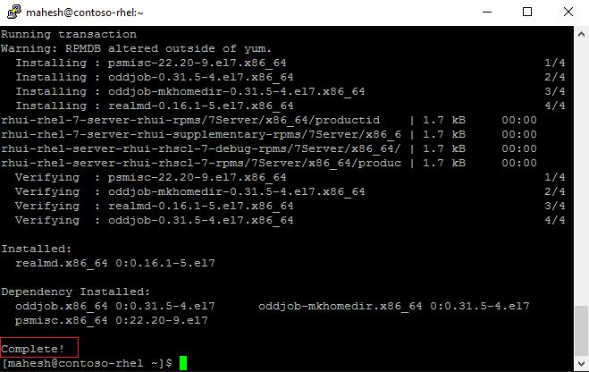

3. **Sssd installieren:** Das Paket Realmd hängt Sssd Domäne Join-Operationen ausführen. Geben Sie in Ihrem PuTTY Terminal den folgenden Befehl aus:

    Sudo Yum installieren sssd

    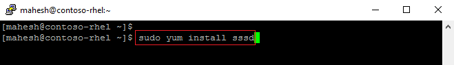

    Nach ein paar Minuten sollte das Paket Sssd auf dem virtuellen Computer installiert.

    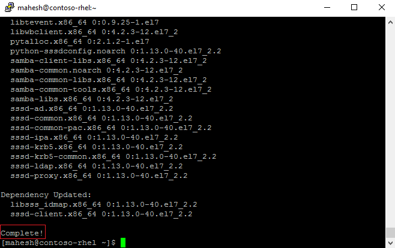

4. **Kerberos installieren:** Geben Sie in Ihrem PuTTY Terminal den folgenden Befehl aus:

    Sudo Yum installieren krb5--Arbeitsstationen krb5-Bibliotheken

    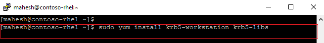

    Nach ein paar Minuten sollte das Paket Realmd auf dem virtuellen Computer installiert.

    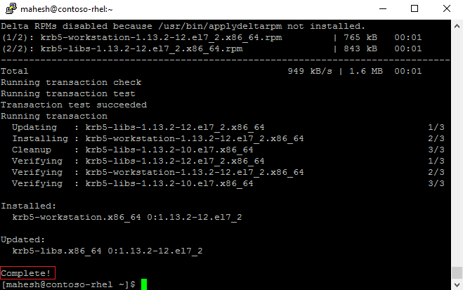

## Fügen Sie die Linux virtuellen Computern zur verwalteten Domäne
Nachdem Sie nun die erforderlichen Pakete auf dem Linux virtuellen Computer installiert sind, besteht die nächste Aufgabe, die virtuellen Computern der verwalteten Domäne hinzuzufügen.

1. Ermitteln der AAD Domänendiensten verwalteten Domäne. Geben Sie in Ihrem PuTTY Terminal den folgenden Befehl aus:

    Sudo Bereich ermitteln CONTOSO100.COM

    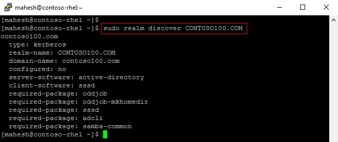

    **Bereich ermitteln** Ihrer verwaltete Domäne finden kann, sicher, dass die Domäne aus des virtuellen Computers (Ping testen) erreichbar ist. Stellen Sie auch sicher, dass die virtuellen Computern tatsächlich um mit dem gleichen virtuellen Netzwerk bereitgestellt wurde, in dem die verwaltete Domäne verfügbar ist.

2. Initialisierung Kerberos. Geben Sie in Ihrem PuTTY Terminal den folgenden Befehl ein. Stellen Sie sicher, dass Sie einen Benutzer angeben, die in der Gruppe 'AAD DC Administratoren' gehört. Nur diese Benutzer können Computern der verwalteten Domäne hinzuzufügen.

    kinitbob@CONTOSO100.COM

    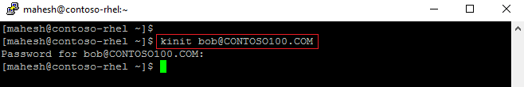

    Stellen Sie sicher, dass Sie den Domänennamen in Großbuchstaben angeben, sonst Kinit schlägt fehl.

3. Teilnehmen an den Computer an die Domäne. Geben Sie in Ihrem PuTTY Terminal den folgenden Befehl ein. Geben Sie den gleichen Benutzer, die, den Sie im vorherigen Schritt ('Kinit') angegeben haben.

    Sudo Bereich Verknüpfung – ausführliche CONTOSO100.COM -U'bob@CONTOSO100.COM'

    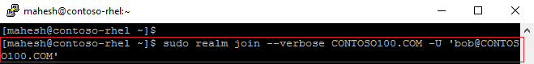

Sie sollten die Meldung ("erfolgreich registrierten Auto im Bereich") Wenn der Computer erfolgreich zu der verwalteten Domäne verknüpft ist.

## Beitreten zu einer Domäne überprüfen
Sie können schnell überprüfen, ob der Computer die verwaltete Domäne erfolgreich hinzugefügt wurde. Herstellen einer Verbindung mit der Domäne beigetreten neu RHEL VM SSH und ein Benutzerkonto für die Domäne und aktivieren Sie dann verwenden, um festzustellen, ob das Benutzerkonto ordnungsgemäß gelöst ist.

1. Geben Sie in Ihrem PuTTY Terminal zum Herstellen einer Verbindung mit den folgenden Befehl der Domäne beigetreten neu RHEL virtuellen Computers SSH verwenden. Verwenden Sie eine Domänenkonto, das die verwaltete Domäne gehört (z. B. 'bob@CONTOSO100.COM' in diesem Fall.)

    SSH -l bob@CONTOSO100.COM Contoso-rhel.cloudapp.net

2. Geben Sie den folgenden Befehl aus, um festzustellen, ob das home-Verzeichnis ordnungsgemäß Initialisierung wurde, in der PuTTY Terminal.

    PWD

3. Geben Sie in Ihrem PuTTY Terminal den folgenden Befehl aus, um festzustellen, ob die Gruppenmitgliedschaft sind ordnungsgemäß aufgelöst wird.

    ID

Diese Befehle eine Stichprobe Ausgabe umfasst:

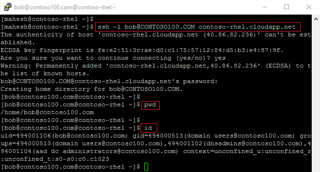

## Problembehandlung bei beitreten zu einer Domäne
Finden Sie im Artikel [Problembehandlung beitreten zu einer Domäne](active-directory-ds-admin-guide-join-windows-vm.md#troubleshooting-domain-join) .

## Siehe auch
- [Azure Active Directory-Domänendiensten - Leitfaden für erste Schritte](./active-directory-ds-getting-started.md)

- [Teilnehmen an einer Windows Server-virtuellen Computern zu einer verwalteten Azure Active Directory-Domänendiensten-Domäne](active-directory-ds-admin-guide-join-windows-vm.md)

- [So melden Sie sich mit einem virtuellen Computer mit Linux](../virtual-machines/virtual-machines-linux-mac-create-ssh-keys.md).

- [Installieren von Kerberos](https://access.redhat.com/documentation/en-US/Red_Hat_Enterprise_Linux/6/html/Managing_Smart_Cards/installing-kerberos.html)

- [Red Hat Enterprise Linux 7 - Leitfaden für Windows-Integration](https://access.redhat.com/documentation/en-US/Red_Hat_Enterprise_Linux/7/html/Windows_Integration_Guide/index.html)
