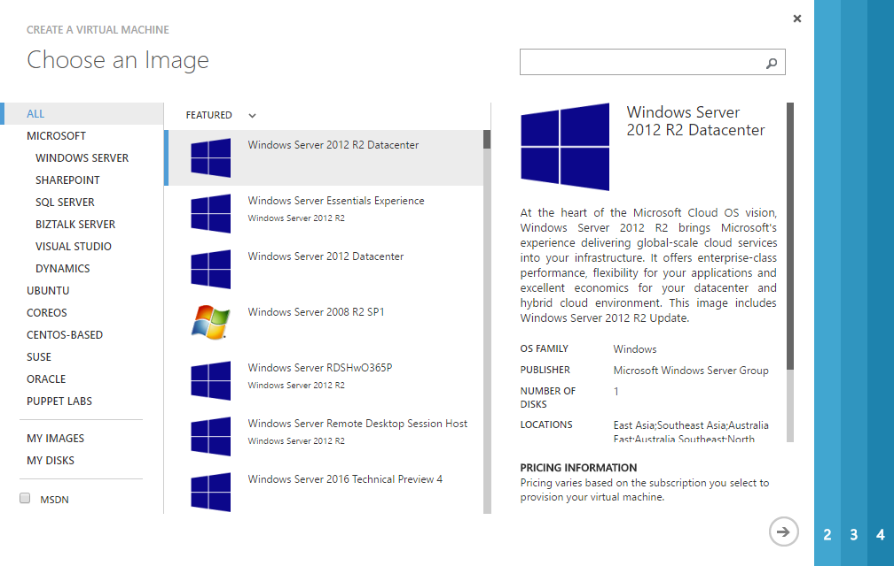
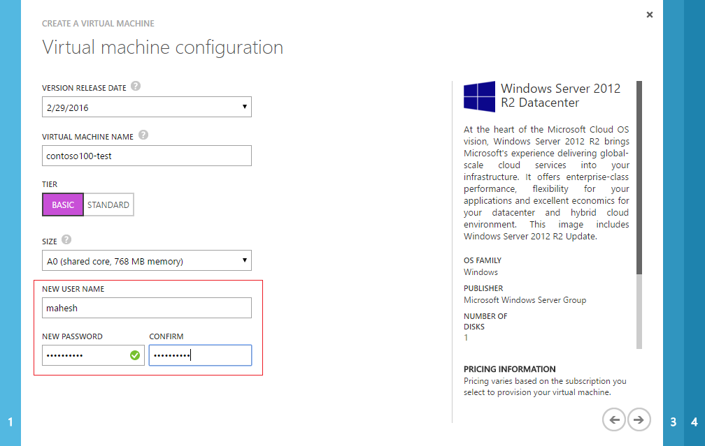
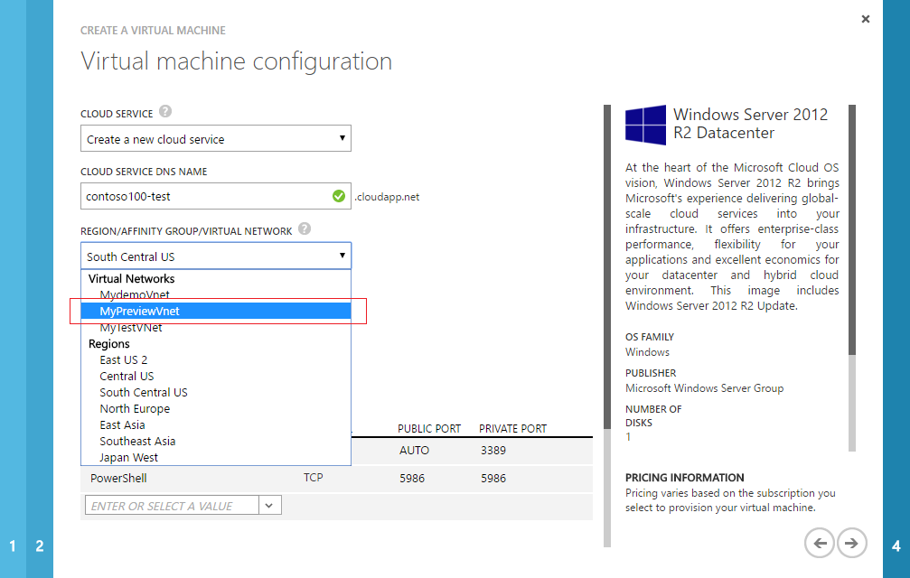
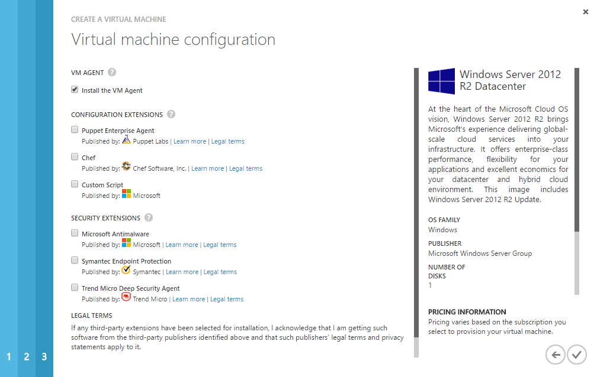
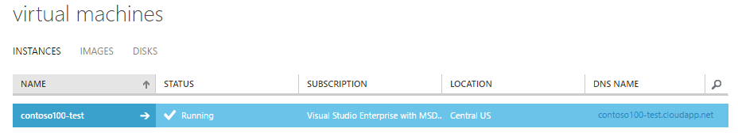
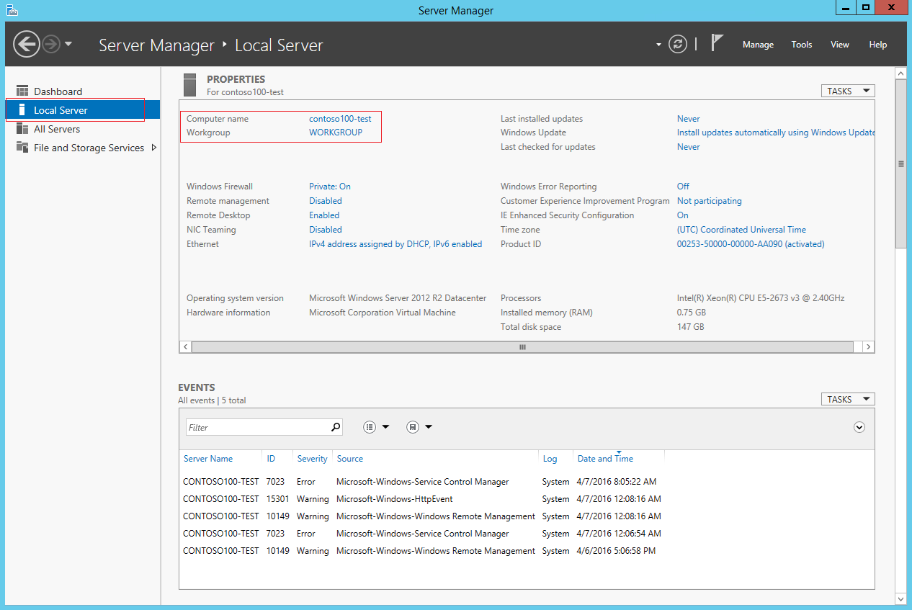
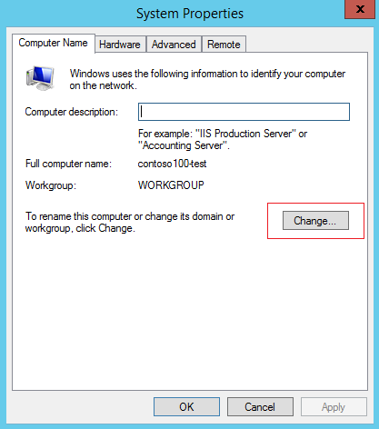
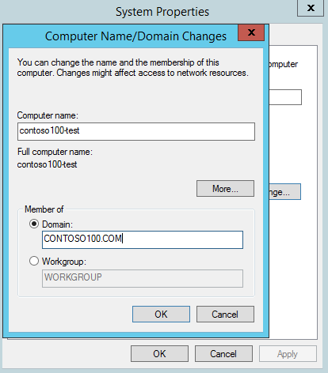
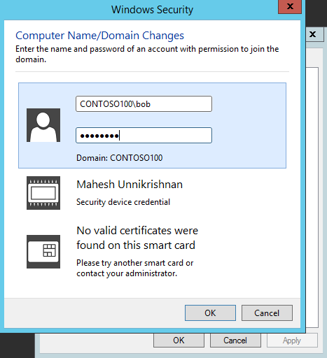
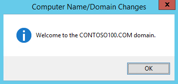

<properties
    pageTitle="Azure Active Directory-Domänendiensten: Hinzufügen eines Windows Server virtuellen Computers zu einer verwalteten Domäne | Microsoft Azure"
    description="Teilnehmen an einer Windows Server-virtuellen Computern zu Azure Active Directory-Domänendiensten"
    services="active-directory-ds"
    documentationCenter=""
    authors="mahesh-unnikrishnan"
    manager="stevenpo"
    editor="curtand"/>

<tags
    ms.service="active-directory-ds"
    ms.workload="identity"
    ms.tgt_pltfrm="na"
    ms.devlang="na"
    ms.topic="article"
    ms.date="10/02/2016"
    ms.author="maheshu"/>

# Teilnehmen an einer Windows Server virtuellen Computers zu einer verwalteten Domäne

> [AZURE.SELECTOR]
- [Azure klassischen Portal – Windows](active-directory-ds-admin-guide-join-windows-vm.md)
- [PowerShell - Windows](active-directory-ds-admin-guide-join-windows-vm-classic-powershell.md)

 

In diesem Artikel wird gezeigt, wie die Teilnahme eines virtuellen Computers mit Windows Server 2012 R2 zu einer verwalteten Domäne Azure Active Directory-Domänendiensten, über das klassische Azure-Portal erstellt wird.

## Schritt 1: Erstellen des virtuellen Computers von Windows Server
Führen Sie die Anweisungen in das [Erstellen eines virtuellen Computers ausgeführt Windows im klassischen Azure-Portal](../virtual-machines/virtual-machines-windows-classic-tutorial.md) Lernprogramm beschriebenen aus. Es ist wichtig, um sicherzustellen, dass neu erstellten virtuellen Computern im gleichen virtuellen Netzwerk Mitglied ist Azure Active Directory-Domänendiensten aktiviert. Die Option 'Symbolleiste erstellen' ermöglicht keine des virtuellen Computers zu einem virtuellen Netzwerk teilnehmen. Daher müssen Sie die Option 'Aus der Katalog' zum Erstellen des virtuellen Computers verwenden.

Führen Sie die folgenden Schritte zum Erstellen von eines Windows-Computers teilnehmen an das virtuelle Netzwerk, in dem Sie Azure Active Directory-Domänendiensten aktiviert haben.

1. Im Azure klassischen-Portal auf der Befehlsleiste am Fuß des Fensters klicken Sie auf **neu**.

2. Klicken Sie unter **zu berechnen**klicken Sie auf **virtuellen Computern**und dann auf **Aus Galerie**.

3. Im ersten Fenster können Sie für den virtuellen Computer aus der Liste der verfügbaren Bilder **Wählen Sie ein Bild aus** . Wählen Sie das richtige Bild aus.

    

4. Im zweiten Fenster können Sie einen Computernamen, der Größe und der administrativen Benutzernamen und ein Kennwort auswählen. Verwenden Sie die Ebene und die Größe, die zum Ausführen Ihrer app oder Arbeitsbelastung an. Der Benutzername, die Sie hier auswählen ist ein lokaler Administrator-Benutzer auf dem Computer. Geben Sie hier ein Domänenbenutzerkonto Anmeldeinformationen nicht.

    

5. Der dritte Bildschirm können Sie Ressourcen für Netzwerke, Speicher und Verfügbarkeit zu konfigurieren. Stellen Sie sicher, dass Sie das virtuelle Netzwerk auswählen, in dem Sie Azure Active Directory-Domänendiensten aus der Dropdownliste **Region Zugehörigkeit/Gruppe/virtuellen Netzwerk** aktiviert. Geben Sie einen **Cloud-Dienst DNS-Name** des virtuellen Computers Bedarf.

    

    > [AZURE.WARNING]
    Stellen Sie sicher, dass Sie des virtuellen Computers mit demselben virtuellen Netzwerk beitreten, in dem Sie Azure Active Directory-Domänendiensten aktiviert haben. Daher des virtuellen Computers können ' finden Sie unter' die Domäne und Aufgaben wie das Beitreten zu der Domäne. Wenn Sie zum Erstellen des virtuellen Computers in einem anderen virtuellen Netzwerk auswählen, schließen Sie diese virtuelle Netzwerk an das virtuelle Netzwerk, in dem Sie Azure Active Directory-Domänendiensten aktiviert haben.

6. Der vierte Bildschirm können Sie der Agent virtuellen Computer installieren und konfigurieren einige der verfügbaren Erweiterungen.

    

7. Nach der Erstellung des virtuellen Computers Listet das klassische Portal den neuen virtuellen Computer unter dem Knoten **virtuellen Computern** aus. Sowohl die virtuellen Computern und Cloud-Dienst werden automatisch gestartet, und deren Status als **ausgeführt**aufgeführt ist.

    

## Schritt 2: Herstellen einer Verbindung die Windows Server-virtuellen Computern mit dem lokalen Administratorkonto mit
Nun, wir Herstellen einer Verbindung mit der neu erstellten Windows Server virtuellen Computern, um es in der Domäne hinzufügen. Verwenden Sie die Anmeldeinformationen für lokale Administratoren, die Sie beim Erstellen des virtuellen Computers, das Herstellen einer Verbindung angegeben.

Führen Sie die folgenden Schritte aus, Verbindung zum des virtuellen Computers.

1. Navigieren Sie zum **virtuellen Computern** -Knoten in der klassischen Portal. Wählen Sie die virtuellen Computern, die Sie in Schritt 1 erstellt haben, und klicken Sie auf der Befehlsleiste am unteren Rand des Fensters auf **Verbinden** .

    

2. Das klassische Portal fordert Sie zum Öffnen oder Speichern einer Datei mit der Erweiterung 'RDP-', die Verbindung zu des virtuellen Computers verwendet wird. Klicken Sie auf diese Option, um die Datei zu öffnen, wenn der Download abgeschlossen ist.

3. Anmeldung aufgefordert werden Geben Sie Ihre **Anmeldeinformationen für lokale Administratoren**, die Sie beim Erstellen des virtuellen Computers angegeben. Wir haben beispielsweise 'Localhost\mahesh' in diesem Beispiel verwendet.

An diesem Punkt sollten Sie zu der neu erstellten Windows virtuellen Computern mit lokalen Administratorberechtigungen angemeldet sein. Im nächsten Schritt wird die Teilnahme des virtuellen Computers zu der Domäne.

## Schritt 3: Verknüpfung des virtuellen Computers die verwaltete AAD-DS-Domäne Windows Server
Führen Sie die folgenden Schritte aus, um der verwalteten AAD-DS-Domäne des virtuellen Computers von Windows Server hinzuzufügen.

1. Herstellen einer Verbindung mit dem Windows-Server wie in Schritt2 dargestellt. Öffnen Sie den Startbildschirm **Server-Manager**.

2. Klicken Sie im linken Bereich des Fensters Server-Manager auf **Lokale Server** .

    

3. Klicken Sie auf **Arbeitsgruppe** , klicken Sie im Abschnitt **Eigenschaften** . Klicken Sie in der Eigenschaftenseite **Systemeigenschaften** auf **Ändern** , um die Domäne.

    

4. Geben Sie den Domänennamen für Ihre Azure Active Directory-Domänendiensten Domäne in das Textfeld **Domäne** verwaltet, und klicken Sie auf **OK**.

    

5. Aufgefordert werden, geben Sie Ihre Anmeldeinformationen ein, um der Domäne beizutreten. Vergewissern Sie sich diese Sie **Geben Sie die Anmeldeinformationen für einen Benutzer, die Administratoren AAD DC gehören** Gruppe. Nur Mitglieder dieser Gruppe berechtigt, zu der verwalteten Domäne Autos hinzuzufügen.

    

6. Sie können eine der folgenden Methoden Anmeldeinformationen angeben:

    - UPN Format: für das Benutzerkonto, das UPN-Suffix angeben, wie in Azure AD konfiguriert. In diesem Beispiel wird das UPN-Suffix des Benutzers 'Bob' 'bob@domainservicespreview.onmicrosoft.com'.

    - SAMAccountName Format: Sie können den Namen des Kontos in das Format SAMAccountName angeben. In diesem Beispiel würde der Benutzer 'Bob' 'CONTOSO100\bob' eingeben müssen.

        > [AZURE.NOTE] **Es empfiehlt sich, mit dem UPN-Format Anmeldeinformationen angeben.** SAMAccountName möglicherweise automatisch generiert werden, wenn eines Benutzers Benutzerprinzipalnamen Präfix sehr lange (z. B. 'Joereallylongnameuser') ist. Wenn mehrere Benutzer dasselbe UPN Präfix (z. B. ' Bob') in Ihrem Azure AD-Mandanten vorhanden sind, möglicherweise deren Format SAMAccountName vom Dienst automatisch generiert. In diesen Fällen werden UPN-Format zuverlässig zum Anmelden bei der Domäne verwendet.

7. Nach dem Beitreten zu einer Domäne erfolgreich ist, wird der folgenden Meldung zur Begrüßung in der Domäne. Starten Sie den virtuellen Computer für die Domäne Join-Vorgang abgeschlossen.

    

## Problembehandlung bei beitreten zu einer Domäne
### Probleme mit der Konnektivität
Wenn des virtuellen Computers die Domäne kann nicht gefunden wird, lesen Sie die folgenden Schritte zur Problembehandlung:

- Stellen Sie sicher, dass die virtuellen Computern verbunden ist, mit dem gleichen virtuellen Netzwerk, wie Sie in-Domänendienste aktiviert haben. Wenn dies nicht der Fall, des virtuellen Computers kann keine Verbindung zu der Domäne herstellen und daher kann der Domäne hinzugefügt werden.

- Wenn der virtuelle Computer in ein anderes virtuelle Netzwerk angeschlossen ist, stellen Sie sicher, dass diese virtuelle Netzwerk an das virtuelle Netzwerk verbunden ist, in dem Sie Domänendiensten aktiviert haben.

- Versuchen Sie die Domäne mithilfe des Domänennamens der verwalteten Domäne (beispielsweise "Ping contoso100.com') Signal an. Wenn Sie nicht möglich sind, versuchen Sie die IP-Adressen für die Domäne, die angezeigt wird, klicken Sie auf der Seite Signal, in denen Sie Azure Active Directory-Domänendiensten aktiviert, an (z. B. ' 10.0.0.4 ping'). Wenn Sie die IP-Adresse, aber nicht die Domäne Pingen befinden, DNS möglicherweise falsch konfiguriert. Sie können die IP-Adressen der Domäne als DNS-Server für das virtuelle Netzwerk nicht konfiguriert haben.

- Versuchen Sie es leeren des DNS-Auflösungscache des virtuellen Computers ("Ipconfig/flushdns").

Wenn das Dialogfeld angezeigt wird, die Anmeldeinformationen ein, der Domäne beizutreten anfordert, müssen Sie nicht Netzwerkkonnektivitätsprobleme vor.

### Probleme mit der Anmeldeinformationen
Schlagen Sie in den folgenden Schritten, wenn Sie mit Anmeldeinformationen Probleme und die Domäne beitreten können.

- Versuchen Sie es mit dem UPN-Format Anmeldeinformationen angeben. Der SAMAccountName für Ihr Konto möglicherweise automatisch generiert, wenn es mehrere Benutzer mit dem gleichen Benutzerprinzipalnamen Präfix in Ihrem Mandanten gibt oder Ihrer Benutzerprinzipalnamen Präfix zu langen ist. Das Format der SAMAccountName für Ihr Konto möglicherweise daher, was Sie erwartet, oder verwenden Sie in Ihrer lokalen Domäne abweicht.

- Versuchen Sie, die Anmeldeinformationen eines Benutzerkontos verwenden, die der Gruppe 'AAD DC Administratoren' Autos der verwalteten Domäne hinzufügen gehört.

- Stellen Sie sicher, dass Sie nach die Schritte in der Leitfaden für erste Schritte [Kennwortsynchronisation aktiviert](active-directory-ds-getting-started-password-sync.md) haben.

- Sicherstellen, dass den UPN des Benutzers verwenden, wie in Azure AD konfiguriert (z. B. 'bob@domainservicespreview.onmicrosoft.com') anmelden.

- Stellen Sie sicher, dass Sie so lange auf die Synchronisierung von Kennwörtern gemäß Angabe in den Leitfaden für erste Schritte ausführen gewartet hat haben.

## Siehe auch

- [Azure Active Directory-Domänendiensten - Leitfaden für erste Schritte](./active-directory-ds-getting-started.md)

- [Verwalten einer verwalteten Azure Active Directory-Domänendiensten-Domäne](./active-directory-ds-admin-guide-administer-domain.md)
