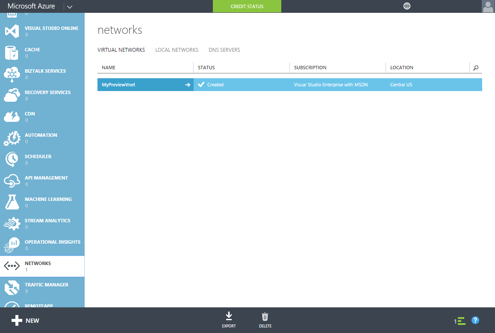
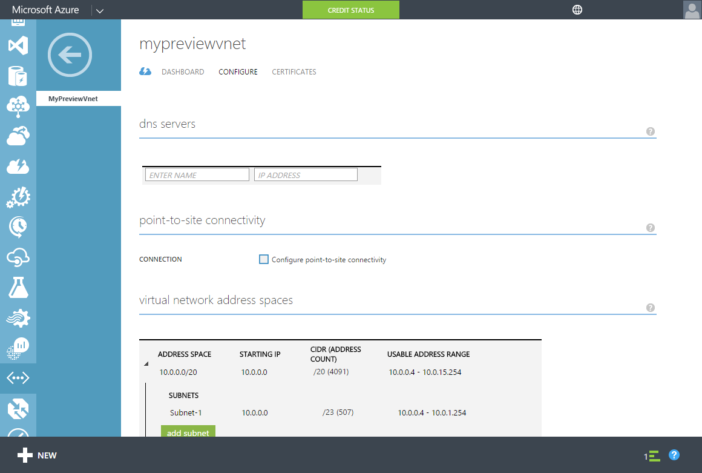
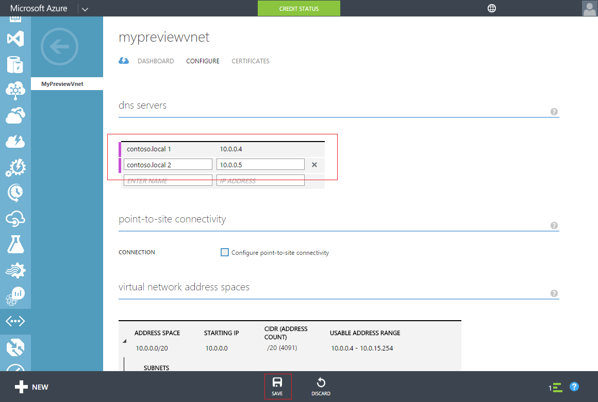

<properties
    pageTitle="Azure-Active Directory-Domänendiensten: Update DNS-Einstellungen für das Azure virtuelle Netzwerk | Microsoft Azure"
    description="Erste Schritte mit Azure Active Directory-Domänendiensten"
    services="active-directory-ds"
    documentationCenter=""
    authors="mahesh-unnikrishnan"
    manager="stevenpo"
    editor="curtand"/>

<tags
    ms.service="active-directory-ds"
    ms.workload="identity"
    ms.tgt_pltfrm="na"
    ms.devlang="na"
    ms.topic="get-started-article"
    ms.date="09/21/2016"
    ms.author="maheshu"/>

# Azure Active Directory-Domänendiensten - Update DNS-Einstellungen für das Azure virtuelle Netzwerk

## Aufgabe 4: Aktualisieren DNS-Einstellungen für das Azure virtuelle Netzwerk
In den vorangegangenen Konfigurationsaufgaben, haben Sie erfolgreich Azure Active Directory-Domänendiensten für Ihr Verzeichnis aktiviert. Die nächste Aufgabe wird sichergestellt, dass innerhalb des Netzwerks virtuellen Computern verbinden und diese Dienste nutzen können. Aktualisieren Sie die DNS-Server-Einstellungen für das virtuelle Netzwerk auf die beiden IP-Adressen verweisen, Azure Active Directory-Domänendiensten auf das virtuelle Netzwerk verfügbar ist.

> [AZURE.NOTE] Beachten Sie unten die IP-Adressen für Azure Active Directory-Domänendiensten auf der Registerkarte **Konfigurieren** Ihres Verzeichnisses angezeigt werden, nachdem Sie Azure Active Directory-Domänendiensten für das Verzeichnis aktiviert haben.

Führen Sie die folgenden Konfigurationsschritte aus, um die DNS-Server-Einstellung für das virtuelle Netzwerk zu aktualisieren, in dem Sie Azure Active Directory-Domänendiensten aktiviert haben.

1. Navigieren Sie zu der **Azure klassischen-Portal** ([https://manage.windowsazure.com](https://manage.windowsazure.com)).

2. Wählen Sie den Knoten **Netzwerke** im linken Bereich aus.

    

3. Wählen Sie auf der Registerkarte **Virtuelle Netzwerke** das virtuelle Netzwerk Azure Active Directory-Domänendiensten zur Anzeige der Sicherheitseigenschaften aktiviert.

4. Klicken Sie auf die Registerkarte **Konfigurieren** .

    

5. Geben Sie im Abschnitt **DNS-Server** die IP-Adressen der Azure-Active Directory-Domänendiensten aus.

6. Stellen Sie sicher, dass Sie sowohl die IP-Adressen eingeben, die im Abschnitt **Domänendiensten** auf der Registerkarte **Konfigurieren** Ihres Verzeichnisses angezeigt wurden.

7. Um die DNS-Server-Einstellungen für diese virtuelle Netzwerk zu speichern, klicken Sie im Aufgabenbereich am unteren Rand der Seite auf **Speichern** .

   

> [AZURE.NOTE] Nach dem Aktualisieren der DNS-Server-Einstellungen für das virtuelle Netzwerk, kann es eine Weile für virtuelle Computer im Netzwerk können Sie die aktualisierte DNS-Konfiguration gelangen dauern. Wenn eine virtuellen Computers zu der Domäne keine Verbindung herstellen kann, können Sie den DNS-Cache (z. b. leeren ' Ipconfig/flushdns') des virtuellen Computers. Dieser Befehl zwingt eine Aktualisierung von DNS-Einstellungen des virtuellen Computers.

## Aufgabe 5 - Synchronisierung von Kennwörtern aktivieren zu Azure Active Directory-Domänendiensten
Der nächste Task ist, aktivieren Sie die [Synchronisierung von Kennwörtern nach Azure Active Directory-Domänendiensten](active-directory-ds-getting-started-password-sync.md).
