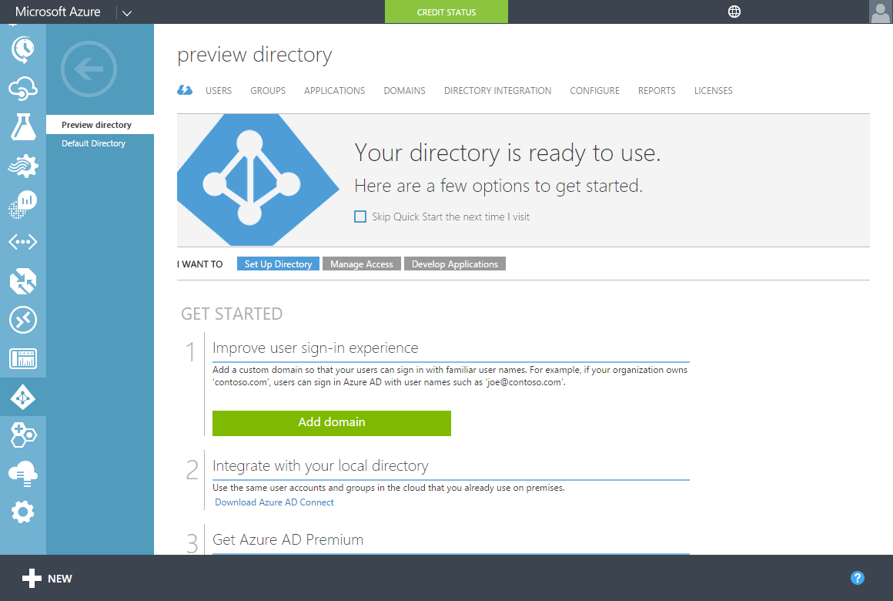
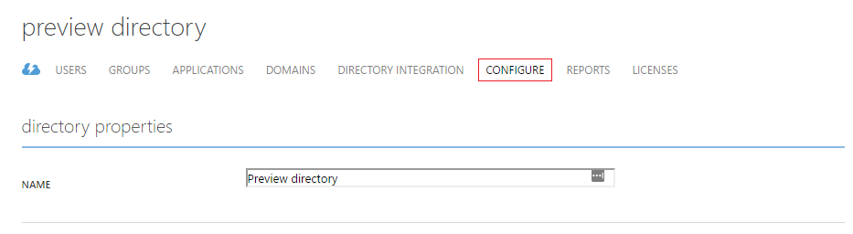
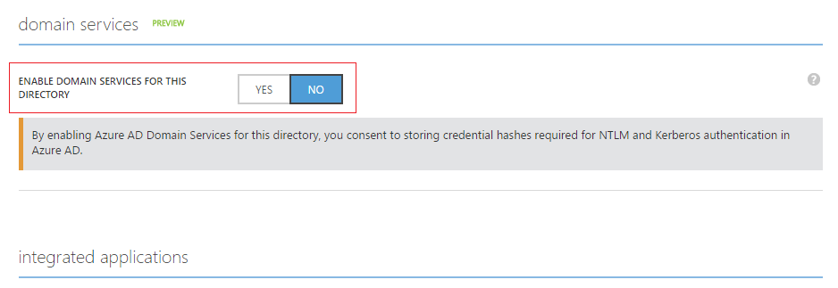
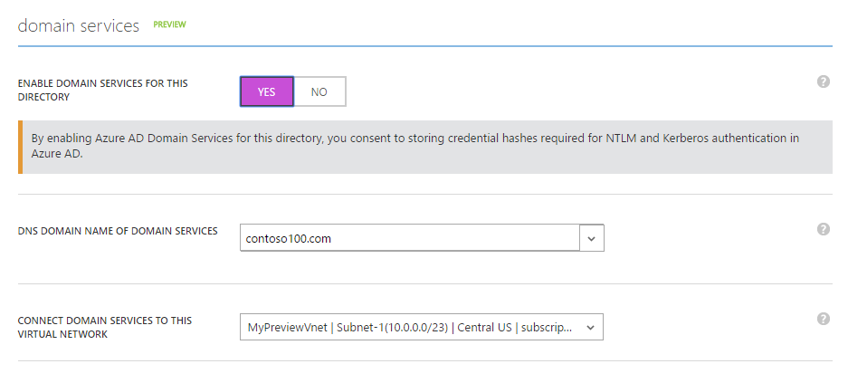
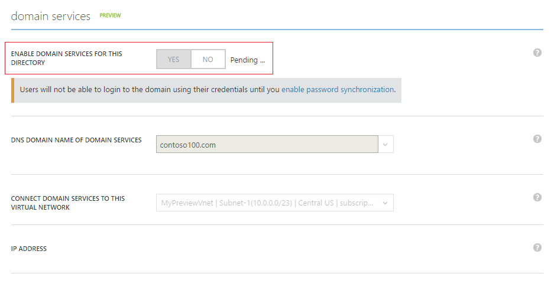
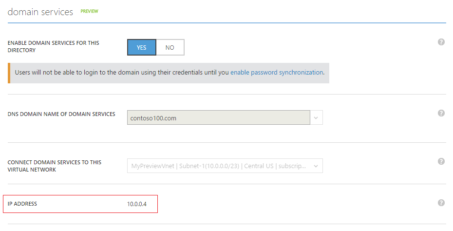
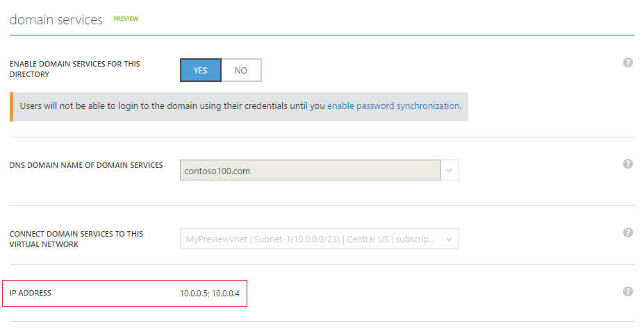

<properties
    pageTitle="Azure Active Directory-Domänendiensten: Aktivieren der Azure-Active Directory-Domänendiensten | Microsoft Azure"
    description="Erste Schritte mit Azure Active Directory-Domänendiensten"
    services="active-directory-ds"
    documentationCenter=""
    authors="mahesh-unnikrishnan"
    manager="stevenpo"
    editor="curtand"/>

<tags
    ms.service="active-directory-ds"
    ms.workload="identity"
    ms.tgt_pltfrm="na"
    ms.devlang="na"
    ms.topic="get-started-article"
    ms.date="10/19/2016"
    ms.author="maheshu"/>

# Azure-Active Directory-Domänendiensten aktivieren

## Aufgabe 3: Aktivieren der Azure-Active Directory-Domänendiensten
In dieser Aufgabe aktivieren Sie Azure Active Directory-Domänendiensten für Ihr Verzeichnis. Führen Sie die folgenden Konfigurationsschritte zum Azure Active Directory-Domänendiensten für Ihr Verzeichnis zu aktivieren.

1. Navigieren Sie zu der **Azure klassischen-Portal** ([https://manage.windowsazure.com](https://manage.windowsazure.com)).

2. Wählen Sie im linken Bereich **Active Directory** -Knotens.

3. Wählen Sie den Azure AD-Mandanten (Verzeichnis) für den Sie Azure Active Directory-Domänendiensten aktivieren möchten.

    

4. Klicken Sie auf die Registerkarte **Konfigurieren** .

    

5. Führen Sie einen Bildlauf nach unten bis zum Abschnitt **Domänendiensten**.

    

6. Schalten Sie die Option mit dem Titel **für diese Directory-Domänendiensten aktivieren** auf **Ja**. Beachten Sie Sie ein paar weitere Konfigurationsoptionen für Azure Active Directory-Domänendiensten auf der Seite angezeigt.

    

    > [AZURE.NOTE] Wenn Sie Azure Active Directory-Domänendiensten für Ihren Mandanten aktivieren, werden Azure AD generiert und speichert die Hashes Kerberos und NTLM Anmeldeinformationen, die für die Benutzerauthentifizierung erforderlich sind.

7. Geben Sie den **DNS-Domänennamen des-Domänendienste**.

   - Dem Standarddomänennamen des Verzeichnisses (d. h., die mit der **. onmicrosoft.com** Domänensuffix) ist standardmäßig aktiviert.

   - Die Liste enthält alle Domänen, die für Ihre Azure AD-Verzeichnis – einschließlich überprüft konfiguriert wurden als auch nicht überprüft Domänen, die Sie auf der Registerkarte 'Domänen' konfigurieren.

   - Darüber hinaus können Sie auch einen benutzerdefinierten Domänennamen eingeben. In diesem Beispiel haben wir in einem benutzerdefinierten Domänennamen 'contoso100.com' eingegeben.

     > [AZURE.WARNING] Stellen Sie sicher, dass das Präfix Domäne des Domänennamens (z. B. 'contoso100' in der Domänenname 'contoso100.com') angegebenen weniger als 15 Zeichen ist. Sie erstellen keine Azure-Active Directory-Domänendiensten Domäne mit mehr als 15 Zeichen Domäne Präfix.

8. Stellen Sie sicher, dass der DNS-Domänennamen für die Domäne verwalteten gewählte in das virtuelle Netzwerk nicht bereits vorhanden ist. Überprüfen Sie insbesondere wenn ein:

   - Sie haben bereits eine Domäne mit den gleichen DNS-Domänennamen auf das virtuelle Netzwerk.

   - das virtuelle Netzwerk aus, die, das Sie ausgewählt haben, weist eine VPN-Verbindung mit Ihrem lokalen Netzwerk, und Sie haben eine Domäne mit den gleichen DNS-Domänennamen in Ihrem lokalen Netzwerk.

   - Sie haben einen vorhandenen Clouddienst mit diesem Namen auf das virtuelle Netzwerk aus.

9. Im nächsten Schritt wird ein virtuelles Netzwerk auswählen in dem Azure Active Directory-Domänendiensten verfügbar sein sollen. Wählen Sie die virtuelle Netzwerk und spezielle Subnetz, die Sie in der Dropdownliste mit dem Titel **Domänendiensten in diesem virtuellen Netzwerk verbinden**erstellt haben.

   - Stellen Sie sicher, dass eine Azure Region von Azure Active Directory-Domänendiensten unterstützt gehört das virtuelle Netzwerk aus, die, das Sie angegeben haben. Schlagen Sie in der Seite [Azure Dienste nach Region](https://azure.microsoft.com/regions/#services/) Azure Regionen wissen, in denen Azure Active Directory-Domänendiensten verfügbar ist.

   - Virtuelle Netzwerke auf einen Bereich, in dem Azure-Active Directory-Domänendiensten wird nicht unterstützt, gehören führen Sie in der Dropdown-Liste nicht angezeigt.
   
   - Verwenden Sie eine spezielle Subnetz innerhalb des virtuellen Netzwerks für Azure Active Directory-Domänendiensten. Stellen Sie sicher, dass Sie nicht das Gateway Subnetz zu aktivieren. Finden Sie unter [Netzwerke Aspekte](active-directory-ds-networking.md). 

   - Virtuelle Netzwerke, die mit Azure Ressourcenmanager erstellt wurden, werden auf ähnliche Weise nicht in der Dropdown-Liste angezeigt. Ressourcenmanager-basierte virtuelle Netzwerke werden durch Azure Active Directory-Domänendiensten derzeit nicht unterstützt.

10. Wenn Azure Active Directory-Domänendiensten aktivieren möchten, klicken Sie aus dem Aufgabenbereich am unteren Rand der Seite auf **Speichern** .

11. Die Seite zeigt eine ' Ausstehend...' Bundesstaat, während Azure Active Directory-Domänendiensten für Ihr Verzeichnis werden aktiviert ist.

    

    > [AZURE.NOTE] Azure-Active Directory-Domänendiensten bietet hohen Verfügbarkeit für Ihre Domäne verwalteten. Nachdem Sie Azure Active Directory-Domänendiensten aktiviert haben, beachten Sie die IP-Adressen, Domänendiensten virtuelles Netzwerk anzeigen von einzeln zur Verfügung stehen. Die zweite IP-Adresse wird in Kürze, angezeigt, wie bald Dienst hohen Verfügbarkeit für Ihre Domäne ermöglicht. Wenn der hoher Verfügbarkeit konfiguriert und für Ihre Domäne aktiv ist, sollte zwei IP-Adressen im Abschnitt **Domänendiensten** der Registerkarte " **Konfigurieren** " angezeigt werden.

12. Nach ungefähr 20-30 Minuten wird die erste IP-Adresse, an der Domänendiensten Ihre virtuelle Netzwerk in das Feld **IP-Adresse** auf der Seite **Konfigurieren** verfügbar ist.

    

13. Wenn der hoher Verfügbarkeit für Ihre Domäne funktionsfähig ist, sehen Sie zwei IP-Adressen auf der Seite angezeigt. Ihre verwaltete Domäne steht in Ihrem ausgewählten virtuelle Netzwerk bei dieser beiden IP-Adressen. Notieren Sie die IP-Adressen, damit Sie aktualisieren können Sie die DNS-Einstellungen für das virtuelle Netzwerk. In diesem Schritt können virtuellen Computern virtuelle Netzwerk Verbindung zu der Domäne JOIN-Operationen wie beitreten zu einer Domäne.

    

> [AZURE.NOTE] Abhängig von der Größe Ihrer Azure AD-Mandanten (Anzahl der Benutzer, gruppiert usw.), Synchronisation an Ihre verwalteten Domäne wird eine Weile. Dieses Verfahren Synchronisation erfolgt im Hintergrund. Für große Mandanten mit Dutzende Tausende von Objekten kann es eine oder zwei Tage für alle Benutzer, die Gruppenmitgliedschaft und die Anmeldeinformationen zu synchronisierenden dauern.

 

## Aufgabe 4 - Update DNS-Einstellungen für das Azure virtuelle Netzwerk
Die nächste Konfigurationsaufgabe besteht darin, [Aktualisieren Sie die DNS-Einstellungen für das Azure virtuelle Netzwerk](active-directory-ds-getting-started-dns.md).
