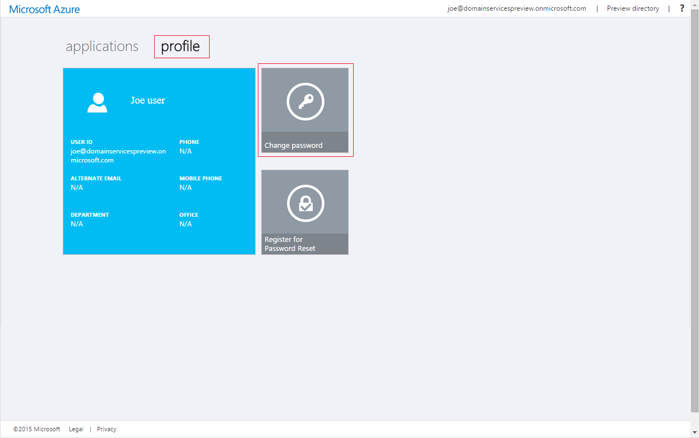
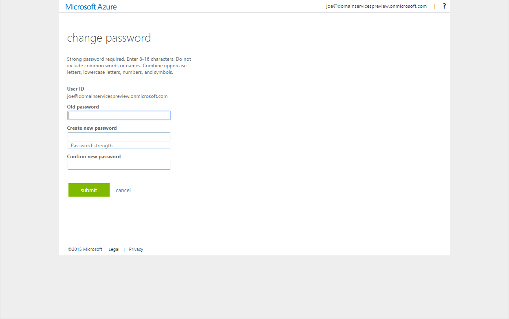

<properties
    pageTitle="Azure-Active Directory-Domänendiensten: Aktivieren der Synchronisierung von Kennwörtern | Microsoft Azure"
    description="Erste Schritte mit Azure Active Directory-Domänendiensten"
    services="active-directory-ds"
    documentationCenter=""
    authors="mahesh-unnikrishnan"
    manager="stevenpo"
    editor="curtand"/>

<tags
    ms.service="active-directory-ds"
    ms.workload="identity"
    ms.tgt_pltfrm="na"
    ms.devlang="na"
    ms.topic="get-started-article"
    ms.date="09/20/2016"
    ms.author="maheshu"/>

# Aktivieren Sie die Synchronisierung von Kennwörtern nach Azure Active Directory-Domänendiensten
In den vorherigen Aufgaben ermöglichte Azure Active Directory-Domänendiensten für Ihren Azure AD-Mandanten. Die nächste Aufgabe ist aktivieren Sie Anmeldeinformationen Hashes für die Synchronisierung mit Azure Active Directory-Domänendiensten NTLM und Kerberos-Authentifizierung erforderlich. Nachdem Sie Anmeldeinformationen Synchronisation eingerichtet haben, können Benutzer mit der verwalteten Domäne mit ihren Anmeldeinformationen Ihres Unternehmens anmelden.

Die einzelnen Schritte unterscheiden sich, ob Ihre Organisation eine Cloud nur Azure AD hat Grundlage Mandanten oder für die Synchronisierung mit Ihrem lokalen Verzeichnis mit Azure AD verbinden festgelegt ist.

 

> [AZURE.SELECTOR]
- [Cloud nur Azure AD-Mandanten](active-directory-ds-getting-started-password-sync.md)
- [Synchronisiert Azure AD-Mandanten](active-directory-ds-getting-started-password-sync-synced-tenant.md)

 

## Aufgabe 5: Aktivieren der Synchronisierung von Kennwörtern nach AAD Domänendiensten für eine Cloud nur Azure AD-Mandanten
Azure-Active Directory-Domänendiensten müssen in einem Format für NTLM und Kerberos-Authentifizierung, für die Benutzerauthentifizierung mit der verwalteten Domäne geeignet Hashes Anmeldeinformationen. Es sei denn, Sie AAD Domänendiensten für Ihren Mandanten aktivieren, Azure AD nicht generieren oder Speichern von Anmeldeinformationen Hashes in das Format für NTLM oder Kerberos-Authentifizierung erforderlich ist. Aus Sicherheitsgründen offensichtlich werden Azure AD auch keine Anmeldeinformationen in unverschlüsselter Form gespeichert. Daher verfügt Azure AD keine Möglichkeit, diese NTLM oder Kerberos Anmeldeinformationen Hashes basierend auf vorhandenen Anmeldeinformationen von Benutzern zu generieren.

> [AZURE.NOTE] Wenn Ihre Organisation eine Cloud nur hat Azure AD-Mandanten, Benutzer, die Azure Active Directory-Domänendiensten verwenden müssen, muss ihre Kennwörter ändern.

Dieses Kennwort ändern Verfahren führt die Anmeldeinformationen Hashes erforderlich durch Azure AD-Domänendienste für Kerberos und NTLM-Authentifizierung in Azure AD generiert werden. Sie können entweder ablaufen Kennwörter für alle Benutzer in den Mandanten, die verwenden Azure-Active Directory-Domänendiensten oder anweisen, diese Benutzer ihre Kennwörter ändern müssen.

### Aktivieren Sie NTLM und Kerberos Anmeldeinformationen Hash Generation für eine Cloud nur Azure AD-Mandanten
Hier sind Anweisungen benötigten Endbenutzern, bereitzustellen, damit Benutzer ihre Kennwörter ändern können:

1. Navigieren Sie zur Seite Systemsteuerung Azure Active Directory Access für Ihre Organisation am [http://myapps.microsoft.com](http://myapps.microsoft.com).

2. Wählen Sie die Registerkarte **Profil** auf dieser Seite.

3. Klicken Sie auf die Kachel **Ändern des Kennworts** auf dieser Seite.

    

    > [AZURE.NOTE] Wenn Sie die Option **Kennwort ändern** , klicken Sie auf der Seite Access Panel nicht angezeigt werden, stellen Sie sicher, dass Ihre Organisation [Kennwort Management in Azure AD-](../active-directory/active-directory-passwords-getting-started.md)konfiguriert hat.

4. Geben Sie auf der Seite **Kennwort ändern** Ihr Kennwort für vorhandene (alte) Geben Sie ein neues Kennwort ein, und bestätigen Sie es. Klicken Sie auf **Absenden**.

    

Nachdem Sie Ihr Kennwort geändert haben, wird das neue Kennwort in Kürze in Azure Active Directory-Domänendiensten verwendet werden. Nach ein paar Minuten (in der Regel ungefähr 20 Minuten,) auf Computern, die der verwalteten Domäne mit den gerade geänderten Kennwort anmelden können.

 

## Siehe auch

- [So aktualisieren Sie Ihr eigenes Kennwort](../active-directory/active-directory-passwords-update-your-own-password.md)

- [Erste Schritte mit der Verwaltung der Kennwörter in Azure Active Directory](../active-directory/active-directory-passwords-getting-started.md).

- [Aktivieren Sie die Synchronisierung von Kennwörtern nach AAD Domänendiensten für eine synchronisierten Azure AD-Mandanten](active-directory-ds-getting-started-password-sync-synced-tenant.md)

- [Verwalten einer verwalteten Azure Active Directory-Domänendiensten-Domäne](active-directory-ds-admin-guide-administer-domain.md)

- [Teilnehmen an einem Windows-Computer mit einer verwalteten Azure Active Directory-Domänendiensten-Domäne](active-directory-ds-admin-guide-join-windows-vm.md)

- [Teilnehmen an einer Red Hat Enterprise Linux virtuellen Computern zu einer verwalteten Azure Active Directory-Domänendiensten-Domäne](active-directory-ds-admin-guide-join-rhel-linux-vm.md)
