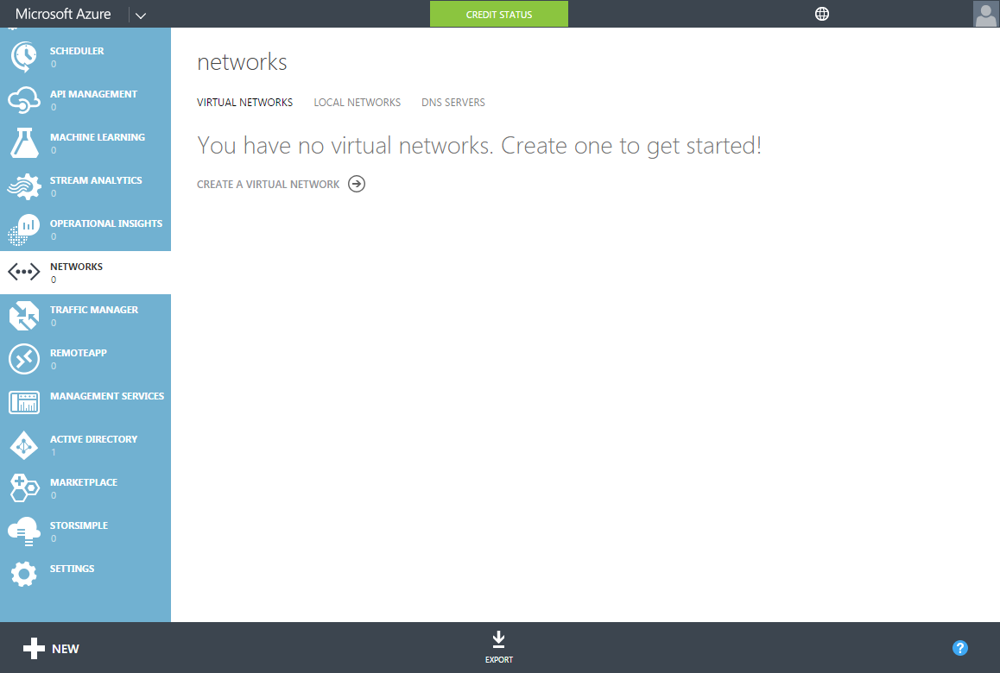
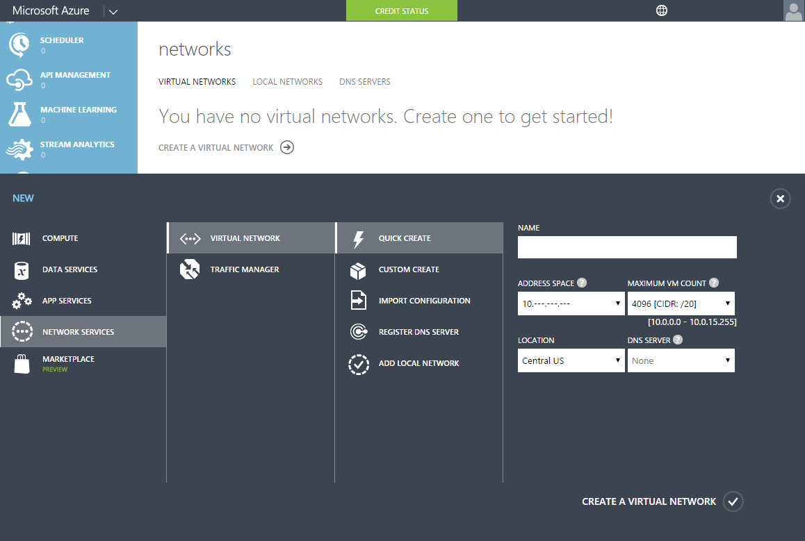
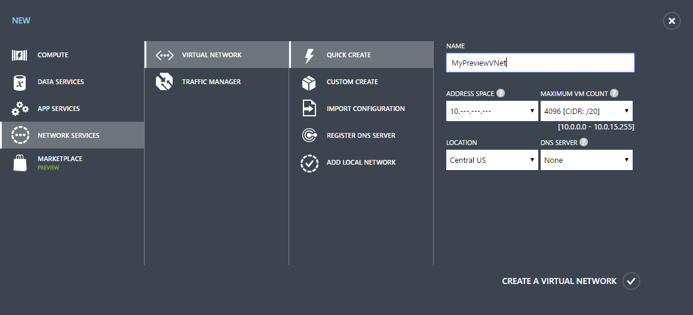
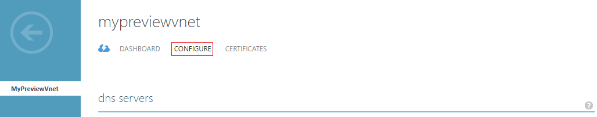
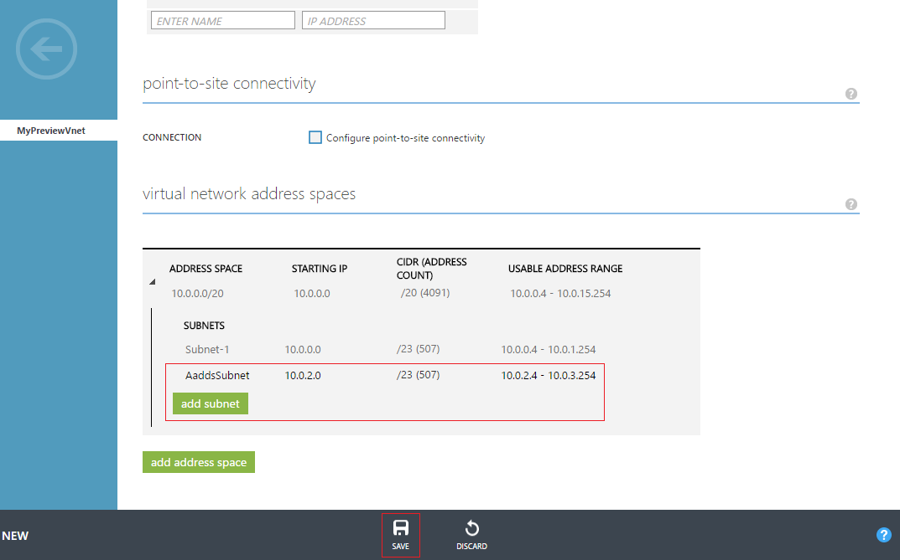

<properties
    pageTitle="Azure-Active Directory-Domänendiensten: Erstellen, oder wählen Sie ein virtuelle Netzwerk | Microsoft Azure"
    description="Erste Schritte mit Azure Active Directory-Domänendiensten"
    services="active-directory-ds"
    documentationCenter=""
    authors="mahesh-unnikrishnan"
    manager="stevenpo"
    editor="curtand"/>

<tags
    ms.service="active-directory-ds"
    ms.workload="identity"
    ms.tgt_pltfrm="na"
    ms.devlang="na"
    ms.topic="get-started-article"
    ms.date="10/03/2016"
    ms.author="maheshu"/>

# Erstellen oder Auswählen eines virtuellen Netzwerks für Azure Active Directory-Domänendiensten

## Richtlinien, wählen Sie ein Azure-virtuelles Netzwerk
> [AZURE.NOTE] **Bevor Sie beginnen**: [Networking Aspekte für Azure Active Directory-Domänendiensten](active-directory-ds-networking.md)finden Sie unter.

## Aufgabe 2: Erstellen eines Azure virtuellen Netzwerks
Der nächste Task ist ein Azure-virtuellen Netzwerk und einem Subnetz darin erstellen. Aktivieren Sie Azure Active Directory-Domänendiensten in diesem Subnetz innerhalb des virtuellen Netzwerks. Wenn Sie bereits über ein vorhandenes virtuelles Netzwerk, die, das Sie verwenden möchten verfügen, können Sie diesen Schritt überspringen.

> [AZURE.NOTE] Stellen Sie sicher, dass das Azure virtuelle Netzwerk erstellen, oder wählen Sie zur Verwendung mit Azure Active Directory-Domänendiensten aus einer Azure Region gehört, die von Azure Active Directory-Domänendiensten unterstützt wird. Finden Sie unter der Seite [Azure Dienste nach Region](https://azure.microsoft.com/regions/#services/) Azure Regionen wissen, in denen Azure Active Directory-Domänendiensten verfügbar ist.

Notieren Sie den Namen des virtuellen Netzwerks, damit Sie auswählen, das rechts virtuelle Netzwerk bei der Aktivierung der Azure Active Directory-Domänendiensten in einem Konfigurationsschritt nachfolgende.

Führen Sie die folgenden Konfigurationsschritte aus, um ein Azure-virtuellen Netzwerk zu erstellen, in dem Sie Azure Active Directory-Domänendiensten aktivieren möchten.

1. Navigieren Sie zu der **Azure klassischen-Portal** ([https://manage.windowsazure.com](https://manage.windowsazure.com)).

2. Wählen Sie den Knoten **Netzwerke** im linken Bereich aus.

    

3. Klicken Sie im Aufgabenbereich am unteren Rand der Seite auf **neu** .

    

4. Wählen Sie in den Knoten **Network Services** **Virtuelle Netzwerk**aus.

5. Klicken Sie auf **Symbolleiste erstellen** , um ein virtuelles Netzwerk erstellen.

    

6. Geben Sie einen **Namen** für das virtuelle Netzwerk an. Sie können auch so konfigurieren Sie die **Adresse Leerzeichen** oder **Anzahl von maximale virtueller Computer** für dieses Netzwerk auswählen. Sie können jetzt die **DNS-Server** -Einstellung 'Keine' festgelegt lassen. Sie können den DNS-Server nach Ihrer aktivieren Azure AD-Domäne einrichten, Dienste aktualisieren.

7. Stellen Sie sicher, dass Sie eine unterstützte Azure Region in der Dropdownliste den **Speicherort** auswählen. Finden Sie unter der Seite [Azure Dienste nach Region](https://azure.microsoft.com/regions/#services/) Azure Regionen wissen, in denen Azure Active Directory-Domänendiensten verfügbar ist.

8. Klicken Sie zum Erstellen von virtuellen Netzwerks auf die Schaltfläche **erstellen ein virtuelles Netzwerk** .

    

9. Nachdem das virtuelle Netzwerk erstellt wurde, wählen Sie das virtuelle Netzwerk aus, und klicken Sie auf die Registerkarte **Konfigurieren** .

    

10. Navigieren Sie zum Abschnitt **virtuelles Netzwerk Adresse Leerzeichen** . Klicken Sie auf **Subnetz hinzufügen** , und geben Sie ein Subnetz mit dem Namen **AaddsSubnet**. Klicken Sie auf **Speichern** , um das Subnetz erstellen.

    

 

## Aufgabe 3: Aktivieren Azure Active Directory-Domänendiensten
Die nächste Konfigurationsaufgabe ist [Azure Active Directory-Domänendiensten](active-directory-ds-getting-started-enableaadds.md)aktivieren.
