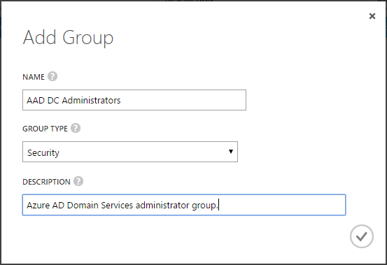
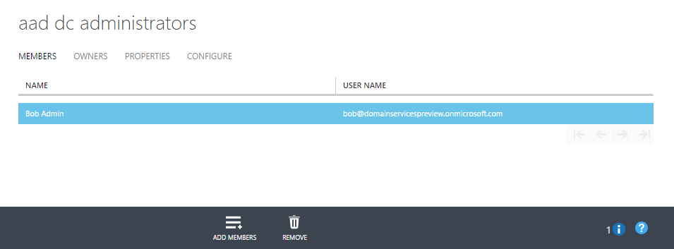
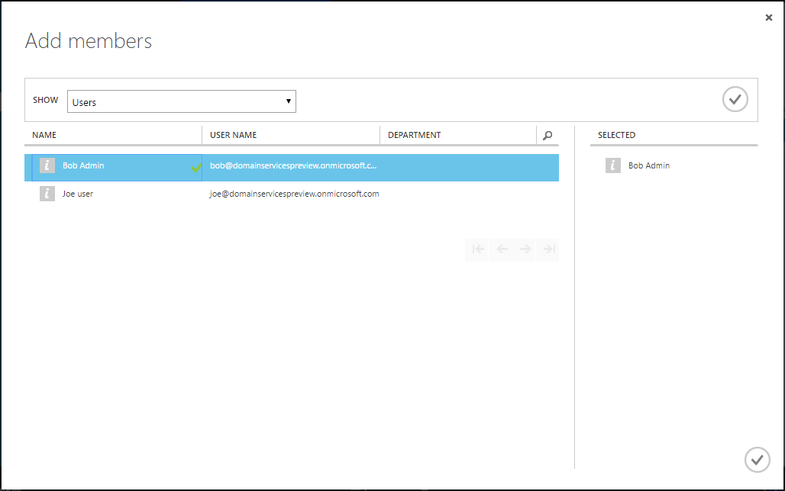

<properties
    pageTitle="Azure-Active Directory-Domänendiensten: Erstellen der AAD DC Administratorgruppe | Microsoft Azure"
    description="Erste Schritte mit Azure Active Directory-Domänendiensten"
    services="active-directory-ds"
    documentationCenter=""
    authors="mahesh-unnikrishnan"
    manager="stevenpo"
    editor="curtand"/>

<tags
    ms.service="active-directory-ds"
    ms.workload="identity"
    ms.tgt_pltfrm="na"
    ms.devlang="na"
    ms.topic="article"
    ms.date="10/03/2016"
    ms.author="maheshu"/>

# Erste Schritte mit Azure Active Directory-Domänendiensten

In diesem Artikel führt durch die erforderlichen Konfigurationsaufgaben zum Aktivieren von Azure Active Directory-Domänendiensten für Ihren Azure AD-Mandanten.

## Aufgabe 1: Erstellen der Gruppe 'AAD DC Administratoren'
Die erste Aufgabe besteht im Erstellen einer administrativen Gruppe in Ihrem Mandanten Azure Active Directory. Diese spezielle administrative Gruppe heißt **AAD DC Administratoren**. Mitglieder dieser Gruppe sind Administratorrechte auf Computern erteilt, die Domäne zur Azure-Active Directory-Domänendiensten verwalteten Domäne sind. Auf Computern Domänenverbund wird dieser Gruppe in der Gruppe 'Administratoren' hinzugefügt. Darüber hinaus können Mitglieder dieser Gruppe Remotedesktop Sie Remote-Verbindung Domänenverbund Autos.  

> [AZURE.NOTE] Sie verfügen nicht über Domäne Administrator-oder Unternehmensadministrator der verwalteten Domäne mit Azure Active Directory-Domänendiensten erstellt. Klicken Sie auf verwalteten Domains diese Berechtigungen werden vom Dienst reserviert und sind für Benutzer innerhalb des Mandanten nicht zur Verfügung gestellt. Die spezielle Administratorgruppe erstellt in dieser Konfigurationsaufgabe können Sie jedoch einige berechtigten Vorgänge ausführen. Zu diesen Vorgängen gehört Beitritt Computern zu der Domäne, die zur Gruppe Administratoren auf Computern Domänenverbund Gruppe Richtlinie usw. konfigurieren.

In dieser Konfigurationsaufgabe die administrative Gruppe erstellen und einen oder mehrere Benutzer in Ihrem Verzeichnis zur Gruppe hinzufügen. Führen Sie die folgenden Schritte aus, um die Administratorgruppe für Azure Active Directory-Domänendiensten zu erstellen:

1. Navigieren Sie zu der **Azure klassischen-Portal** ([https://manage.windowsazure.com](https://manage.windowsazure.com))

2. Wählen Sie im linken Bereich **Active Directory** -Knotens.

3. Wählen Sie den Azure AD-Mandanten (Verzeichnis) für den Sie Azure Active Directory-Domänendiensten aktivieren möchten. Sie können nur eine Domäne für jedes Azure AD-Verzeichnis erstellen.

    

4. Klicken Sie auf die Registerkarte **Gruppen** .

5. Klicken Sie zum Hinzufügen einer Gruppe zu Ihrem Azure AD-Mandanten, aus dem Aufgabenbereich am unteren Rand der Seite auf **Gruppe hinzufügen** .

    

6. Erstellen Sie eine Gruppe namens **AAD DC Administratoren**. Legen Sie **GRUPPENTYP** auf **Sicherheit**.

    > [AZURE.WARNING] Zum Aktivieren des Zugriffs innerhalb Ihrer Azure Active Directory-Domänendiensten verwalteten Domäne, erstellen Sie eine Gruppe mit diesem genauen Namen.

    

7. Fügen Sie eine Beschreibung für diese Gruppe aus, damit andere Personen verstehen, dass diese Gruppe verwendet wird, um Administratorberechtigungen in Azure Active Directory-Domänendiensten erteilen.

8. Nachdem die Gruppe erstellt wurde, klicken Sie auf den Namen der Gruppe, um die Eigenschaften in dieser Gruppe anzeigen möchten. Wenn Sie Benutzer als Mitglieder dieser Gruppe hinzufügen möchten, klicken Sie auf die Schaltfläche **Mitglieder hinzufügen** auf den unteren Bereich.

    

9. Wählen Sie die Benutzer, die Mitglieder dieser Gruppe werden soll, und aktivieren Sie das Kontrollkästchen, wenn Sie fertig sind, klicken Sie im Dialogfeld **Mitglieder hinzufügen** .

    

 

## Aufgabe 2: Erstellen Sie, oder wählen Sie ein Azure virtuelle Netzwerk
Die nächste Konfigurationsaufgabe ist zu [erstellen, oder wählen Sie ein Azure-virtuellen Netzwerk aus](active-directory-ds-getting-started-vnet.md).
