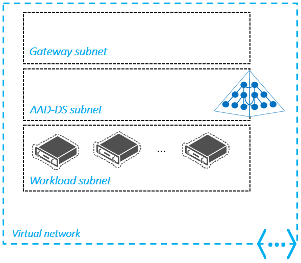
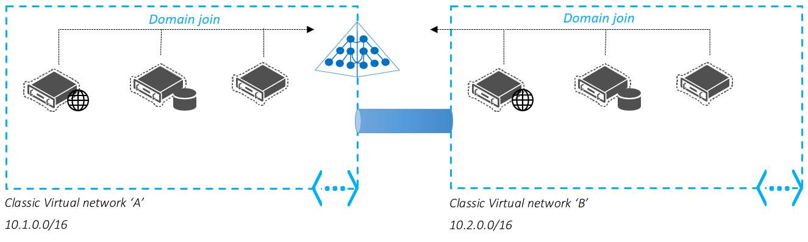
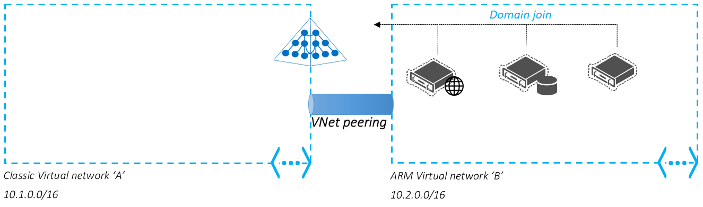
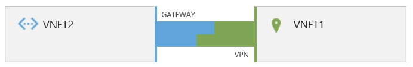
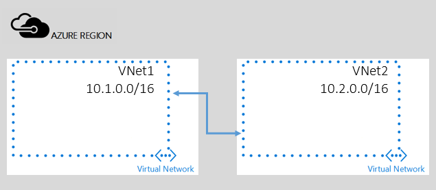

<properties
    pageTitle="Azure-Active Directory-Domänendiensten: Netzwerke Richtlinien | Microsoft Azure"
    description="Kriterien für Netzwerk für Azure Active Directory-Domänendiensten"
    services="active-directory-ds"
    documentationCenter=""
    authors="mahesh-unnikrishnan"
    manager="stevenpo"
    editor="curtand"/>

<tags
    ms.service="active-directory-ds"
    ms.workload="identity"
    ms.tgt_pltfrm="na"
    ms.devlang="na"
    ms.topic="article"
    ms.date="10/18/2016"
    ms.author="maheshu"/>

# Kriterien für Netzwerk für Azure Active Directory-Domänendiensten

## So markieren Sie ein Azure-virtuelles Netzwerk
Die folgenden Richtlinien helfen Ihnen ein virtuelles Netzwerk zur Verwendung mit Azure Active Directory-Domänendiensten auszuwählen.

### Typ des Azure-virtuellen Netzwerks

- Sie können Azure Active Directory-Domänendiensten in einem klassischen Azure-virtuellen Netzwerk aktivieren.

- Azure Active Directory-Domänendiensten **in virtuelle Netzwerke erstellt Azure Ressourcenmanager nicht aktiviert werden**.

- Sie können ein Ressourcenmanager-basierten virtuelles Netzwerk zu einem klassischen virtuellen Netzwerk verbinden, in denen Azure Active Directory-Domänendiensten aktiviert ist. Danach können Sie im Netzwerk virtuelle Ressourcenmanager-basierten Azure Active Directory-Domänendiensten. Weitere Informationen finden Sie im Abschnitt [Netzwerkkonnektivität](active-directory-ds-networking.md#network-connectivity) .

- **Landes-/ virtuelle Netzwerke**: Wenn Sie ein vorhandenes virtuelles Netzwerk verwenden möchten, stellen Sie sicher, dass es ein Landes-/ virtuelles Netzwerk befindet.

    - Virtuelle Netzwerke, die die Gruppen die legacy Verwendungsmöglichkeiten können mit Azure Active Directory-Domänendiensten verwendet werden.

    - Azure AD-Domänendiensten, [Migration älterer virtuelle Netzwerke auf Landes-/ virtuelle Netzwerke](../virtual-network/virtual-networks-migrate-to-regional-vnet.md)zu verwenden.

### Azure Region für das virtuelle Netzwerk

- Ihre Azure AD-Domänendienste verwalteten Domäne in der gleichen Azure Region als das virtuelle Netzwerk bereitgestellt wird, wählen Sie zur Aktivierung des Diensts in.

- Wählen Sie ein virtuelle Netzwerk in einem Azure Region von Azure Active Directory-Domänendiensten unterstützt.

- Finden Sie unter der Seite [Azure Dienste nach Region](https://azure.microsoft.com/regions/#services/) Azure Regionen wissen, in denen Azure Active Directory-Domänendiensten verfügbar ist.

### Anforderungen für das virtuelle Netzwerk

- **Nähe zu Ihrer Azure Auslastung**: Wählen Sie das virtuelle Netzwerk, die aktuell hostet/hostet virtuellen Computern, die Zugriff auf den Azure-Active Directory-Domänendiensten erforderlich.

- **Benutzerdefinierte/bringen eigener DNS-Server**: Stellen Sie sicher, dass keine benutzerdefinierten DNS-Server für das virtuelle Netzwerk konfiguriert sind.

- **Vorhandene Domänen mit dem gleichen Domänennamen**: Stellen Sie sicher, dass Sie nicht mit eine vorhandene Domäne mit den gleichen Domänennamen für diese virtuelle Netzwerk verfügen. Beispielsweise wird davon ausgegangen Sie, dass Sie eine Domäne "contoso.com" bereits verfügbar für das ausgewählte virtuelle Netzwerk aufgerufen haben. Später versuchen Sie, eine Azure-Active Directory-Domänendiensten verwaltete Domäne mit den gleichen Domänennamen (das "contoso.com") in diesem virtuellen Netzwerk zu aktivieren. Bei dem Versuch, Azure-Active Directory-Domänendiensten aktivieren auftreten einen Fehler. Dieser Fehler wird aufgrund von Namenskonflikten für den Domänennamen in diesem virtuellen Netzwerk. In diesem Fall müssen Sie einen anderen Namen verwenden, Ihre Azure-Active Directory-Domänendiensten verwalteten Domäne einrichten. Alternativ können Sie heben die vorhandene Domäne bereitstellen und passen Sie dann Azure Active Directory-Domänendiensten aktivieren.

> [AZURE.WARNING] Sie können nicht zu einem anderen virtuellen Netzwerk-Domänendienste wechseln, nachdem Sie den Dienst aktiviert haben.

## Sicherheitsgruppen Netzwerk und Subnetz design
Ein [Netzwerk Sicherheit Gruppe (NSG)](../virtual-network/virtual-networks-nsg.md) enthält eine Liste mit Access Control Liste (ACL) Regeln, die zulassen oder verhindern Netzwerkverkehr auf Ihre Instanzen virtueller Computer in einem virtuellen Netzwerk an. NSGs können entweder Subnets oder einzelne Instanzen von virtuellen Computer in diesem Subnetz zugeordnet werden. Wenn eine NSG ein Subnetz zugeordnet ist, wenden Sie ACL-Regeln auf alle Instanzen virtueller Computer in diesem Subnetz aus. Darüber hinaus kann den Datenverkehr in einem einzelnen virtuellen Computer beschränkt werden weitere durch Zuordnen einer NSG direkt an diesen virtuellen Computer.

### Bewährte Methoden für die Auswahl ein Subnetz
- Bereitstellen Sie Azure-Active Directory-Domänendiensten wird in einem **separaten dedizierten Subnetz** innerhalb Ihrer Azure virtuelles Netzwerk.

- NSGs nicht mit dem dedizierten Subnetz für Ihre Domäne verwalteten angewendet. Wenn Sie das spezielle Subnetz NSGs zuweisen müssen, stellen Sie sicher, **nicht für service und Verwalten Ihrer Domäne erforderlichen Ports blockieren**.

- Beschränken Sie die Anzahl der verfügbaren innerhalb der spezielle Subnetz für Ihre Domäne verwalteten IP-Adressen nicht zu. Diese Einschränkung verhindert, dass den Dienst zwei Domänencontroller für Ihre Domäne verwalteten zur Verfügung zu stellen.

- **Aktivieren nicht Azure Active Directory-Domänendiensten im Subnetz Gateway** des virtuellen Netzwerks ein.

> [AZURE.WARNING] Wenn Sie Zuordnen einer NSG mit einem Subnetz, in dem Azure Active Directory-Domänendienste, aktiviert ist, können Sie Microsoft Möglichkeit service und Verwalten der Domäne beeinträchtigen. Darüber hinaus ist die Synchronisierung zwischen Ihrem Azure AD-Mandanten und der verwalteten Domäne unterbrochen. **Der Vereinbarung zum SERVICELEVEL gilt nicht für Bereitstellungen, wo eine NSG, blockiert Azure Active Directory-Domänendiensten angewendet wurde aus aktualisieren und Verwalten Ihrer Domäne.**

### Ports für Azure Active Directory-Domänendiensten erforderlich ist
Die folgenden Ports sind für Azure Active Directory-Domänendiensten Dienst erforderlich und Verwalten Ihrer verwaltete Domäne. Stellen Sie sicher, dass diese Ports nicht für das Subnetz blockiert werden, in dem Sie Ihre Domäne verwaltete aktiviert haben.

| Port-Nummer | Zweck |
|---|---|
| 443 | Synchronisierung mit Ihrem Azure AD-Mandanten |
| 3389 | Verwaltung von Ihrer Domäne |
| 5986 | Verwaltung von Ihrer Domäne |
| 636 | Sicherer LDAP (LDAPS) Zugriff auf Ihre verwalteten Domäne |

## Netzwerkkonnektivität
Eine Azure-Active Directory-Domänendiensten verwaltete Domäne kann nur in einem einzigen klassischen virtuelle Netzwerk in Azure aktiviert sein. Virtuelle Netzwerke mit Azure Ressourcenmanager erstellt werden nicht unterstützt.

### Szenarien für das Herstellen einer Verbindung Azure Netzwerken
Verbinden von Azure virtuelle Netzwerke, um die verwaltete Domäne in einem der folgenden Bereitstellungsszenarien verwenden:

#### Verwenden der verwalteten Domäne in mehr als einem Azure klassischen virtuelle Netzwerk
Sie können andere Azure klassischen virtuelle Netzwerke zum klassischen Azure virtuelle Netzwerk verbinden, in denen Sie Azure Active Directory-Domänendiensten aktiviert haben. Diese VPN-Verbindung können Sie zur Verwendung von verwalteten Domäne mit Ihrer Auslastung in anderen Netzwerken virtuellen bereitgestellt.

#### Verwenden der verwalteten Domäne in einem Ressourcenmanager-basierten virtuelle Netzwerk
Sie können ein Ressourcenmanager-basierten virtuelles Netzwerk mit dem Azure klassischen virtuellen Netzwerk verbinden, in denen Sie Azure Active Directory-Domänendiensten aktiviert haben. Diese Verbindung ermöglicht Ihnen die Verwendung die verwaltete Domäne mit Ihrer Auslastung in das Ressourcenmanager-basierte virtuelle Netzwerk bereitgestellt.

### Netzwerk-Verbindungsoptionen

- **VNet-VNet - Verbindungen zwischen Standorten VPN-Verbindungen**: Herstellen einer Verbindung ein virtuelles Netzwerk zu einem anderen virtuellen Netzwerk (VNet VNet) ähnelt der herstellen von Verbindungen ein virtuelles Netzwerk mit einer lokalen Website-Speicherort. Beide Typen Connectivity verwenden einen VPN-Gateway, um einen sicheren Tunnel mit IPSec-/IKE bereitzustellen.

    

    [Weitere Informationen – virtuelle Netzwerke mit VPN-Gateway verbinden](../vpn-gateway/virtual-networks-configure-vnet-to-vnet-connection.md)

- **VNet-VNet - Verbindungen mit virtuelles Netzwerk peering**: virtuelles Netzwerk peering eine Methode, die zwei virtuelle Netzwerke in derselben Region über das Azure Backbonenetzwerk verbunden ist. Nachdem dies ist, werden die beiden virtuelle Netzwerke als eine für alle Verwendungszwecke der Konnektivität angezeigt. Sie werden weiterhin als separate Ressourcen verwaltet, aber virtuellen Computern in diese virtuelle Netzwerke können direkt mithilfe der private IP-Adressen miteinander kommunizieren.

    

    [Weitere Informationen – virtuelle Netzwerk peering](../virtual-network/virtual-network-peering-overview.md)

 

## Siehe auch

- [Azure virtuelles Netzwerk peering](../virtual-network/virtual-network-peering-overview.md)

- [Konfigurieren einer VNet-VNet-Verbindung für das Bereitstellungsmodell klassischen](../vpn-gateway/virtual-networks-configure-vnet-to-vnet-connection.md)

- [Sicherheitsgruppen Azure Netzwerk](../virtual-network/virtual-networks-nsg.md)
