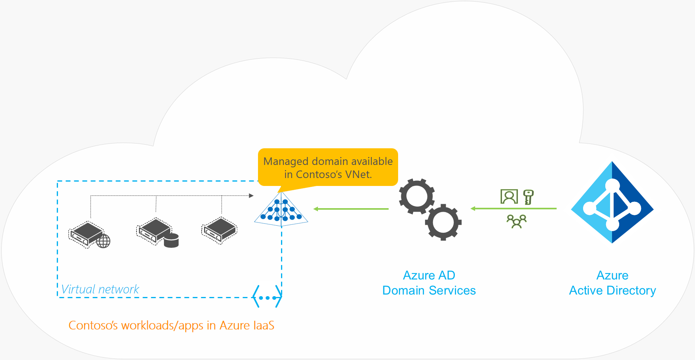
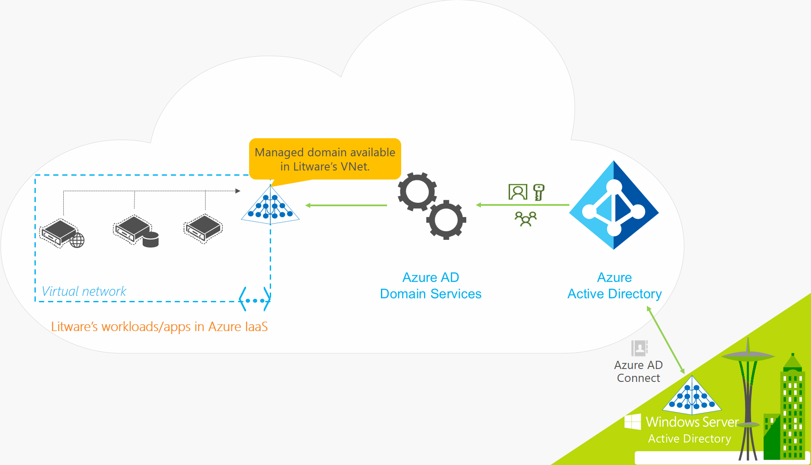

<properties
    pageTitle="Übersicht über Azure-Active Directory-Domänendiensten | Microsoft Azure"
    description="Übersicht über Azure-Active Directory-Domänendiensten"
    services="active-directory-ds"
    documentationCenter=""
    authors="mahesh-unnikrishnan"
    manager="stevenpo"
    editor="curtand"/>

<tags
    ms.service="active-directory-ds"
    ms.workload="identity"
    ms.tgt_pltfrm="na"
    ms.devlang="na"
    ms.topic="article"
    ms.date="10/07/2016"
    ms.author="maheshu"/>

# Azure-Active Directory-Domänendiensten

## (Übersicht)
Azure-Infrastrukturdiensten ermöglichen Ihnen eine Vielzahl von Lösungen auf eine Weise agiles computing bereitstellen. Azure virtuellen Computern können nahezu unmittelbar bereitgestellt werden, und Sie bezahlen nur die Minute. Unterstützung für Windows, Linux, SQL Server, Oracle, IBM, SAP und BizTalk verwenden, können Sie alle Arbeitsbelastung, eine beliebige Sprache, klicken Sie auf nahezu jedem Betriebssystem bereitstellen. Diese Vorteile ermöglichen es Ihnen, legacy-Anwendung bereitgestellt lokalen zur Azure speichern auf Betrieb Ausgaben zu migrieren.

Ein wichtiger Aspekt des Migrieren von lokalen Applications in Azure ist die Identität Bedürfnisse dieser Anwendung behandeln. Directory-kompatiblen Applications möglicherweise basieren auf LDAP für Lese- oder Schreibzugriff auf Firmenverzeichnis oder integrierte Windows-Authentifizierung (Kerberos oder NTLM-Authentifizierung) zum Authentifizieren von Endbenutzern abhängig. Line-of-Business (LOB) unter Windows Server in der Regel auf Computern der Domäne hinzugefügt, Bereitstellen einer Anwendung, damit sie sicher mithilfe von Gruppenrichtlinien verwaltet werden können. 'Heben Sie und UMSCHALT' lokalen Applications in der Cloud müssen diese Abhängigkeiten von der Ihres Unternehmens Identitätsinfrastruktur gelöst werden.

Administratoren aktivieren häufig auf eine der folgenden Lösungen für den Anforderungen ihrer Anwendung, die in Azure bereitgestellt Identität zu erfüllen:

- Bereitstellen einer Website-zu-Standort VPN-Verbindungs zwischen Auslastung in Azure-Infrastrukturdiensten und das Firmenverzeichnis lokal ausgeführt.
- Erweitern Sie die corporate AD-Domäne/Gesamtinfrastruktur, indem Sie Replikatdomänencontroller mit Azure-virtuellen Computern einrichten.
- Bereitstellen einer eigenständigen Domäne in Azure mit Domänencontroller als Azure-virtuellen Computern bereitgestellt.

Alle folgenden Verfahren aus hohe Kosten und Verwaltungsaufwand beeinträchtigt werden. Administratoren müssen sich mithilfe von virtuellen Computern in Azure bereitstellen. Darüber hinaus müssen sie verwalten, secure, patch, überwachen, Sichern und Behandeln von Problemen mit diesen virtuellen Computern. Die Abhängigkeit von VPN-Verbindungen mit lokalen Verzeichnis bewirkt, dass Auslastung in Azure zum vorübergehenden Network-Fehler oder Ausfall gefährdet bereitgestellt. Diese Netzwerkausfälle Fehlern wiederum im unteren Verfügbarkeit und reduzierte Zuverlässigkeit in diesem Bereich.

Wir so gestaltet Azure AD-Domänendienste Alternative einfachere bereitstellen.

## Einführung in Azure-Active Directory-Domänendiensten
Azure-Active Directory-Domänendiensten bietet verwalteten Domänendiensten wie beitreten zu einer Domäne, Gruppenrichtlinie, LDAP, Kerberos-NTLM-Authentifizierung, die mit Windows Server Active Directory vollständig kompatibel sind. Sie können diese Domänendiensten, ohne dass Sie zum Bereitstellen, verwalten und patch Controller in der Cloud nutzen. Azure-Active Directory-Domänendiensten arbeitet mit Ihrer vorhandenen Azure AD-Mandanten, wodurch es möglich, dass Benutzer sich anmelden, mit ihren Anmeldeinformationen Ihres Unternehmens. Darüber hinaus können Sie zum Sichern des Zugriffs auf Ressourcen, wodurch sichergestellt wird eine gleichmäßigere 'heben Sie-und-Schicht' eines lokalen Ressourcen Azure-Infrastrukturdiensten vorhandenen Gruppen und Benutzerkonten.

Azure Active Directory-Domänendiensten Funktionalität arbeitet nahtlos unabhängig davon, ob Ihre Azure AD-Mandanten Cloud nur oder mit Ihrem lokalen Active Directory synchronisierten ist.

### Azure Active Directory-Domänendiensten Cloud nur Organisationen
Eine Cloud nur Azure AD-Mandanten (oft 'verwaltete Mandanten' genannt) verfügt nicht über eine lokale Identität Platzbedarf. Kurzum, werden Benutzerkonten, deren Kennwörter und Gruppenmitgliedschaft alle systemeigenen in der Cloud – d. h., erstellt und verwaltet wird in Azure Active Directory. Sehen Sie sich, dass Contoso eine Cloud nur ist Azure AD-Mandanten. Wie in der folgenden Abbildung gezeigt wird, hat der Administrator von Contoso ein virtuelles Netzwerk in Azure-Infrastrukturdiensten konfiguriert. In diesem virtuellen Netzwerk in Azure-virtuellen Computern sind Applikationen und Arbeitsbelastung der Server bereitgestellt. Da Contoso einen Mandanten Cloud nur ist, werden alle Benutzeridentitäten, deren Anmeldeinformationen und Gruppenmitgliedschaft erstellt und verwaltet in Azure Active Directory.

Contoso IT-Administrator Azure Active Directory-Domänendiensten für ihre Azure AD-Mandanten aktivieren und denn Domänendiensten in diesem virtuellen Netzwerk zur Verfügung stellen kann. Danach Azure Active Directory-Domänendiensten eine verwaltete Domäne Vorschriften und in das virtuelle Netzwerk bereitgestellt. Alle Benutzerkonten, Mitgliedschaften und Benutzeranmeldeinformationen in Contoso Azure AD-Mandanten zur Verfügung stehen auch in dieser Domäne neu erstellten. Dieses Feature ermöglicht Benutzern in der Organisation Anmelden bei der Domäne mit ihren corporate Anmeldeinformationen – beispielsweise beim Remote Verbinden mit Computern über Remote Desktop Domänenverbund. Administratoren können Zugriff auf Ressourcen in der Domäne, die mit vorhandenen Gruppenmitgliedschaft bereitstellen. Anwendung auf das virtuelle Netzwerk virtuellen-bereitgestellt können Features wie beitreten zu einer Domäne, LDAP-lesen, LDAP-Bindung, NTLM und Kerberos-Authentifizierung und Gruppenrichtlinien.

Einige Vertriebsstrategie Aspekte der verwalteten Domäne, die nach der Bereitstellung von Azure Active Directory-Domänendiensten ist lauten wie folgt aus:

- Contoso IT-Administrator muss nicht verwalten, patch oder diese Domäne oder alle Domänen-Controller für diese Domäne verwalteten überwachen.
- Es ist nicht erforderlich zum Verwalten von Active Directory-Replikation für diese Domäne vorhanden. Benutzerkonten, Mitgliedschaften und Anmeldeinformationen von Contoso Azure AD-Mandanten sind innerhalb dieser verwalteten Domäne automatisch zur Verfügung.
- Da die Domäne von Azure Active Directory-Domänendiensten, Contoso des verwaltet wird IT-Administrator hat keinen Domäne Administrator-oder Unternehmensadministrator in dieser Domäne.

### Azure Active Directory-Domänendiensten Organisationen hybrid
Organisationen mit einem Hybriden IT-Infrastruktur nutzen eine Mischung Cloudressourcen und lokale Ressourcen. Solche Organisationen synchronisieren Identitätsinformationen aus ihrem lokalen Verzeichnis auf deren Azure AD-Mandanten. Wie Hybrid Organisationen suchen, um weitere Migrieren ihrer Programme lokal in der Cloud, insbesondere legacy Directory-kompatiblen Applications, können der Azure-Active Directory-Domänendiensten können hilfreich sein.

Litware weist [Azure AD verbinden](../active-directory/active-directory-aadconnect.md), zum Synchronisieren von Identitätsinformationen aus ihrem lokalen Verzeichnis auf deren Azure AD-Mandanten bereitgestellt. Die synchronisierten Identitätsinformationen enthält Benutzerkonten, deren Anmeldeinformationen Hashes für die Authentifizierung (Kennwort synchronisieren) und Gruppenmitgliedschaft.

> [AZURE.NOTE] Die **Synchronisierung von Kennwörtern für Hybrid Organisationen mit Azure Active Directory-Domänendiensten obligatorisch ist**. Diese Anforderung ist, da Anmeldeinformationen von Benutzern in der verwalteten Domäne von Azure Active Directory-Domänendiensten, bereitgestellt, diese Benutzer über NTLM oder Kerberos-Authentifizierungsmethoden authentifizieren erforderlich sind.

Die vorherige Abbildung zeigt an, wie Organisationen mit einem Hybriden IT-Infrastruktur, wie z. B. Litware-Unternehmen Azure Active Directory-Domänendiensten verwenden können. Litware Anwendungen und Arbeitsbelastung der Server, die erfordern Domänendiensten sind in einem virtuellen Netzwerk in Azure-Infrastrukturdiensten bereitgestellt. Litware des IT-Administrator Azure Active Directory-Domänendiensten für ihre Azure AD-Mandanten aktivieren kann, und wählen Sie aus eine verwaltete Domäne in diesem virtuellen Netzwerk zur Verfügung gestellt. Da Litware einer Organisation mit einem Hybriden IT-Infrastruktur ist, werden Benutzerkonten, Gruppen und Anmeldeinformationen auf deren Azure AD-Mandanten aus ihrem lokalen Verzeichnis synchronisiert. Dieses Feature ermöglicht Benutzern, melden Sie sich bei der Domäne mit ihren corporate Anmeldeinformationen – beispielsweise beim Herstellen einer Verbindung per Remotezugriff auf Computern der Domäne über Remote Desktop hinzugefügt. Administratoren können Zugriff auf Ressourcen in der Domäne, die mit vorhandenen Gruppenmitgliedschaft bereitstellen. Anwendung auf das virtuelle Netzwerk virtuellen-bereitgestellt können Features wie beitreten zu einer Domäne, LDAP-lesen, LDAP-Bindung, NTLM und Kerberos-Authentifizierung und Gruppenrichtlinien.

Einige Vertriebsstrategie Aspekte der verwalteten Domäne, die nach der Bereitstellung von Azure Active Directory-Domänendiensten ist lauten wie folgt aus:

- Die verwaltete Domäne ist eine eigenständige Domäne. Es ist keine Erweiterung Litwares lokale Domäne.
- Litware des IT-Administrator muss nicht zum Verwalten von Patch, oder Domänencontroller für diese Domäne verwalteten überwachen.
- Es ist nicht erforderlich zum Verwalten von Active Directory-Replikation an diese Domäne vorhanden. Benutzerkonten, die Gruppenmitgliedschaft und die Anmeldeinformationen Litwares lokalen Verzeichnis werden mit Azure AD über Azure AD verbinden synchronisiert. Diese Benutzerkonten, die Gruppenmitgliedschaft und die Anmeldeinformationen sind innerhalb der verwalteten Domäne automatisch zur Verfügung.
- Da die Domäne von Azure Active Directory-Domänendiensten, Litware des verwaltet wird IT-Administrator hat keinen Domäne Administrator-oder Unternehmensadministrator in dieser Domäne.

## Vorteile
Mit Azure Active Directory-Domänendiensten können Sie die folgenden Vorteile:

-   **Einfache** – Sie können die Anforderungen der Identität des virtuellen Computern befinden, die auf Azure-Infrastrukturdiensten mit wenigen Mausklicks erfüllen. Sie müssen nicht bereitstellen und Verwalten von Identitätsinfrastruktur in Azure oder Setup Connectivity wieder in Ihrer lokalen Identitätsinfrastruktur.

-   **Integrated** – Azure Active Directory-Domänendiensten ist mit der Azure AD-Mandanten tief integriert. Jetzt können Azure AD als ein integriertes cloudbasierten Unternehmensverzeichnis, die an den Anforderungen Ihrer moderne Applikationen und die traditionelle Directory-kompatiblen Applikationen eignet.

-   **Kompatibel** – Azure Active Directory-Domänendiensten basiert auf der bewährten Enterprise Noten Infrastruktur von Windows Server Active Directory. Daher können Ihre Programme auf einen höheren Grad der Kompatibilität mit Windows Server Active Directory-Features verlassen. Nicht alle Features in Windows Server AD verfügbar sind in Azure Active Directory-Domänendiensten derzeit verfügbar. Verfügbare Features sind jedoch mit der entsprechenden Windows Server Active Directory-Features, die Sie in Ihrer lokalen Infrastruktur auf verlassen kompatibel. Die Funktionen der Verknüpfung LDAP, Kerberos, NTLM, Gruppenrichtlinien und Domäne bilden ein Reifen Angebot, die über die verschiedenen Versionen von Windows Server eingeschränkt und getestet wurde.

-   **Kostengünstiger** – mit Azure Active Directory-Domänendiensten, können Sie die Infrastruktur und Verwaltung Belastung, die bei der Verwaltung von Identitätsinfrastruktur zur Unterstützung von herkömmlicher Directory-kompatiblen Applikationen verknüpft ist zu vermeiden. Können Sie diese Programme Azure-Infrastrukturdiensten verschieben und nutzbringend größer Spareinlagen auf Betrieb Ausgaben.
