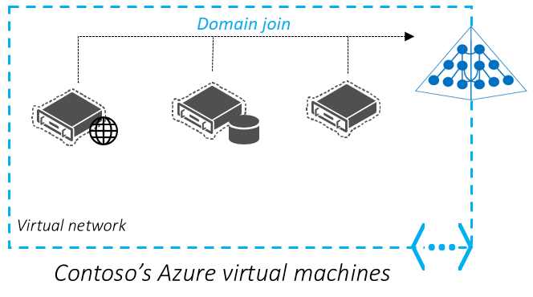
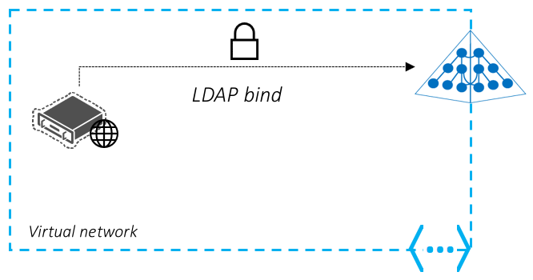
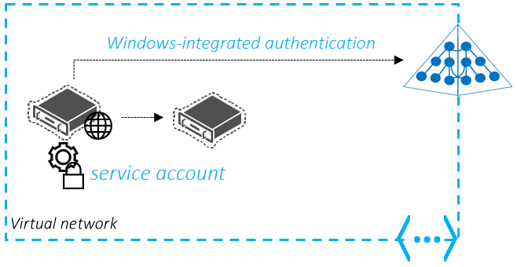
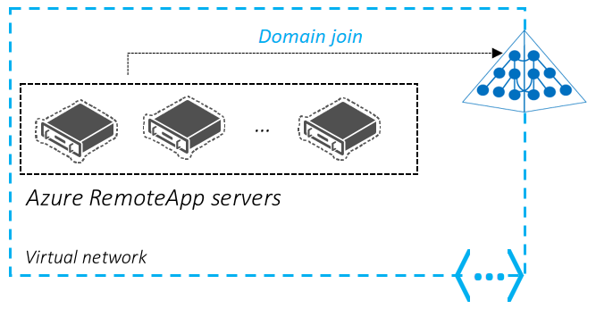

<properties
    pageTitle="Azure Active Directory-Domänendiensten: Szenarien für die Bereitstellung | Microsoft Azure"
    description="Szenarien für die Bereitstellung für Azure Active Directory-Domänendiensten"
    services="active-directory-ds"
    documentationCenter=""
    authors="mahesh-unnikrishnan"
    manager="stevenpo"
    editor="curtand"/>

<tags
    ms.service="active-directory-ds"
    ms.workload="identity"
    ms.tgt_pltfrm="na"
    ms.devlang="na"
    ms.topic="article"
    ms.date="09/21/2016"
    ms.author="maheshu"/>

# Szenarien für die Bereitstellung und Fallstudien
In diesem Abschnitt betrachten wir einige Szenarien und Fallstudien, die von Domänendiensten Azure Active Directory (AD) profitieren.

## Sichere und einfache Verwaltung Azure-virtuellen Computern
Azure Active Directory-Domänendiensten können Sie Ihre Azure-virtuellen Computern in einer optimierten Weise verwalten. Azure-virtuellen Computern kann die verwaltete Domäne, sodass Sie Ihre corporate AD-Anmeldeinformationen bei der Anmeldung beim Verwenden angehören. Dieser Ansatz hilft Anmeldeinformationen Management Netzwerkprobleme wie das Verwalten von lokaler Administratorkonten auf jedem Ihrer Azure-virtuellen Computern zu vermeiden.

Server-virtuellen Computern, die die verwaltete Domäne angehören, können auch verwaltet und über Gruppenrichtlinien abgesichert. Sie können erforderliche Sicherheit Basisplänen für Ihre Azure-virtuellen Computern gelten, und gemäß den Sicherheitsrichtlinien des Unternehmens sperren. Gruppenrichtlinie Verwaltungsfunktionen können Sie beispielsweise die Typen von Applications einzuschränken, die auf diesen virtuellen Computern gestartet werden kann.

Wie Servern und anderen Infrastruktur erreicht Ende des Lebenszyklus, ist Contoso viele Clientanwendungen aktuell gehostet lokal in der Cloud verschieben. Ihre aktuelle IT Standard Vorschriften, dass Indexserver corporate Applikationen Domänenverbund und verwaltete über Gruppenrichtlinien werden müssen. Contoso IT-Administrator lieber Domäne Join-virtuellen Computern bereitgestellt in Azure, um die Verwaltung zu erleichtern. Daher können Administratoren und Benutzer melden Sie sich mit ihren Anmeldeinformationen Ihres Unternehmens. Zur gleichen Zeit können Maschinen zur Einhaltung der erforderlichen Sicherheit Basisplänen mithilfe von Gruppenrichtlinien konfiguriert werden. Contoso würde lieber nicht bereitstellen, überwachen und Verwalten von Domänencontroller in Azure Azure-virtuellen Computern gesichert haben. Daher Azure Active Directory-Domänendiensten hervorragend auf diese Anwendungsfall-ist.

**Von Bereitstellungsnotizen**

Beachten Sie die folgenden wichtigen Punkte in diesem Szenario Bereitstellung aus:

- Verwalteten Domains von Azure Active Directory-Domänendiensten bereitgestellt bereitstellen eine einzelne flache (Organisationseinheit) Organisationseinheitsstruktur standardmäßig an. Alle Domänenverbund Computer befinden sich in einer einzelnen flachen Organisationseinheit. Sie können jedoch zum Erstellen von benutzerdefinierter Organisationseinheiten auswählen.

- Azure Active Directory-Domänendiensten unterstützt einfachen Gruppenrichtlinien in Form von einer integrierten Gruppenrichtlinienobjekt jedes für die Benutzer und Computer Container. Sie können nicht adressieren GP nach Organisationseinheit/Abteilung, WMI-Filterung ausführen oder benutzerdefinierte Gruppenrichtlinienobjekte erstellen.

- Azure Active Directory-Domänendiensten unterstützt das Schema der base AD-Computer-Objekts. Sie können nicht den des Computerobjekts Schema zu erweitern.

## Heben Sie-und-UMSCHALT eine lokale Anwendung, die LDAP-Bindung Authentifizierung zu Azure-Infrastrukturdiensten verwendet

Contoso verfügt über eine lokale Anwendung, die von einem ISV vor vielen Jahren gekauft wurde. Die Anwendung wird gerade Wartungsmodus vom ISV und Anfordern von Änderungen an der Anwendung ist für Contoso erheblichen Kosten verbunden sein. Diese Anwendung besitzt, einem webbasierten Front-End, die sammelt Benutzeranmeldeinformationen mithilfe eines Webformulars, und klicken Sie dann Benutzer authentifiziert, indem Sie eine LDAP-Bindung zu Active Directory des Unternehmens ausführen. Contoso möchte diese Anwendung in Azure-Infrastrukturdiensten migrieren. Es empfiehlt sich, dass die Anwendung ist erwartungsgemäß, ohne dass Änderungen. Darüber hinaus sollten Benutzer mit ihren vorhandenen corporate Anmeldeinformationen authentifizieren und ohne Benutzer um Dinge anders vorgehen nicht umlernen. Kurzum, sollten Endbenutzer verlassen, von dem die Anwendung ausgeführt wird und die Migration sollten für diese transparent sein.

**Von Bereitstellungsnotizen**

Beachten Sie die folgenden wichtigen Punkte in diesem Szenario Bereitstellung aus:

- Stellen Sie sicher, dass die Anwendung keine zu ändern/Schreiben in das Verzeichnis erforderlich ist. LDAP-Schreibzugriff auf verwalteten Domains von Azure Active Directory-Domänendiensten bereitgestellt wird nicht unterstützt.

- Sie können keine Kennwörter direkt für die verwaltete Domäne ändern. Endbenutzer ändern ihres Kennworts entweder mit Azure AD-Self-service-Kennwort ändern Verfahren oder mit dem lokalen Verzeichnis. Diese Änderungen werden automatisch synchronisierten und zur Verfügung, in der verwalteten Domäne.

## Heben Sie UMSCHALT lesen eine lokale-Anwendung, die LDAP verwendet, um das Verzeichnis zu Azure-Infrastrukturdiensten zugreifen
Contoso verfügt über eine lokale Linie-von-branchenspezifische Anwendung, die fast vor zehn Jahren entwickelt wurde. Diese Anwendung ist Verzeichnis bewusst und für die Arbeit mit Windows Server AD entwickelt wurde. Die Anwendung verwendet LDAP (Lightweight Directory Access Protocol) zum Lesen von Informationen/Attribute über Websitebenutzer aus Active Directory. Die Anwendung nicht Attribute geändert oder andernfalls in das Verzeichnis schreiben. Contoso möchte diese Anwendung Azure-Infrastrukturdiensten migrieren und Zurückziehen der Rückblick lokalen Hardware aktuell Hostinganbieter dieser Anwendung. Die Anwendung kann nicht modernen Verzeichnisses APIs wie die REST-basierten Azure AD Graph-API verwenden angepasst werden. Daher ist eine Option heben Sie UMSCHALT gewünscht, bei dem die Anwendung migriert werden kann, um in der Cloud, auszuführen, ohne Code ändern oder die Anwendung neu zu schreiben.

**Von Bereitstellungsnotizen**

Beachten Sie die folgenden wichtigen Punkte in diesem Szenario Bereitstellung aus:

- Stellen Sie sicher, dass die Anwendung keine zu ändern/Schreiben in das Verzeichnis erforderlich ist. LDAP-Schreibzugriff auf verwalteten Domains von Azure Active Directory-Domänendiensten bereitgestellt wird nicht unterstützt.

- Stellen Sie sicher, dass der Anwendung eine benutzerdefinierte/erweiterte Active Directory-Schema nicht erforderlich ist. Schema Erweiterungen werden in Azure Active Directory-Domänendiensten nicht unterstützt.

## Migrieren einer lokalen Dienst oder Dämon Anwendungs zu Azure-Infrastrukturdiensten
Einige Applikationen bestehen aus mehreren Ebenen, die Stelle, an der eine der leisten authentifizierten Anrufe an einer Back-End-Ebene wie eine Datenbank Stufe ausführen muss. Active Directory-Dienstkonten werden für diese Fallstudien häufig verwendet werden. Sie können heben Sie UMSCHALT solche Applikationen Azure-Infrastrukturdiensten und Verwenden von Azure Active Directory-Domänendiensten für den Anforderungen Identität diesen Anwendungen. Sie können auch das gleiche Dienstkonto verwenden, das aus Ihrem lokalen Verzeichnis in Azure Active Directory synchronisiert wird. Alternativ können Sie erstellen Sie zuerst eine benutzerdefinierte Organisationseinheit und erstellen Sie dann ein separates Dienstkonto in dieser Organisationseinheit, solche Applikationen bereitstellen.

Contoso verfügt über eine benutzerdefinierte Software Tresor-Anwendung, die ein Web-front-End, einem SQLServer und einem Back-End-FTP-Server enthält. Windows-integrierte Authentifizierung von Dienstkonten wird zur Web front-End für den FTP-Server Authentifizierung verwendet. Das Web-front-End ist einrichten als Dienstkonto ausgeführt. Der Back-End-Server ist so konfiguriert, dass zum Autorisieren des Zugriffs aus dem Dienstkonto für das Web-front-End. Contoso lieber nicht von einer Domänencontroller virtuellen Computern in der Cloud zu dieser Anwendung zu Azure-Infrastrukturdiensten verschieben bereitstellen. Contoso IT-Administrator kann das Web-front-End, SQLServer und dem FTP-Server zu Azure-virtuellen Computern der Indexserver bereitstellen. Diese Computer werden dann Azure Active Directory-Domänendiensten verwalteten Domäne hinzugefügt. Klicken Sie dann können sie das gleiche Dienstkonto in ihrer lokalen Verzeichnis Zwecks des app Authentifizierung verwenden. Dieses Dienstkonto wird mit der Azure-Active Directory-Domänendiensten verwalteten Domäne synchronisiert und steht zur Verfügung.

**Von Bereitstellungsnotizen**

Beachten Sie die folgenden wichtigen Punkte in diesem Szenario Bereitstellung aus:

- Stellen Sie sicher, dass die Anwendung Benutzername und Kennwort für die Authentifizierung verwendet. Zertifikat/Smartcard-basierten Authentifizierung wird von Azure Active Directory-Domänendiensten nicht unterstützt.

- Sie können keine Kennwörter direkt für die verwaltete Domäne ändern. Endbenutzer ändern ihres Kennworts entweder mit Azure AD-Self-service-Kennwort ändern Verfahren oder mit dem lokalen Verzeichnis. Diese Änderungen werden automatisch synchronisierten und zur Verfügung, in der verwalteten Domäne.

## Azure RemoteApp
Azure RemoteApp ermöglicht Contoso Administrator eine Websitesammlung Domänenverbund erstellen. Dieses Feature ermöglicht remote von Azure RemoteApp verarbeiteten Applikationen auf Computern Domänenverbund ausführen und anderen Ressourcen mithilfe der Windows-integrierte Authentifizierung zugreifen. Azure-Active Directory-Domänendiensten können Contoso eine verwaltete Domäne untersuchten Azure RemoteApp Domänenverbund Websitesammlungen bereitstellen.

Weitere Informationen zu diesem Bereitstellungsszenario finden Sie im Remote Desktop Services-Blog-Artikel mit dem Titel [heben Sie UMSCHALT Ihrer Auslastung mit Azure RemoteApp und Azure-Active Directory-Domänendiensten](http://blogs.msdn.com/b/rds/archive/2016/01/19/lift-and-shift-your-workloads-with-azure-remoteapp-and-azure-ad-domain-services.aspx).
