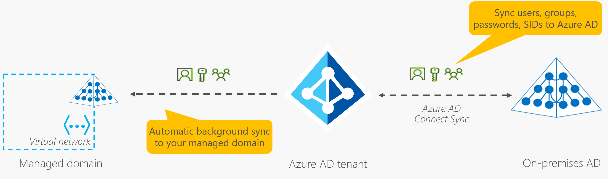

<properties
    pageTitle="Azure Active Directory-Domänendiensten: Synchronisierung in verwalteten Domains | Microsoft Azure"
    description="Verstehen der Synchronisierung in einer verwalteten Azure Active Directory-Domänendienste-Domäne"
    services="active-directory-ds"
    documentationCenter=""
    authors="mahesh-unnikrishnan"
    manager="stevenpo"
    editor="curtand"/>

<tags
    ms.service="active-directory-ds"
    ms.workload="identity"
    ms.tgt_pltfrm="na"
    ms.devlang="na"
    ms.topic="article"
    ms.date="10/03/2016"
    ms.author="maheshu"/>

# Synchronisierung in einer verwalteten Azure Active Directory-Domänendiensten-Domäne
Das folgende Diagramm veranschaulicht, wie Synchronisierung Azure Active Directory-Domänendiensten verwalteten Domains arbeitet.

## Synchronisierung von Ihrem lokalen Verzeichnis zu Ihrem Azure AD-Mandanten
Azure AD verbinden synchronisieren wird verwendet, um Benutzerkonten zu synchronisieren, Mitgliedschaften und Anmeldeinformationen wandelt zu Ihrem Azure AD-Mandanten. Eigenschaften des Benutzers wie dem UPN Firmen und lokalen SID (Sicherheits-ID) synchronisiert werden. Wenn Sie Azure Active Directory-Domänendiensten verwenden, werden ältere Anmeldeinformationen Hashes für NTLM und Kerberos-Authentifizierung erforderlich ist auch zu Ihrem Azure AD-Mandanten synchronisiert.

Wenn Sie schreiben-Back konfiguriert haben, werden die Änderungen, die in Ihrem Verzeichnis Azure AD-auftreten wieder in Ihrem lokalen Active Directory synchronisiert. Beispielsweise, wenn Sie Ihr Kennwort mit Azure AD-Self-service-Kennwort ändern Features ändern, das Kennwort geänderte wird aktualisiert in Ihrem lokalen AD-Domäne.

> [AZURE.NOTE] Verwenden Sie immer die neueste Version von Azure AD verbinden, um sicherzustellen, dass Sie über Updates für alle bekannten Fehler verfügen.

## Synchronisierung von Ihrem Azure AD-Mandanten zu Ihrer verwalteten Domäne
Benutzerkonten, Mitgliedschaften und Anmeldeinformationen Hashes werden aus Ihrem Azure AD-Mandanten mit Ihrer Azure-Active Directory-Domänendiensten verwalteten Domäne synchronisiert. Dieses Verfahren Synchronisierung erfolgt automatisch. Sie müssen nicht konfigurieren, überwachen oder Verwalten dieses Verfahren für die Synchronisierung. Die Synchronisierung erfolgt auch one-Wege/unidirektionale Natur. Ihre Domäne verwaltete weitgehend schreibgeschützt ist eine Ausnahme bilden jedoch alle benutzerdefinierten Organisationseinheiten, die Sie erstellen. Daher ändern nicht Sie Benutzerattributen, wie Benutzerkennwörter oder Gruppenmitgliedschaft innerhalb der verwalteten Domäne. Es besteht daher keine umgekehrte Synchronisierung von Änderungen aus der verwalteten Domäne wieder zu Ihrem Azure AD-Mandanten.

## Synchronisierung von einer Umgebung mit mehreren Gesamtstrukturen lokal
Viele Organisationen verfügen über eine lokale relativ komplexe Identitätsinfrastruktur aus mehreren Kontengesamtstrukturen besteht. Verbinden von Azure AD unterstützt das Synchronisieren von Benutzern, Gruppen und Anmeldeinformationen Hashes aus Umgebungen mit mehreren Gesamtstrukturen zu Ihrem Azure AD-Mandanten.

Ihre Azure AD-Mandanten ist dagegen ein viel einfacher und flachen Namespace. Damit Benutzer zuverlässig Applikationen durch Azure AD gesicherte zugreifen können, Konflikte lösen Benutzerprinzipalnamen über Benutzerkonten in verschiedenen Gesamtstrukturen hinweg. Ihre Azure-Active Directory-Domänendiensten verwalteten Domäne bärchen schließen Ähnlichkeit mit Ihrem Azure AD-Mandanten. Daher wird eine flache Organisationseinheitsstruktur in Ihrer verwalteten Domäne. Alle Benutzer und Gruppen werden im Container "AADDC Users", unabhängig von der lokalen Domäne oder Gesamtstruktur, aus denen in synchronisiert wurden, gespeichert. Sie haben eine hierarchische Organisationseinheit konfiguriert lokalen strukturieren. Ihre Domäne verwaltete enthält jedoch immer noch eine einfache Organisationseinheitenstruktur auf flache.

## Ausschlüsse – was an Ihre Domäne verwalteten synchronisiert nicht zur Verfügung
Die folgenden Objekte oder-Attribute sind nicht zu Ihrem Azure AD-Mandanten oder an Ihre Domäne verwalteten synchronisiert:

- **Attribute ausgeschlossen:** Sie können auswählen, ausgeschlossen werden bestimmte Attribute zu Ihrem Azure AD-Mandanten über Ihre lokalen Domäne mit Azure AD verbinden synchronisieren. Diese ausgeschlossene Attribute sind in der verwalteten Domäne nicht verfügbar.

- **Richtlinien gruppieren:** Gruppenrichtlinien in Ihrer lokalen Domäne konfiguriert werden nicht an Ihre verwalteten Domäne synchronisiert.

- **SYSVOL-Freigabe:** Der Inhalt der SYSVOL-Freigabe in der lokalen Domäne werden auf ähnliche Weise nicht an Ihre verwalteten Domäne synchronisiert.

- **Computerobjekte:** Computerobjekte auf Computern der lokalen Domäne hinzugefügt werden nicht an Ihre verwalteten Domäne synchronisiert. Diese Computer keine Vertrauensstellung mit Ihrer Domäne verwalteten und zu Ihrer lokalen Domäne nur gehören. In der verwalteten Domäne finden Sie Computerobjekte nur für Computer, die Sie explizit, die Domäne-der verwalteten Domäne hinzugefügt haben.

- **SID-Verlauf Attribute für Benutzer und Gruppen:** Der primäre Benutzer und die primäre Gruppe SIDs aus Ihrem lokalen Domäne werden an Ihre verwalteten Domäne synchronisiert. Allerdings werden vorhandene SID-Verlauf Attribute für Benutzer und Gruppen nicht über Ihre Domäne lokalen an Ihre Domäne verwalteten synchronisiert.

- **Organisation Einheiten (Organisationseinheit) Strukturen:** Organisationseinheit in Ihrer lokalen Domäne definierte Einheiten synchronisieren an Ihre verwalteten Domäne nicht. Es gibt zwei integrierte Organisationseinheiten in Ihrer verwalteten Domäne aus. Standardmäßig verfügt über Ihre verwaltete Domäne einer flachen Organisationseinheitsstruktur aus. Sie können jedoch zum [Erstellen einer benutzerdefinierten Organisationseinheit in Ihrer verwalteten Domäne](./active-directory-ds-admin-guide-create-ou.md)auswählen.

## Wie bestimmte Attribute an Ihre Domäne verwalteten synchronisiert werden
Die folgende Tabelle listet einige allgemeine Attribute und beschreibt, wie sie sich an Ihre verwalteten Domäne synchronisiert werden.

| Attribut in Ihrer verwalteten Domäne | Datenquelle | Notizen |
|:---|:---|:---|
|BENUTZERPRINZIPALNAMEN|UPN-Attribut des Benutzers in Ihrem Azure AD-Mandanten|Als an Ihre verwalteten Domäne ist, wird das UPN-Attribut aus Ihrem Azure AD-Mandanten synchronisiert. Daher ist die am häufigsten zuverlässige Methode zum Anmelden bei Ihrem verwalteten Domäne Ihre Benutzerprinzipalnamen verwenden.|
|SAMAccountName|Des Benutzers MailNickname Attribut in Ihrem Azure AD-Mandanten oder automatisch generiert|Das SAMAccountName-Attribut aus dem Attribut MailNickname in Ihrem Azure AD-Mandanten zugegriffen werden konnte. Wenn mehrere Benutzerkonten dasselbe Attribut MailNickname haben, wird der SAMAccountName automatisch generiert. MailNickname oder UPN Präfix des Benutzers ist maximal 20 Zeichen lang, SAMAccountName automatisch generiert, um die 20 Zeichengrenze auf SAMAccountName-Attribute erfüllen.|
|Kennwörter|Benutzerkennworts aus Ihrem Azure AD-Mandanten|Anmeldeinformationen Hashes für NTLM oder Kerberos-Authentifizierung (auch zusätzliche Anmeldeinformationen genannt) erforderlich ist, werden von Ihrer Azure AD-Mandanten synchronisiert. Ist Ihre Azure AD-Mandanten einen synchronisierten Mandanten, werden diese Anmeldeinformationen über Ihre Domäne lokale Quelle.|
|Primäre Benutzer/Gruppe SID|Automatisch generiert|Die primäre SID für Benutzer/Gruppe-Konten wird in Ihrem verwalteten Domäne automatisch generiert. Dieses Attribut entspricht nicht die primäre Benutzer/Gruppe SID des Objekts in der lokalen AD-Domäne. Dies ist, weil die verwaltete Domäne einen anderen SID Namespace als Ihrer lokalen Domäne aufweist.|
|SID-Verlauf für Benutzer und Gruppen|Lokale primäre Benutzer und Gruppen-SID|Das Attribut SID-Verlauf für Benutzer und Gruppen in Ihrer verwalteten Domäne wird festgelegt, zu der entsprechenden primären Benutzer oder eine Gruppe SID in Ihrer lokalen Domäne entsprechen. Dieses Feature hilft heben Sie und UMSCHALT der lokalen Anwendungen zu der verwalteten Domäne zu vereinfachen, da Sie nicht zu Ressourcen Abstände-ACL benötigen.|

> [AZURE.NOTE] **Melden Sie sich bei der verwalteten Domäne, die mit dem UPN Format:** Das Attribut SAMAccountName möglicherweise für einige Benutzerkonten in Ihrer verwalteten Domäne automatisch generiert. Wenn mehrere Benutzer vorhanden, das gleiche MailNickname Attribut sind oder Benutzer zu langen Benutzerprinzipalnamen Präfixe, möglicherweise der SAMAccountName für diesen Benutzer automatisch generiert. Daher ist das SAMAccountName-Format (z. B. ' CONTOSO100\joeuser') nicht immer eine zuverlässigen Möglichkeit zum Anmelden bei der Domäne. Der Benutzer automatisch generierte SAMAccountName kann ihre Benutzerprinzipalnamen Präfix variieren. Verwenden Sie das UPN-Format (z. B. 'joeuser@contoso100.com') zuverlässig bei der verwalteten Domäne anmelden.

## Objekte, die nicht zu Ihrem Azure AD-Mandanten über Ihre verwalteten Domäne synchronisiert werden
Wie im vorherigen Abschnitt in diesem Artikel beschrieben, erfolgt es jedoch keine Synchronisierung über Ihre verwalteten Domäne wieder zu Ihrem Azure AD-Mandanten. Sie können in Ihrer verwalteten Domäne zum [Erstellen eines benutzerdefinierten Organisationseinheit (OU)](./active-directory-ds-admin-guide-create-ou.md) auswählen. Darüber hinaus können Sie andere Organisationseinheiten, Benutzer, Gruppen oder Dienstkonten für diesen benutzerdefinierten OUs erstellen. Keines der Objekte innerhalb der benutzerdefinierten Organisationseinheiten erstellt wurden, werden wieder zu Ihrem Azure AD-Mandanten synchronisiert. Diese Objekte stehen nur innerhalb der verwalteten Domäne. Daher sind diese Objekte nicht sichtbar, Azure AD-PowerShell-Cmdlets, Azure AD Graph-API verwenden, oder verwenden die Azure AD-Verwaltung Benutzeroberfläche.

## Siehe auch
- [Features - Services Azure AD-Domäne](active-directory-ds-features.md)

- [Szenarien für die Bereitstellung - Azure Active Directory-Domänendiensten](active-directory-ds-scenarios.md)

- [Kriterien für Netzwerk für Azure Active Directory-Domänendiensten](active-directory-ds-networking.md)

- [Erste Schritte mit Azure Active Directory-Domänendiensten](active-directory-ds-getting-started.md)
