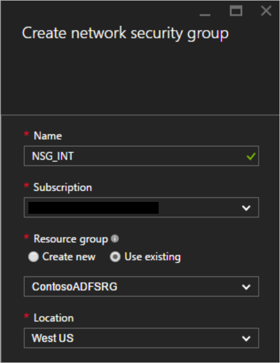
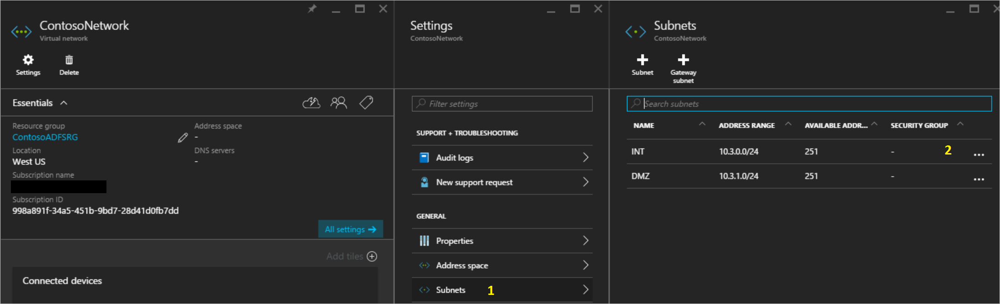
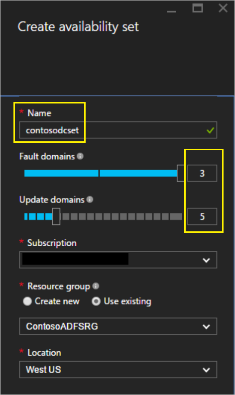
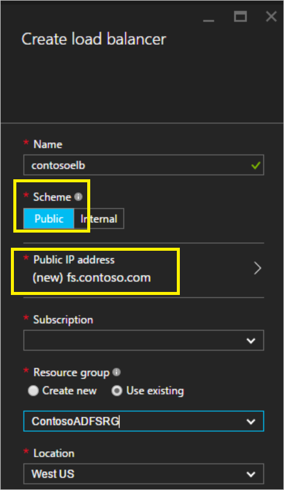
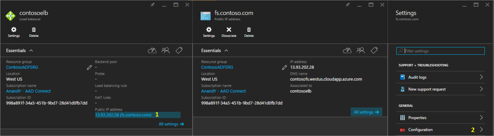

<properties
    pageTitle="Active Directory Federation Services in Azure | Microsoft Azure"
    description="In diesem Dokument erfahren Sie, wie AD FS in Azure für hohen Verfügbarkeit bereitgestellt."
    keywords="Bereitstellen von AD FS in Azure, Azure Adfs, Azure Adfs, Azure Ad fs bereitstellen, Adfs bereitstellen, Bereitstellen von Ad fs, Adfs in Azure bereitstellen Adfs in Azure, Bereitstellen von AD FS in Azure, Adfs Azure, Einführung in AD FS, Azure, AD FS in Azure, Iaas, ADFS, Adfs in Azure verschieben"
    services="active-directory"
    documentationCenter=""
    authors="anandyadavmsft"
    manager="femila"
    editor=""/>

<tags
    ms.service="active-directory"
    ms.workload="identity"
    ms.tgt_pltfrm="na"
    ms.devlang="na"
    ms.topic="get-started-article"
    ms.date="10/03/2016"
    ms.author="anandy;billmath"/>

# AD FS-Bereitstellung in Azure 

AD FS bietet vereinfachtes, gesicherte Identitätsverbund und Web-Funktionen einmaliges Anmelden (SSO). Föderation mit Azure AD oder Office 365 ermöglicht Benutzern, die mit einer lokalen Anmeldeinformationen authentifizieren und Zugriff auf alle Ressourcen in der Cloud. Daher wird es wichtig, dass eine Infrastruktur mit hoher verfügbare AD FS um Zugriff auf Ressourcen beide lokalen sicherzustellen und in der Cloud. Bereitstellen von AD FS in Azure hilft Ihnen die hohe Verfügbarkeit erforderlich mit minimalen Aufwand erzielen.
Es gibt mehrere Vorteile der Bereitstellung von AD FS in Azure, sind einige davon unten aufgelistet:

* **Hohe Verfügbarkeit** – mit der Leistung der Azure Verfügbarkeit Mengen, stellen Sie sicher Infrastruktur mit hoher verfügbare.
* **Einfach zu skalieren** – mehr Performance benötigen? Einfache Migration leistungsfähigeren Maschinen nach nur wenigen Klicks in Azure
* **Cross-Geo Redundanz** – Azure Geo Redundanz Sie können sicher, dass Ihre Infrastruktur des Globus hoch verfügbar ist
* **Einfach zu verwalten** – ist mit stark vereinfachtes Verwaltungsoptionen Azure-Portal Verwaltung Ihrer Infrastruktur denkbar einfach und benutzerfreundliche 

## Entwurfsgrundsätze

Das Diagramm oben zeigt die empfohlene grundlegende Suchtopologie zum Starten eine AD FS-Infrastruktur Azure bereitstellen. Das Prinzip hinter der verschiedenen Komponenten von der Suchtopologie werden nachfolgend aufgeführt:

* **DC / ADFS-Server**: Wenn Sie weniger als 1.000 Benutzer haben können AD FS Rolle einfach auf Ihre Domänencontroller installieren. Wenn Sie keine Leistung Einfluss auf die Domänencontroller oder wenn Sie mehr als 1.000 Benutzer haben, stellen Sie AD FS auf separaten Servern bereit.
* **WAP Server** – es ist erforderlich, vor Anwendung Web-Proxy-Servern bereitstellen, sodass die Benutzer das AD FS erreichen können, wenn sie nicht auf das Unternehmensnetzwerk auch sind.
* **DMZ**: der Web-Anwendungsproxy-Servern werden in der DMZ abgelegt und TCP/443 Zugriff zwischen der DMZ und dem internen Subnetz zulässig ist.
* **Laden Balancers**: zur Sicherstellung der hohen Verfügbarkeit von AD FS und Web-Anwendungsproxy-Servern wir empfehlen verwenden eine interne Lastenausgleich für AD FS-Servern und Lastenausgleich Azure für Web Anwendungsproxy-Servern.
* **Verfügbarkeit Sätze**: Damit redundante zur Bereitstellung AD FS verwendet werden kann, wird empfohlen, dass Sie zwei oder mehr virtuellen Computern in einer Verfügbarkeit einrichten für ähnliche Auslastung gruppieren. Diese Konfiguration stellt sicher, dass während entweder ein Ereignis geplanten oder nicht geplanten Wartung mindestens eine virtuellen Computern verfügbar ist
* **Speicher-Konten**: Es wird empfohlen, zwei Speicherkonten verfügen. Erstellen einer einzelnen Speicher-Kontos kann dazu führen, dass die Erstellung eines einzelnen Punktes des Fehlers und kann dazu führen, dass die Bereitstellung auf in einem Szenario wahrscheinlich nicht mehr verfügbar, in dem das Speicherkonto-fällt aus. Zwei Speicherkonten hilft, eine für jede Zeile Fehlerstrukturanalyse Speicher-Konto zugeordnet werden soll.
* **Netzwerk Trennung**: Web Anwendungsproxy-Servern in einem separaten DMZ-Netzwerk bereitgestellt werden soll. Können Sie eine virtuelles Netzwerk in zwei Subnetzen unterteilen und dann bereitstellen die Web-Anwendungsproxy-Servern in einem Subnetz isoliert. Einfach können Sie die Gruppe Netzwerkeinstellungen für jedes Subnetz konfigurieren und nur erforderlichen Kommunikation zwischen den zwei Subnets zulassen. Weitere Informationen hierzu erhalten pro Bereitstellungsszenario unten

##Schritte zum Bereitstellen von AD FS in Azure

Die Schritte in diesem Abschnitt erwähnten Gliedern den Leitfaden für die Bereitstellung der unten abgebildeten AD FS-Infrastruktur in Azure.

### 1 Bereitstellen von im Netzwerk

Wie oben dargelegt, können Sie entweder zwei Subnetzen in einem einzigen virtuellen Netzwerk erstellen sonst zwei vollständig unterschiedliche virtuelle Netzwerke (VNet) erstellen. In diesem Artikel wird Fokussierung auf Bereitstellen eines einzelnen virtuellen Netzwerks und teilen Sie sie in zwei Subnetzen. Dies ist derzeit ein einfacher Ansatz, wie zwei separate VNets eine VNet mit VNet Gateway für die Kommunikation benötigen würden.

**1.1 erstellen Sie virtuelles Netzwerk**

    
Im Portal Azure können select virtuelles Netzwerk und Sie das virtuelle Netzwerk und einem Subnetz sofort mit nur einem Klick bereitstellen. INT Subnetz ist auch definiert und kann nun für virtuellen Computern hinzugefügt werden soll.
Im nächsten Schritt wird ein anderes Subnetz mit dem Netzwerk, d. h. im DMZ Subnetz hinzufügen. So erstellen Sie das DMZ Subnetz, einfach

* Wählen Sie das neu erstellte Netzwerk
* Wählen Sie in den Eigenschaften Subnetz
* Klicken Sie in das Subnetz auf Systemsteuerung auf die Schaltfläche hinzufügen
* Die Subnetz Namens- und Leerzeichen Information zum Erstellen des Subnetzes

**1.2. erstellen im Netzwerk Sicherheitsgruppen**

Eine Netzwerksicherheitsgruppe (NSG) enthält eine Liste mit Access Control Liste (ACL) Regeln, die zulassen oder verhindern Netzwerkverkehr auf Ihre Instanzen virtueller Computer in einem virtuellen Netzwerk an. NSGs können entweder Subnets oder einzelne Instanzen von virtuellen Computer in diesem Subnetz zugeordnet werden. Wenn eine NSG ein Subnetz zugeordnet ist, wenden Sie ACL-Regeln auf alle Instanzen virtueller Computer in diesem Subnetz aus.
Im Sinne dieser Anleitung erstellen wir zwei NSGs: jeweils eines für ein internes Netzwerk und einer DMZ. Sie werden NSG_INT und NSG_DMZ Hilfethemas beschriftet werden.

Nachdem die NSG erstellt wurde, werden 0 eingehende und 0 ausgehende Regeln. Nachdem Sie die Rollen auf den jeweiligen Servern installiert und funktionsfähig sind, können die eingehenden und ausgehenden Regeln entsprechend der gewünschten Sicherheitsstufe vorgenommen werden.

Nachdem die NSGs erstellt werden, ordnen Sie NSG_INT Subnetz INT und NSG_DMZ mit Subnetz DMZ. Ein Screenshot Beispiel wird unten angezeigt:

* Klicken Sie auf in Subnetzen in den Bereich für Subnetze zu öffnen
* Wählen Sie aus dem Subnetz, mit dem NSG zugeordnet werden soll 

Nach der Konfiguration sollte klicken Sie im Bereich für Subnetze unter aussehen:

**1.3 Erstellen Sie 1.3 die Verbindung zu (lokal)**

Eine Verbindung mit einer lokalen benötigen wir akzeptieren, um die Domänencontroller (DC) in Azure bereitstellen. Azure bietet verschiedene Optionen für die Netzwerkkonnektivität in Verbindung mit Ihrer Azure-Infrastruktur Ihrer lokalen Infrastruktur.

* Punkt-zu-Standort
* Virtuelle Netzwerk-Standorten
* ExpressRoute

Es wird empfohlen, ExpressRoute zu verwenden. ExpressRoute ermöglicht die Erstellung private Verbindungen zwischen Azure Rechenzentren und Infrastruktur, die Ihre lokal oder in einer Umgebung für die gemeinsame Speicherort ist. ExpressRoute Verbindungen gehen Sie nicht über das öffentliche Internet. Sie bieten weitere Zuverlässigkeit, höhere Geschwindigkeit, unteren Wartezeiten und höhere Sicherheit als normalen Verbindungen über das Internet an.
Während es empfohlen wird, ExpressRoute verwendet werden, können Sie eine Verbindungsmethode für Ihre Organisation am besten geeignet ist. Weitere Informationen zu ExpressRoute und ExpressRoute mit den verschiedenen Connectivity-Optionen finden Sie unter [ExpressRoute – technische Übersicht](https://aka.ms/Azure/ExpressRoute).

### 2. erstellen Sie Speicherkonten

Um hohe Verfügbarkeit und Abhängigkeit von einer einzelnen Speicher-Konto zu vermeiden, können Sie zwei Speicherkonten erstellen. Teilen Sie die Computern in den einzelnen Sätzen Verfügbarkeit in zwei Gruppen, und weisen Sie jeder Gruppe eine separate Speicher-Konto.

### 3. Verfügbarkeit Mengen erstellen

Erstellen Sie für jede Rolle (DC/AD FS und WAP) Verfügbarkeit Datensätze, die 2 Maschinen mindestens enthalten sollen. Dadurch wird für jede Rolle höheren Verfügbarkeit zu erzielen. Beim Erstellen der Verfügbarkeit festlegt, ist es wichtig, auf die folgenden entscheiden:
* **Fehlerstrukturanalyse-Domänen**: Freigeben von virtuellen Computern in der gleichen Fehlerstrukturanalyse-Domäne derselben Power Quell- und physischen Netzwerk wechseln. Mindestens 2 Fehlerstrukturanalyse-Domänen werden empfohlen. Der Standardwert ist 3, und lassen Sie ihn als für die Zwecke dieser Bereitstellung ist
* **Aktualisieren von Domänen**: Maschinen, die in der gleichen Domäne aktualisieren gehören zusammen während einer Aktualisierung gestartet werden. Mindestens 2 Update Domänen sein soll. Der Standardwert ist 5, und lassen Sie ihn als für die Zwecke dieser Bereitstellung ist

Im folgenden wird der Verfügbarkeit erstellen

| Festlegen der Verfügbarkeit | Rolle | Fehlerstrukturanalyse-Domänen | Aktualisieren von Domänen |
|:----------------:|:----:|:-----------:|:-----------|
| contosodcset | DC/ADFS | 3 | 5 |
| contosowapset | WAP | 3 | 5 |

### 4 Bereitstellen von virtuellen Computern
Im nächsten Schritt wird virtuellen Computern bereitstellen, auf denen die verschiedenen Rollen in Ihrer Infrastruktur gehostet wird. Mindestens zwei Computern sind in den einzelnen Sätzen Verfügbarkeit empfohlen. Sechs virtuelle Computer für die grundlegenden Bereitstellung zu erstellen.

| Computer | Rolle | Subnetz | Festlegen der Verfügbarkeit | Speicher-Konto | IP-Adresse |
|:-----:|:-----:|:-----:|:-----:|:-----:|:-----:|
|contosodc1|DC/ADFS|GANZZAHL|contosodcset|contososac1|Statische|
|contosodc2|DC/ADFS|GANZZAHL|contosodcset|contososac2|Statische|
|contosowap1|WAP|DMZ|contosowapset|contososac1|Statische|
|contosowap2|WAP|DMZ|contosowapset|contososac2|Statische|

Wie Sie gesehen haben ist, wurde keine NSG angegeben. Dies ist, da Azure NSG Ebene der Subnetz verwenden kann. Klicken Sie dann können Sie Netzwerkverkehr maschinelle steuern, mithilfe der einzelnen NSG entweder im Subnetz sonst das Objekt NIC zugeordnet. Lesen Sie weitere auf [Was ist ein Netzwerk Sicherheit Gruppe (NSG)](https://aka.ms/Azure/NSG).
Statische IP-Adresse wird empfohlen, wenn Sie die DNS-Einträge verwalten. Sie können Azure DNS verwenden und stattdessen die DNS-Einträge für Ihre Domäne, beziehen sich auf die neuen Computer durch ihre Azure Fully.
Klicken Sie im Bereich der virtuellen Computern sollte unter Aussehen nach Abschluss die Bereitstellung:

### 5. Konfigurieren des Domänencontrollers / AD FS-Servern
 AD FS müssen alle eingehende Anforderung für die Authentifizierung, wenden Sie sich an den Domänencontroller. Um die teure Geschäftsreise aus Azure lokalen DC für die Authentifizierung zu speichern, empfiehlt es sich um eine Kopie der Domänencontroller in Azure bereitstellen. Um hohe Verfügbarkeit zu erreichen, empfiehlt es sich zum Erstellen einer Menge Verfügbarkeit der mindestens 2 Domain Controller.

|Domänencontroller|Rolle|Speicher-Konto|
|:-----:|:-----:|:-----:|
|contosodc1|Replikat|contososac1|
|contosodc2|Replikat|contososac2|

* Höherstufen Sie die beiden Server als Replikatdomänencontrollern mit DNS
* Konfigurieren Sie die AD FS-Servern, indem Sie die AD FS-Rolle mit dem Servermanager installieren.

###6. Bereitstellen von internen Lastenausgleich (ILB)

**6.1 erstellen Sie 6.1 die ILB**

Um eine ILB bereitzustellen, fügen Sie select Lastenausgleich in der Azure-Portal, und klicken Sie auf (+) hinzu.
>[AZURE.NOTE] Wenn **Lastenausgleich** nicht in Ihrem Menü angezeigt wird, klicken Sie auf **Durchsuchen** , in der unteren linken Ecke der Portal und führen Sie einen Bildlauf bis **Zum Lastenausgleich**angezeigt wird.  Klicken Sie dann auf den gelben Stern, um es dem Menü hinzufügen. Wählen Sie jetzt die neue Lastenausgleich Symbole auf den Bereich um die Konfiguration von Lastenausgleich beginnen zu öffnen.

* **Name**: Geben Sie einen geeigneten Namen an dem Lastenausgleich
* **Schema**: Da diese Lastenausgleich vor dem AD FS-Servern platziert werden wird und sollte für interne Netzwerk Verbindungen nur, wählen Sie "Internal"
* **Virtuelle Netzwerk**: Wählen Sie das virtuelle Netzwerk, in dem Sie Ihre AD FS bereitstellen,
* **Subnetz**: Wählen Sie aus dem internen Subnetz hier
* **IP-Adresse Zuordnung**: dynamische

 
Nachdem Sie klicken Sie auf erstellen und die ILB bereitgestellt wird, sollten Sie es in der Liste der Lastenausgleich sehen:

 
Nächsten Schritt müssen Sie die Back-End-Pool als auch der Back-End-Prüfpunkt konfigurieren.

**6.2. ILB Back-End-Ressourcenpool zu konfigurieren**

Wählen Sie den neu erstellten ILB auf den Lastenausgleich aus. Klicken Sie im Bereich Settings wird geöffnet. 
1.  Wählen Sie die Back-End-Pools aus dem Bereich "Einstellungen" aus
2.  Klicken Sie in der Systemsteuerung Back-End-Ressourcenpool hinzufügen klicken Sie auf Add virtuellen Computern
3.  Es wird mit einem Bereich angezeigt, in dem Sie festlegen der Verfügbarkeit auswählen können
4.  Wählen Sie die Menge der AD FS-Verfügbarkeit

 
**6.3. Prüfpunkt konfigurieren**

Wählen Sie im Bereich ILB Einstellungen Prüfpunkte aus.
1.  Klicken Sie auf Hinzufügen
2.  Bereitstellen von Details für Prüfpunkt ein. **Name**: Name b Prüfpunkt. **Protokoll**: TCP c. **Port**: 443 (HTTPS) d. **Intervall**: 5 (Standardwert) – Dies ist das Intervall, ILB die Computer in die Back-End-Ressourcenpool e Prüfpunkt wird. **Fehlerhafte Schwellenwert Begrenzung**: 2 (Standard Ue Val) – Dies ist der Schwellenwert der Prüfpunkt aufeinander folgender Fehler nach dem ILB ein Computers in die Back-End-Ressourcenpool deklarieren, nicht mehr reagiert und zu unterbinden Datenverkehr zu senden.

 
**6.4 Erstellen Sie 6.4 Regeln für den Lastenausgleich**

Um den Datenverkehr effektiv zu verteilen, sollte der ILB mit den Lastenausgleich Regeln konfiguriert werden. Klicken Sie zum Erstellen einer Regel für den Lastenausgleich 
1.  Wählen Sie den Lastenausgleich Regel aus dem Bereich "Einstellungen" von der ILB
2.  Klicken Sie auf Hinzufügen in den Lastenausgleich Regel Systemsteuerung
3.  In der Regel Systemsteuerung Lastenausgleich hinzufügen ein. **Name**: Geben Sie einen Namen für die Regel b. **Protokoll**: Wählen Sie TCP c. **Port**: 443 d. **Back-End-Port**: 443 e. **Back-End-Ressourcenpool**: Wählen Sie aus dem Pool, die Sie erstellt haben, für die AD FS früheren f cluster. **Prüfpunkt**: Wählen Sie den zuvor erstellten für AD FS-Servern Prüfpunkt aus.

**6.5 aktualisieren von DNS-Einträge mit ILB**

Wechseln Sie zu Ihrem DNS-Server, und erstellen Sie einen CNAME für die ILB. Der CNAME-Eintrag sollten für den Dienst Föderation mit der IP-Adresse auf die IP-Adresse der ILB zeigen. Für das Beispiel ist die Adresse ILB DIP 10.3.0.8 mit Föderation Dienst fs.contoso.com ist, erstellen Sie dann einen CNAME für fs.contoso.com auf 10.3.0.8 zeigen.
Dadurch wird sichergestellt, dass alle Communication hinsichtlich fs.contoso.com beenden nach in der ILB oben und ordnungsgemäß weitergeleitet werden.

###7. Konfigurieren des Web-Anwendung-Proxyservers

**7.1. konfigurieren die Web-Anwendung Proxyserver zum AD FS-Servern erreicht haben.**

Um sicherzustellen, dass Web Anwendungsproxy-Servern die ADFS-Server hinter der ILB erreichen können, erstellen Sie einen Eintrag in der %systemroot%\system32\drivers\etc\hosts für die ILB ein. Beachten Sie, dass der Name [distinguished Name (DN) der Föderation Service Name, beispielsweise fs.contoso.com werden sollen. Und sollten IP-Eintrags, der die ILBs IP-Adresse (wie im Beispiel 10.3.0.8).

**7.2. installieren die Web-Anwendungsproxy-Rolle**

Nachdem Sie sicherstellen, dass Web Anwendungsproxy-Servern die ADFS-Server hinter ILB erreichen können, können Sie als Nächstes die Web-Anwendungsproxy-Servern installieren. Web-Anwendungsproxy-Servern nicht der Domäne hinzugefügt werden. Installieren Sie die Web-Anwendungsproxy Rollen auf den beiden Web Anwendungsproxy-Servern, indem Sie die Rolle des Remote Access auswählen. Der Server-Manager führt Sie zum Abschließen der Installation WAP.
Lesen Sie weitere Informationen zum WAP bereitstellen [Installieren und Konfigurieren des Proxyservers für Web-Anwendung](https://technet.microsoft.com/library/dn383662.aspx)aus.

###8 Bereitstellen von im Internet gegenüberliegende Lastenausgleich (öffentlich)

**8.1. erstellen Sie Internet (öffentlich) Lastenausgleich gegenüberliegende**
 
Im Portal Azure Lastenausgleich wählen Sie aus, und klicken Sie dann auf Hinzufügen. Geben Sie im Bereich laden Lastenausgleich erstellen die folgenden Informationen
1. **Name**: Name für den Lastenausgleich
2. **Schema**: öffentliche – mit dieser Option wird Azure, dass diese Lastenausgleich eine öffentliche Adresse benötigen.
3. **IP-Adresse**: erstellen eine neue IP-Adresse (dynamisch)

Lastenausgleich wird nach der Bereitstellung in der Liste der laden Balancers angezeigt.

 
**8.2. Zuweisen einer Bezeichnung DNS die öffentliche IP-Adresse**

Klicken Sie auf den neu erstellten laden Lastenausgleich Eintrag im Bereich Balancers laden, um den Bereich für Konfiguration anzuzeigen. Führen Sie folgende Schritte aus, die DNS-Bezeichnung für die öffentliche IP-Adresse zu konfigurieren:
1.  Klicken Sie auf der öffentlichen IP-Adresse. Dadurch wird im Bereich für die öffentliche IP-Adresse und die zugehörigen Einstellungen geöffnet.
2.  Klicken Sie auf Konfiguration
3.  Bereitstellen einer Bezeichnung DNS. Dadurch werden die öffentlichen DNS-Bezeichnung erst, die Sie von überall darauf, beispielsweise contosofs.westus.cloudapp.azure.com zugreifen können. Sie können einen Eintrag in der externen DNS für den Dienst Föderation (wie fs.contoso.com) hinzufügen, die die DNS-Bezeichnung des externen Lastenausgleich (contosofs.westus.cloudapp.azure.com) aufgelöst wird.

 

**8.3. konfigurieren Sie die Back-End-Pool für Lastenausgleich Internet gegenüberliegende (öffentlich)** 

Führen Sie die gleichen Schritte erstellen internen Lastenausgleich, um die Back-End-Pool für (öffentlich) Lastenausgleich Internet gegenüberliegende als die Verfügbarkeit, legen Sie für den WAP-Servern konfigurieren. Beispielsweise Contosowapset.

 
**8,4. Prüfpunkt konfigurieren**

Führen Sie die gleichen Schritte wie in dem internen Lastenausgleich zum Konfigurieren des Prüfpunkts für die Back-End-Pool von WAP-Servern konfigurieren.

 
**8.5 erstellen Sie 8.5 Regeln für den Lastenausgleich**

Führen Sie die gleichen Schritte wie ILB so konfigurieren Sie die Regel für den Lastenausgleich für TCP 443 ein.

 
###9 Schutz von Netzwerken

**9.1. Schutz des internen Subnetzes**

Insgesamt, benötigen Sie die folgenden Regeln effizient Ihre interne Subnetz (in der Reihenfolge wie nachstehend) gesichert

|Regel|Beschreibung|Fluss|
|:----|:----|:------:|
|AllowHTTPSFromDMZ| HTTPS-Kommunikation von DMZ zulassen | Eingehende |
|DenyInternetOutbound| Keinen Zugriff auf das internet | Ausgehende |

[Kommentar]: <> () [Kommentar]: <> ()
 
**9.2. Schutz des DMZ Subnetzes**

|Regel|Beschreibung|Fluss|
|:----|:----|:------:|
|AllowHTTPSFromInternet| HTTPS von Internet zur DMZ zulassen | Eingehende|
|DenyInternetOutbound|  Alles außer HTTPS zum Internet ist gesperrt | Ausgehende |

[Kommentar]: <> () [Kommentar]: <> ()

>[AZURE.NOTE] Wenn Clientbenutzer Authentifizierung Zertifikat (ClientTLS Authentifizierung mit X509 Benutzerzertifikate) ist erforderlich, und klicken Sie dann AD FS TCP erfordert Port 49443 für eingehenden Zugriff aktiviert werden.

###10 Testen der AD FS-Anmeldung

Die einfachste Möglichkeit ist AD FS Testen mithilfe der Seite IdpInitiatedSignon.aspx. Um nicht ausführen, es ist erforderlich, um die IdpInitiatedSignOn auf den AD FS-Eigenschaften zu aktivieren. Gehen Sie zur Überprüfung Ihrer AD FS-setup
1.  Führen Sie die unter Cmdlet auf dem ADFS-Server mithilfe der PowerShell, es zu aktiviert festlegen.
    Set-AdfsProperties - EnableIdPInitiatedSignonPage $true 
2.  Aus einer beliebigen externen Computer Access https://adfs.thecloudadvocate.com/adfs/ls/IdpInitiatedSignon.aspx  
3.  Nun sollte die AD FS-Seite angezeigt wie unter:

Auf dem erfolgreiche Anmeldung stellt es Ihnen eine Erfolgsmeldung zur Verfügung wie unten dargestellt:

## Vorlage für die Bereitstellung von AD FS in Azure

Die Vorlage wird eine 6 Setup, das jedes 2 für Domänencontroller, AD FS und WAP bereitgestellt.

[AD FS Vorlage Azure-Bereitstellung](https://github.com/paulomarquesc/adfs-6vms-regular-template-based)

Können Sie ein vorhandenes virtuelles Netzwerk verwenden oder einen neuen VNET beim Bereitstellen dieser Vorlage erstellen. Die verschiedenen Parameter, die zur Anpassung der bereitstellungs verfügbaren werden nachfolgend aufgeführt, mit der Beschreibung der Verwendung des Parameters in der Bereitstellungsprozess. 

| Parameter | Beschreibung |
|:--------|:-----|
|Speicherort| Der Bereich den Ressourcen in, z. B. Osten uns bereitstellen. |
|StorageAccountType| Den Typ des Kontos Speicher erstellt|
|VirtualNetworkUsage| Zeigt an, ob ein neues virtuelles Netzwerk erstellt werden, oder verwenden Sie eine vorhandene|
|VirtualNetworkName| Der Name des virtuellen Netzwerks zu erstellen, die auf vorhandenen oder neuen virtuellen Netzwerkverwendung obligatorisch|
|VirtualNetworkResourceGroupName| Gibt den Namen der Ressourcengruppe, in der sich das vorhandene virtuelle Netzwerk befindet. Wenn Sie ein vorhandenes virtuelles Netzwerk verwenden zu können, wird dies eine obligatorische Parameter, damit die Bereitstellung die ID des vorhandenen virtuellen Netzwerks gefunden werden|
|VirtualNetworkAddressRange| Bereich von den neuen VNET, obligatorisch, wenn Sie ein neues virtuelles Netzwerk erstellen|
|InternalSubnetName| Der Name des im internen Subnetz, obligatorischer beide virtuelle Netzwerk Verwendung Optionen (neuen oder vorhandenen)|
|InternalSubnetAddressRange| Bereich von der internen Subnetz verwenden, das die Domänencontroller und ADFS-Server obligatorisch aufweist, wenn ein neues virtuelles Netzwerk erstellen.|
|DMZSubnetAddressRange| Bereich von der dmz Subnetz gehören, die die Windows-Anwendung Proxy-Servern, obligatorischer enthält, wenn ein neues virtuelles Netzwerk erstellen.|
|DMZSubnetName| Der Name des im internen Subnetz, obligatorischer beide virtuelle Netzwerk Verwendung Optionen (neuen oder vorhandenen). |
|ADDC01NICIPAddress| Der interne IP-Adresse der ersten Domänencontroller, diese IP-Adresse statisch zugewiesen werden an den DC und muss eine gültige IP-Adresse innerhalb der internen Subnetz|
|ADDC02NICIPAddress| Der interne IP-Adresse der zweiten Domänencontroller, diese IP-Adresse statisch zugewiesen werden an den DC und muss eine gültige IP-Adresse innerhalb der internen Subnetz|
|ADFS01NICIPAddress| Der interne IP-Adresse des ersten Servers ADFS, diese IP-Adresse statisch zugewiesen werden auf dem ADFS-Server und muss eine gültige IP-Adresse innerhalb der internen Subnetz|
|ADFS02NICIPAddress| Der interne IP-Adresse des zweiten ADFS-Server, diese IP-Adresse statisch zugewiesen werden auf dem ADFS-Server und muss eine gültige IP-Adresse innerhalb der internen Subnetz|
|WAP01NICIPAddress| Die interne IP-Adresse des ersten Servers WAP, diese IP-Adresse statisch zugewiesen werden auf dem Server WAP und muss eine gültige IP-Adresse innerhalb der DMZ Subnetz|
|WAP02NICIPAddress| Der interne IP-Adresse des zweiten WAP Servers, diese IP-Adresse statisch zugewiesen werden auf dem Server WAP und muss eine gültige IP-Adresse innerhalb der DMZ Subnetz|
|ADFSLoadBalancerPrivateIPAddress| Der interne IP-Adresse des ADFS Lastenausgleich, diese IP-Adresse statisch zugewiesen werden, den Lastenausgleich und muss eine gültige IP-Adresse innerhalb der internen Subnetz|
|ADDCVMNamePrefix| Präfix für die Domänencontroller virtuellen Computern|
|ADFSVMNamePrefix| Präfix für ADFS-Server virtuellen Computern|
|WAPVMNamePrefix| Präfix für WAP-Servern virtuellen Computern|
|ADDCVMSize| Die Größe der virtuellen Computer der Domänencontroller|
|ADFSVMSize| Die Größe der virtuellen Computer der ADFS-Server|
|WAPVMSize| Die Größe der virtuellen Computer WAP-Server|
|AdminUserName| Der Name des lokalen Administrators virtuellen Computern|
|AdminPassword| Das Kennwort für das lokale Administratorkonto virtuellen Computern|

## Zusätzliche Ressourcen
* [Verfügbarkeit von Gruppen](https://aka.ms/Azure/Availability ) 
* [Azure Lastenausgleich](https://aka.ms/Azure/ILB)
* [Interner Lastenausgleich](https://aka.ms/Azure/ILB/Internal)
* [Internet Facing Lastenausgleich](https://aka.ms/Azure/ILB/Internet)
* [Speicherkonten](https://aka.ms/Azure/Storage )
* [Azure virtuelle Netzwerke](https://aka.ms/Azure/VNet)
* [AD FS und Links zu Web-Proxy](http://aka.ms/ADFSLinks) 

## Nächste Schritte

* [Integrieren von Ihrem lokalen Identitäten in Azure Active Directory](active-directory-aadconnect.md)
* [Konfigurieren und Verwalten von Ihrer AD FS mit Azure AD-verbinden](active-directory-aadconnectfed-whatis.md)
* [Hohe Verfügbarkeit Cross geografischen AD FS-Bereitstellung in Azure mit Azure Datenverkehr Manager](active-directory-adfs-in-azure-with-azure-traffic-manager.md)

