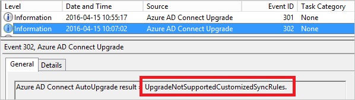

<properties
   pageTitle="Azure AD-verbinden: Automatische Aktualisierung | Microsoft Azure"
   description="In diesem Thema werden die integrierte automatische Upgrade-Funktion in Azure AD verbinden synchronisieren."
   services="active-directory"
   documentationCenter=""
   authors="AndKjell"
   manager="femila"
   editor=""/>

<tags
   ms.service="active-directory"
   ms.devlang="na"
   ms.topic="article"
   ms.tgt_pltfrm="na"
   ms.workload="identity"
   ms.date="08/24/2016"
   ms.author="billmath"/>

# Azure AD-verbinden: Automatische Aktualisierung
Diese Funktion wurde mit Build 1.1.105.0 (veröffentlicht Februar 2016) eingeführt werden.

## (Übersicht)
Sicherstellen, dass Ihre Installation Azure AD Verbinden immer auf dem neuesten Stand ist war nie mit der Funktion für die **Automatische Aktualisierung** . Dieses Feature ist standardmäßig für express-Installationen aktiviert und DirSync aktualisiert. Wenn Sie eine neue Version veröffentlicht wird, wird die Installation automatisch aktualisiert.

Automatische Aktualisierung aktiviert ist standardmäßig für Folgendes:

- Express-Einstellungen-Installation und Dirsync-Upgrades.
- Mit SQL Express LocalDB ist das, was immer Express-Einstellungen verwenden. DirSync mit SQL Express auch LocalDB verwendet werden.
- Das AD-Konto wird Standard MSOL_ Express-Einstellungen und DirSync erstellt.
- Haben Sie weniger als 100.000 Objekte im Metaverse.

Der aktuelle Status der automatischen Aktualisierung kann angezeigt werden, mit der PowerShell-Cmdlet `Get-ADSyncAutoUpgrade`. Es weist die folgenden Zustände:

Bundesstaat | Kommentar
---- | ----
Aktiviert | Automatische Aktualisierung aktiviert ist.
Unterbrochen | Durch das System nur festgelegt. Das System ist nicht mehr berechtigt automatische Upgrades zu erhalten.
Deaktiviert | Automatische Aktualisierung deaktiviert ist.

Sie können ändern, zwischen **aktiviert** und **deaktiviert** mit `Set-ADSyncAutoUpgrade`. Nur das System sollte den Status **angehalten**festgelegt.

Automatische Aktualisierung ist Azure AD verbinden Gesundheit für das Upgrade Infrastruktur verwenden. Automatische Aktualisierung arbeiten Vergewissern Sie sich, dass Sie die URLs auf dem Proxyserver für **Azure AD verbinden Gesundheit** geöffnet haben wie in [Office 365-URLs und IP-Adressbereiche](https://support.office.com/article/Office-365-URLs-and-IP-address-ranges-8548a211-3fe7-47cb-abb1-355ea5aa88a2)erläutert.

Wenn die **Synchronisierung Dienst-Manager** Benutzeroberfläche auf dem Server ausgeführt wird, ist das Upgrade erst nach dem Schließen der Benutzeroberfläche angehalten.

## Behandlung von Problemen
Wenn Ihre Installation Verbinden nicht selbst aktualisieren wie erwartet, klicken Sie dann gehen Sie folgendermaßen vor um herauszufinden, was geklappt werden konnte.

Zunächst erwarten nicht, dass die automatische Aktualisierung in den ersten Tag versucht, die, den eine neue Version veröffentlicht wird. Es gibt einer beabsichtigt Zufälligkeit vor der Aktualisierung ist, sodass keine alarmiert werden, wenn Ihre Installation sofort aktualisiert nicht zur Verfügung.

Wenn Sie denken, etwas ist nicht richtig, klicken Sie dann zum ersten Mal starten `Get-ADSyncAutoUpgrade` um sicherzustellen, dass automatische Aktualisierung aktiviert ist.

Stellen Sie sicher, dass Sie die erforderlichen URLs in Ihren Proxy oder die Firewall geöffnet haben. Automatische Aktualisierung ist Azure AD verbinden Gesundheit verwenden, wie in der [Übersicht](#overview)beschrieben. Wenn Sie einen Proxy verwenden, stellen Sie sicher, dass Gesundheit konfiguriert wurde, um einen [Proxyserver](active-directory-aadconnect-health-agent-install.md#configure-azure-ad-connect-health-agents-to-use-http-proxy)verwenden. Testen Sie auch die [Gesundheit Konnektivität](active-directory-aadconnect-health-agent-install.md#test-connectivity-to-azure-ad-connect-health-service) mit Azure AD.

Mit der Verbindung zu Azure AD überprüft werden soll ist es Zeit, näher zu untersuchen der Eventlogs. Starten Sie die Ereignisanzeige und in der **Anwendung** Ereignisprotokoll sehen. Einen Ereignisprotokoll für die Quelle **Azure AD Upgrade verbinden** und das Ereignis Id Bereich **300-399**hinzufügen.  
  

Sie sehen jetzt die Eventlogs der Status für die automatische Aktualisierung zugeordnet.  
  

Der Ergebniscode enthält ein Präfix mit Übersicht über den Status.

Ergebnis Codepräfix | Beschreibung
--- | ---
Erfolg | Die Installation wurde erfolgreich durchgeführt.
UpgradeAborted | Eine temporäre Bedingung beendet das Upgrade an. Erneut wiederholt werden soll, und der Annahme ist, dass sie später erfolgreich ist.
UpgradeNotSupported | Das System verfügt über eine Konfiguration, die Blockieren des Systems automatisch aktualisiert. Es wird wiederholt um festzustellen, ob der Status ändert sich, aber der Annahme ist, dass das System manuell aktualisiert werden muss.

Hier ist eine Liste der am häufigsten verwendeten Nachrichten, die Sie suchen nach ein. Es werden alle nicht aufgelistet, aber die Ergebnisnachricht sollten deaktivieren mit was das Problem ist.

Ergebnisnachricht | Beschreibung
--- | ---
**UpgradeAborted** |
UpgradeAbortedCouldNotSetUpgradeMarker | In der Registrierung konnte nicht geschrieben werden.
UpgradeAbortedInsufficientDatabasePermissions | Berechtigungen für die Datenbank keinen integrierten Gruppe der Administratoren. Aktualisieren Sie manuell auf die neueste Version von Azure AD verbinden, um dieses Problem zu beheben.
UpgradeAbortedInsufficientDiskSpace | Es ist nicht genügend Speicherplatz, ein Upgrade unterstützen.
UpgradeAbortedSecurityGroupsNotPresent | Konnte nicht suchen und beheben alle Sicherheitsgruppen, die vom Synchronisierungsmodul.
UpgradeAbortedServiceCanNotBeStarted | **Microsoft Azure AD synchronisieren** NT-Dienst konnte nicht gestartet werden.
UpgradeAbortedServiceCanNotBeStopped | Fehler bei der NT-Dienst **Microsoft Azure-Active Directory-Synchronisierung** beenden
UpgradeAbortedServiceIsNotRunning | **Microsoft Azure AD synchronisieren** NT-Dienst wird nicht ausgeführt.
UpgradeAbortedSyncCycleDisabled | Die Option SyncCycle in der [Scheduler](active-directory-aadconnectsync-feature-scheduler.md) wurde deaktiviert.
UpgradeAbortedSyncExeInUse | Der [Dienst-Manager Benutzeroberfläche für die Synchronisierung](active-directory-aadconnectsync-service-manager-ui.md) ist auf dem Server geöffnet.
UpgradeAbortedSyncOrConfigurationInProgress | Der Installationsassistent wird ausgeführt, oder eine Synchronisierung außerhalb der Scheduler geplant wurde.
**UpgradeNotSupported** |
UpgradeNotSupportedCustomizedSyncRules | Sie haben Ihre eigenen benutzerdefinierten Regeln an der Konfiguration hinzugefügt.
UpgradeNotSupportedDeviceWritebackEnabled | Sie haben das [Gerät abgeschlossenen writebackvorgängen](active-directory-aadconnect-feature-device-writeback.md) Feature aktiviert.
UpgradeNotSupportedGroupWritebackEnabled | Sie haben das [Gruppe abgeschlossenen writebackvorgängen](active-directory-aadconnect-feature-preview.md#group-writeback) Feature aktiviert.
UpgradeNotSupportedInvalidPersistedState | Die Installation ist keiner Express-Einstellungen oder eines Upgrades DirSync.
UpgradeNotSupportedMetaverseSizeExceeeded | Sie verfügen über 100.000 Objekte im Metaverse.
UpgradeNotSupportedMultiForestSetup | Sie sind mit mehr als einer Gesamtstruktur verbinden. Express-Setup wird nur mit einer Gesamtstruktur verbunden.
UpgradeNotSupportedNonLocalDbInstall | Sie sind keine SQL Server Express LocalDB Datenbank verwenden.
UpgradeNotSupportedNonMsolAccount | Das [AD-Connector-Konto](active-directory-aadconnect-accounts-permissions.md#active-directory-account) ist nicht mehr MSOL_ Standardkonto.
UpgradeNotSupportedStagingModeEnabled | Der Server wird festgelegt, [das staging Modus](active-directory-aadconnectsync-operations.md#staging-mode)sein.
UpgradeNotSupportedUserWritebackEnabled | Sie haben das [Benutzer abgeschlossenen writebackvorgängen](active-directory-aadconnect-feature-preview.md#user-writeback) Feature aktiviert.

## Nächste Schritte
Erfahren Sie mehr über die [Integration von Ihrem lokalen Identitäten mit Azure Active Directory](active-directory-aadconnect.md).
