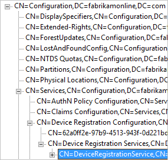

<properties
    pageTitle="Azure AD-verbinden: Aktivieren Gerät abgeschlossenen writebackvorgängen | Microsoft Azure"
    description="Dieses Dokument enthält Informationen zum Gerät abgeschlossenen writebackvorgängen Azure AD-Verbinden mit aktivieren"
    services="active-directory"
    documentationCenter=""
    authors="billmath"
    manager="femila"
    editor="curtand"/>

<tags
    ms.service="active-directory"  
    ms.workload="identity"
    ms.tgt_pltfrm="na"
    ms.devlang="na"
    ms.topic="article"
    ms.date="08/29/2016"
    ms.author="billmath"/>

# Azure AD-verbinden: Aktivieren Gerät abgeschlossenen writebackvorgängen

>[AZURE.NOTE] Ein Azure AD Premium-Abonnement ist für Gerät abgeschlossenen writebackvorgängen erforderlich.

Die folgende Dokumentation enthält Informationen zum Aktivieren des Geräts abgeschlossenen writebackvorgängen Features in Azure AD-Verbindung herstellen. Gerät abgeschlossenen Writebackvorgängen wird in den folgenden Szenarien verwendet:

- Bedingte basierend auf Geräten ADFS Zugriff aktivieren (2012 R2 oder höher) geschützten Applikationen (sich verlassen Partei Vertrauensstellungen).

Dies bietet zusätzliche Sicherheit und Assurance, der Zugriff auf Programme nur für vertrauenswürdige Geräte gewährt wird. Weitere Informationen zu bedingter Access finden Sie unter [Verwalten von Risiken mit bedingten Zugriff](active-directory-conditional-access.md) und [Einrichten von lokalen bedingten Zugriff mit Azure Active Directory-Gerät Registrierung](https://msdn.microsoft.com/library/azure/dn788908.aspx).

>[AZURE.IMPORTANT]
<li>Geräte müssen in der gleichen Struktur wie die Benutzer befinden. Da Geräte wieder in eine einzige Gesamtstruktur geschrieben werden müssen, unterstützt dieses Feature nicht aktuell eine Bereitstellung mit mehreren Benutzergesamtstrukturen.</li>
<li>Lokalen Active Directory-Struktur kann nur ein Gerät Registrierung Konfigurationsobjekt hinzugefügt werden. Dieses Feature ist nicht mit einer Stelle, an der lokalen Active Directory, auf mehrere Azure AD-Verzeichnisse synchronisiert wird Suchtopologie kompatibel.</li>

## Teil 1: Installieren Azure AD verbinden
1. Installieren von Azure AD Verbinden mit benutzerdefinierten oder Express-Einstellungen. Microsoft empfiehlt zunächst alle Benutzer und Gruppen erfolgreich synchronisiert, bevor Sie Gerät abgeschlossenen writebackvorgängen aktivieren.

## Teil 2: Vorbereiten von Active Directory
Gehen Sie folgendermaßen vor, um Vorbereiten der Verwendung von Gerät abgeschlossenen writebackvorgängen.

1.  Starten Sie auf dem Computer, auf dem Azure AD verbinden installiert ist PowerShell im erweiterten Modus.

2.  Wenn das Active Directory-PowerShell-Modul nicht installiert ist, installieren Sie es mit dem folgenden Befehl aus:

    `Install-WindowsFeature –Name AD-Domain-Services –IncludeManagementTools`

3. Wenn es sich bei das Azure-Active Directory-PowerShell-Modul nicht installiert ist, klicken Sie dann herunter, und installieren Sie es aus [Azure Active Directory-Modul für Windows PowerShell (64-Bit-Version)](http://go.microsoft.com/fwlink/p/?linkid=236297). Diese Komponente hat eine Abhängigkeit zu der-Anmeldeassistenten, die mit Azure AD verbinden installiert wird.

4.  Enterprise-Administrator-Anmeldeberechtigungen führen Sie die folgenden Befehle und beenden Sie dann PowerShell.

    `Import-Module 'C:\Program Files\Microsoft Azure Active Directory Connect\AdPrep\AdSyncPrep.psm1'`

    `Initialize-ADSyncDeviceWriteback {Optional:–DomainName [name] Optional:-AdConnectorAccount [account]}`

Enterprise-Administrator-Anmeldeberechtigungen sind erforderlich, da Änderungen an der Konfiguration Namespace erforderlich sind. Ein Domänenadministrator wird nicht genügend Berechtigungen verfügen.

Beschreibung:

- Wenn sie noch nicht vorhanden sind, erstellt und neuen Container und Objekte unter CN konfiguriert = Gerät Registrierung Konfiguration, CN = Dienste, CN = Konfiguration, [Gesamtstruktur-dn].
- Wenn sie noch nicht vorhanden sind, erstellt und neuen Container und Objekte unter CN konfiguriert = RegisteredDevices, [Domäne-dn]. Geräteobjekte werden in diesem Container erstellt.
- Legt erforderlichen Berechtigungen auf die Azure AD-Connector-Konto Ihrer Active Directory-Geräte verwalten.
- Nur muss in eine Struktur, ausführen, auch wenn Azure AD verbinden auf mehrere Gesamtstrukturen installiert wird.

Parameter:

- Domänenname: Active Directory-Domäne, wo Geräteobjekte erstellt werden soll. Hinweis: Alle Geräte für einen angegebenen Active Directory-Struktur werden in einer einzelnen Domäne erstellt werden.
- AdConnectorAccount: Active Directory-Konto, das zum Verwalten von Objekten im Verzeichnis von Azure AD verbinden verwendet werden. Dies ist das Konto von Azure AD verbinden synchronisieren verwendet, um die Verbindung mit Active Directory. Wenn Sie installiert haben, express-Einstellungen verwenden, empfiehlt es sich um das Konto, mit dem Präfix MSOL_.

## Teil 3: Aktivieren Gerät abgeschlossenen writebackvorgängen in Azure AD-Verbindung herstellen
Gehen Sie folgendermaßen vor, Gerät abgeschlossenen writebackvorgängen in Azure AD verbinden aktivieren.

1.  Führen Sie den Installationsassistenten erneut aus. Wählen Sie auf der Seite zusätzliche Aufgaben **Anpassen von Optionen für die Synchronisierung** aus, und klicken Sie auf **Weiter**.

2.  Auf der Seite optionale Features werden Gerät abgeschlossenen writebackvorgängen nicht mehr abgeblendet sein. Bitte wird Beachten Sie, dass wenn Azure AD verbinden vorbereitende Schritte nicht abgeschlossenen Gerät abgeschlossenen writebackvorgängen sind Verkleinern der Seite optionale Features abgeblendet sein. Aktivieren Sie das Kontrollkästchen für das Gerät abgeschlossenen writebackvorgängen, und klicken Sie auf **Weiter**. Wenn das Kontrollkästchen immer noch deaktiviert ist, finden Sie im [Abschnitt Problembehandlung](#the-writeback-checkbox-is-still-disabled)aus.

3.  Klicken Sie auf der Seite abgeschlossenen writebackvorgängen sehen Sie die angegebene Domäne als die standardmäßige Gerät abgeschlossenen writebackvorgängen Gesamtstruktur.

4.  Führen Sie die Installation des Assistenten mit keine zusätzliche Konfiguration Änderungen an. Falls erforderlich, schlagen Sie in [benutzerdefinierte Installation von Azure AD verbinden.](./connect/active-directory-aadconnect-get-started-custom.md)

## Aktivieren von bedingten Zugriff
Ausführliche Anweisungen zum Aktivieren dieses Szenarios sind innerhalb der [Einrichtung lokalen bedingten Zugriff mit Azure Active Directory-Gerät Registrierung](https://msdn.microsoft.com/library/azure/dn788908.aspx)verfügbar.

## Stellen Sie sicher, dass Geräte mit Active Directory synchronisiert werden
Gerät abgeschlossenen writebackvorgängen sollte jetzt ordnungsgemäß funktionieren. Achten Sie darauf, dass es bis zu 3 Stunden für Geräteobjekte geschrieben zurück in AD werden kann.  Um den Besitz Ihrer Geräte ordnungsgemäß synchronisiert werden, gehen Sie nach Abschluss die Synchronisierung von Regeln:

1.  Active Directory Administrative Center zu starten.
2.  Erweitern Sie RegisteredDevices, innerhalb der Domäne, die gerade verbunden ist.

3.  Es werden aktuelle registrierten Geräte aufgelistet.

## Behandlung von Problemen

### Das Kontrollkästchen abgeschlossenen writebackvorgängen ist immer noch deaktiviert.
Wenn Sie das Kontrollkästchen Gerät abgeschlossenen writebackvorgängen nicht aktiviert ist, obwohl Sie die oben aufgeführten Schritte ausgeführt haben, die folgenden Schritte führt Sie durch was, der Assistenten zum Installieren überprüft werden, bevor das Kontrollkästchen aktiviert ist.

Wichtigste ersten:

- Stellen Sie sicher, dass mindestens eine Gesamtstruktur Windows Server 2012R2 weist. Der Gerät Objekttyp muss vorhanden sein.
- Wenn der Assistent zum Installieren bereits ausgeführt wird, werden alle Änderungen nicht erkannt werden. In diesem Fall schließen Sie den Installationsassistenten, und führen Sie es erneut aus.
- Stellen Sie sicher, dass das Konto ein, geben Sie in das Initialisierungsskript ein, tatsächlich den richtigen Benutzer von Active Directory Connector verwendet wird. Gehen Sie folgendermaßen vor, um dies zu überprüfen:
    - Öffnen Sie über das Startmenü **Synchronisierungsdiensts**ein.
    - Öffnen Sie die Registerkarte **Verbinder** .
    - Suchen nach der Verbinder mit Typ Active Directory-Domänendiensten, und wählen Sie ihn aus.
    - Klicken Sie unter **Aktionen**wählen Sie **Eigenschaften**aus.
    - Wechseln Sie zu **Verbinden mit Active Directory-Gesamt**. Stellen Sie sicher, dass die Domäne und den Namen dieser Bildschirm Übereinstimmung das Konto bereitgestellt, um das Skript angegeben.

Überprüfen Sie die Konfiguration in Active Directory:
- Stellen Sie sicher, dass das Gerät Registration Service in den folgenden Speicherort befindet (CN = DeviceRegistrationService, CN Gerät Registrierungsdienste, CN = Gerät Registrierung Konfiguration, CN = Dienste, CN = = Konfiguration) unter dem Konfigurationsnamenskontext.

- Stellen Sie sicher, dass es ist nur eine Konfigurationsobjekt durch die Konfiguration Namespace suchen. Wenn mehr als einmal vorhanden ist, löschen Sie das Duplikat aus.

- Das Objekt Gerät Registration Service Vergewissern Sie sich das Attribut MsDS-DeviceLocation vorhanden ist, und hat einen Wert. Nachschlagen diesem Speicherort und stellen Sie sicher, dass sie vorhanden ist mit der Objekttyp MsDS-DeviceContainer.

- Stellen Sie sicher, dass das Konto, das Active Directory-Connector verwendet auf den Geräten registriert Container gefunden werden, indem Sie im vorherigen Schritt erforderlichen Berechtigungen verfügt. Dies ist die erwarteten Berechtigungen für diesen Container:

- Überprüfen das Active Directory-Konto verfügt über Berechtigungen für den CN Gerät Registrierung Konfiguration, CN = = Dienste, CN = Konfigurationsobjekt.

## Weitere Informationen
- [Verwalten von Risiken mit bedingten Zugriff](active-directory-conditional-access.md)
- [Einrichten von lokalen bedingten Zugriff mit Azure Active Directory-Gerät Registrierung](https://msdn.microsoft.com/library/azure/dn788908.aspx)

## Nächste Schritte
Erfahren Sie mehr über die [Integration von Ihrem lokalen Identitäten mit Azure Active Directory](active-directory-aadconnect.md).
