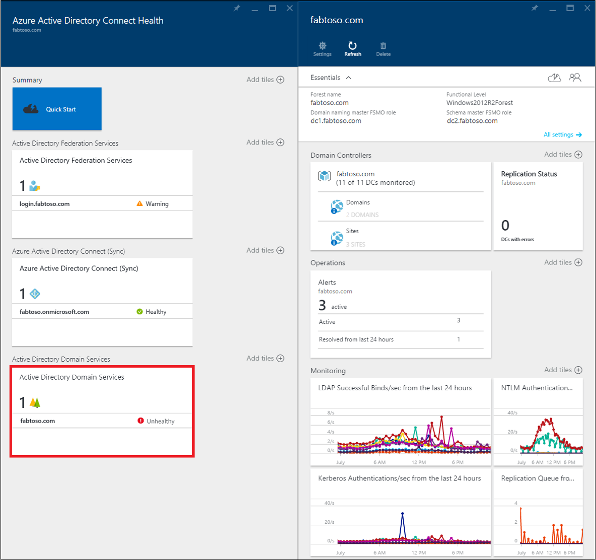
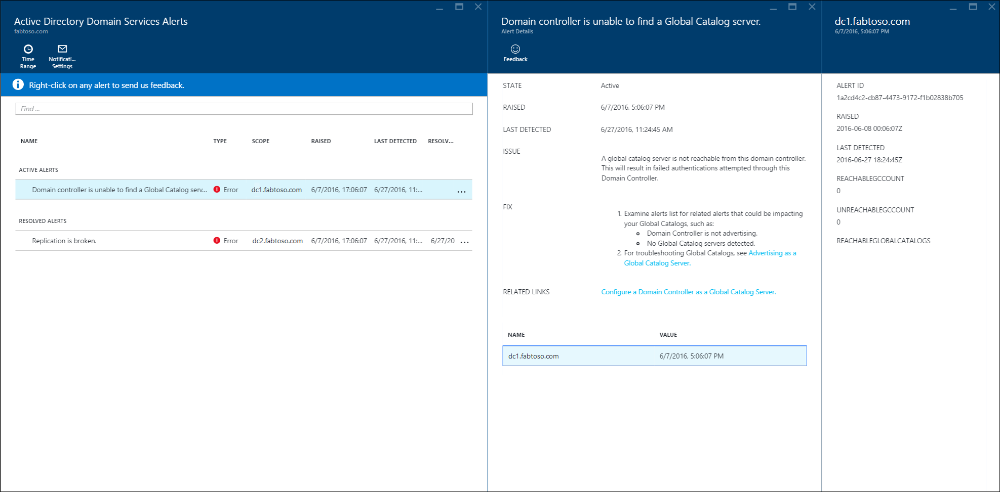
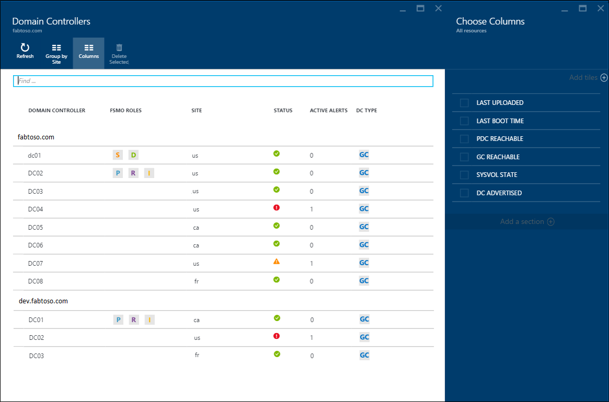
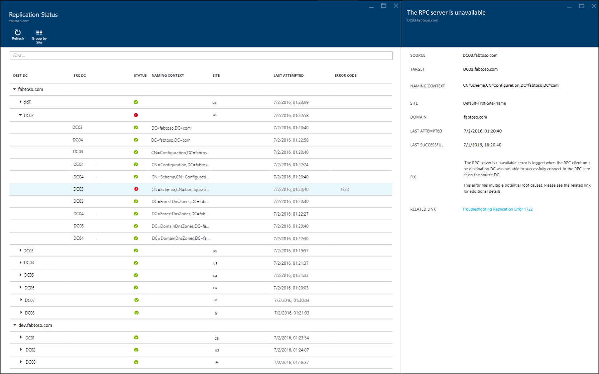
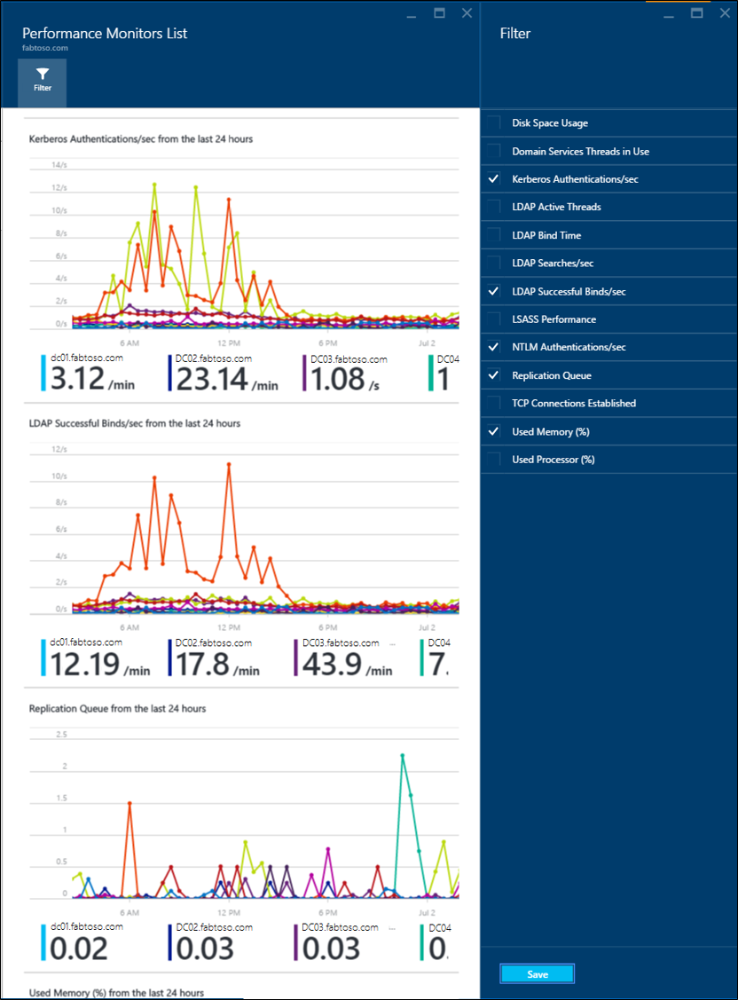

<properties
    pageTitle="Azure AD-Dienststatus in AD DS verbinden | Microsoft Azure"
    description="Dies ist der Azure AD verbinden Dienststatus-Seite, die von AD DS überwachen erläutert werden."
    services="active-directory"
    documentationCenter=""
    authors="arluca"
    manager="samueld"
    editor="curtand"/>

<tags
    ms.service="active-directory"
    ms.workload="identity"
    ms.tgt_pltfrm="na"
    ms.devlang="na"
    ms.topic="get-started-article"
    ms.date="10/18/2016"
    ms.author="arluca"/>

# Azure AD-Dienststatus in AD DS verbinden
Die folgende Dokumentation ist speziell für die Überwachung von Active Directory-Domänendiensten mit Azure AD verbinden Dienststatus. Die folgenden unterstützten Versionen von AD DS: Windows Server 2008 R2, Windows Server 2012 und Windows Server 2012 R2.

Weitere Informationen zum Überwachen von AD FS mit Azure AD verbinden Dienststatus finden Sie unter [Verwenden Azure AD Gesundheit Verbinden mit AD FS](active-directory-aadconnect-health-adfs.md). Weitere Informationen zum Überwachen der Azure AD verbinden (synchronisieren) mit Azure AD verbinden Gesundheit finden Sie darüber hinaus [Mithilfe von Azure AD verbinden Gesundheit für synchronisieren](active-directory-aadconnect-health-sync.md).

## Verbinden von Benachrichtigungen für Azure AD Gesundheit für AD DS
Im Abschnitt Benachrichtigungen in Azure AD verbinden Gesundheit für AD DS, bietet Ihnen eine Liste der aktiven und gelöst Benachrichtigungen, die im Zusammenhang mit Ihrer Domänencontroller. Auswählen einer Benachrichtigung aktiven oder gelöst öffnet einen neuen Blade mit zusätzlichen Informationen sowie Lösungsschritten, und links zu unterstützenden Dokumentation. Jeder Benachrichtigung Typ kann eine oder mehrere Instanzen verfügen, die die Domänencontroller auswirken, die bestimmte Benachrichtigung entsprechen. Im unteren Bereich des Benachrichtigungssounds Blades können Sie einen betroffenen Domänencontroller zum Öffnen einer zusätzlichen Blade mit Weitere Details zu benachrichtigen Instanz doppelklicken.

Innerhalb dieser Blade können Sie e-Mail-Benachrichtigungen für Benachrichtigungen aktivieren und ändern in der Ansicht des Zeitraums. Erweitern des Zeitraums, können Sie vorherige gelöst Benachrichtigungen finden Sie unter.

## Domänencontroller Dashboard
Diese Dashboard bietet eine topologische Ansicht Ihrer Umgebung in Verbindung mit wichtigen Betrieb Kriterien und Integritätsstatus der einzelnen Ihrer überwachten Domänencontroller. Die präsentierten Kennzahlen helfen Ihnen dabei, um schnell zu identifizieren, eine Domänencontroller, die möglicherweise untersucht werden müssen. Standardmäßig wird nur eine Teilmenge der Spalten angezeigt. Jedoch können Sie den ganzen Satz von Verfügbare Spalten durch Doppelklicken auf den Befehl Spalten suchen. Auswählen der Spalten, die Ihnen besonders schaltet dieses Dashboard in einem einzigen und einfach zu platzieren wichtig, um die Integrität Ihrer AD DS-Umgebung anzuzeigen.

Domänencontroller können, indem Sie die jeweilige Domäne oder eine Website, die Sie zum Verständnis der Suchtopologie-Umgebung, die gruppiert werden. Wenn Sie die Kopfzeile Blade doppelklicken, maximiert das Dashboard schließlich um verfügbar – Platz auf dem Bildschirm zu nutzen. Diese Ansicht vergrößern ist hilfreich, wenn mehrere Spalten angezeigt werden.

## Replikation Status Dashboard
In diesem Dashboard bietet einen Überblick über den Replikationsstatus und Replikation Suchtopologie Ihrer überwachten Domäne Controller. Der Status des letzten Replikationsversuchs wird zusammen mit hilfreich Dokumentation für alle Fehler aufgeführt, die gefunden wird. Sie können einen Domänencontroller ein Fehler auftritt, um eine neue Blade wie mit Informationen zu öffnen doppelklicken: Details zu dem Fehler, Lösungsschritten und Links zur Problembehandlung in der Dokumentation empfohlen.

## Für die Überwachung
Dieses Feature ermöglicht grafisch Trends unterschiedliche Performance Indikatoren, die aus jeder der überwachten Domänencontroller kontinuierlich zusammengestellt sind. Leistung von einer Domänencontroller kann einfach über alle anderen überwachten Domänencontroller in Ihrer Gesamtstruktur verglichen werden. Darüber hinaus können Sie verschiedene Performance-Zähler nebeneinander anzeigen, welche ist hilfreich bei der Behandlung von Problemen in Ihrer Umgebung.

Standardmäßig haben wir vier Leistungsindikatoren bereits ausgewählt; Allerdings können Sie andere durch Klicken auf den Filterbefehl und aktivieren oder deaktivieren alle gewünschten Leistungsindikatoren enthalten. Darüber hinaus können Sie ein Diagramm Leistung Zähler, um eine neue Blade, öffnen, in der Datenpunkte für jede der überwachten Domänencontroller enthält doppelklicken.

## Links zu verwandten Themen

* [Azure AD verbinden Dienststatus](active-directory-aadconnect-health.md)
* [Azure AD verbinden Health Agent-Installation](active-directory-aadconnect-health-agent-install.md)
* [Azure AD verbinden Gesundheit Vorgänge](active-directory-aadconnect-health-operations.md)
* [Azure AD-Dienststatus mit AD FS verbinden](active-directory-aadconnect-health-adfs.md)
* [Mithilfe von Azure AD verbinden Gesundheit für synchronisieren](active-directory-aadconnect-health-sync.md)
* [Azure AD verbinden Gesundheit häufig gestellte Fragen](active-directory-aadconnect-health-faq.md)
* [Azure AD verbinden Versionsverlauf Dienststatus](active-directory-aadconnect-health-version-history.md)
