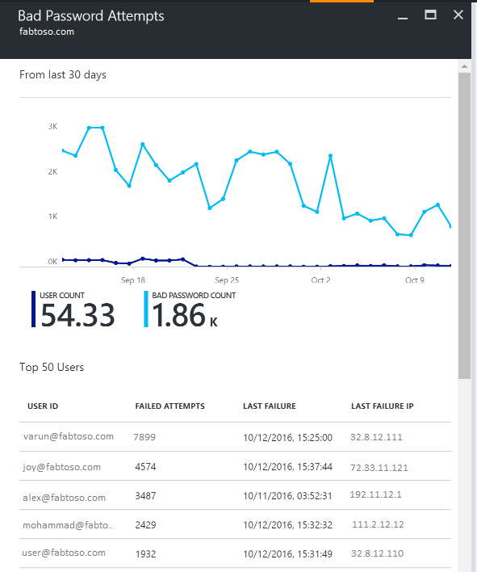

<properties
    pageTitle="Azure AD-Dienststatus mit AD FS verbinden | Microsoft Azure"
    description="Dies ist die Azure AD verbinden Dienststatus-Seite zum Überwachen der lokalen AD FS-Infrastruktur."
    services="active-directory"
    documentationCenter=""
    authors="karavar"
    manager="samueld"
    editor="curtand"/>

<tags
    ms.service="active-directory"
    ms.workload="identity"
    ms.tgt_pltfrm="na"
    ms.devlang="na"
    ms.topic="get-started-article"
    ms.date="10/18/2016"
    ms.author="vakarand"/>

# Azure AD-Dienststatus mit AD FS verbinden
Die folgende Dokumentation ist speziell für die Überwachung Ihrer AD FS-Infrastruktur mit Azure AD verbinden Dienststatus. Weitere Informationen zum Überwachen von Azure AD verbinden (synchronisieren) mit Azure AD verbinden Gesundheit finden Sie unter [Verwenden Azure AD verbinden Gesundheit für synchronisieren](active-directory-aadconnect-health-sync.md). Darüber hinaus Informationen zum Überwachen von Active Directory-Domänendiensten mit Azure AD verbinden Dienststatus finden Sie unter [Verwenden Azure AD Gesundheit Verbinden mit AD DS](active-directory-aadconnect-health-adds.md).

## Benachrichtigungen für AD FS
Im Abschnitt Azure AD verbinden Gesundheit Benachrichtigungen enthält eine Liste der aktiven Benachrichtigungen. Jede Warnung enthält relevante Informationen, Lösungsschritten und Links zu verwandter Dokumentation.

Sie können eine Benachrichtigung aktive oder gelöst, um eine neue Blade mit zusätzlichen Informationen Schritte zu öffnen, die Sie, zum Beheben der Warnung, und klicken Sie auf Links auf relevante Dokumentation ergreifen können doppelklicken. Sie können auch zurückliegende Daten auf Benachrichtigungen anzeigen, die in der Vergangenheit gelöst wurden.

## Nutzungsanalysen für AD FS
Azure AD verbinden Gesundheit Nutzungsanalysen analysiert den Authentifizierungsdatenverkehr Föderation-Servern. Sie können im Feld Verwendung Analytics um die Verwendung Analytics Blade, öffnen, in dem Sie verschiedene Kennzahlen und Gruppierungen zeigt doppelklicken.

>[AZURE.NOTE] Um Nutzungsanalysen mit AD FS verwenden zu können, müssen Sie sicherstellen, dass AD FS Überwachung aktiviert ist. Weitere Informationen finden Sie unter [Für AD FS Überwachung aktivieren](active-directory-aadconnect-health-agent-install.md#enable-auditing-for-ad-fs).

Weitere Kennzahlen auswählen, geben Sie einen Zeitraum oder die Gruppierung zu ändern, mit der rechten Maustaste auf das Verwendung Analytics-Diagramm, und wählen Sie Diagramm bearbeiten. Klicken Sie dann können Sie den Zeitraum angeben, wählen Sie aus einer anderen Metrik und ändern Sie die Gruppierung. Die Verteilung des Authentifizierungsdatenverkehrs basierend auf unterschiedliche "Maße" anzeigen können und jede Metrik mit relevanten "Gruppieren nach" Parameter in der folgenden Tabelle beschriebenen gruppiert werden:

| Metrisch | Gruppieren nach | Welche die Gruppierung bedeutet und warum es sinnvoll ist? |
| ------ | -------- | -------------------------------------------- |
| Summe anfordert: Die Gesamtzahl der Besprechungsanfragen, die vom Dienst Föderation verarbeitet | Alle | Zeigt die Anzahl der Gesamtzahl der Anfragen ohne Gruppierung an. |
|  | Anwendung | Gruppiert die Anfragen insgesamt basierend auf den zielgerichteten Identitätsempfänger. Diese Gruppierung eignet sich zu verstehen, welche Anwendung wie viel Prozent des gesamten Datenverkehrs empfängt. |
|  | Server | Gruppiert die Anfragen insgesamt basierend auf dem Server, der die Anforderung verarbeitet. Diese Gruppierung ist sinnvoll, die Verteilung Laden des gesamten Datenverkehrs zu verstehen. |
|  | Arbeitsplatz-Verknüpfung | Gruppiert die Anfragen insgesamt basierend auf, ob sie von Geräten stammen, die Arbeitsplatz beigetreten sind (bezeichnet). Diese Gruppierung eignet sich zu verstehen, wenn Ihre Ressourcen zugegriffen werden mit Geräten, die die Identitätsinfrastruktur unbekannt sind. |
|  | Authentifizierungsmethode | Gruppiert die Anfragen insgesamt basierend auf der Authentifizierungsmethode für die Authentifizierung verwendet. Diese Gruppierung eignet sich für die gemeinsame Authentifizierungsmethode zu verstehen, die für die Authentifizierung verwendet wird. Folgenden sind die möglichen Authentifizierungsmethoden <ol> <li>Windows-Authentifizierung (Windows)</li> <li>Formularbasierte Authentifizierung (Forms)</li> <li>SSO (einmaliges Anmelden)</li> <li>X509 Zertifikat Authentifizierung (Zertifikat)</li>  Wenn die Föderation-Server die Anfrage mit einem SSO Cookie erhalten, wird die Anforderung als SSO (Single Sign On) gezählt. In diesem Fall ist das Cookie gültig ist, der Benutzer ist nicht für die Anmeldeinformationen aufgefordert und nahtlose Zugriff auf die Anwendung erhält. Dieses Verhalten unterscheidet allgemeine, wenn Sie mehrere Identitätsempfänger durch den Servern Föderation geschützt haben. |
|  | Speicherort im Netzwerk | Gruppiert die Anfragen insgesamt basierend auf den Speicherort im Netzwerk des Benutzers an. Sie können entweder Intranet werden oder extranet. Diese Gruppierung ist sinnvoll, wissen, welchem Prozentwert des Datenverkehrs im Intranet und extranet stammt. |
| Anfragen für insgesamt fehlgeschlagen: Die Gesamtzahl Fehler bei der Föderation Dienst verarbeiteten Anfragen   (Diese Metrik ist nur verfügbar, auf dem AD FS für Windows Server 2012 R2)| Fehlertyp | Zeigt die Anzahl der Fehler basierend auf vordefinierten Fehlertypen an. Diese Gruppierung ist sinnvoll, die allgemeinen Fehlertypen zu verstehen. <ul><li>Falsche Benutzernamen oder Kennwort: Fehler aufgrund von falschen Benutzernamen oder Kennwort.</li> <li>"Extranet Sperrung": Fehler aufgrund der Anfragen erhalten von einem Benutzer, die von extranet gesperrt wurde </li><li> "Kennwort abgelaufen": Fehler aufgrund von Benutzern zur Anmeldung mit einem abgelaufenen Kennwort.</li><li>"Konto deaktiviert": Fehler aufgrund von Benutzern zur Anmeldung mit einem deaktivierten Konto.</li><li>"Geräteauthentifizierung": Fehler aufgrund Benutzer authentifizieren Authentifizierung Gerät mit weiß nicht.</li><li>"Benutzerauthentifizierung Zertifikat": Fehler aufgrund der Benutzer weiß nicht, da ein ungültiges Zertifikat authentifizieren.</li><li>"MFA": Fehler aufgrund der Benutzer weiß nicht authentifizieren mit kombinierte Authentifizierung.</li><li>"Andere Anmeldeinformationen": "Emission Autorisierung": Fehler aufgrund fehlgeschlagener Autorisierung.</li><li>"Emission Delegation": Fehler aufgrund Emission Delegation Fehler.</li><li>"Annahme token": Fehler aufgrund von ADFS das Token aus einer Drittanbieter-Identitätsanbieter ablehnen.</li><li>"Protokoll": Fehler aufgrund von Protokollfehlern.</li><li>"Unbekannt": Alle erfassen. Alle anderen Fehler, die nicht in den definierten Kategorien passen.</li> |
|  | Server | Gruppen Fehler basierend auf dem Server. Diese Gruppierung ist sinnvoll, die Verteilung Fehler auf Servern zu verstehen. Ungleiche Verteilung könnte ein Indikator eines Servers in einem fehlerhaften Zustand. |
|  | Speicherort im Netzwerk | Gruppen Fehler basierend auf den Speicherort im Netzwerk Anfragen (Intranet-und im Vergleich extranet). Diese Gruppierung ist sinnvoll, den Typ der Anfragen zu verstehen, die weiß nicht, sind. |
|  | Anwendung | Gruppiert die Fehler basierend auf der Gezielte Anwendung (Identitätsempfänger). Diese Gruppierung eignet sich zu verstehen, welche Gezielte Anwendung die meisten Anzahl der Fehler angezeigt wird. |
| Anzahl der Benutzer: Durchschnittliche Anzahl der eindeutigen Benutzer im System aktiv | Alle | Diese Metrik stellt die durchschnittliche Anzahl der Benutzer mithilfe des Diensts für die Föderation in das Segment ausgewählten Zeit. Die Benutzer werden nicht gruppiert werden.  Der Mittelwert hängt von der Zeit Segment ausgewählt. |
|  | Anwendung | Gruppiert die durchschnittliche Anzahl der Benutzer, die auf Grundlage der Gezielte Anwendung (Identitätsempfänger). Diese Gruppierung eignet sich zu verstehen, wie viele Benutzer die Anwendung verwenden. |

## Für AD FS zum Überwachen der Leistung
Azure AD verbinden Gesundheit Leistung Überwachung stellt Überwachung auf Kennzahlen. Markieren das Kontrollkästchen für die Überwachung, wird einen neuen Blade ausführliche Informationen zu den Kennzahlen geöffnet.

Wenn Sie die Filteroption am oberen Rand der Blade auswählen, können Sie vom Server an einen einzelnen Server Metrik finden Sie unter Filtern. Kennzahlen ändern, mit der rechten Maustaste auf die Überwachung Diagramm unter die Überwachung Blade, und wählen Sie Diagramm bearbeiten. Anschließend können Sie aus dem neuen Blade, die angezeigt wird, wählen Sie weitere Kriterien aus der Dropdownliste aus und geben eine Zeitspanne zum Anzeigen der Leistungsdaten an.

## Berichte für AD FS
Azure AD verbinden Gesundheit bietet Berichte über die Aktivität und Leistung von AD FS. Diese Berichte können Administratoren Einblick in Aktivitäten auf deren AD FS-Servern.

### Top 50 Benutzer mit fehlerhaften Benutzername und Kennwort Benutzernamen

Einer der häufige Gründe für eine fehlgeschlagene Authentifizierung Anforderung auf einem AD FS-Server ist eine Anforderung mit ungültigen Anmeldeinformationen, d. h., einen falschen Benutzernamen oder ein Kennwort. Für Benutzer, die aufgrund von Tippfehlern, vergessene Kennwörter oder komplexe Kennwörter in der Regel ausgeführt.

Es gibt jedoch einige andere Gründe, die eine unerwartete Anzahl von Anfragen behandelt den AD FS-Servern, z. B. führen können: eine Anwendung, die Caches Benutzeranmeldeinformationen und die Anmeldeinformationen abläuft oder ein bösartiger Benutzer versuchen, melden Sie sich bei einem Konto mit einer Reihe von bekannten Kennwörter. Diese zwei Beispiele sind gute Gründe, die zu einer Onlinediebstahl Anfragen führen können.

Azure AD verbinden Gesundheit für ADFS bietet einen Bericht zu 50 Benutzer mit fehlgeschlagener Login-Versuche aufgrund Benutzername oder Kennwort ungültig. Dieser Bericht wird durch die Verarbeitung von den AD FS-Servern in Farmen generierten Ereignisse Audit erreicht

In diesem Bericht müssen Sie den einfachen Zugriff auf die folgenden Teile der Informationen:

- Fehler beim Anfragen mit falschen Benutzername und Kennwort in den letzten 30 Tagen insgesamt
- Durchschnittliche # von Benutzern, die nicht mit einer schlechten Benutzername und Kennwort Login pro Tag.

Auf dieses Teils gelangen Sie an die Hauptbericht Blade, die zusätzliche Details enthält. Diese Blade enthält ein Diagramm beliebte Informationen zum Festlegen eines Basisplans über Anfragen mit falschen Benutzernamen oder Kennwort an. Darüber hinaus bietet es die Liste der ersten 50 Benutzer die Anzahl der Versuche.

Das Diagramm enthält die folgenden Informationen:

- Fehler beim Benutzernamen durch ein ungültiges Benutzername/Kennwort auf Basis pro Tag insgesamt.
- Die Summe # verschiedener Benutzer, die auf Basis pro Tag Benutzernamen fehlgeschlagen ist.
- Für die letzte Anforderung IP-Adresse der

Der Bericht umfasst die folgende Informationen:

| Berichtselement | Beschreibung
| ------ | -------- |
|Benutzer-ID| Zeigt die Benutzer-ID, die verwendet wurde. Dieser Wert ist, was der vom Benutzer eingegebene der in einigen Fällen wird der falsche Benutzer-ID verwendet wird.|
|Fehlgeschlagene Versuche| Zeigt die insgesamt fehlgeschlagene Versuche für die bestimmte Benutzer-ID Die Tabelle ist für die meisten der fehlgeschlagene Versuche in absteigender Reihenfolge sortiert.|
|Fehler bei der letzten| Zeigt den Zeitstempel an, wenn der letzte Fehler aufgetreten ist.
|Fehler bei der letzten IP | Zeigt die Client-IP-Adresse aus der neuesten ungültige Anforderung.|

>[AZURE.NOTE] Dieser Bericht wird automatisch aktualisiert, nachdem alle zwei Stunden mit den neuen Informationen innerhalb dieses Zeitraums gesammelt. Login-Versuche innerhalb der letzten zwei Stunden können daher nicht im Bericht enthalten sein.

## Links zu verwandten Themen

* [Azure AD verbinden Dienststatus](active-directory-aadconnect-health.md)
* [Azure AD verbinden Health Agent-Installation](active-directory-aadconnect-health-agent-install.md)
* [Azure AD verbinden Gesundheit Vorgänge](active-directory-aadconnect-health-operations.md)
* [Mithilfe von Azure AD verbinden Gesundheit für synchronisieren](active-directory-aadconnect-health-sync.md)
* [Azure AD-Dienststatus in AD DS verbinden](active-directory-aadconnect-health-adds.md)
* [Azure AD verbinden Gesundheit häufig gestellte Fragen](active-directory-aadconnect-health-faq.md)
* [Azure AD verbinden Versionsverlauf Dienststatus](active-directory-aadconnect-health-version-history.md)
