<properties
    pageTitle="Azure AD verbinden Health Agent Installation | Microsoft Azure"
    description="Dies ist der Azure AD verbinden Dienststatus-Seite, die beschreibt die Agent-Installation für AD FS und synchronisieren."
    services="active-directory"
    documentationCenter=""
    authors="karavar"
    manager="samueld"
    editor="curtand"/>

<tags
    ms.service="active-directory"
    ms.workload="identity"
    ms.tgt_pltfrm="na"
    ms.devlang="na"
    ms.topic="get-started-article"
    ms.date="10/18/2016"
    ms.author="vakarand"/>

# Azure AD verbinden Health Agent-Installation

Dieses Dokument führt Sie durch Installieren und Konfigurieren der Azure verbinden AD-Dienststatus-Agents. Sie können die Agents aus [hier](active-directory-aadconnect-health.md#download-and-install-azure-ad-connect-health-agent)herunterladen.

##  Anforderungen
In der folgenden Tabelle wird eine Liste der Voraussetzungen für die Verwendung von Azure AD verbinden Dienststatus.

| Anforderung | Beschreibung|
| ----------- | ---------- |
|Azure AD-Premium| Azure AD verbinden Gesundheit ist ein Feature Azure AD Premium und erfordert Azure AD Premium.   Weitere Informationen finden Sie unter [Erste Schritte mit Azure AD-Premium](active-directory-get-started-premium.md)  Um eine 30-Tage-Testversion beginnen möchten, finden Sie unter [Starten Sie eine Testversion.](https://azure.microsoft.com/trial/get-started-active-directory/)|
|Sie müssen ein globaler Administrator für Ihre Azure AD erste Schritte mit Azure AD verbinden Gesundheit sein.|Standardmäßig können nur globalen Administratoren installieren und konfigurieren die Integrität Agents auf Erste Schritte auf das Portal zugreifen, und führen Sie Operationen in Azure AD verbinden Dienststatus. Weitere Informationen finden Sie unter [Verwalten von Ihrem Azure AD-Verzeichnis](active-directory-administer.md).    Mit der Rolle basierend Access Control können Sie Zugriff auf Azure AD verbinden Gesundheit für andere Benutzer in Ihrer Organisation zulassen. Weitere Informationen finden Sie unter [Rolle basierend Access Control für Azure AD verbinden Dienststatus.](active-directory-aadconnect-health-operations.md#manage-access-with-role-based-access-control)   **Wichtige:** Das Konto bei der Installation von Agents verwendet, muss ein Konto geschäftlichen oder schulnotizbücher. Es nicht möglich einem Microsoft-Konto. Weitere Informationen finden Sie unter [Anmelden für Azure als einer Organisation](sign-up-organization.md)
|Der Azure AD verbinden Health Agent ist auf jedem zielgerichteten Server installiert| Azure AD verbinden Gesundheit erfordert keine Agent-Installation auf den Servern, die Daten bereitstellen, die im Portal angezeigt wird.   Um Daten aus Ihrer lokalen AD FS-Infrastruktur zu erhalten, muss der Agent beispielsweise auf den AD FS, AD FS Proxy und Web-Anwendungsproxy-Servern installiert sein. Auf ähnliche Weise zum Abrufen von Daten auf Ihrem lokalen AD DS-Infrastruktur, der Agent muss auf die Domänencontroller installiert sein.   **Wichtige:** Das Konto bei der Installation von Agents verwendet, muss ein Konto geschäftlichen oder schulnotizbücher. Es nicht möglich einem Microsoft-Konto. Weitere Informationen finden Sie unter [Anmelden für Azure als einer Organisation](sign-up-organization.md)|
|Ausgehende Verbindungen an die Endpunkte Azure service|Während der Installation und Laufzeit erfordern der Agent die Verbindung zu verbinden Gesundheit von Azure AD-Endpunkte. Wenn ausgehende Verbindungen blockiert wird, stellen Sie sicher, dass die folgenden Endpunkte zur Liste zugelassenen hinzugefügt werden:   <li>& #42;. BLOB.Core.Windows.NET </li><li>& #42;. Queue.Core.Windows.NET</li><li>adhsprodwus.Servicebus.Windows.NET - Anschluss: 5671 </li><li>https://Management.Azure.com </li><li>https://s1.adhybridhealth.Azure.com/</li><li>https://policykeyservice.DC.AD.msft.NET/</li><li>https://Login.Windows.NET</li><li>https://Login.microsoftonline.com</li><li>https://Secure.aadcdn.microsoftonline-p.com</li> |
|Firewallports auf dem Server mit der Agent.| Der Agent benötigt die folgenden Firewallports in Reihenfolge für den Agent zur Kommunikation mit der Azure AD-Dienststatus-Endpunkte geöffnet sein.  <li>Ports 443</li><li>Ports 5671</li>
|Erlauben Sie die folgenden Websites, wenn IE erweiterte Sicherheit aktiviert ist| Wenn Sie Internet Explorer Enhanced Security aktiviert ist, müssen die folgenden Websites auf dem Server zugelassen werden, das der Agent installiert ist.  <li>https://Login.microsoftonline.com</li><li>https://Secure.aadcdn.microsoftonline-p.com</li><li>https://Login.Windows.NET</li><li>Der für Ihre Organisation vertrauen von Azure Active Directory Federation-Server. Beispiel: https://sts.contoso.com</li>

## Installieren von Azure AD Health Agent für AD FS verbinden
Doppelklicken Sie auf die .exe-Datei, die Sie heruntergeladen haben, um die Agenteninstallation zu starten. Klicken Sie auf dem ersten Bildschirm auf installieren.

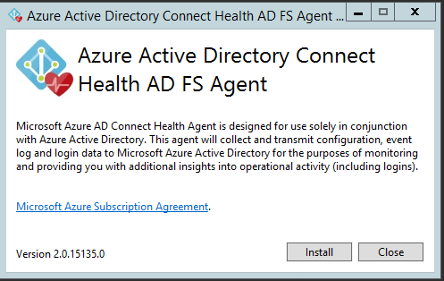

Sobald die Installation abgeschlossen ist, klicken Sie auf jetzt konfigurieren.

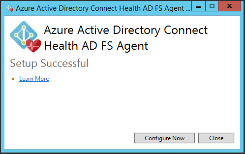

Ein Eingabeaufforderungsfenster wird gestartet, gefolgt von einigen PowerShell, der Register-AzureADConnectHealthADFSAgent ausgeführt wird. Klicken Sie bei Aufforderung zum Anmelden bei Azure fortfahren Sie, und melden Sie sich.

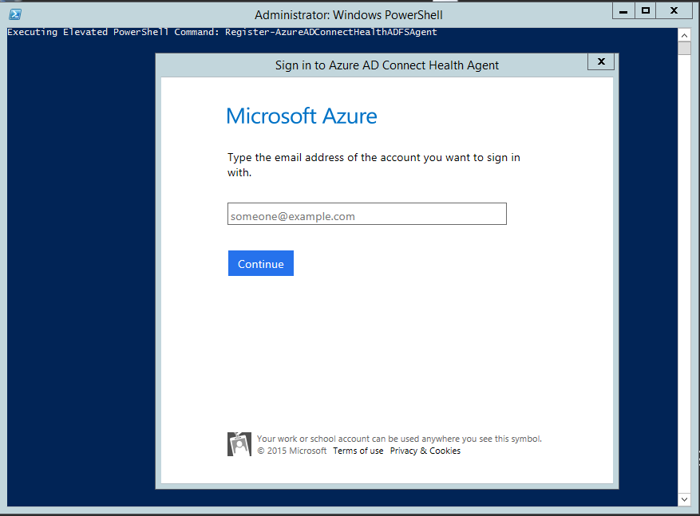

Nach der Anmeldung, weiterhin PowerShell. Sobald sie abgeschlossen ist, können Sie PowerShell schließen und die Konfiguration abgeschlossen ist.

An diesem Punkt sollte die Dienste automatisch gleicht des Agents zum Überwachen und Erfassen von Daten gestartet werden. Wenn Sie nicht alle erforderlichen Komponenten, die in den vorherigen Abschnitten beschriebenen erreicht wurde, werden Warnungen im PowerShell-Fenster angezeigt. Achten Sie darauf, dass die [Anforderungen](active-directory-aadconnect-health-agent-install.md#requirements) vor der Neuinstallation des Agents ausführen. Das folgende Bildschirmabbild ist ein Beispiel für diesen Fehler an.

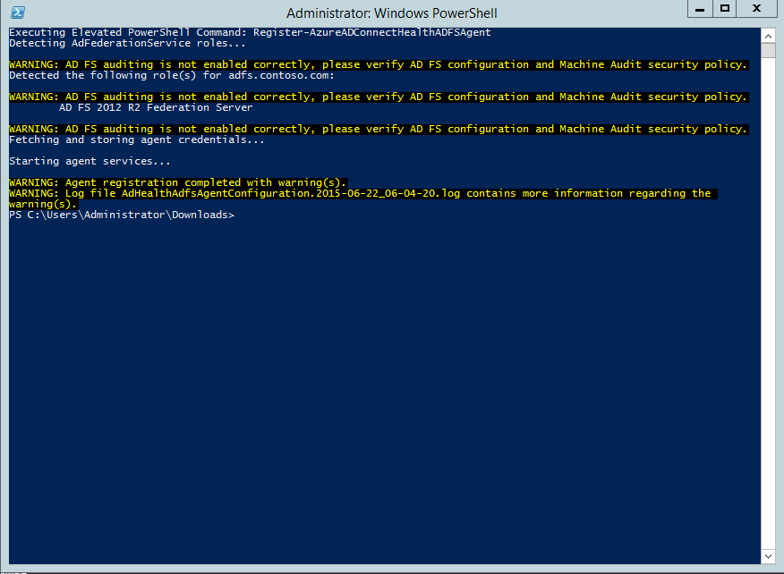

Suchen Sie die folgenden Dienste auf dem Server um zu überprüfen, dass der Agent installiert wurde. Wenn Sie die Konfiguration abgeschlossen haben, sollten sie bereits ausgeführt werden. Andernfalls werden angehalten, bis die Konfiguration abgeschlossen ist.

- Azure AD verbinden Health AD FS-Diagnose Service
- Azure AD verbinden Health AD FS Einsichten Service
- Azure AD verbinden Gesundheit AD FS-Dienst für die Überwachung

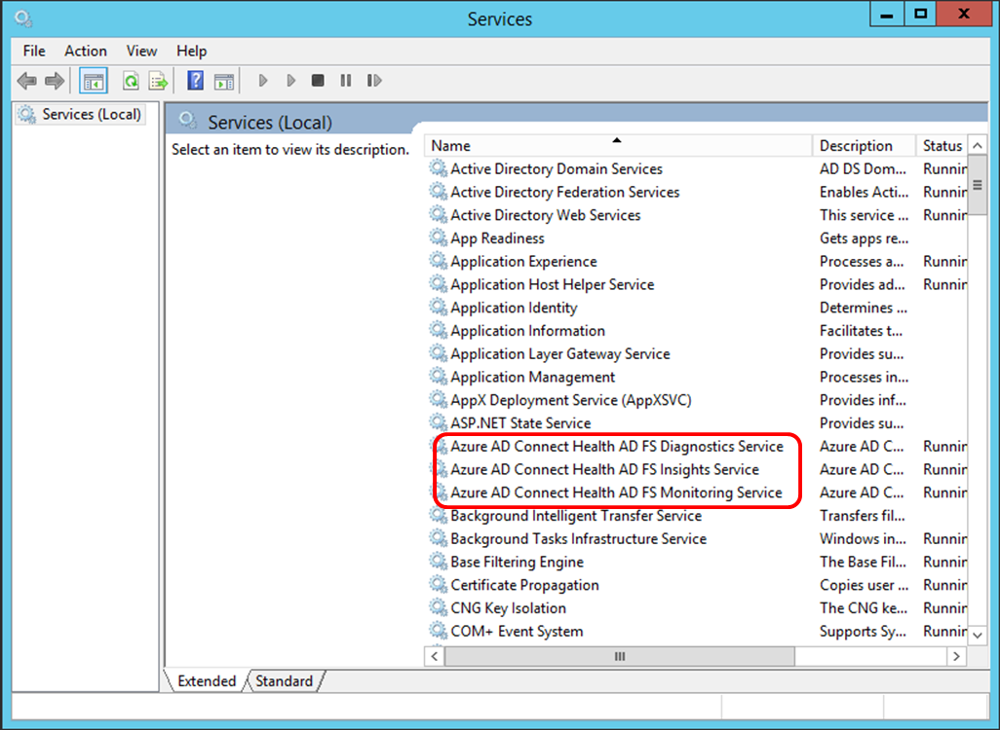

### Agenteninstallation auf Windows Server 2008 R2-Server

Schritte für Windows Server 2008 R2-Server:

1. Stellen Sie sicher, dass der Server mit Service Pack 1 oder höher ausgeführt wird.
1. Deaktivieren Sie für IE für die Agenteninstallation aus:
1. Installieren Sie Windows PowerShell 4.0 auf jedem der Server vor der Installation des AD-Dienststatus-Agents aus. So installieren Sie Windows PowerShell 4.0
 - Installieren Sie [Microsoft .NET Framework 4.5](https://www.microsoft.com/download/details.aspx?id=40779) verwenden den folgenden Link, den offline Installer herunterzuladen.
 - Installieren Sie PowerShell ISE (von Windowsfunktionen)
 - Installieren der [Windows Management Framework 4.0.](https://www.microsoft.com/download/details.aspx?id=40855)
 - Installieren Sie Internet Explorer, Version 10 oder höher auf dem Server. (Erforderlich vom Dienst Gesundheit eine Authentifizierung mit Azure-Administrator-Anmeldeberechtigungen.)
1. Weitere Informationen zum Installieren von Windows PowerShell 4.0 unter Windows Server 2008 R2 finden Sie im Wiki-Artikel [hier](http://social.technet.microsoft.com/wiki/contents/articles/20623.step-by-step-upgrading-the-powershell-version-4-on-2008-r2.aspx).

### Aktivieren Sie die Überwachung für AD FS

> [AZURE.NOTE] Dieser Abschnitt gilt nur für AD FS-Verbund-Servern.

Damit das Feature Nutzungsanalysen zum Sammeln und Analysieren von Daten benötigt der Azure AD verbinden Health Agent die Informationen in den AD FS-Überwachungsprotokollen. Diese Protokolle sind standardmäßig nicht aktiviert. Verwenden Sie die folgenden Verfahren aus, um AD FS Überwachung aktivieren und der AD FS-Überwachungsprotokolle auf Ihre AD FS-Servern zu suchen.

#### So aktivieren Sie die Überwachung von AD FS 2.0

1. Klicken Sie auf **Start**, zeigen Sie auf **Programme**, zeigen Sie auf **Verwaltung**, und klicken Sie dann auf **Lokale Sicherheitsrichtlinie**.
2. Navigieren Sie zu dem Ordner **Sicherheit Einstellungen\Sicherheitseinstellungen\Lokale von Rights Management** , und doppelklicken Sie dann auf die Sicherheit Überwachungen generieren.
3. Auf der Registerkarte **Lokale Sicherheitsrichtlinie** stellen Sie sicher, dass die AD FS 2.0 Dienstkontos aufgelistet ist. Wenn es nicht vorhanden ist, klicken Sie auf **Benutzer oder Gruppe hinzufügen** und zu der Liste hinzuzufügen Sie, und klicken Sie dann auf **OK**.
4. Zum Aktivieren der Überwachung, öffnen Sie ein Eingabeaufforderungsfenster mit erhöhten, und führen Sie den folgenden Befehl aus:<code>auditpol.exe /set /subcategory:"Application Generated" /failure:enable /success:enable</code>
5. Schließen Sie die lokale Sicherheitsrichtlinie, und öffnen Sie das-Snap-in. Um das-Snap-in zu öffnen, klicken Sie auf **Start**, zeigen Sie auf **Programme**, zeigen Sie auf **Verwaltung**, und klicken Sie dann auf AD FS 2.0 Verwaltung.
6. Klicken Sie im Bereich Aktionen auf Föderation Diensteigenschaften bearbeiten.
7. Klicken Sie auf der Registerkarte **Events** , klicken Sie im Dialogfeld **Eigenschaften von Föderation** .
8. Wählen Sie die Kontrollkästchen **Erfolg überwacht** und **überwacht die Fehler** aus.
9. Klicken Sie auf **OK**.

#### So aktivieren Sie die Überwachung von AD FS unter Windows Server 2012 R2

1. Öffnen Sie **Lokale Sicherheitsrichtlinie** , indem Sie **Server-Manager** auf dem Startbildschirm und Server-Manager auf der Taskleiste auf dem Desktop öffnen, und klicken Sie auf **Systemprogramme/Lokale Sicherheitsrichtlinie**.
2. Navigieren Sie zu dem Ordner **Sicherheit Einstellungen\Sicherheitseinstellungen\Lokale Richtlinien\benutzerrechtezuweisung** , und doppelklicken Sie dann auf **Sicherheit generieren überwacht**.
3. Klicken Sie auf der Registerkarte **Lokale Sicherheitsrichtlinie** stellen Sie sicher, dass das AD FS-Dienstkonto aufgelistet ist. Wenn es nicht vorhanden ist, klicken Sie auf **Benutzer oder Gruppe hinzufügen** und zu der Liste hinzuzufügen Sie, und klicken Sie dann auf **OK**.
4. Zum Aktivieren der Überwachung, öffnen Sie ein Eingabeaufforderungsfenster mit erhöhten, und führen Sie den folgenden Befehl aus:<code>auditpol.exe /set /subcategory:"Application Generated" /failure:enable /success:enable.</code>
5. Schließen Sie die **Lokale Sicherheitsrichtlinie**, und öffnen Sie das **AD FS-Verwaltung** -Snap-in (in Server-Manager, klicken Sie auf Extras, und wählen Sie dann auf AD FS-Verwaltung).
6. Klicken Sie im Bereich Aktionen auf **Föderation Diensteigenschaften bearbeiten**.
7. Klicken Sie auf der Registerkarte **Events** , klicken Sie im Dialogfeld Eigenschaften von Föderation.
8. Wählen Sie die Kontrollkästchen **Erfolg überwacht und überwacht die Fehler** aus, und klicken Sie dann auf **OK**.

#### Suchen Sie das AD FS-Audit anmeldet

1. Öffnen Sie die **Ereignisanzeige**.
2. Wechseln Sie zum Windows-Protokolle, und wählen Sie die **Sicherheit**.
3. Klicken Sie auf der rechten Seite auf **Aktuelle Protokolle Filtern**.
4. Wählen Sie unter Quelle die **AD FS Überwachung**ein.

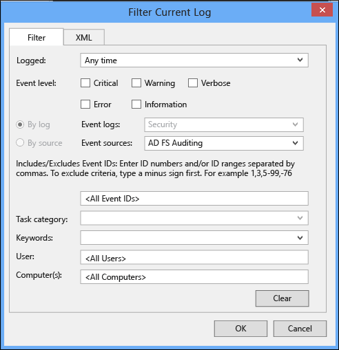

> [AZURE.WARNING] Wenn ein, die durch das AD FS Überwachung deaktivieren werden Gruppenrichtlinien vorhanden ist, ist der Azure AD verbinden Health Agent zum Sammeln von Informationen können nicht genutzt werden. Stellen Sie sicher, dass Sie nicht über eine Gruppenrichtlinien verfügen, die Überwachung deaktivieren können.

[//]: # (Start of Agent Proxy Configuration Section)

## Installieren des Azure AD verbinden Health Agents für synchronisieren
Der Azure AD verbinden Health Agent für die Synchronisierung wird in der neuesten Version von Azure AD verbinden automatisch installiert. Um Azure AD verbinden für synchronisieren verwenden zu können, müssen Sie die neueste Version von Azure AD verbinden herunterzuladen und zu installieren. Sie können die neueste Version herunterladen [können](http://www.microsoft.com/download/details.aspx?id=47594).

Suchen Sie die folgenden Dienste auf dem Server um zu überprüfen, dass der Agent installiert wurde. Wenn Sie die Konfiguration abgeschlossen haben, sollten sie bereits ausgeführt werden. Andernfalls werden angehalten, bis die Konfiguration abgeschlossen ist.

- Azure AD verbinden Health synchronisieren Einsichten Service
- Azure AD verbinden Gesundheit synchronisieren Dienst Überwachung

> [AZURE.NOTE] Denken Sie daran, dass Azure AD-Dienststatus zum Verbinden mit Azure AD Premium erforderlich ist. Wenn Sie nicht Azure AD Premium verfügen, können Sie nicht die Konfiguration der Azure-Portal zu beenden. Weitere Informationen finden Sie auf der [Seite Anforderungen](active-directory-aadconnect-health-agent-install.md#requirements).

## Manueller Azure AD verbinden Gesundheit für die Registrierung synchronisieren
Wenn die Azure AD verbinden Integrität für die Synchronisierung Agent Registrierung fehlschlägt, nach der Installation von erfolgreich Azure AD verbinden, können Sie den folgenden PowerShell-Befehl verwenden, den Agent manuell zu registrieren.

>[AZURE.IMPORTANT] Mit dem folgenden PowerShell-Befehl ist nur erforderlich, wenn die Agent-Registrierung fehlschlägt, nach der Installation von Azure AD verbinden.

Die folgende PowerShell Befehl ist erforderlich ist nur bei die Registrierung Gesundheit Agent auch nach einer erfolgreichen Installation und Konfiguration von Azure AD-verbinden fehlschlägt. Die Dienste Azure AD verbinden Dienststatus werden gestartet, nachdem der Agent erfolgreich registriert wurde.

Sie können den Azure AD verbinden Gesundheit Agent für die Synchronisierung mit dem folgenden PowerShell-Befehl manuell registrieren:

`Register-AzureADConnectHealthSyncAgent -AttributeFiltering $false -StagingMode $false`

Der Befehl erfordert folgenden Parameter:

- AttributeFiltering: $true (Standard) – Wenn Azure AD verbinden das Attribut standardmäßig nicht synchronisiert wird festgelegt, und um eine Reihe von gefilterten Attribut verwenden angepasst wurde. $false andernfalls.
- StagingMode: $false (Standard) – Wenn der Server Azure AD Verbinden nicht im Modus $true staging, wenn der Server so konfiguriert ist, um in das staging Modus werden.

Aufforderung zur Eingabe Authentifizierung sollten Sie dasselbe globaler Administratorkonto verwenden (z. B. admin@domain.onmicrosoft.com) , die für das Konfigurieren von Azure AD verbinden verwendet wurde.

## Installieren von Azure AD Health Agent für AD DS verbinden
Doppelklicken Sie auf die .exe-Datei, die Sie heruntergeladen haben, um die Agenteninstallation zu starten. Klicken Sie auf dem ersten Bildschirm auf installieren.

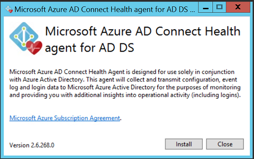

Sobald die Installation abgeschlossen ist, klicken Sie auf jetzt konfigurieren.

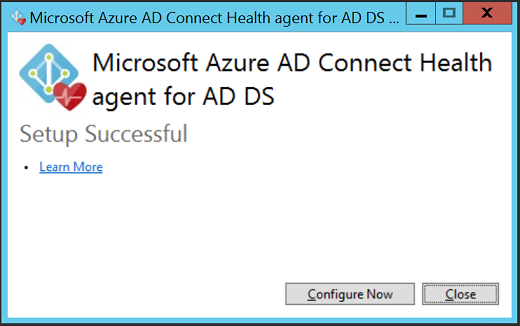

Ein Eingabeaufforderungsfenster wird gestartet, gefolgt von einigen PowerShell, der Register-AzureADConnectHealthADDSAgent ausgeführt wird. Klicken Sie bei Aufforderung zum Anmelden bei Azure fortfahren Sie, und melden Sie sich.

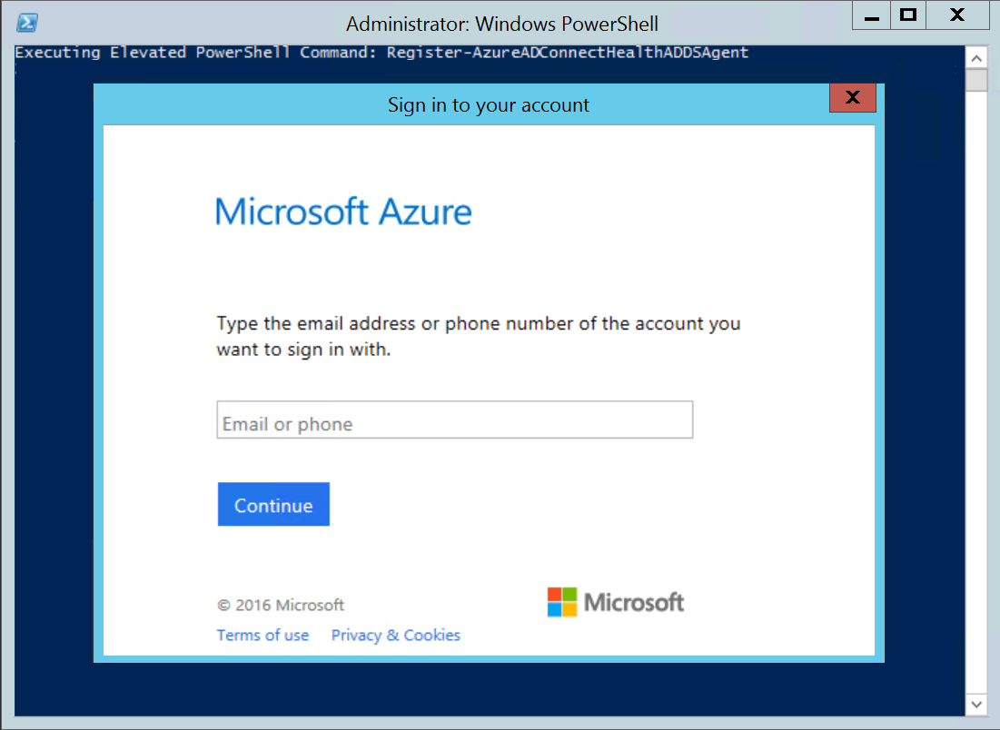

Nach der Anmeldung, weiterhin PowerShell. Sobald sie abgeschlossen ist, können Sie PowerShell schließen und die Konfiguration abgeschlossen ist.

An diesem Punkt sollte die Dienste automatisch gleicht des Agents zum Überwachen und Erfassen von Daten gestartet werden. Wenn Sie nicht alle erforderlichen Komponenten, die in den vorherigen Abschnitten beschriebenen erreicht wurde, werden Warnungen im PowerShell-Fenster angezeigt. Achten Sie darauf, dass die [Anforderungen](active-directory-aadconnect-health-agent-install.md#requirements) vor der Neuinstallation des Agents ausführen. Das folgende Bildschirmabbild ist ein Beispiel für diesen Fehler an.

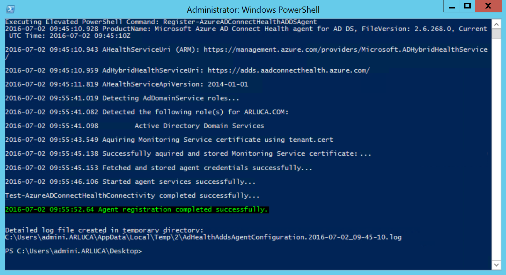

Suchen Sie zum Überprüfen, dass der Agent installiert wurde, für die folgenden Dienste auf dem Domänencontroller aus.

- Azure AD verbinden Health AD DS Einsichten Service
- Azure AD verbinden Gesundheit AD DS-Dienst für die Überwachung

Wenn Sie die Konfiguration abgeschlossen haben, sollte dieser Dienste noch ausgeführt werden. Andernfalls werden angehalten, bis die Konfiguration abgeschlossen ist.

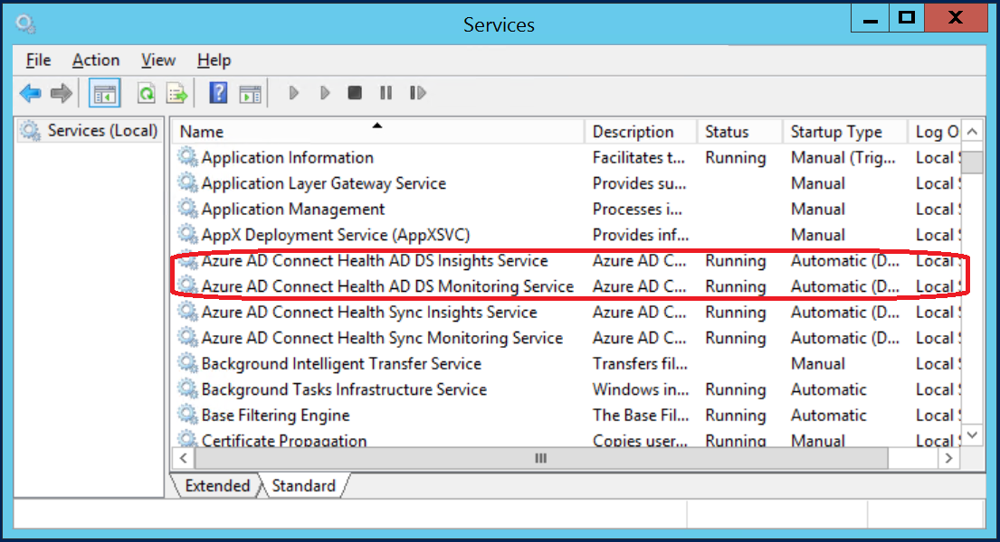

## Installieren von Azure AD Health Agent für AD DS auf Server Core verbinden.
Nach der Installation von .exe-Datei, können Sie die Registrierung abzuschließen mithilfe des folgenden PowerShell-Befehls:

`Register-AzureADConnectHealthADDSAgent -Credential $cred`

## Konfigurieren von Azure AD verbinden Dienststatus-Agents HTTP-Proxy verwenden
Sie können Azure AD verbinden Health Agent für die Arbeit mit einem HTTP-Proxy konfigurieren.

>[AZURE.NOTE]
- Verwenden von "Netsh WinHttp festgelegt ProxyServerAddress" wird nicht unterstützt, wie der Agent System.Net Web anzufordern anstelle von Microsoft Windows HTTP-Dienste verwendet.
- Die konfigurierte Http-Proxy-Adresse wird Pass-Through-verschlüsselte Https-Nachrichten verwendet.
- Authentifizierten Proxys (mit HTTPBasic) werden nicht unterstützt.

### Gesundheit Agent Proxy-Konfiguration ändern
Sie haben die folgenden Optionen aus, um Azure AD verbinden Health Agent für einen HTTP-Proxy konfigurieren.

>[AZURE.NOTE]Alle Azure AD verbinden Health Agent-Dienste müssen gestartet werden, in der Reihenfolge für die Proxyeinstellungen aktualisiert werden. Führen Sie den folgenden Befehl ein: 
Restart-Service AdHealth *

#### Importieren von vorhandenen Proxy-Einstellungen

##### Importieren von InternetExplorer
Internet Explorer HTTP-Proxy-Einstellungen können importiert werden vom Azure AD verbinden Health Agents verwendet werden soll. Führen Sie auf jeder der Server mit der Health Agent den folgenden PowerShell-Befehl aus:

    Set-AzureAdConnectHealthProxySettings -ImportFromInternetSettings

##### Importieren von WinHTTP
WinHTTP-Proxyeinstellungen können importiert werden vom Azure AD verbinden Health Agents verwendet werden soll. Führen Sie auf jeder der Server mit der Health Agent den folgenden PowerShell-Befehl aus:

    Set-AzureAdConnectHealthProxySettings -ImportFromWinHttp

#### Manuelles Festlegen der Proxyadressen
Sie können einen Proxyserver manuell angeben, klicken Sie auf den Servern des Dienststatus-Agents durch Ausführen des folgenden PowerShell-Befehls ausführen:

    Set-AzureAdConnectHealthProxySettings -HttpsProxyAddress address:port

Beispiel: *Set-AzureAdConnectHealthProxySettings - HttpsProxyAddress Myproxyserver: 443*

- "Adresse" kann aufgelöst werden DNS-Servernamen oder eine IPv4-Adresse
- "Port" kann weggelassen werden. Wenn nicht angegeben, und klicken Sie dann als Standardport 443 ausgewählt ist.

#### Löschen der vorhandenen Proxy-Konfiguration
Sie können die vorhandenen Proxy-Konfiguration löschen, indem Sie den folgenden Befehl ausführen:

    Set-AzureAdConnectHealthProxySettings -NoProxy

### Lesen Sie die aktuellen Proxyeinstellungen
Sie können die derzeit konfigurierten Proxyeinstellungen lesen, indem Sie den folgenden Befehl ausführen:

    Get-AzureAdConnectHealthProxySettings

## Testen der Konnektivität zu Azure AD-verbinden Health Service
Es ist möglich, dass Probleme auftreten, die dazu führen, dass der Agent Azure AD verbinden Gesundheit Konnektivität mit dem Dienst Azure AD verbinden Gesundheit verlieren möchten. Hierzu gehören Netzwerkproblemen, Zugriffsproblemen oder aus verschiedenen anderen Gründen.

Wenn der Agent zum Senden von Daten mit dem Dienst Azure AD verbinden Gesundheit für mehr als zwei Stunden kann, mit der folgenden Warnung im Portal angegeben: "Health Service Daten ist nicht auf dem neuesten Stand." Sie können bestätigen, verbinden das betroffene Azure AD Health Agent Hochladen von Daten mit dem Dienst Azure AD verbinden Gesundheit durch Ausführen des folgenden PowerShell-Befehls ist:

    Test-AzureADConnectHealthConnectivity -Role ADFS

Der Rolle Parameter kann derzeit die folgenden Werte aus:

- ADFS
- Synchronisieren
- FÜGT HINZU

Sie können die Kennzeichnung - ShowResults in den Befehl verwenden, um detaillierte Protokolle anzuzeigen. Verwenden Sie das folgende Beispiel:

    Test-AzureADConnectHealthConnectivity -Role Sync -ShowResult

>[AZURE.NOTE]Um das Tool Connectivity verwenden zu können, müssen Sie zunächst die Registrierung Agent ausführen. Wenn Sie nicht die Registrierung Agent fertig sind, stellen Sie sicher, dass Sie die [Anforderungen](active-directory-aadconnect-health-agent-install.md#requirements) für Azure AD verbinden Gesundheit erreicht haben. Diese Verbindungstest wird standardmäßig während der Registrierung Agent durchgeführt.

## Links zu verwandten Themen

* [Azure AD verbinden Dienststatus](active-directory-aadconnect-health.md)
* [Azure AD verbinden Gesundheit Vorgänge](active-directory-aadconnect-health-operations.md)
* [Azure AD-Dienststatus mit AD FS verbinden](active-directory-aadconnect-health-adfs.md)
* [Mithilfe von Azure AD verbinden Gesundheit für synchronisieren](active-directory-aadconnect-health-sync.md)
* [Azure AD-Dienststatus in AD DS verbinden](active-directory-aadconnect-health-adds.md)
* [Azure AD verbinden Gesundheit häufig gestellte Fragen](active-directory-aadconnect-health-faq.md)
* [Azure AD verbinden Versionsverlauf Dienststatus](active-directory-aadconnect-health-version-history.md)
