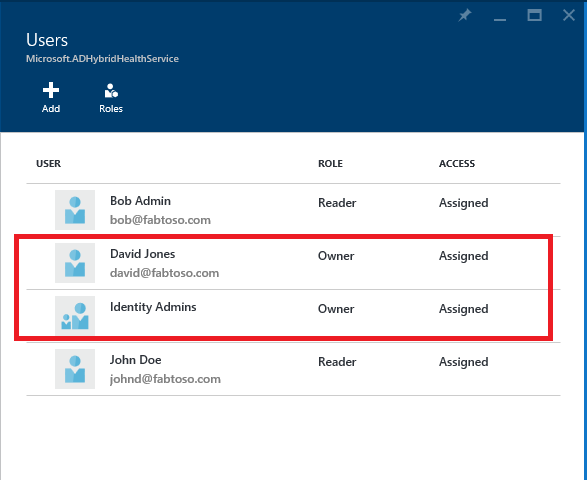
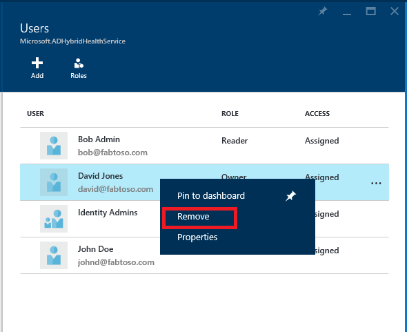

<properties
    pageTitle="Azure AD verbinden Gesundheit Vorgänge."
    description="In diesem Artikel werden zusätzliche Vorgänge, die ausgeführt werden können, nachdem Sie Azure AD verbinden Gesundheit bereitgestellt haben."
    services="active-directory"
    documentationCenter=""
    authors="karavar"
    manager="samueld"
    editor="curtand"/>

<tags
    ms.service="active-directory"
    ms.workload="identity"
    ms.tgt_pltfrm="na"
    ms.devlang="na"
    ms.topic="article"
    ms.date="10/18/2016"
    ms.author="vakarand"/>

# Azure AD verbinden Gesundheit Vorgänge

Im folgende Thema werden die verschiedenen Vorgänge, die mit Azure AD verbinden Gesundheit ausgeführt werden können.

## E-Mail-Benachrichtigungen aktivieren
Sie können den Azure AD verbinden Dienststatus ab, um e-Mail-Benachrichtigungen senden, wenn Sie Benachrichtigungen generiert werden, die angibt, dass Ihre Identitätsinfrastruktur nicht fehlerfrei ist konfigurieren. Dies ist der Fall, wenn eine Warnung generiert wird, als auch, wenn es als gelöst markiert ist. Gehen Sie so konfigurieren Sie e-Mail-Benachrichtigungen.

>[AZURE.NOTE] E-Mail-Benachrichtigungen werden standardmäßig deaktiviert.

### So aktivieren Sie Azure AD verbinden Gesundheit e-Mail-Benachrichtigungen

1. Öffnen Sie das Blade Benachrichtigungen für den Dienst, für den Sie die e-Mail-Benachrichtigung erhalten möchten.
2. Klicken Sie auf die Schaltfläche "Einstellungen für Benachrichtigungen" auf der Aktionsleiste.
3. Aktivieren Sie die e-Mail-Benachrichtigung wechseln auf ein.
4. Aktivieren Sie das Kontrollkästchen alle globale Administratoren zum Empfangen von e-Mail-Benachrichtigungen zu konfigurieren.
5. Wenn Sie auf eine beliebige andere e-Mail-Adressen e-Mail-Benachrichtigungen erhalten möchten, können Sie diese im Feld weiteren e-Mail-Empfänger angeben. Wenn eine e-Mail-Adresse aus dieser Liste entfernen möchten, klicken Sie mit der rechten Maustaste auf den Eintrag, und wählen Sie löschen aus.
6. Klicken Sie zum Abschließen die Änderungen auf "Speichern" ein. Alle Änderungen dauert Effekte, nur nach der Auswahl von "Speichern".

## Löschen einer Instanz von Server oder Dienst

### Löschen eines Servers aus Azure AD verbinden Health Service
In einigen Fällen können Sie einen Server aus, die überwacht entfernen möchten. Gehen Sie zum Entfernen eines Servers aus Azure AD Gesundheit Dienst verbinden.

Beim Löschen von eines Servers, achten Sie darauf, dass Sie die folgenden Aktionen aus:

- Diese Aktion wird das Sammeln von allen weiteren Daten aus diesem Server beenden. Diese Server werden aus dem überwachenden Dienst entfernt. Nach dieser Aktion Sie nicht mehr neue Benachrichtigungen anzeigen für die Überwachung oder Verwendung Analytics-Daten für diesen Server.
- Diese Aktion wird nicht deinstallieren oder entfernen Sie den Dienststatus-Agent aus dem Server. Wenn Sie den Dienststatus Agent nicht vor Durchführung dieses Schritts deinstalliert haben, wird möglicherweise Fehlerereignisse auf dem Server im Zusammenhang mit der Gesundheit Agent angezeigt.
- Diese Aktion wird die bereits auf diesem Server erfassten Daten nicht gelöscht. Die Daten werden gemäß der Microsoft Azure Daten Aufbewahrungsrichtlinie gelöscht.
- Nachdem Sie diese Aktion ausführen, wenn Sie demselben Server für die Überwachung erneut starten möchten müssen Sie deinstallieren und den Dienststatus Agent auf diesem Server neu installieren.

#### So löschen Sie einen Server aus Azure AD verbinden Health Service

Azure AD verbinden Gesundheit von AD FS und Azure AD-hergestellt (synchronisieren):

1. Öffnen Sie das Server-Blade aus der Liste Serverblade, indem Sie den Servernamen zu entfernenden auswählen.
2. Klicken Sie auf dem Server-Blade auf die Schaltfläche "Löschen" auf der Aktionsleiste.
3. Bestätigen Sie die Aktion aus, um den Server zu löschen, indem Sie den Servernamen im Bestätigungsfeld eingeben.
4. Klicken Sie auf die Schaltfläche "Löschen".

Azure AD Gesundheit für AD DS verbinden:

1. Öffnen Sie das Domänencontroller Dashboard.
2. Wählen Sie den Domänencontroller entfernt werden.
3. Klicken Sie auf die Schaltfläche "Ausgewählte löschen" auf der Aktionsleiste.
4. Bestätigen Sie die Aktion aus, um den Server zu löschen.
5. Klicken Sie auf die Schaltfläche "Löschen".

### Löschen einer Serviceinstanz aus Azure AD Gesundheit Dienst verbinden

In einigen Fällen können Sie eine Dienstinstanz entfernen möchten. Gehen Sie so entfernen Sie eine Instanz von Azure AD Health Service verbinden.

Beim Löschen einer Dienstinstanz, achten Sie darauf, dass Sie die folgenden Aktionen aus:

- Diese Aktion entfernt die aktuelle Dienstinstanz aus dem überwachenden Dienst.
- Diese Aktion wird nicht deinstallieren oder entfernen Sie den Dienststatus-Agent in jedem der Server, die als Teil dieser Dienstinstanz überwacht wurden. Wenn Sie den Dienststatus Agent nicht vor Durchführung dieses Schritts deinstalliert haben, wird möglicherweise Fehlerereignisse auf den Servern im Zusammenhang mit der Gesundheit Agent angezeigt.
- Alle Daten aus diesem Dienstinstanz werden gemäß der Microsoft Azure Daten Aufbewahrungsrichtlinie gelöscht.
- Nachdem Sie diese Aktion, wenn Sie den Dienst Überwachung starten möchten, deinstallieren Sie und erneut installieren Sie den Dienststatus-Agent auf allen Servern, die überwacht wird. Nachdem Sie diese Aktion ausführen, wenn Sie demselben Server für die Überwachung erneut starten möchten müssen Sie deinstallieren und den Dienststatus Agent auf diesem Server neu installieren.

#### So löschen Sie eine Instanz von Azure AD verbinden Health Service

1. Öffnen Sie die Service-Karte vorausgesetzt aus der Liste Service,-Karte vorausgesetzt, indem Sie wählen den Dienstbezeichner (Farmname), den Sie entfernen möchten.
2. Klicken Sie auf dem Server-Blade auf die Schaltfläche "Löschen" auf der Aktionsleiste.
3. Bestätigen Sie den Namen, indem Sie es im Bestätigungsfeld eingeben. (zum Beispiel: sts.contoso.com)
4. Klicken Sie auf die Schaltfläche "Löschen".
  

[//]: # (Start of RBAC section)
## Verwalten des Zugriffs mit rollenbasierte Steuerelement zugreifen
### (Übersicht)
[Access-basierten-Steuerelement Rolle](role-based-access-control-configure.md) für Azure AD verbinden Gesundheit bietet Zugriff Azure AD verbinden Health Service auf Benutzer und/oder Gruppen außerhalb von globalen Administratoren. Dies wird erreicht, indem Sie die gewünschten Benutzer und Gruppen Sperren Rollen zuweisen und bietet ein Verfahren, um die globalen Administratoren in Ihrem Verzeichnis zu beschränken.

#### Rollen
Azure AD verbinden Gesundheit unterstützt folgenden integrierten Funktionen.

| Rolle | Berechtigungen |
| ----------- | ---------- |
| Besitzer | Besitzer können ***Verwalten des Zugriffs*** (z. B. Rolle zuweisen einer Benutzergruppe), ***alle Informationen anzeigen*** (z. B. Ansicht Alarme) aus dem Portal und dem (z. B. e-Mail-Benachrichtigungen) in Azure AD verbinden Gesundheit ***Einstellungen ändern*** .  Standardmäßig Azure AD-globale Administratoren werden diese Rolle zugewiesen und kann nicht geändert werden.  |
|Mitwirkenden|  Mitwirkenden können ***alle Informationen anzeigen*** (z. B. Ansicht Alarme) aus dem Portal und dem (z. B. e-Mail-Benachrichtigungen) in Azure AD verbinden Gesundheit ***Einstellungen ändern*** .|
|Reader| Leser können (z. B. Ansicht Benachrichtigungen) aus dem Portal in Azure AD verbinden Gesundheit ***alle Informationen anzeigen*** .|

Alle anderen Rollen (z. B. 'Benutzer Access Administratoren' oder 'DevTest Labs Benutzer'), selbst wenn in der Portal-Oberfläche zur Verfügung haben keine Auswirkung auf innerhalb von Azure AD verbinden Gesundheit zugreifen.

#### Access-Bereich

Azure AD verbinden unterstützt das Verwalten des Zugriffs auf zwei Ebenen:

- ***Alle Dienstinstanzen***: Dies ist die empfohlene Vorgehensweise für die meisten Kunden und steuert den Zugriff für alle Dienstinstanzen (z. B. eine Farm ADFS) für alle Arten von Rolle, die vom Azure AD verbinden Gesundheit überwacht werden.

- ***Dienstinstanz***: In einigen Fällen müssen Sie aufteilen des Zugriffs, basierend auf Rollentypen oder indem Sie eine Instanz. In diesem Fall können Sie den Zugriff auf den Dienst Instanzebene verwalten.  

Die Berechtigung ist, wenn ein Endbenutzer weist entweder auf der Ebene Verzeichnisses oder Dienstinstanz zugreifen.

### Wie Sie Benutzern oder Gruppen Zugriff auf Azure AD verbinden Gesundheit zulassen
#### Schritte 1: Wählen Sie den entsprechenden Access-Bereich
Wenn Sie einem Benutzer den Zugriff auf *Alle Dienstinstanzen* Ebene in Azure AD verbinden Gesundheit zulassen möchten, öffnen Sie das Hauptfenster Blade in Azure AD verbinden Gesundheit aus. 
#### Schritt 2: Hinzufügen von Benutzern, Gruppen und Rollen zuweisen
1. Klicken Sie auf das Webpart "Benutzer" aus dem Abschnitt konfigurieren. 

2. Wählen Sie "Hinzufügen"
3. Wählen Sie die "Rolle" wie "Besitzer" 

4. Geben Sie den Namen oder Bezeichner des gezielte Benutzer oder der Gruppe ein. Sie können eine oder mehrere Benutzer oder Gruppen gleichzeitig auswählen. Klicken Sie auf "select".

5. Wählen Sie "Ok". 

6. Sobald die rollenzuweisung abgeschlossen ist, werden die Benutzer und/oder Gruppen in der Liste angezeigt. 

Mit diesen Schritten werden die aufgeführten Benutzer und Gruppenzugriff gemäß ihre zugewiesenen Rollen können.
>[AZURE.NOTE]
- Globale Administratoren haben immer Vollzugriff auf alle Vorgänge globaler Administratorkonten werden jedoch nicht in der obigen Liste vorhanden.
- Feature "Einladen von Benutzern" wird in Azure AD verbinden Gesundheit nicht unterstützt.

#### Schritt 3: Freigeben der Position Blade für Benutzer oder Gruppen
1. Nach dem Zuweisen von Berechtigungen, kann ein Benutzer Azure AD verbinden Dienststatus auf [http://aka.ms/aadconnecthealth](http://aka.ms/aadconnecthealth)zugreifen.
2. Einmal kann in der Blade, der Benutzer Blade oder anderen Webparts auf dem Dashboard anheften einfach durch Klicken auf "Pin zum Dashboard" 

>[AZURE.NOTE] Ein Benutzer mit der Rolle "Leser" zugewiesen werden nicht zum Ausführen des Vorgangs "erstellen", um Azure AD verbinden Gesundheit Erweiterung aus dem Azure Marketplace abrufen können. Diese Benutzer kann weiterhin an die Blade aufrufen, indem Sie auf den Link. Für nachfolgende Verwendung kann der Benutzer das Blade mit dem Dashboard anheften.

### Entfernen von Benutzern und/oder Gruppen
Entfernen Sie einen Benutzer oder eine Gruppe von der rechten Maustaste klicken und entfernen Azure AD verbinden Gesundheit Rolle basierend Access Control Webpart hinzugefügt. 

[//]: # (End of RBAC section)

## Links zu verwandten Themen

* [Azure AD verbinden Dienststatus](active-directory-aadconnect-health.md)
* [Azure AD verbinden Health Agent-Installation](active-directory-aadconnect-health-agent-install.md)
* [Azure AD-Dienststatus mit AD FS verbinden](active-directory-aadconnect-health-adfs.md)
* [Mithilfe von Azure AD verbinden Gesundheit für synchronisieren](active-directory-aadconnect-health-sync.md)
* [Azure AD-Dienststatus in AD DS verbinden](active-directory-aadconnect-health-adds.md)
* [Azure AD verbinden Gesundheit häufig gestellte Fragen](active-directory-aadconnect-health-faq.md)
* [Azure AD verbinden Versionsverlauf Dienststatus](active-directory-aadconnect-health-version-history.md)
