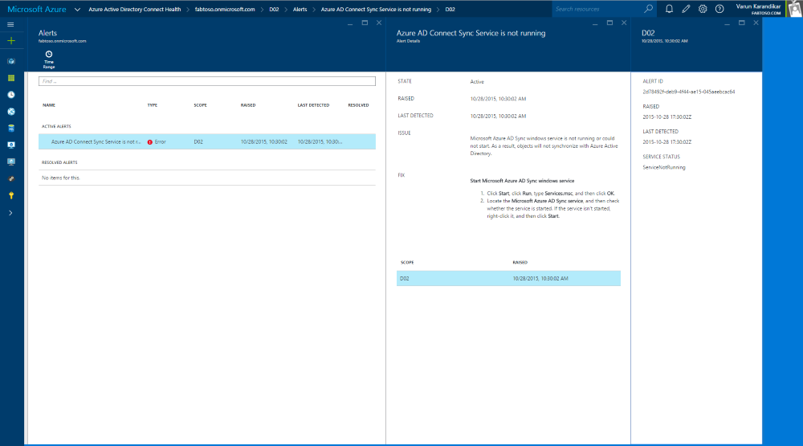

<properties
    pageTitle="Synchronisieren mit Azure AD verbinden Gesundheit | Microsoft Azure"
    description="Dies ist der Azure AD verbinden Dienststatus-Seite, die von Azure AD verbinden synchronisieren überwachen erläutert werden."
    services="active-directory"
    documentationCenter=""
    authors="karavar"
    manager="samueld"
    editor="curtand"/>

<tags
    ms.service="active-directory"
    ms.workload="identity"
    ms.tgt_pltfrm="na"
    ms.devlang="na"
    ms.topic="get-started-article"
    ms.date="10/18/2016"
    ms.author="vakarand"/>

# Mithilfe von Azure AD verbinden Gesundheit für synchronisieren
Die folgende Dokumentation ist speziell für die Überwachung Azure AD verbinden (synchronisieren) mit Azure AD verbinden Dienststatus.  Weitere Informationen zum Überwachen der AD FS mit Azure AD verbinden Dienststatus finden Sie unter [Verwenden Azure AD Gesundheit Verbinden mit AD FS](active-directory-aadconnect-health-adfs.md). Weitere Informationen zum Überwachen der Active Directory-Domänendiensten mit Azure AD verbinden Dienststatus finden Sie darüber hinaus [Mithilfe von Azure AD Gesundheit Verbinden mit AD DS](active-directory-aadconnect-health-adds.md).

## Benachrichtigungen für Azure AD verbinden Gesundheit für synchronisieren
Der Azure AD verbinden Gesundheit Benachrichtigungen für synchronisieren Abschnitt enthält eine Liste der aktiven Benachrichtigungen. Jede Warnung enthält relevante Informationen, Lösungsschritten und Links zu verwandter Dokumentation. Durch Auswählen einer Benachrichtigung aktiven oder gelöst wird einen neuen Blade mit zusätzlichen Informationen sowie Maßnahmen ergreifen können zum Beheben der Warnung, und klicken Sie auf Links zu zusätzliche Dokumentation angezeigt. Sie können auch zurückliegende Daten auf Benachrichtigungen anzeigen, die in der Vergangenheit gelöst wurden.

Durch Auswählen einer Benachrichtigung, die eingegebene mit zusätzlichen Informationen sowie die Schritte können Sie die Benachrichtigung und Links zu zusätzliche Dokumentation auflösen nutzen.

### Eingeschränkte Auswertung von Benachrichtigungen
Wenn Azure AD Verbinden nicht verwendet die standardmäßige Konfiguration (z. B. Attribut Filtern von der Standard-Konfiguration in einer benutzerdefinierten Konfiguration geändert wird), wird der Azure AD verbinden Health Agent nicht der Fehlerereignisse im Zusammenhang mit Azure AD verbinden hochladen.

Dadurch wird die Auswertung von Benachrichtigungen vom Dienst beschränkt. Sie möchten ein Banner angezeigt wird, die diese Bedingung im Azure-Portal unter dem Dienst angibt.

Sie können dies, indem "Einstellungen" und Azure AD verbinden Health Agent zum Hochladen von Fehlerprotokollen alle gleicht ändern.

## Synchronisieren Einblick
Administratoren häufig möchten wissen, zu der Zeitaufwand zum Synchronisieren von Änderungen zu Azure AD- und der Menge an stattfindenden Änderungen. Dieses Feature bietet eine einfache Möglichkeit, diese Visualisierung mithilfe der unter Diagramme:   

- Wartezeit synchronisieren Vorgänge
- Objekt ändern trend

### Synchronisieren Wartezeit
Dieses Feature bietet einen grafischen Trend von Wartezeit der synchronisieren Vorgänge (importieren, Exportieren usw.) für Verbinder.  Dies stellt eine schnelle und einfache Möglichkeit zu verstehen, nicht nur die Wartezeit Ihrer Vorgänge (größer, wenn Sie eine Reihe von Änderungen, die auftreten haben), sondern auch eine Möglichkeit zum Ermitteln von Bildschirmdarstellung auftreten in der Wartezeit, das Untersuchung erfordert.

Standardmäßig wird nur die Wartezeit des Vorgangs 'Exportieren' für den Verbinder Azure Ad-angezeigt.  Um finden Sie unter Weitere Vorgänge auf den Verbinder oder zum Anzeigen der Vorgänge aus der anderen Schablone Verbinder Maustaste auf das Diagramm, wählen Sie Diagramm bearbeiten oder klicken Sie auf die Schaltfläche "Wartezeit Diagramm bearbeiten", und wählen Sie den bestimmten Vorgang und Verbinder.

### Synchronisieren Objekt Änderungen
Dieses Feature stellt einen grafischen Trend die Anzahl der Änderungen, die gerade ausgewertet und in Azure AD importiert werden.  Heute ist bei dem Versuch, diese Informationen aus den Protokollen synchronisieren sammeln schwierig.  Das Diagramm bietet Ihnen, nicht nur eine einfache Möglichkeit, die Anzahl der Änderungen, die in Ihrer Umgebung auftreten, sondern auch eine visuelle Ansicht der Fehler, die auftreten, für die Überwachung.

## Objekt abgleichen Synchronisation Fehlerbericht (Preview)
Dieses Feature bietet einen Bericht zu Synchronisierungsfehlern, die auftreten können, wenn die Identitätsdaten zwischen Windows-Server AD und Azure AD mit Azure AD verbinden synchronisiert werden.

- Der Bericht umfasst folgende Fehler bei der Synchronisierungsclient erfasst (Azure AD verbinden Version 1.1.281.0 oder höher)
- Sie enthält die aufgetretenen Fehler bei der letzten Synchronisierung der Synchronisierungs-Engine aus. ("Exportieren Sie" auf dem Azure AD-Verbinder.)
- Azure AD verbinden Health Agent für synchronisieren müssen ausgehende Verbindung zu den erforderlichen Endpunkte für den Bericht, um die neuesten Daten enthalten sind. Details finden Sie im [Abschnitt Anforderungen](active-directory-aadconnect-health-agent-install.md#Requirements) .
- Der Bericht ist **nach: 30 Minuten aktualisierte** mithilfe der Daten hochgeladen durch Azure AD verbinden Health Agent für synchronisieren.
Er bietet die folgenden wichtigen Funktionen

    - Kategorisierung von Fehlern
    - Liste der Objekte mit Fehler pro Kategorie
    - Alle Daten zu dem Fehler an einer zentralen Stelle
    - Seite durch Vergleich der Objekte Fehler aufgrund einen Konflikt
    - Herunterladen des Fehlerberichts als eine CVS (in Kürze verfügbar)

### Kategorisierung von Fehlern
Der Bericht kategorisiert die vorhandenen Synchronisierungsfehler in den folgenden Kategorien:

| Kategorie | Beschreibung |
| -------------- | ----------- |
| Doppeltes Attribut | Fehler beim Azure AD verbinden versucht erstellen oder Aktualisieren von Objekten mit doppelte Werte von einem oder mehreren Attributen in Azure AD, die in einen Mandanten, wie z. B. ProxyAddresses, UserPrincipalName eindeutig sein muss. |
| Falsche Zuordnung | Fehler beim die weiche-Übereinstimmung keine Übereinstimmung von Objekten, die Synchronisierungsfehler führen. |
| Überprüfungsfehler Daten | Fehler aufgrund ungültiger Daten, wie z. B. nicht unterstützte Zeichen im kritischen Attributen, wie z. B. UserPrincipalName, formatieren Fehler, die fehlgeschlagener Überprüfung, bevor Sie in Azure AD geschrieben werden.|
| Große Attribut | Fehler, wenn ein oder mehrere Attribute größer als die zulässige Größe, Länge oder zählen sind.|
| Andere | Alle anderen Fehler, die nicht in der oben genannten Kategorien passen. Basierend auf Feedback, wird dieser Kategorie Sub-Kategorien aufgeteilt werden.

### Liste der Objekte mit Fehler pro Kategorie
Ausführen von Drilldowns in jeder Kategorie wird die Liste der Objekte, die den Fehler in dieser Kategorie Probleme bereitstellen.

### Fehlerdetails
Folgen Daten steht in der Detailansicht für jeden Fehler

- Bezeichner für die *AD-Objekt*
- Bezeichner für das *Azure AD-Objekt* verbindet (sofern zutreffend)
- Beschreibung des Fehlers und wie Sie beheben
- Verwandte Artikel

### Den Bericht als CSV-Datei herunterladen
Diese Funktion ist in Kürze zur Verfügung. Achten Sie auf Weitere Updates.

## Links zu verwandten Themen
* [Problembehandlung von Fehlern bei der Synchronisierung](active-directory-aadconnect-troubleshoot-sync-errors.md)
* [Doppeltes Attribut Stabilität](active-directory-aadconnectsyncservice-duplicate-attribute-resiliency.md)
* [Azure AD verbinden Dienststatus](active-directory-aadconnect-health.md)
* [Azure AD verbinden Health Agent-Installation](active-directory-aadconnect-health-agent-install.md)
* [Azure AD verbinden Gesundheit Vorgänge](active-directory-aadconnect-health-operations.md)
* [Azure AD-Dienststatus mit AD FS verbinden](active-directory-aadconnect-health-adfs.md)
* [Azure AD-Dienststatus in AD DS verbinden](active-directory-aadconnect-health-adds.md)
* [Azure AD verbinden Gesundheit häufig gestellte Fragen](active-directory-aadconnect-health-faq.md)
* [Azure AD verbinden Versionsverlauf Dienststatus](active-directory-aadconnect-health-version-history.md)
