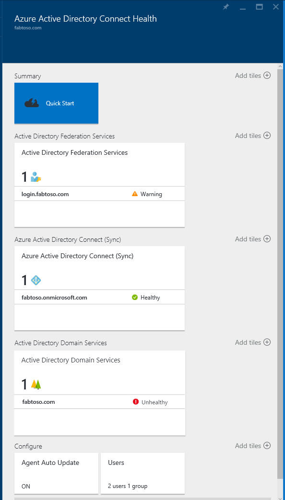

<properties
    pageTitle="Überwachen Sie Ihrer lokalen Identitätsinfrastruktur in der Cloud."
    description="Dies ist die Azure AD verbinden Dienststatus-Seite, die beschreibt, wie es ist und warum Sie es verwenden möchten."
    services="active-directory"
    documentationCenter=""
    authors="karavar"
    manager="samueld"
    editor="curtand"/>

<tags
    ms.service="active-directory"
    ms.workload="identity"
    ms.tgt_pltfrm="na"
    ms.devlang="na"
    ms.topic="get-started-article"
    ms.date="10/18/2016"
    ms.author="vakarand"/>

# Überwachen Sie Ihrer lokalen Identität Infrastruktur und Synchronisierung der Dienste in der cloud

Azure AD verbinden Gesundheit hilft Ihnen überwachen und Einblick Ihrer lokalen Identitätsinfrastruktur und der Synchronisierungsdienste.  Es können Sie eine zuverlässige Verbindung mit Office 365 und Microsoft Online Services zu verwalten, indem Sie Überwachungsfunktionen für Ihre Identität Key-Komponenten, wie z. B. AD FS-Servern, Azure AD verbinden Servers (QuickInfos synchronisieren-Engine), Active Directory-Domäne Controller usw. bereitstellen. Dies ist auch die wichtigsten Datenpunkte zu diesen Komponenten einfach zugänglich, sodass sie mühelos Verwendung und anderen wichtigen Einsichten auszuführende informiert Entscheidungen zu erhalten.

Die Informationen werden Ihnen im [Azure AD verbinden Gesundheitsportal](https://aka.ms/aadconnecthealth)angezeigt. Verwenden des Portals Azure AD verbinden Systemzustand können Sie Benachrichtigungen, Überwachen der Leistung, Nutzungsanalysen und vieles mehr anzeigen. Azure AD verbinden Gesundheit ermöglicht die einzelnen Lens der Zustand für Ihre Identität Key-Komponenten alle an einer zentralen Stelle.

Zukünftige Updates Azure AD verbinden Gesundheit enthalten zusätzliche Überwachung und einen Einblick in zusätzliche Identität Komponenten. Womit Sie einen einzelnen Aufspüren durch die Lens Identität, aktivieren Sie eine noch mehr robuste, fehlerfreie und integrierte Umgebung verfügen, der Ihre Benutzer nutzen können, erhöhen die Möglichkeit, Dinge zu erledigen.

## Gründe für die Verwendung Azure AD verbinden Dienststatus

Integrieren von Ihrem lokalen Verzeichnissen in Azure AD Ihrer Anwender macht produktiver durch Bereitstellen einer gemeinsamen Identität für den Zugriff auf sowohl die Cloud lokalen Ressourcen. Mit dieser Integration enthält die Herausforderung, um sicherzustellen, dass diese Umgebung fehlerfrei ist, sodass die Benutzer zuverlässig Ressourcen beide lokalen zugreifen können und in der Cloud von jedem Gerät aus. Azure AD verbinden Gesundheit bietet einen einfachen cloudbasierten Ansatz zum Überwachen und gewinnen Sie Einsichten in Ihrer lokalen Identitätsinfrastruktur, die zum Zugreifen auf Office 365 oder einer anderen Anwendung Azure AD-verwendet wird. Es ist so einfach wie das Installieren eines Agents auf Ihrem lokalen Identität-Servern.

## [Azure AD verbinden Gesundheit für AD FS](active-directory-aadconnect-health-adfs.md)

Azure AD verbinden Gesundheit für AD FS unterstützt AD FS 2.0 unter Windows Server 2008 R2, AD FS unter Windows Server 2012 und Windows Server 2012R2 an. Darüber hinaus unterstützt die Überwachung AD FS Proxy oder Web Anwendungsproxy-Servern die Authentifizierung Unterstützung von extranet-Zugriff. Mit einer einfacher und kostengünstiger Installation von der Health Agent bietet Azure AD verbinden Gesundheit für AD FS den folgenden Satz von wichtigen Funktionen:

- Überwachen von Benachrichtigungen, wenn AD FS und AD FS-Proxy-Servern nicht fehlerfrei sind
- E-Mail-Benachrichtigungen für kritischen Benachrichtigungen
- Anzeigen von Trends in Performance-Daten, für die Planung von AD FS
- Nutzungsanalysen für AD FS-Benutzernamen mit anderen Pivot (apps, Benutzer Netzwerkspeicherort usw.) hilfreich, verstehen, wie AD FS ausgelastet erste ist.
- Berichte für AD FS Top 50 Benutzern mit fehlerhaften Benutzername und Kennwort versucht, mit dem letzten IP-Adresse

Das folgende Video bietet einen Überblick über die Azure AD verbinden Gesundheit für AD FS

>[AZURE.VIDEO azure-ad-connect-health--monitor-you-identity-bridge]

## [Azure AD verbinden Gesundheit für synchronisieren](active-directory-aadconnect-health-sync.md)

Azure AD verbinden Gesundheit für synchronisieren überwacht und enthält Informationen über die Synchronisierung aus, die zwischen der lokalen Active Directory und Azure Active Directory auftreten. Azure AD verbinden Gesundheit für synchronisieren stellt den folgenden Satz von wichtigen Funktionen:

- Überwachung mit Benachrichtigungen wissen, wann ist Azure AD verbinden Servern QuickInfos für die Synchronisierungs-Engine nicht fehlerfrei
- E-Mail-Benachrichtigungen für kritischen Benachrichtigungen
- Synchronisieren Betrieb Einsichten einschließlich Diagrammen Wartezeit für Vorgänge synchronisieren und Trends in verschiedenen Vorgängen wie hinzufügt, Updates, werden gelöscht.
- Schnell eine Übersicht Informationen zum Synchronisieren von Eigenschaften, die letzten erfolgreichen Export nach Azure AD
- Berichte über Objekt abgleichen Synchronisierungsfehler \(Azure AD Premium sind nicht erforderlich\)

Das folgende Video bietet einen Überblick über die Azure AD verbinden Gesundheit für synchronisieren

>[AZURE.VIDEO azure-active-directory-connect-health-monitoring-the-sync-engine]

## [Azure AD verbinden Gesundheit für AD DS (Preview)](active-directory-aadconnect-health-adds.md)

Azure AD verbinden Gesundheit für AD DS bietet Überwachungsfunktionen für Domänencontroller installiert unter Windows Server 2008 R2, Windows Server 2012 und Windows Server 2012 R2. Eine einfacher und kostengünstiger Health Agent-Installation ermöglicht es Ihnen, überwachen die lokalen AD DS-Umgebung direkt aus der Cloud. Azure AD verbinden Gesundheit für AD DS bietet die folgenden Key Funktionen:

- Überwachen von Benachrichtigungen zu erkennen, wenn die Domänencontroller fehlerhaft, zusammen mit e-Mail-Benachrichtigungen für kritischen Benachrichtigungen sind.
- Domänencontroller Dashboards, die einen schnellen Überblick über die Gesundheit und Betrieb Staus Ihrer Domänencontroller bereitstellt.
- Wenn Fehler erkannt werden, begleitet Replikation Status Dashboard mit neuesten Replikationsinformationen sowie Links zu behandeln.
- An einer beliebigen Stelle schnellen Zugriff auf Daten Diagramme für die Performance beliebte Leistung Indikatoren, für die Überwachung und Problembehandlung bei Bedarf.

Das folgende Video bietet einen Überblick über die Azure AD verbinden Gesundheit für AD DS

>[AZURE.VIDEO azure-ad-connect-health-monitors-on-premises-ad-domain-services]

## Erste Schritte mit Azure AD verbinden Dienststatus
Es ist sehr einfach zu den ersten Schritten mit Azure AD verbinden Dienststatus. Führen Sie die folgenden Schritte aus:

1. [Abrufen von Azure AD Premium](active-directory-get-started-premium.md) oder [Starten Sie eine Testversion](https://azure.microsoft.com/trial/get-started-active-directory/)

2. [Herunterladen und Installieren von Azure AD verbinden Gesundheit-Agents](#download-and-install-azure-ad-connect-health-agent) auf Ihre Identität-Servern.

3. Ansicht Azure AD verbinden Dienststatus-Dashboard am [https://aka.ms/aadconnecthealth](https://aka.ms/aadconnecthealth)

>[AZURE.NOTE]Denken Sie daran, dass, bevor Sie Daten in Ihrer Azure AD verbinden Dienststatus-Dashboard sehen, Sie die Azure AD-verbinden Health Agents auf den Servern zu installieren müssen.

## Herunterladen und installieren Azure AD verbinden Health-Agent

- Finden Sie unter die [Anforderungen](active-directory-aadconnect-health-agent-install.md#Requirements) für Azure AD Gesundheit verbinden

- Sie können den Einstieg Azure AD verbinden Gesundheit für AD FS die neueste Version des Agents hier herunterladen: [herunterladen Azure AD verbinden Health Agent für AD FS.](http://go.microsoft.com/fwlink/?LinkID=518973)

- Um anzufangen mithilfe von Azure AD verbinden Gesundheit für synchronisieren, herunterladen Sie und installieren Sie der [neuesten Version von Azure AD verbinden](http://go.microsoft.com/fwlink/?linkid=615771).  Als Teil der Installation Azure AD Verbinden des Dienststatus-Agents installiert werden (Version 1.0.9125.0 oder höher).  Verbinden von Azure AD unterstützt ein direktes Upgrade aus früheren Versionen.

- Den Einstieg Azure AD verbinden Gesundheit für AD DS können Sie die neueste Version des Agents hier herunterladen: [herunterladen Azure AD verbinden Health Agent für AD DS.](http://go.microsoft.com/fwlink/?LinkID=820540)

## Azure AD verbinden Dienststatus-Portal
Im Portal Azure AD verbinden Systemzustand können Sie Benachrichtigungen zum Überwachen der Leistung und Nutzungsanalysen anzeigen. https://AKA.ms/aadconnecthealth gelangen Sie zum Hauptfenster Falz Azure AD verbinden Dienststatus.  Sie können eine Blade als Fenster vorstellen. Klicken Sie auf das Hauptfenster Blade wird Schnellstart, Dienste in Azure AD verbinden Gesundheit und zusätzliche Konfigurationsoptionen. Unter den Screenshot befindet sich eine kurze Erläuterung der einzelnen von Drittanbietern.  Nachdem Sie die Agents bereitgestellt haben, identifiziert der Dienststatus Dienst automatisch für die Dienste, die Überwachung Azure AD verbinden Integrität ist.

- **Schnellstart** – wird, indem Sie diese Sie auswählen, das Blade Schnellstart geöffnet. Hier werden Sie möglicherweise zum Herunterladen des Azure AD verbinden Health Agents durch Auswählen von Tools erhalten, Dokumentation zugreifen und Feedback bereitstellen.

- **Active Directory Federation Services** – Dies stellt alle AD FS-Dienste, die aktuell Azure AD verbinden Gesundheit überwacht werden. Indem Sie eine der Instanzen auswählen, wird eine Blade mit Informationen zu diesen Services-Instanz geöffnet.  Diese Informationen enthält eine Übersicht, Eigenschaften, Benachrichtigungen, Überwachung und Verwendung Analytics. Weitere Informationen zu den Funktionen [hier.](active-directory-aadconnect-health-adfs.md)

- **Azure Active Directory verbinden (synchronisieren)** – Hierbei handelt es sich um Ihren Azure AD verbinden-Servern, die aktuell Azure AD verbinden Gesundheit überwacht werden. Indem Sie den Eintrag auswählen, wird eine Blade mit Informationen zu Ihren Servern Azure AD verbinden geöffnet. Weitere Informationen zu den Funktionen, die [hier.](active-directory-aadconnect-health-sync.md)

- **Active Directory-Domänendiensten** – Dies stellt allen AD DS-Gesamtstrukturen, die aktuell Azure AD verbinden Gesundheit überwacht werden. Indem Sie einer auswählen, wird eine Blade mit Informationen zu dieser Gesamtstruktur geöffnet.  Diese Informationen enthält eine Übersicht über wichtige Informationen, Domain Controller Dashboard, Replikationsstatus Dashboard, Benachrichtigungen und überwachen. Weitere Informationen zu den Funktionen [hier.](active-directory-aadconnect-health-adds.md)

- **Konfigurieren** – diese Weise können Sie aktivieren oder deaktivieren Sie die folgenden:

    1. Automatisches Aktualisieren, um der Azure AD verbinden Health Agent automatisch auf die neueste Version aktualisieren – Dies bedeutet, dass Sie automatisch, um die neueste Version von der Azure AD verbinden Health Agent aktualisiert werden sobald diese verfügbar sind. Dies ist standardmäßig aktiviert.

    2. Microsoft Access auf Ihrem Azure AD-Verzeichnis Gesundheitsdaten nur zur Problembehandlung zu ermöglichen – Dies bedeutet, dass, wenn diese Einstellung aktiviert ist, Microsoft imstande sein sollen, um dieselben Daten anzuzeigen, die angezeigt wird. Dies kann sich bei der Problembehebung und Hilfe bei Problemen helfen. Dies ist standardmäßig deaktiviert.

## Links zu verwandten Themen

* [Azure AD verbinden Health Agent-Installation](active-directory-aadconnect-health-agent-install.md)
* [Azure AD verbinden Gesundheit Vorgänge](active-directory-aadconnect-health-operations.md)
* [Azure AD-Dienststatus mit AD FS verbinden](active-directory-aadconnect-health-adfs.md)
* [Schließen Sie Dienststatus mit Azure AD für synchronisieren](active-directory-aadconnect-health-sync.md)
* [Azure AD-Dienststatus in AD DS verbinden](active-directory-aadconnect-health-adds.md)
* [Azure AD verbinden Gesundheit häufig gestellte Fragen](active-directory-aadconnect-health-faq.md)
* [Azure AD verbinden Versionsverlauf Dienststatus](active-directory-aadconnect-health-version-history.md)
