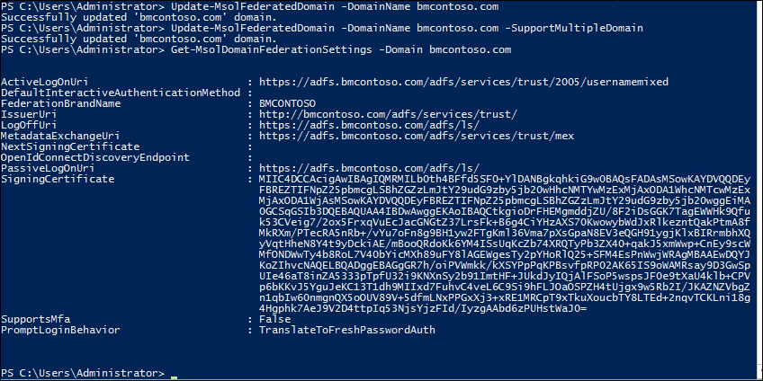
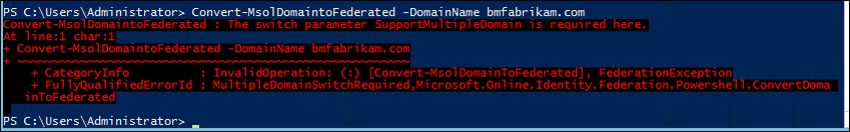
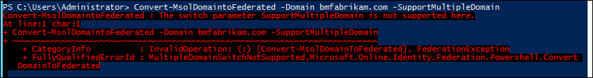
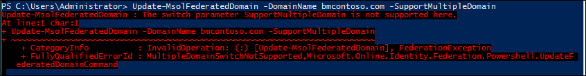
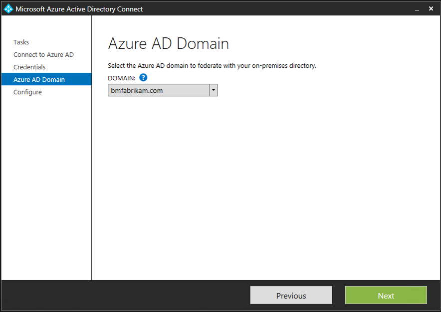
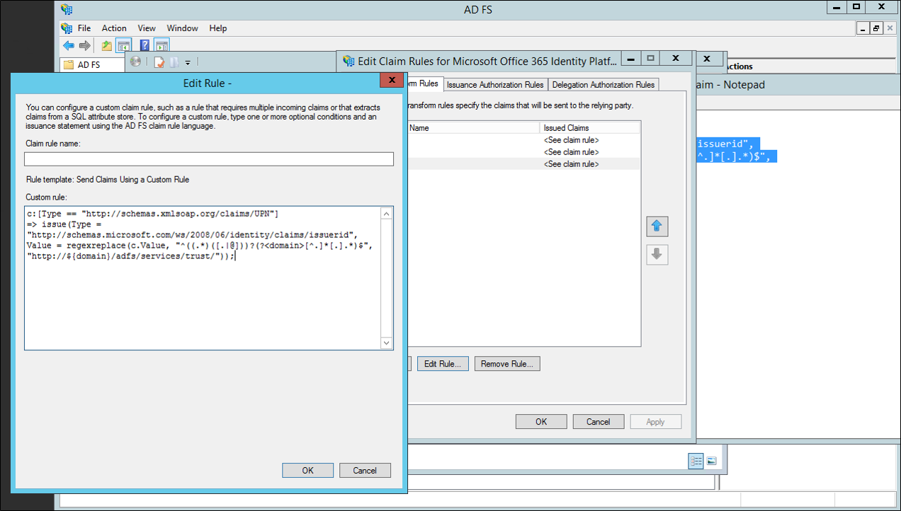

<properties
    pageTitle="Azure AD verbinden mehrere Domänen"
    description="Dieses Dokument beschreibt das Einrichten und konfigurieren mehrere Domänen der obersten Ebene mit Office 365 und Azure AD-."
    services="active-directory"
    documentationCenter=""
    authors="billmath"
    manager="femila"
    editor="curtand"/>

<tags
    ms.service="active-directory"
    ms.workload="identity"
    ms.tgt_pltfrm="na"
    ms.devlang="na"
    ms.topic="article"
    ms.date="08/08/2016"
    ms.author="billmath"/>

# Unterstützung für mehrere Domänen für eine Föderation mit Azure AD
Die folgende Dokumentation bietet Anleitung erfahren Sie, wie mehrere Domänen auf oberster Ebene und Unterdomänen verwendet werden, wenn Partnerverbund mit Office 365 oder Azure AD-Domänen.

## Unterstützung für mehrere Domänen auf oberster Ebene
Eine Föderation auf mehrere, Domänen auf oberster Ebene mit Azure AD erfordert einige zusätzliche Konfiguration, die nicht erforderlich ist, wenn Partnerverbund mit einem Domänen auf oberster Ebene.

Wenn Sie eine Domäne mit Azure AD verbunden ist, werden mehrere Eigenschaften auf die Domäne in Azure festgelegt.  Wichtigste ist IssuerUri.  Hierbei handelt es sich um eine URI, die von Azure AD verwendet wird, um die Domäne zu identifizieren, der das Token zugeordnet ist.  Der URI muss nicht in einen anderen Wert als aufgelöst werden, dass er einen gültigen URI sein muss.  Standardmäßig Azure AD setzt diesen Wert auf den Wert der Föderation Service-ID in der lokalen AD FS Konfiguration.

>[AZURE.NOTE]Der Föderation Dienstbezeichner ist ein URI, der einen Dienst Föderation identifiziert.  Der Dienst Föderation ist eine Instanz von AD FS dieser Funktionen als die Sicherheitstoken-Dienst an. 

Können Sie mithilfe des Befehls PowerShell Listenansicht IssuerUri `Get-MsolDomainFederationSettings - DomainName <your domain>`.

Ein Problem tritt auf, wenn es mehrere Domänen auf oberster Ebene hinzufügen möchten.  Beispielsweise angenommen Setup Föderation zwischen Azure AD-stehen Ihnen und Ihrem lokalen Umgebung.  Für dieses Dokument verwende ich bmcontoso.com.  Nachdem ich eine zweite, auf oberster Ebene Domäne hinzugefügt haben bmfabrikam.com.

Wenn wir versuchen, unsere bmfabrikam.com Domäne verbunden sein konvertieren, Fehlermeldung wir eine.  Der Grund dafür ist auf Azure AD eine Einschränkung aufweist, die die Eigenschaft IssuerUri denselben Wert für mehrere Domänen haben keine zulässt.  
  

### SupportMultipleDomain Parameter

Um dieses Problem zu umgehen, müssen wir eine andere IssuerUri hinzufügen, die mithilfe von ausgeführt werden, können die `-SupportMultipleDomain` Parameter.  Für diesen Parameter ist mit den folgenden Cmdlets verwendet:
    
- `New-MsolFederatedDomain`
- `Convert-MsolDomaintoFederated`
- `Update-MsolFederatedDomain`

Für diesen Parameter ist Azure AD der IssuerUri so konfigurieren, dass sie auf den Namen der Domäne basiert.  Dies ist über Verzeichnisse in Azure AD eindeutig.  Verwenden den Parameter ermöglicht den PowerShell-Befehl erfolgreich abgeschlossen.

Die Einstellungen unserer neuen bmfabrikam.com Domäne betrachten Sie können die folgenden sehen:

Beachten Sie, dass `-SupportMultipleDomain` ändert sich nicht auf die anderen Endpunkte die weiterhin auf unseren Service Föderation auf adfs.bmcontoso.com verweisen konfiguriert werden.

Ein anderes Objekt, das `-SupportMultipleDomain` bedeutet besteht darin, dass es stellt sicher, dass es sich bei das AD FS-System in Token ausgestellt für Azure AD, den korrekten Herausgeber Wert enthält. Dies geschieht durch die Domänenteil der Benutzer Benutzerprinzipalnamen aufzeichnen und diese als die Domäne in der IssuerUri, d. h. https://{upn Suffix festlegen} / Adfs/Services/Trust. 

Daher während Azure AD-Authentifizierung oder Office 365, das Element IssuerUri in Token des Benutzers wird verwendet, um die Domäne in Azure AD gesucht werden soll.  Wenn eine Übereinstimmung, dass die Authentifizierung fehl gefunden wird. 

Beträgt beispielsweise, wenn ein Benutzer Benutzerprinzipalnamen ist bsimon@bmcontoso.com, wird das Element IssuerUri der Token AD FS-Problemen auf http://bmcontoso.com/adfs/services/trust festgelegt. Dies wird die Konfiguration von Azure AD-entsprechen, und Authentifizierung sind erfolgreich.

Im folgenden finden die angepasste anfordern Regel, die diese Logik implementiert:

    c:[Type == "http://schemas.xmlsoap.org/claims/UPN"] => issue(Type =   "http://schemas.microsoft.com/ws/2008/06/identity/claims/issuerid", Value = regexreplace(c.Value, ".+@(?<domain>.+)", "http://${domain}/adfs/services/trust/"));

>[AZURE.IMPORTANT]Beim Hinzufügen von Domänen Hinzufügen neuer oder bereits konvertieren versuchen, den Schalter - SupportMultipleDomain verwenden möchten, müssen Sie Setup Ihre Vertrauensstellung zur Unterstützung von ihnen ursprünglich haben.  

## So aktualisieren Sie die Vertrauensstellung zwischen AD FS und Azure AD-
Wenn Sie die Vertrauensstellung zwischen AD FS und Ihre Instanz von Azure AD nicht eingerichtet, müssen Sie diese Vertrauensstellung neu zu erstellen.  Dies liegt daran, wenn Setup ohne ursprünglich ist die `-SupportMultipleDomain` Parameter, die IssuerUri mit den Standardwert festgelegt ist.  Im Screenshot unten, Sie sehen, dass die IssuerUri auf https://adfs.bmcontoso.com/adfs/services/trust festgelegt ist.

In diesem Fall jetzt, wenn wir erfolgreich eine neue Domäne Azure AD-Portal hinzugefügt haben, und klicken Sie dann versuchen, daran zu konvertieren `Convert-MsolDomaintoFederated -DomainName <your domain>`, wir wird der folgende Fehler.

Wenn Sie versuchen, fügen Sie die `-SupportMultipleDomain` wechseln wir wird die folgende Fehlermeldung:

Einfach versuchen, ausführen `Update-MsolFederatedDomain -DomainName <your domain> -SupportMultipleDomain` auf die ursprüngliche Domäne auch führt zu einem Fehler.

Verwenden Sie die Schritte zum Hinzufügen einer weiteren Domäne der obersten Ebene aus.  Wenn Sie bereits eine Domäne hinzugefügt haben, und dafür nicht verwendet die `-SupportMultipleDomain` Parameter, beginnen Sie mit den Schritten zum Entfernen und Aktualisieren Ihrer ursprüngliche Domäne.  Wenn Sie eine Domäne der obersten Ebene nicht hinzugefügt haben können noch Sie die Schritte zum Hinzufügen einer Domäne mit PowerShell Azure AD Verbinden starten.

Gehen Sie folgendermaßen vor, entfernen Sie die Microsoft Online-Vertrauensstellung und Aktualisieren Ihrer ursprüngliche Domäne.

2.  Auf dem AD FS-Verbundserver öffnen **AD FS-Verwaltung.** 
2.  Erweitern Sie auf der linken Seite **Vertrauen Beziehungen** und **Verlassen vertrauen**
3.  Löschen Sie den Eintrag **Microsoft Office 365-Identitätsplattform** , auf der rechten Seite.

1.  Führen Sie auf einem Computer, [Azure Active Directory-Modul für Windows PowerShell](https://msdn.microsoft.com/library/azure/jj151815.aspx) installiert ist Folgendes: `$cred=Get-Credential`.  
2.  Geben Sie den Benutzernamen und das Kennwort für ein globaler Administrator für die Azure AD-Domäne, die, der Sie mit Partnerverbund sind
2.  Geben Sie in der PowerShell`Connect-MsolService -Credential $cred`
4.  Geben Sie in der PowerShell `Update-MSOLFederatedDomain -DomainName <Federated Domain Name> -SupportMultipleDomain`.  Dies ist für die ursprüngliche Domäne.  Also mithilfe der oben genannten Domänen, die es wäre:`Update-MsolFederatedDomain -DomainName bmcontoso.com -SupportMultipleDomain`

Gehen Sie folgendermaßen vor, um die neue Domäne der obersten Ebene mithilfe der PowerShell hinzuzufügen

1.  Führen Sie auf einem Computer, [Azure Active Directory-Modul für Windows PowerShell](https://msdn.microsoft.com/library/azure/jj151815.aspx) installiert ist Folgendes: `$cred=Get-Credential`.  
2.  Geben Sie den Benutzernamen und das Kennwort für ein globaler Administrator für die Azure AD-Domäne, die, der Sie mit Partnerverbund sind
2.  Geben Sie in der PowerShell`Connect-MsolService -Credential $cred`
3.  Geben Sie in der PowerShell`New-MsolFederatedDomain –SupportMultipleDomain –DomainName`

Gehen Sie folgendermaßen vor, die neue Domäne der obersten Ebene mit Azure AD verbinden hinzufügen.

1.  Starten Sie Azure AD verbinden vom Desktop oder Startmenü
2.  Wählen Sie "Eine zusätzliche Azure AD-Domäne hinzufügen" 
3.  Geben Sie Ihre Azure AD- und Active Directory-Anmeldeinformationen
4.  Wählen Sie die zweite Domäne, die Sie für die Föderation konfigurieren möchten.

5.  Klicken Sie auf Installieren

### Überprüfen Sie die neue Domäne der obersten Ebene
Mithilfe des Befehls PowerShell `Get-MsolDomainFederationSettings - DomainName <your domain>`können Sie die aktualisierten IssuerUri anzeigen.  Das Bildschirmabbild unten zeigt der Föderation, dass die Einstellungen auf unsere ursprüngliche Domäne http://bmcontoso.com/adfs/services/trust aktualisiert wurden

Und die IssuerUri auf unserer neuen Domäne auf https://bmfabrikam.com/adfs/services/trust festgelegt wurde

##Unterstützung für Unterdomänen
Wenn Sie eine untergeordnete Domäne aufgrund der Weise Azure AD gehandhabt Domänen hinzufügen, werden sie die Einstellungen des übergeordneten Elements erben.  Dies bedeutet, dass die IssuerUri die Eltern entsprechen muss.

Lassen Sie uns sagen beispielsweise, dass ich habe bmcontoso.com, und fügen Sie dann corp.bmcontoso.com hinzu.  Dies bedeutet, dass die IssuerUri für einen Benutzer aus corp.bmcontoso.com sein muss **http://bmcontoso.com/adfs/services/trust.**  Jedoch die standardmäßige Regel für Azure AD über implementiert wird ein Token mit ein Herausgeber als generieren **http://corp.bmcontoso.com/adfs/services/trust.** Wert, die der Domäne nicht übereinstimmen, werden erforderlich und Authentifizierung schlägt fehl.

### So aktivieren Sie die Unterstützung für Unterdomänen
Um dieses Problem umgehen, die AD FS muss sich verlassen Partei Trust für Microsoft Online aktualisiert werden.  Dazu müssen Sie eine Regel benutzerdefinierten Anspruch so konfigurieren, dass beim Erstellen des benutzerdefinierten Herausgebers Werts deaktivieren alle Unterdomänen aus des Benutzers UPN Suffix entfernt. 

Die folgenden anfordern wird folgende Schritte ausführen:

    c:[Type == "http://schemas.xmlsoap.org/claims/UPN"] => issue(Type = "http://schemas.microsoft.com/ws/2008/06/identity/claims/issuerid", Value = regexreplace(c.Value, "^((.*)([.|@]))?(?<domain>[^.]*[.].*)$", "http://${domain}/adfs/services/trust/"));

Gehen Sie folgendermaßen vor, einen benutzerdefinierten Anspruch zur Unterstützung von Unterdomänen hinzufügen.

1.  Öffnen der AD FS-Verwaltung
2.  Klicken Sie mit der rechten Maustaste im Microsoft Online RP Trust, und wählen Sie Regeln bearbeiten anfordern
3.  Wählen Sie die dritte anfordern Regel aus, und Ersetzen Sie 
4.  Ersetzen Sie den aktuellen anfordern:
    
        c:[Type == "http://schemas.xmlsoap.org/claims/UPN"] => issue(Type = "http://schemas.microsoft.com/ws/2008/06/identity/claims/issuerid", Value = regexreplace(c.Value, ".+@(?<domain>.+)","http://${domain}/adfs/services/trust/"));
        
    mit
    
        `c:[Type == "http://schemas.xmlsoap.org/claims/UPN"] => issue(Type = "http://schemas.microsoft.com/ws/2008/06/identity/claims/issuerid", Value = regexreplace(c.Value, "^((.*)([.|@]))?(?<domain>[^.]*[.].*)$", "http://${domain}/adfs/services/trust/"));`
    

5.  Klicken Sie auf Ok.  Klicken Sie auf Übernehmen.  Klicken Sie auf Ok.  AD FS-Verwaltung zu schließen.

