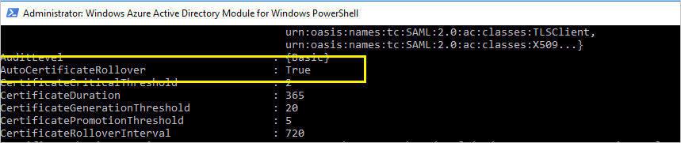
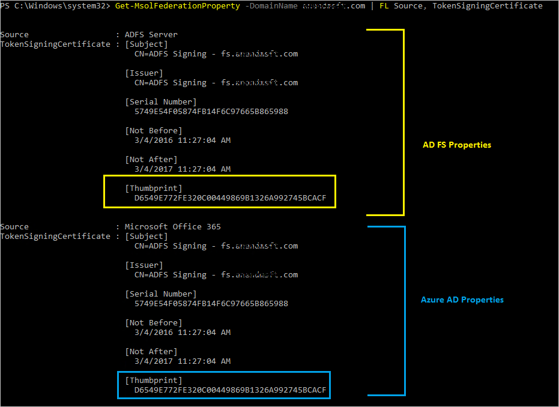

<properties
    pageTitle="Das Zertifikat Erneuerung Anleitungen für Office 365 und Azure-Active Directory-Benutzer | Microsoft Azure"
    description="In diesem Artikel erläutert für Office 365-Benutzer zur Lösung von Problemen mit e-Mails, die sie über ein Zertifikat erneuern benachrichtigen."
    services="active-directory"
    documentationCenter=""
    authors="billmath"
    manager="femila"
    editor="curtand"/>

<tags
    ms.service="active-directory"
    ms.workload="identity"
    ms.tgt_pltfrm="na"
    ms.devlang="na"
    ms.topic="article"
    ms.date="08/08/2016"
    ms.author="billmath"/>

# Erneuern Sie für Office 365 und Azure Active Directory Federation Zertifikate

##(Übersicht)

Für eine erfolgreiche Föderation zwischen Azure Active Directory (Azure AD) und Active Directory Federation Services (AD FS) sollten die Zertifikate von AD FS verwendet, um Sicherheitstokens zu Azure AD-melden übereinstimmen was in Azure AD konfiguriert ist. Jede Abweichung kann zu fehlerhaften Trust führen. Azure AD wird sichergestellt, dass diese Informationen beim Bereitstellen von AD FS und Web-Anwendungsproxy (für extranet-Zugriff) synchron bleiben.

In diesem Artikel erhalten Sie zusätzliche Informationen zum Verwalten Ihrer Zertifikate Signieren Tokens und synchron gehalten werden mit Azure AD in den folgenden Fällen:

* Sie sind nicht der Web-Proxy-Anwendung bereitstellen, und die Metadaten Föderation ist daher nicht verfügbar in das extranet.
* Sie verwenden die standardmäßige Konfiguration von AD FS nicht für Token Zertifikate signieren.
* Sie sind ein Drittanbieter-Identitätsanbieter verwenden.

## Standardkonfiguration von AD FS für Token Signieren von Zertifikaten

Die token Signieren Token entschlüsseln Zertifikate sind in der Regel selbstsignierten Zertifikaten und eignen sich für ein Jahr. AD FS enthält standardmäßig einen automatische Verlängerung Prozess mit dem Namen **AutoCertificateRollover**. Wenn Sie AD FS 2.0 oder höher, Office 365 und Azure AD-automatisch verwenden aktualisieren Sie Ihrer Zertifikat, bevor diese abgelaufen ist.

### Erneuerung Benachrichtigung über Office 365-Portal oder eine e-Mail-Nachricht

>[AZURE.NOTE] Wenn Sie eine e-Mail-Nachricht oder eine Portalseite Benachrichtigung mit der Frage, so erneuern Sie Ihr Zertifikat für Office erhalten haben, finden Sie unter [Verwalten von Änderungen bei der Anmeldung Zertifikate Token](#managecerts) prüfen, ob Sie Maßnahmen ergreifen müssen. Microsoft kennt eine mögliche Problem, das dazu, dass Benachrichtigungen für Erneuerung eines Zertifikats gesendet führen kann, auch wenn keine Maßnahmen nötig sind.

Azure AD versucht, die Metadaten Föderation überwachen und aktualisieren das Token Zertifikate signieren, wie durch diese Metadaten angezeigt. 30 Tage vor Ablauf der Token Zertifikate, bei der Anmeldung überprüft Azure AD aus, wenn neue Zertifikate verfügbar sind, indem die Föderation Metadaten abgerufen.

* Wenn es erfolgreich Umfrage unter den Föderation Metadaten und die neuen Zertifikate abrufen kann, wird keine e-Mail-Benachrichtigung oder eine Warnung in Office 365-Portal an den Benutzer ausgegeben.
* Wenn sie das neue Token Signieren Zertifikate abrufen kann, Probleme entweder, da die Metadaten Föderation nicht erreichbar ist oder automatische Zertifikat Rollover nicht aktiviert ist, Azure AD einer e-Mail-Benachrichtigung und eine Warnung in Office 365-Portal.

>[AZURE.IMPORTANT] Wenn Sie AD FS, um sicherzustellen, dass Geschäftskontinuität verwenden, stellen Sie sicher, dass Ihre Server die folgenden Updates verfügen, sodass keine Fehler bei der Authentifizierung für bekannte Probleme auftreten. Dadurch werden bekannte AD FS Proxy Serverprobleme für diese Erneuerung und zukünftigen Erneuerung Perioden zu Zahlen sind:
>
>Server 2012 R2 - [Windows Server Mai 2014 Rollup](http://support.microsoft.com/kb/2955164)
>
>Server 2008 R2 und 2012 - [Authentifizierung über Proxy schlägt in Windows Server 2012 oder Windows 2008 R2 SP1](http://support.microsoft.com/kb/3094446)

## Überprüfen Sie, ob die Zertifikate aktualisiert werden müssen

### Schritt 1: Überprüfen Sie den Status AutoCertificateRollover

Öffnen Sie auf dem ADFS-Server PowerShell aus. Überprüfen Sie, dass der AutoCertificateRollover Wert true festgelegt ist.

    Get-Adfsproperties

[AZURE.NOTE] Wenn Sie AD FS 2.0 verwenden, führen Sie zuerst Add-Pssnapin Microsoft.Adfs.Powershell.

### Schritt 2: Bestätigen Sie, dass AD FS und Azure AD-synchron sind.

Klicken Sie auf dem ADFS-Server die Aufforderung Azure AD-PowerShell öffnen, und Verbinden mit Azure AD.

>[AZURE.NOTE] Sie können Azure AD-PowerShell herunterladen [können](https://technet.microsoft.com/library/jj151815.aspx).

    Connect-MsolService

Überprüfen Sie die Zertifikate in AD FS und Azure AD-Eigenschaften für die angegebene Domäne vertrauen konfiguriert.

    Get-MsolFederationProperty -DomainName <domain.name> | FL Source, TokenSigningCertificate

Wenn die Fingerabdrücke in den beiden Ausgaben übereinstimmen, werden Ihre Zertifikate synchron mit Azure AD.

### Schritt 3: Überprüfen Sie, ist das Zertifikat läuft ab

Aktivieren Sie in der Ausgabe von Get-MsolFederationProperty oder Get-AdfsCertificate für das Datum unter "Nicht nach" Wenn das Datum weniger als 30 Tage abwesend ist, sollten Sie bezüglich.

| AutoCertificateRollover | Synchron mit Azure AD Zertifikate | Föderation Metadaten ist öffentlich zugänglich | Gültigkeitsdauer | Aktion |
|:-----------------------:|:-----------------------:|:-----------------------:|:-----------------------:|:-----------------------:|
| Ja | Ja | Ja | - | Keine Maßnahme erforderlich. Finden Sie unter [Erneuern Token Signaturzertifikat automatisch](#autorenew). |
| Ja | Nein  | - | Weniger als 15 Tage | Erneuern Sie sofort. Finden Sie unter [Erneuern Token Signaturzertifikat manuell](#manualrenew)ein. |
| Nein | - | - | Weniger als 30 Tage | Erneuern Sie sofort. Finden Sie unter [Erneuern Token Signaturzertifikat manuell](#manualrenew)ein. |

\[-] Spielt keine Rolle.

## Das Signaturzertifikat automatisch Token erneuern (empfohlen)

Sie müssen keine manuelle Schritte durchzuführen, wenn beide der folgenden Punkte zutreffen:
- Sie haben Web Proxy-Anwendung, bereitgestellt, die Zugriff auf die Föderation Metadaten aus dem extranet aktivieren können.
- Sie verwenden die AD FS-Standardkonfiguration (AutoCertificateRollover ist aktiviert).

Aktivieren Sie vor, um zu bestätigen, dass das Zertifikat automatisch aktualisiert werden kann.

**1. die AD FS-Eigenschaft AutoCertificateRollover muss auf True festgelegt werden.** Dies zeigt an, dass AD FS generiert automatisch neue token signieren und Entschlüsseln token Zertifikate, bevor Sie das alte Schriftarten ablaufen.

**2. die AD FS-Metadaten Föderation ist öffentlich zugänglich.** Überprüfen Sie, ob der Metadaten Ihrer Föderation öffentlich zugängliche durch Navigieren auf den folgenden URL von einem Computer im öffentlichen Internet (vom Firmennetzwerk):

https:// (Your_FS_name) /federationmetadata/2007-06/federationmetadata.xml

wo `(your_FS_name) `wird mit dem Ihre Organisation, wie z. B. fs.contoso.com verwendet Föderation Dienst Hostnamen ersetzt.  Wenn Sie beide überprüfen können diese Einstellungen erfolgreich, Sie verfügen nicht über irgendetwas anderes tun.  

Beispiel: https://fs.contoso.com/federationmetadata/2007-06/federationmetadata.xml

## Erneuern Sie das Signaturzertifikat manuell token

Sie auch das Zertifikate manuell zu signieren Token erneuern. Beispielsweise die folgenden Szenarien besser für die manuelle Erneuerung funktioniert möglicherweise:
* Bei der Anmeldung Zertifikate Token sind nicht selbstsignierte Zertifikaten. Die häufigste Ursache hierfür ist, dass Ihre Organisation AD FS-Zertifikate von einer Zertifizierungsstelle organisationsinterne registriert verwaltet werden.
* Netzwerk-Sicherheit lässt sich nicht auf die Metadaten Föderation öffentlich verfügbar sein aus.

In diesen Szenarios jedes Mal, wenn Sie das Token Signieren Zertifikate, aktualisieren, müssen Sie auch Ihre Office 365-Domäne aktualisieren mithilfe des PowerShell-Befehls Update-MsolFederatedDomain.

### Schritt 1: Sicherstellen Sie, dass es sich bei AD FS neues Token Signieren Zertifikate hat

**Nicht standardmäßige Konfiguration**

Wenn Sie eine nicht standardmäßige Konfiguration von AD FS verwenden (in **AutoCertificateRollover** auf **False**festgelegt ist), verwenden Sie wahrscheinlich benutzerdefinierten Zertifikate (nicht selbst signiert). Weitere Informationen dazu, wie Sie bei der Anmeldung Zertifikate AD FS-Sicherheitstoken erneuern finden Sie unter [Anleitungen für Kunden, die nicht mit AD FS selbst Zertifikate signiert](https://msdn.microsoft.com/library/azure/JJ933264.aspx#BKMK_NotADFSCert).

**Föderation Metadaten ist nicht öffentlich verfügbar**

Andererseits, wenn **AutoCertificateRollover** auf **True**festgelegt ist, aber der Metadaten Ihrer Föderation nicht öffentlich zugängliche ist, vergewissern Sie sich zuerst, dass neue Tokensignaturzertifikate von AD FS generiert wurden. Bestätigen Sie, dass stehen Ihnen neues Token Zertifikate signieren, indem Sie die folgenden Schritte aus:

1. Stellen Sie sicher, dass Sie auf dem primären ADFS-Server angemeldet sind.
2. Überprüfen Sie die aktuellen signierenden Zertifikate in AD FS, indem Sie ein PowerShell-Befehl-Fenster zu öffnen und den folgenden Befehl ausführen:

    PS C:\>Get-ADFSCertificate – CertificateType Token signieren

    >[AZURE.NOTE] Wenn Sie AD FS 2.0 verwenden, sollten Sie zuerst Add-Pssnapin Microsoft.Adfs.Powershell ausführen.

3. Schauen Sie sich die Ausgabe des Befehls bei allen Zertifikaten aufgeführt. Wenn AD FS ein neues Zertifikat erstellt hat, sollten Sie feststellen, dass zwei Zertifikate in der Ausgabe: eine für die der Wert **IsPrimary** **Wahr** und **nicht nach** Datum ist ist innerhalb von 5 Tagen und eine für die **IsPrimary** ist **falsch** und **nicht nach** über ein Jahr in der Zukunft.

4. Wenn Sie nur ein Zertifikat angezeigt, und das **nicht nach** Datum innerhalb von 5 Tagen, müssen Sie ein neues Zertifikat generieren.

5. Um ein neues Zertifikat generieren, führen Sie den folgenden Befehl über die Befehlszeile PowerShell: `PS C:\>Update-ADFSCertificate –CertificateType token-signing`.

6. Überprüfen Sie die Aktualisierung, indem Sie erneut mit dem folgenden Befehl ausführen: PS C:\>Get-ADFSCertificate – CertificateType Token signieren

Zwei Zertifikate sollte jetzt aufgelistet werden, von denen ein Datum **nicht nach** der ungefähr ein Jahr in der Zukunft hat und für die der **IsPrimary** Wert **False**ist.

### Schritt 2: Aktualisieren des neuen Tokens Signieren von Zertifikaten für die Office 365-trust

Aktualisieren von Office 365 mit dem neuen Token Signieren Zertifikate, wie folgt für das Trust verwendet werden soll.

1.  Öffnen Sie das Microsoft Azure-Active Directory-Modul für Windows PowerShell.
2.  Ausführen von $cred = Get-Credential. Wenn dieses Cmdlet für Anmeldeinformationen aufgefordert werden, geben Sie Ihre Cloud-Dienst Konto Administratorberechtigungen.
3.  Verbinden-MsolService ausführen – $cred von Anmeldeinformationen. Dieses Cmdlet, die Sie mit der Cloud-Dienst verbunden. Erstellen einen Kontext, der mit der Cloud-Dienst verbindet ist erforderlich, bevor Sie eine zusätzliche Cmdlets installiert, indem Sie das Tool ausführen.
4.  Wenn Sie diese Befehle auf einem Computer, die nicht auf dem AD FS primären Föderation Server ist ausgeführt werden, führen Sie Set-MSOLAdfscontext-Computer <AD FS primary server>, wobei <AD FS primary server> ist der primäre ADFS-Server der interne Vollqualifizierten Domänennamen. Dieses Cmdlet erstellt einen Kontext, der mit dem AD FS verbindet.
5.  Führen Sie die Update-MSOLFederatedDomain – Domänenname <domain>. Dieses Cmdlet die Einstellungen von AD FS in der Cloud-Dienst aktualisiert, und die Vertrauensstellung zwischen den beiden konfiguriert.

>[AZURE.NOTE] Wenn Sie mehrere Domänen auf oberster Ebene, wie z. B. contoso.com und fabrikam.com, unterstützen müssen, müssen Sie den Schalter **SupportMultipleDomain** mit einem beliebigen Cmdlets verwenden. Weitere Informationen finden Sie unter [Unterstützung für mehrere Domänen der obersten Ebene](active-directory-aadconnect-multiple-domains.md).

## Reparieren von Azure AD-Trust mithilfe von Azure AD-verbinden

Wenn Sie Ihre AD FS-Farm und Azure AD-Trust konfiguriert mithilfe von Azure AD verbinden, können Azure AD verbinden Sie erkennen, wenn Sie für das Signieren Zertifikate Token Maßnahmen ergreifen müssen. Wenn Sie die Zertifikate erneuern müssen, können Sie Azure AD verbinden dazu verwenden.

Weitere Informationen finden Sie unter [Reparieren die Vertrauensstellung](./active-directory-aadconnect-federation-management.md#repairing-the-trust).
