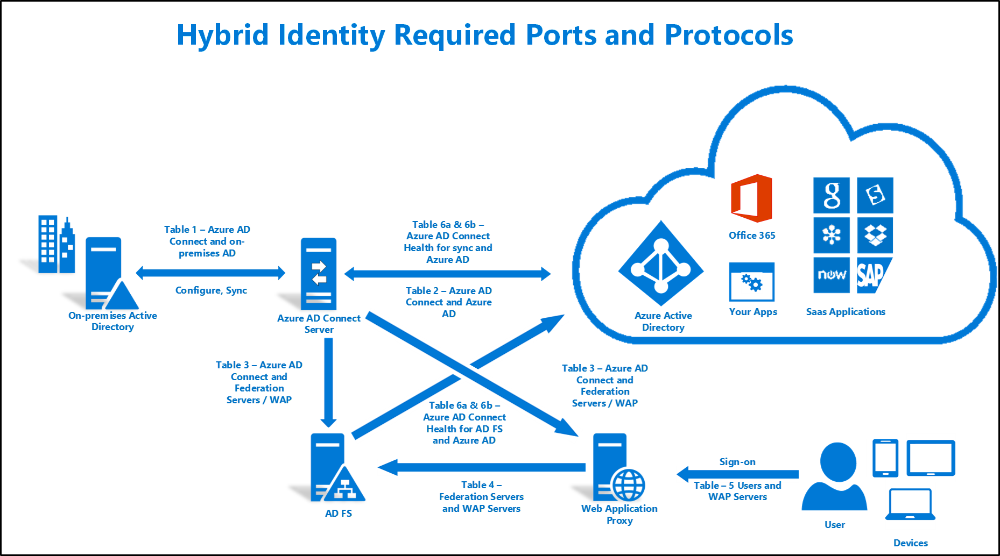

<properties
    pageTitle="Azure AD verbinden: Ports | Microsoft Azure"
    description="Diese Seite ist eine Seite technische Referenz für Ports, die erforderlich sind, um geöffnet sein, damit Azure AD-verbinden"
    services="active-directory"
    documentationCenter=""
    authors="billmath"
    manager="femila"
    editor="curtand"/>

<tags
    ms.service="active-directory"
    ms.workload="identity"
    ms.tgt_pltfrm="na"
    ms.devlang="na"
    ms.topic="article"
    ms.date="08/25/2016"
    ms.author="billmath"/>

# Hybrid Identität erforderlich Ports und Protokolle
Das folgende Dokument ist eine technische Referenz zu finden Sie Informationen zu den erforderlichen Ports und Protokolle, die für die Durchführung einer Identität Hybrid-Lösung erforderlich sind. Verwenden Sie die folgende Abbildung, und klicken Sie auf die entsprechende Tabelle verweisen.

## Tabelle 1: Azure AD verbinden und lokalen AD
Diese Tabelle beschreibt die Ports und Protokolle, die für die Kommunikation zwischen dem Server Azure AD verbinden erforderlich sind und lokalen AD.

Protokoll | Ports | Beschreibung
--------- | --------- |---------
DNS-EINTRÄGE|53 (TCP/UDP)| DNS-Suchvorgänge in der Zielgesamtstruktur.
Kerberos|88 (TCP/UDP)| Kerberos-Authentifizierung Active Directory-Struktur.
MS-RPC |135 (TCP/UDP)| Während der erstmaligen Konfiguration des Assistenten Azure AD verbinden verwendet, wenn Active Directory-Struktur gebunden wird.
LDAP|389 (TCP/UDP)| Zum Importieren von Daten aus dem Active Directory. Daten werden mit Kerberos unterschreiben und verschlüsseln verschlüsselt.
LDAP/SSL|636 (TCP/UDP)| Zum Importieren von Daten aus dem Active Directory. Die Datenübertragung ist signiert und verschlüsselt werden. Nur verwendet, wenn Sie SSL verwenden.
RPC |49152 und 65535 (verteilte hohe RPC Port)(TCP/UDP)| Während der erstmaligen Konfiguration von Azure AD verbinden verwendet, wenn sie in den Active Directory-Gesamtstrukturen bindet. Weitere Informationen finden Sie unter [KB929851](https://support.microsoft.com/kb/929851), [KB832017](https://support.microsoft.com/kb/832017)und [KB224196](https://support.microsoft.com/kb/224196) .

## Tabelle 2: Azure AD verbinden und Azure AD-
Diese Tabelle beschreibt die Ports und Protokolle, die für die Kommunikation zwischen dem Verbinden von Azure AD-Server und Azure AD-erforderlich sind.

Protokoll |Ports |Beschreibung
--------- | --------- |---------
HTTP|80 (TCP/UDP)| Zum Herunterladen von Zertifikatsperrlisten (Zertifikatsperrlisten) zur Überprüfung des SSL-Zertifikate verwendet.
HTTPS|443(TCP/UDP)| Zum Synchronisieren mit Azure AD verwendet.

Eine Liste der URLs und IP-Adressen, die Sie in Ihrer Firewall, öffnen müssen, finden Sie unter [Office 365-URLs und IP-Adressbereiche](https://support.office.com/article/Office-365-URLs-and-IP-address-ranges-8548a211-3fe7-47cb-abb1-355ea5aa88a2).

## Tabelle 3: Azure AD verbinden und Föderation Servern/WAP
Diese Tabelle beschreibt die Ports und Protokolle, die für die Kommunikation zwischen dem Azure AD verbinden Server und Föderation/WAP-Servern erforderlich sind.  

Protokoll |Ports |Beschreibung
--------- | --------- |---------
HTTP|80 (TCP/UDP)| Zum Herunterladen von Zertifikatsperrlisten (Zertifikatsperrlisten) zur Überprüfung des SSL-Zertifikate verwendet.
HTTPS|443(TCP/UDP)| Zum Synchronisieren mit Azure AD verwendet.
WinRM|5985| WinRM Zuhörer

## Tabelle 4: WAP und Föderation-Servern
Diese Tabelle beschreibt die Ports und Protokolle, die für die Kommunikation zwischen Servern Föderation und WAP-Servern erforderlich sind.

Protokoll |Ports |Beschreibung
--------- | --------- |---------
HTTPS|443(TCP/UDP)| Für die Authentifizierung verwendet.

## Tabelle 5: WAP und Benutzer
Diese Tabelle beschreibt die Ports und Protokolle, die für die Kommunikation zwischen den Benutzern und den WAP-Servern erforderlich sind.

Protokoll |Ports |Beschreibung
--------- | --------- |--------- |
HTTPS|443(TCP/UDP)| Für das Geräteauthentifizierung verwendet.
TCP|49443 (TCP)| Für das Zertifikatauthentifizierung verwendet.

## Tabelle 6a und 6 b - Azure AD verbinden Health Agent für (AD FS/synchronisieren) und Azure AD-
Die folgenden Tabellen beschreiben die Endpunkte, Ports und Protokolle, die für die Kommunikation zwischen Agents Azure AD verbinden Gesundheit und Azure AD-erforderlich sind

### Tabelle 6a – Ports und Protokolle für Azure AD verbinden Health Agent für (AD FS/synchronisieren) und Azure AD-
Diese Tabelle beschreibt die folgenden ausgehenden Ports und Protokolle, die für die Kommunikation zwischen den Azure AD verbinden Dienststatus-Agents und Azure AD-erforderlich sind.  

Protokoll |Ports  |Beschreibung
--------- | --------- |--------- |
HTTPS|443(TCP/UDP)| Ausgehende
Azure Dienstbus|5671 (TCP/UDP)| Ausgehende

### 6 b - Endpunkte für Azure AD verbinden Health Agent für (AD FS/synchronisieren) und Azure AD-
Eine Liste von Endpunkten finden Sie unter [Abschnitt Anforderungen für den Agent Azure AD verbinden Dienststatus](active-directory-aadconnect-health-agent-install.md#requirements).
