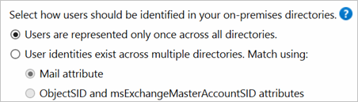

<properties
    pageTitle="Azure AD-verbinden: Unterstützte Topologien | Microsoft Azure"
    description="In diesem Thema werden unterstützte und nicht unterstützte Topologien für Azure AD-verbinden"
    services="active-directory"
    documentationCenter=""
    authors="AndKjell"
    manager="femila"
    editor=""/>
<tags
    ms.service="active-directory"
    ms.devlang="na"
    ms.tgt_pltfrm="na"
    ms.workload="identity"
    ms.topic="article"
    ms.date="10/20/2016"
    ms.author="billmath"/>

# Topologien für Azure AD verbinden
Ziel dieses Themas ist es, unterschiedlichen lokalen und Azure AD-Topologien mit Azure AD verbinden synchronisieren als die wichtigsten Integration Lösung zu beschreiben. Unterstützte und nicht unterstützte Konfigurationen beschrieben.

Legende für die Bilder im Dokument:

Beschreibung | Symbol
-----|-----
Lokalen Active Directory-Struktur| 
Active Directory mit gefilterten importieren| 
Azure AD verbinden Synchronisierungsserver| 
Azure AD verbinden synchronisieren Server "Staging-Modus"| 
GALSync mit FIM2010 oder MIM2016| 
Azure AD verbinden Synchronisierungsserver, detaillierte| 
Azure AD-Verzeichnis |
Nicht unterstütztes Szenario | 

## Einzelne Gesamtstruktur, einzelner Sie Azure AD-Mandanten

Die am häufigsten verwendeten Suchtopologie ist eine einzige Gesamtstruktur lokal mit einer oder mehreren Domänen und einer einzelnen Azure AD-Mandanten. Für Azure AD-Authentifizierung wird die Synchronisierung von Kennwörtern verwendet. Die express-Installation von Azure AD verbinden unterstützt nur diese Suchtopologie.

### Einzelne Struktur, mehrere Sync-Server auf eine Azure AD-Mandanten

Es wird nicht unterstützt, wenn Sie mehrere Azure AD verbinden synchronisieren Server mit den gleichen Azure AD-Mandanten, eine Ausnahme bilden jedoch eine [staging-Server](#staging-server)verbunden haben. Es wird nicht unterstützt, auch wenn diese konfiguriert sind, um gegenseitig Satz von Objekten zu synchronisieren. Sie möglicherweise diese entschieden haben, wenn Sie nicht alle Domänen in der Gesamtstruktur von einem einzelnen Server oder Last auf mehrere Server verteilen erreichen können.

## Mehrere Gesamtstrukturen einzelner Azure AD-Mandanten

Viele Unternehmen haben Umgebungen mit mehreren lokalen Active Directory-Gesamtstrukturen. Es gibt verschiedene Gründe für die Verwendung von mehr als einem lokalen Active Directory-Struktur. Typische Beispiele sind Designs mit Konto-Ressourcengesamtstrukturen und als Ergebnis nach einer Beurteilung von Fusionen oder Übernahme.

Wenn Sie mehrere Gesamtstrukturen, alle Gesamtstrukturen haben muss durch einzigen Azure AD verbinden erreichbar Synchronisierungsserver. Sie verfügen nicht auf den Server zu einer Domäne hinzufügen. Falls erforderlich, wenn alle Gesamtstruktur erreicht haben, kann der Server in einem Netzwerk DMZ platziert werden.

Der Assistent zum Installieren von Azure AD verbinden bietet mehrere Möglichkeiten zum Konsolidieren von Benutzern in mehreren Gesamtstrukturen dargestellt. Das Ziel ist, dass ein Benutzer nur einmal in Azure AD dargestellt wird. Es gibt einige allgemeinen Topologien, die Sie, in die benutzerdefinierte Installationspfad im Assistenten zum Installieren konfigurieren können. Wählen Sie die entsprechende Option, die Ihre Suchtopologie auf der Seite **eindeutig identifizieren Benutzer**darstellt. Die Konsolidierung ist nur für Benutzer konfiguriert. Doppelte Gruppen werden nicht mit der Standardkonfiguration konsolidiert werden.

Allgemeine Topologien werden im nächsten Abschnitt erläutert: [separaten Topologien](#multiple-forests-separate-topologies), [vollständige Netz](#multiple-forests-full-mesh-with-optional-galsync)und [Konto-Ressourcen](#multiple-forests-account-resource-forest).

Die standardmäßige Konfiguration in Azure AD verbinden synchronisieren setzt voraus:

1. Benutzer haben nur ein aktiviertes Konto und die Gsamtstruktur, in dem dieses Konto befindet, zum Authentifizieren des Benutzers verwendet wird. Diese Annahme ist für beide Kennwort synchronisieren und für die Föderation. UserPrincipalName und SourceAnchor/ImmutableID stammen aus dieser Gesamtstruktur.
2. Benutzer können nur ein Postfach an.
3. Die Gesamtstruktur, die das Postfach für einen Benutzer hostet weist die beste Datenqualität für Attribute in Exchange globale Adressliste Liste (GAL) angezeigt. Wenn keine Postfach vorhanden, klicken Sie auf den Benutzer ist, kann jeder Gesamtstruktur verwendet werden, diese Attributwerte beteiligen.
4. Wenn Sie ein verknüpftes Postfach verfügen, dann wird auch ein anderes Konto in einer anderen Gesamtstruktur für die Anmeldung verwendet.

Wenn Ihre Umgebung diese Annahmen nicht übereinstimmt, passiert Folgendes:

- Wenn Sie mehr als eine aktive Konto oder mehr als einem Postfach verfügen, wird die synchronisieren-Engine wählt einen und anderen ignorieren.
- Ein verknüpftes Postfach mit keine andere aktive Konto wird in Azure AD nicht exportiert. Das Benutzerkonto ist nicht als Mitglied in eine Gruppe dargestellt. Ein verknüpftes Postfach in DirSync würde immer als ein normales Postfach dargestellt werden. Diese Änderung ist absichtlich ein anderes Verhalten zu Szenarien mit mehreren Gesamtstrukturen besser zu unterstützen.

Weitere Informationen hierzu finden Sie im [Grundlegendes zu den Standard-Konfiguration](active-directory-aadconnectsync-understanding-default-configuration.md).

### Mehrere Gesamtstrukturen, mehrere synchronisieren Server auf eine Azure AD-Mandanten

Es wird nicht unterstützt, damit mehrere Azure AD verbinden synchronisieren Server mit einem einzigen verbunden Azure AD-Mandanten. Die Ausnahme ist die Verwendung von einem [Bereitstellungsserver](#staging-server).

### Mehrere Gesamtstrukturen – separaten Topologien
**Benutzer werden nur einmal über alle Verzeichnisse dargestellt.**

In dieser Umgebung werden alle Gesamtstrukturen lokal als separate Einheiten behandelt und kein Benutzer würde in einem beliebigen anderen Gesamtstruktur vorhanden sein.
Jede Gesamtstruktur verfügt über eine eigene Exchange-Organisation, und es wird keine GALSync zwischen den Gesamtstrukturen. Diese Suchtopologie könnte die Situation nach einer Beurteilung von Fusionen/Erwerb oder in einer Organisation, in dem jede Unternehmenseinheit arbeitet, voneinander isoliert. Diese Gesamtstrukturen werden in der gleichen Organisation in Azure AD und mit einer einheitlichen GAL angezeigt werden.
In der folgenden Abbildung ist jedes Objekt in jeder Gesamtstruktur einmal im Metaverse dargestellt und in der Zielliste Azure AD-Mandanten aggregiert.

### Mehrere Gesamtstrukturen – Übereinstimmung Benutzer
**Benutzeridentitäten vorhanden über mehrere Verzeichnisse**

Allgemeine für alle diese Szenarios heißt Verteilung und Sicherheitsgruppen können enthalten eine Mischung von Benutzern, Kontakten und FSPs (Fremdschlüssel Sicherheit Hauptbenutzer)

FSPs werden in ADDS verwendet, um Mitglieder aus anderen Gesamtstrukturen in einer Sicherheitsgruppe darzustellen. Alle FSPs sind nach dem eigentlichen Objekt in Azure Active Directory.

### Mehrere Gesamtstrukturen – vollständige Netz mit optional GALSync
**Benutzeridentitäten über mehrere Verzeichnisse vorhanden ist. Mit entsprechen: Attribut ' Mail '**

Eine vollständige Netz Suchtopologie ermöglicht Benutzern und Ressourcen in jeder Gesamtstruktur befinden und häufig es wäre bidirektionale Vertrauensstellungen zwischen den Gesamtstrukturen.

Wenn Exchange in mehr als einer Gesamtstruktur vorhanden ist, könnte optional es eine lokale GALSync-Lösung. Jeder Benutzer würde als Kontakt in allen anderen Gesamtstrukturen dargestellt werden. GALSync wird im Allgemeinen implementiert Forefront Identität Manager 2010 oder Microsoft Identität-Manager 2016 verwenden. Verbinden von Azure AD kann für lokale GALSync verwendet werden.

In diesem Szenario sind Identitätsobjekte über das e-Mail-Attribut verbunden. Ein Benutzer mit dem Postfach in einer Gesamtstruktur wird durch die Kontakte in den anderen Gesamtstrukturen verknüpft.

### Mehrere Gesamtstrukturen – Konto-Ressourcengesamtstruktur
**Benutzeridentitäten über mehrere Verzeichnisse vorhanden ist. Mit entsprechen: ObjectSID und MsExchMasterAccountSID Attributen**

In einer Konto-Topologie müssen Sie eine oder mehrere Kontengesamtstrukturen mit aktiven Benutzerkonten. Sie können auch eine oder mehrere Ressourcengesamtstrukturen mit deaktivierten Konten.

In diesem Szenario vertraut (mindestens) **Ressourcengesamtstruktur** alle **Kontengesamtstrukturen**. Die Ressourcengesamtstruktur weist normalerweise ein erweitertes Active Directory-Schema mit Exchange und Lync. Alle Exchange und Lync-Dienste als auch in anderen freigegebenen Dienste ansässig sind in dieser Gesamtstruktur. Benutzer haben ein deaktiviertes Benutzerkonto in dieser Gesamtstruktur und der Kontengesamtstruktur das Postfach verknüpft ist.

## Office 365 und Suchtopologie Aspekte
Einige Office 365-Auslastung müssen bestimmte Einschränkungen unterstützte Topologien. Wenn Sie eins der folgenden verwenden möchten, lesen Sie dann das Thema unterstützte Topologien für die Arbeitsbelastung.

Arbeitsbelastung |  
--------- | ---------
Exchange Online | Wenn es mehr als eine Exchange-Organisation lokal (d. h., Exchange bereitgestellt wurde in mehr als einer Gesamtstruktur), verwenden Sie müssen Exchange 2013 SP1 oder höher. Details finden Sie hier: [hybridbereitstellungen mit mehreren Active Directory-Gesamtstrukturen](https://technet.microsoft.com/library/jj873754.aspx)
Skype für Unternehmen | Wenn Sie mehrere Gesamtstrukturen lokal verwenden, wird dann nur Konto-Topologie unterstützt. Details zu unterstützte Topologien hier zu finden sind: [Umgebung Anforderungen für Skype für Business Server 2015](https://technet.microsoft.com/library/dn933910.aspx)

## Staging-server

Azure AD verbinden unterstützt einen zweiten Server im **Modus Staging**installieren. Ein Server in diesem Modus liest Daten aus allen verbundenen Verzeichnissen jedoch nicht alles an verbundene Verzeichnisse schreiben. Es das normale Synchronisation Kreis, und hat daher eine aktualisierte Kopie der Identitätsdaten. Bei einem Ausfall, in dem der primäre Server fehlschlägt, kann über staging Server fehl. Aktion des Assistenten Azure AD verbinden. Dieser zweite Server kann in einem anderen Datencenter vorzugsweise abgelegt sein, da keine Infrastruktur für die primäre Server freigegeben werden. Sie müssen manuell auf dem primären Server an den zweiten Server vorgenommenen Änderungen Konfiguration kopieren.

Ein staging-Server kann auch verwendet werden, um eine neue benutzerdefinierte Konfiguration und den Effekt, den sie für Ihre Daten hat zu testen. Sie können eine Vorschau die Änderungen, und passen Sie die Konfiguration. Wenn Sie mit der neuen Konfiguration zufrieden sind, können Sie stellen den Bereitstellungsserver der active Server und den alten active Server in das staging Modus festlegen.

Diese Methode kann auch active Sync-Server ersetzen verwendet werden. Vorbereiten des neuen Servers, und legen Sie sie in das staging Modus. Vergewissern Sie sich, befindet sich in guten Zustand, deaktivieren Sie das staging Modus (Aktivieren des), und fahren Sie die gerade aktive Server.

Es ist möglich, mehrere Bereitstellungsserver haben, wenn Sie mehrere Sicherungskopien in verschiedenen Data Center haben möchten.

## Mehrere Azure AD-Mandanten
Microsoft empfiehlt, einen einzelnen Mandanten in Azure AD für eine Organisation.
Bevor Sie mehrere Azure AD-Mandanten verwenden möchten, Deckblatt dieser Themen häufige Szenarien, sodass Sie einen einzelnen Mandanten verwenden.

Thema |  
--------- | ---------
Verwenden von administrativen Einheiten Delegation | [Administrative Einheiten verwalten in Azure AD-](active-directory-administrative-units-management.md)

Es gibt eine 1:1-Beziehung zwischen einem Azure AD verbinden synchronisieren-Server und einem Azure AD-Mandanten. Für jede Azure AD-Mandanten benötigen Sie eine Installation von Azure AD verbinden synchronisieren Server aus. Instanzen der Azure AD-Mandanten standardmäßig isoliert sind, und Benutzer in einem Benutzer in der anderen Mandanten wird nicht angezeigt. Wenn diese Trennung vorgesehen ist, und klicken Sie dann dies eine unterstützte Konfiguration ist, aber andernfalls Sie das einzelne sollten Azure AD-Mandanten Modell.

### Jedes Objekt nur einmal in einem Azure AD-Mandanten

In diesem Suchtopologie ist eine Azure AD verbinden Synchronisierungsserver auf jede Azure AD-Mandanten verbunden. Die Azure AD verbinden synchronisieren Server müssen konfiguriert sein, zum Filtern, sodass jeder gegenseitig Objektgruppe gearbeitet haben. Sie können beispielsweise einen einzelnen Server mit einer bestimmten Domäne oder Organisationseinheit Bereich. Eine DNS-Domäne kann nur in einem einzigen registriert werden Azure AD-Mandanten. Die Benutzerprinzipalnamen der Benutzer in der lokalen AD separaten Namespaces auch verwenden muss. Angenommen, in der Abbildung oben drei separate UPN Suffixe registriert sind in der lokalen AD: contoso.com und fabrikam.com wingtiptoys.com. Die Benutzer in den einzelnen lokalen AD-Domäne einen anderen Namespace verwenden.

Es gibt keine GALsync zwischen Instanzen der Azure AD-Mandanten. Das Adressbuch in Exchange Online und Skype für Business nur zeigt Benutzer in der gleichen Mandanten.

Diese Suchtopologie weist die folgenden Einschränkungen andernfalls unterstützte Szenarien:

- Nur eine der Azure AD-Mandanten kann Exchange-Hybrid mit dem lokalen Active Directory aktivieren.
- Windows-10-Geräten können nur eine Azure AD-Mandanten zugeordnet werden.

Die Anforderung für gegenseitig Objektgruppe gilt auch für abgeschlossenen writebackvorgängen. Einige abgeschlossenen writebackvorgängen-Features werden nicht mit diesem Suchtopologie unterstützt, da diese Features wird davon ausgegangen, eine einzelne Konfiguration lokal:

-   Gruppe abgeschlossenen writebackvorgängen mit Standard-Konfiguration
-   Gerät abgeschlossenen writebackvorgängen

### Jedes Objekt mehrmals in einem Azure AD-Mandanten
 

- Es wird nicht unterstützt, wenn Sie um das gleiche Benutzerkonto an mehreren Azure AD-Mandanten zu synchronisieren.
- Es wird nicht unterstützt, stellen Sie eine Konfiguration ändern, damit Benutzer in einer Azure Active Directory als Kontakte in ein anderes Azure AD-Mandanten angezeigt werden.
- Es wird nicht unterstützt, zum Synchronisieren von Azure AD verbinden Verbindung zu mehreren Azure AD-Mandanten zu ändern.

### GALsync mithilfe der abgeschlossenen writebackvorgängen
 

Azure AD-Mandanten sind Entwurf isoliert.

- Es wird nicht unterstützt, wenn Sie um die Konfiguration von Azure AD verbinden synchronisieren zum Lesen von Daten aus einem anderen Azure AD-Mandanten zu ändern.
- Es wird nicht unterstützt, um Benutzer als Kontakte zum Exportieren einer anderen lokalen Active Directory mithilfe von Azure AD verbinden synchronisieren.

### GALsync mit dem lokalen server

Es wird unterstützt, um die lokale GALsync Benutzern zwischen zwei Exchange-Organisationen FIM2010/MIM2016 verwenden. Die Benutzer in einer Organisation wird als Fremdschlüssel Benutzer/Kontakte in der anderen Organisation. Diese unterschiedlichen lokalen anzeigen können klicken Sie dann auf die eigene Azure AD-Mandanten synchronisiert werden.

## Nächste Schritte
Um weitere Informationen zum Azure AD-Verbindung für diese Szenarios Installation finden Sie unter [benutzerdefinierte Installation von Azure AD verbinden](./connect/active-directory-aadconnect-get-started-custom.md).

Erfahren Sie mehr über die Konfiguration [Azure AD verbinden synchronisieren](active-directory-aadconnectsync-whatis.md) .

Erfahren Sie mehr über die [Integration von Ihrem lokalen Identitäten mit Azure Active Directory](active-directory-aadconnect.md).
