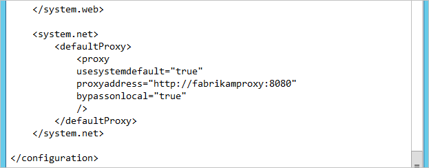
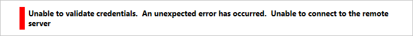
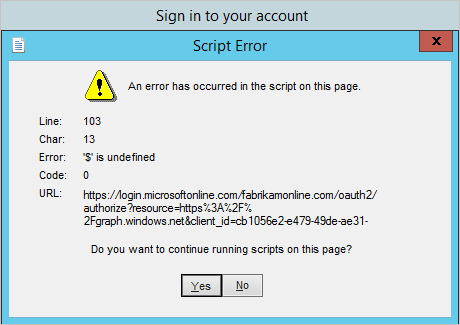
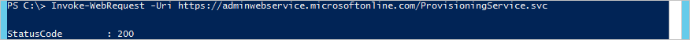
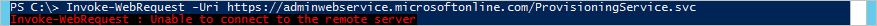
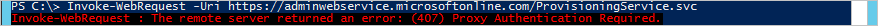
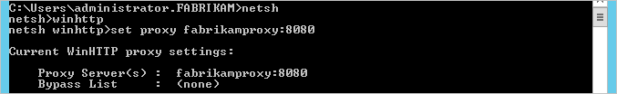
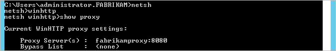

<properties
    pageTitle="Azure AD-verbinden: Behandeln von Verbindungsproblemen | Microsoft Azure"
    description="Es wird erläutert, wie von Verbindungsproblemen mit Azure AD verbinden."
    services="active-directory"
    documentationCenter=""
    authors="andkjell"
    manager="femila"
    editor=""/>

<tags
    ms.service="active-directory"
    ms.workload="identity"
    ms.tgt_pltfrm="na"
    ms.devlang="na"
    ms.topic="article"
    ms.date="06/27/2016"
    ms.author="billmath"/>

# Behandeln von Verbindungsproblemen mit Azure AD-verbinden
Dieser Artikel erläutert die Funktionsweise der Konnektivität zwischen Azure AD verbinden und Azure AD- und zur Behandlung von Verbindungsproblemen. Diese Probleme sind wahrscheinlich in einer Umgebung mit einem Proxyserver angezeigt werden.

## Behandeln von Verbindungsproblemen im Assistenten zum Installieren
Azure AD verbinden ist moderne Authentifizierung (mit der ADAL Library) für die Authentifizierung verwenden. Der Assistent zum Installieren und die richtige synchronisieren-Engine erforderlich "Machine.config" ordnungsgemäß konfiguriert sein, da diese .NET Applications sind.

In diesem Artikel werden wir zeigen, wie Fabrikam und Azure AD über deren Proxy besteht. Der Proxyserver heißt Fabrikamproxy und Anschluss 8080 verwendet.

Zuerst müssen wir stellen Sie sicher, dass [**"Machine.config"**](active-directory-aadconnect-prerequisites.md#connectivity) richtig konfiguriert ist.  

>[AZURE.NOTE]
In einigen nicht-Microsoft-Blogs ist es dokumentierten, dass miiserver.exe.config stattdessen geändert werden soll. Diese Datei ist jedoch bei jeder Aktualisierung also auch wenn es sich bei Erstinstallation funktioniert, das System funktioniert nicht mehr wird nach dem ersten aktualisieren überschrieben. Aus diesem Grund empfiehlt es sich, stattdessen "Machine.config" zu aktualisieren.

Der Proxyserver müssen auch die erforderlichen URLs geöffnet. Offizielle Liste wird in [Office 365-URLs und IP-Adressbereiche ](https://support.office.com/article/Office-365-URLs-and-IP-address-ranges-8548a211-3fe7-47cb-abb1-355ea5aa88a2)beschrieben.

Dieser ist in der folgenden Tabelle den absoluten absolute Minimum Azure AD gar herstellen können. Diese Liste enthält alle optionale Features, wie z. B. Kennwort abgeschlossenen writebackvorgängen oder Azure AD verbinden Gesundheit keinen. Es wird hier dokumentierten Problembehandlung bei der erstmaligen Konfiguration erleichtern.

URL | Port | Beschreibung
---- | ---- | ----
mscrl.Microsoft.com | HTTP/80 | Zum Herunterladen von Zertifikatsperrlisten Listen verwendet.
\*. verisign.com | HTTP/80 | Zum Herunterladen von Zertifikatsperrlisten Listen verwendet.
\*. entrust.com | HTTP/80 | Herunterladen von Zertifikatsperrlisten Listen für MFA verwendet.
\*. Windows | HTTPS/443 | Anmeldung bei Azure AD verwendet.
Secure.aadcdn.microsoftonline-p.com | HTTPS/443 | Für MFA verwendet.
\*. microsoftonline.com | HTTPS/443 | Zum Konfigurieren Ihrer Azure AD-Verzeichnis und Daten importieren/exportieren.

## Fehler im Assistenten
Zwei unterschiedlichen Sicherheitskontexten ist verwenden. Klicken Sie auf der Seite **mit Azure AD** ist es den aktuell angemeldeten Benutzer verwenden. Klicken Sie auf der Seite **Konfigurieren** ist es in dem [Konto der Dienst für die Synchronisierungs-Engine läuft](active-directory-aadconnect-accounts-permissions.md#azure-ad-connect-sync-service-accounts)zu ändern. Die Proxykonfigurationen Wir stellen global sind auf dem Computer ist ein Problem, wird das Problem am häufigsten wahrscheinlich bereits bei der **Verbindung herstellen mit Azure AD** -Seite des Assistenten angezeigt.

Dies sind die am häufigsten verwendeten Fehler, die im Assistenten zum Installieren angezeigt werden.

### Der Assistent zum Installieren wurde nicht richtig konfiguriert
Dieser Fehler wird angezeigt, wenn der Assistent selbst den Proxy erreichen kann.

- Wenn dies nicht angezeigt, stellen Sie sicher, dass die ["Machine.config"](active-directory-aadconnect-prerequisites.md#connectivity) richtig konfiguriert ist.
- Wenn die richtig aussieht, führen Sie die Schritte in [Proxy-Konnektivität überprüfen](#verify-proxy-connectivity) , um festzustellen, ob das Problem außerhalb des Assistenten ebenfalls vorhanden ist.

### Der Endpunkt MFA kann nicht erreicht werden
Dieser Fehler wird angezeigt, wenn der Endpunkt **https://secure.aadcdn.microsoftonline-p.com** nicht erreichbar und Ihre globale Administrator MFA aktiviert weist.  

- Wenn dies nicht angezeigt, stellen Sie sicher, dass der Proxy den Endpunkt secure.aadcdn.microsoftonline-p.com hinzugefügt wurde.

### Das Kennwort kann nicht bestätigt werden
Wenn Sie der Assistenten zum Installieren in Verbindung mit Azure AD erfolgreich ist, aber das Kennwort selbst kann nicht bestätigt werden, sehen Sie dies: 

- Ist das Kennwort ein temporäres Kennwort und muss werden geändert? Handelt es sich tatsächlich um das richtige Kennwort? Versuchen Sie, melden Sie sich bei https://login.microsoftonline.com (auf einem anderen Computer als auf dem Server Azure AD verbinden), und stellen Sie sicher, dass das Konto verwendet werden kann.

### Überprüfen Sie die Proxy-Verbindung
Um zu überprüfen, ob der Server Azure AD verbinden die tatsächliche Konnektivität mit dem Proxy und Internet hat werden wir einige PowerShell verwenden, um festzustellen, ob der Proxy Webanfragen zugelassen wird. Führen Sie eine Aufforderung PowerShell `Invoke-WebRequest -Uri https://adminwebservice.microsoftonline.com/ProvisioningService.svc`. (Technisch der erste Anruf besteht darin, https://login.microsoftonline.com und dieses Verfahren funktioniert auch, aber der anderen URI geht schneller reagieren.)

PowerShell wird die Konfiguration in "Machine.config" verwenden, um den Proxy wenden Sie sich an. Die Einstellungen in Winhttp/Netsh sollte keine Auswirkung auf dieser Cmdlets.

Wenn der Proxy richtig konfiguriert ist, erhalten Sie sollten eine Erfolgsmeldung: 

Wenn Sie **keine Verbindung mit dem Remoteserver möglich** erhalten dann PowerShell versucht, einen direkten Anruf zu tätigen, ohne den Proxy oder DNS nicht ordnungsgemäß konfiguriert ist. Stellen Sie sicher, dass die Datei **"Machine.config"** richtig konfiguriert ist.

Wenn der Proxy nicht richtig konfiguriert ist, wird es ein Fehler angezeigt: 

Fehler | Fehlertext | Kommentar
---- | ---- | ---- |
403 | Verboten | Der Proxy wurde nicht für die angeforderten URL geöffnet. Besuchen Sie die Proxy-Konfiguration, und stellen Sie sicher die [URLs](https://support.office.com/article/Office-365-URLs-and-IP-address-ranges-8548a211-3fe7-47cb-abb1-355ea5aa88a2) geöffnet haben.
407 | Proxy-Authentifizierung erforderlich | Der Proxyserver erforderlich anmelden und keine bereitgestellt wurde. Wenn Sie der Proxyserver-Authentifizierung erforderlich ist, stellen Sie sicher, diese in der Datei machine.config konfiguriert haben. Stellen Sie auch sicher, dass Sie für den Benutzer ausführen wie für das Dienstkonto sowie des Assistenten Domänenkonten verwenden.

## Das Kommunikationsmuster zwischen Azure AD verbinden und Azure AD-
Wenn Sie alle befolgt haben, die diese Schritte oben und weiterhin keine Verbindung herstellen können möglicherweise Sie an diesem Punkt starten Netzwerk Protokolle betrachtet. In diesem Abschnitt ist ein normales und erfolgreichen Connectivity Muster dokumentieren. Es ist auch allgemeine Rot Herrings aufgelistet, die ignoriert werden können, wenn Sie die Protokolle Netzwerk lesen.

- Anrufe an https://dc.services.visualstudio.com werden. Es ist nicht erforderlich, um diese in den Proxy für die Installation erfolgreich geöffnet ist, und diese können ignoriert werden.
- Sie sehen, dass in DNS-Auflösung der ist-Hosts in der DNS-Name Leerzeichen nsatc.net und andere Namespaces nicht unter microsoftonline.com benutzerspezifisch aufgeführt wird. Jedoch nicht mehr alle Serviceanfragen Web auf die ist-Servernamen ein, und Sie verfügen nicht über diese an den Proxy hinzufügen.
- Die Endpunkte Adminwebservice und Provisioningapi (siehe unten in den Protokollen) und Discovery-Endpunkte werden verwendet, um den tatsächlichen Endpunkt zu suchen verwenden und wird je nach Ihrer Region differierten werden.

### Verweis Proxyprotokolle
Hier ist ein Abbild aus einem tatsächlichen Proxy-Protokoll und der Assistentenseite Installation, an denen sie entnommen wurde (doppelte Einträge an den gleichen Endpunkt entfernt wurden). Dies kann als Referenz für eigene Proxy und Netzwerk Protokolle verwendet werden. Die tatsächliche Endpunkte möglicherweise in Ihrer Umgebung unterschiedlich sein (insbesondere diejenigen in *Kursiv*).

**Herstellen einer Verbindung Azure AD mit**

Zeit | URL
--- | ---
1/11/2016 8:31 | Connect://Login.microsoftonline.com:443
1/11/2016 8:31 | Connect://adminwebservice.microsoftonline.com:443
1/11/2016 8:32 | Verbinden: / /*bba800-Anker*. microsoftonline.com:443
1/11/2016 8:32 | Connect://Login.microsoftonline.com:443
1/11/2016 8:33 | Connect://provisioningapi.microsoftonline.com:443
1/11/2016 8:33 | Verbinden: / /*bwsc02-Relay*. microsoftonline.com:443

**Konfigurieren**

Zeit | URL
--- | ---
1/11/2016 8:43 | Connect://Login.microsoftonline.com:443
1/11/2016 8:43 | Verbinden: / /*bba800-Anker*. microsoftonline.com:443
1/11/2016 8:43 | Connect://Login.microsoftonline.com:443
1/11/2016 8:44 | Connect://adminwebservice.microsoftonline.com:443
1/11/2016 8:44 | Verbinden: / /*bba900-Anker*. microsoftonline.com:443
1/11/2016 8:44 | Connect://Login.microsoftonline.com:443
1/11/2016 8:44 | Connect://adminwebservice.microsoftonline.com:443
1/11/2016 8:44 | Verbinden: / /*bba800-Anker*. microsoftonline.com:443
1/11/2016 8:44 | Connect://Login.microsoftonline.com:443
1/11/2016 8:46 | Connect://provisioningapi.microsoftonline.com:443
1/11/2016 8:46 | Verbinden: / /*bwsc02-Relay*. microsoftonline.com:443

**Erster Synchronisierung**

Zeit | URL
--- | ---
1/11/2016 8:48 | Connect://Login.Windows.NET:443
1/11/2016 8:49 | Connect://adminwebservice.microsoftonline.com:443
1/11/2016 8:49 | Verbinden: / /*bba900-Anker*. microsoftonline.com:443
1/11/2016 8:49 | Verbinden: / /*bba800-Anker*. microsoftonline.com:443

## Fehler bei der Authentifizierung
Dieser Abschnitt enthält Fehler, die aus ADAL (Authentifizierung Library untersuchten Azure AD verbinden) und PowerShell zurückgegeben werden können. Erläuterung der Fehler sollte in den nächsten Schritten helfen können.

### Ungültige erteilen
Benutzername oder Kennwort ungültig. Weitere Informationen finden Sie unter [das Kennwort kann nicht bestätigt werden](#the-password-cannot-be-verified) .

### Unbekannten Benutzertyp
Ihr Azure AD-Verzeichnis kann nicht gefunden oder gelöst werden. Vielleicht versuchen Sie mit einem Username in eine Domäne nicht überprüft anmelden?

### Benutzer Bereich Discovery fehlgeschlagen ist
Netzwerk oder des Proxyservers Konfigurationsproblemen. Das Netzwerk kann nicht erreicht werden, finden Sie unter [Behandeln von Verbindungsproblemen im Assistenten zum Installieren](#troubleshoot-connectivity-issues-in-the-installation-wizard).

### Benutzerkennwort ist abgelaufen
Ihre Anmeldeinformationen sind ungültig. Ändern Sie Ihr Kennwort ein.

### AuthorizationFailure
Unbekanntes Problem.

### Authentifizierung abgebrochen
Die kombinierte Authentifizierung (MFA) Herausforderung wurde abgebrochen.

### ConnectToMSOnline
Authentifizierung war erfolgreich, doch Azure AD-PowerShell hat ein Authentifizierungsproblem.

### AzureRoleMissing
Authentifizierung war erfolgreich. Sie sind kein globaler Administrator.

### PrivilegedIdentityManagement
Authentifizierung war erfolgreich. Verwaltung von Berechtigungen Identität aktiviert wurde, und Sie sind derzeit kein globaler Administrator. Weitere Informationen finden Sie unter [Berechtigungen Identitätsmanagement](active-directory-privileged-identity-management-getting-started.md) .

### CompanyInfoUnavailable
Authentifizierung war erfolgreich. Firmeninformationen konnte nicht vom Azure AD abgerufen werden.

### RetrieveDomains
Authentifizierung war erfolgreich. Informationen zur Domäne konnte aus Azure AD nicht abgerufen werden.

## Schritte zur Problembehandlung für frühere Versionen ausführen.
Mit Versionen angefangen Build-Nummer 1.1.105.0 (veröffentlicht Februar 2016) wurde der-Anmeldeassistenten eingestellt. In diesem Abschnitt und die Konfiguration sollten nicht mehr erforderlich, aber als Referenz gespeichert ist.

Für die Single-Anmelde-Assistent entwickelt muss Winhttp konfiguriert sein. Dies kann mit [**Netsh**](active-directory-aadconnect-prerequisites.md#connectivity)erfolgen.  

### Der Anmelde-Assistenten wurde nicht richtig konfiguriert
Dieser Fehler wird angezeigt, wenn der-Anmeldeassistenten nicht den Proxy erreichen oder der Proxy ist nicht gestattet, dass die Anfrage.

- Wenn dies nicht angezeigt, prüfen Sie die Proxy-Konfiguration in [Netsh](active-directory-aadconnect-prerequisites.md#connectivity) , und stellen Sie sicher, dass er korrekt ist.

- Wenn die richtig aussieht, führen Sie die Schritte in [Proxy-Konnektivität überprüfen](#verify-proxy-connectivity) , um festzustellen, ob das Problem außerhalb des Assistenten ebenfalls vorhanden ist.

## Nächste Schritte
Erfahren Sie mehr über die [Integration von Ihrem lokalen Identitäten mit Azure Active Directory](active-directory-aadconnect.md).
