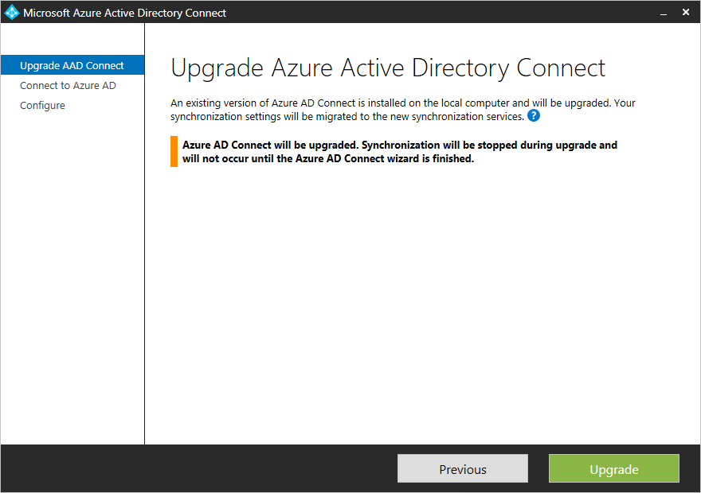
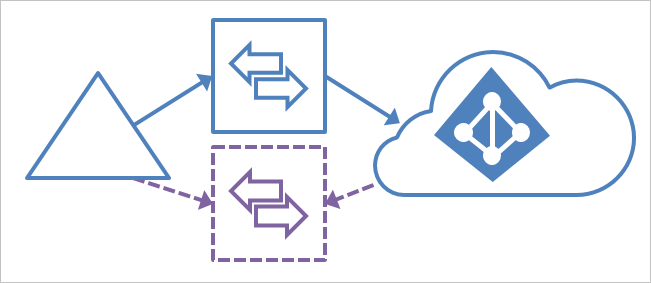
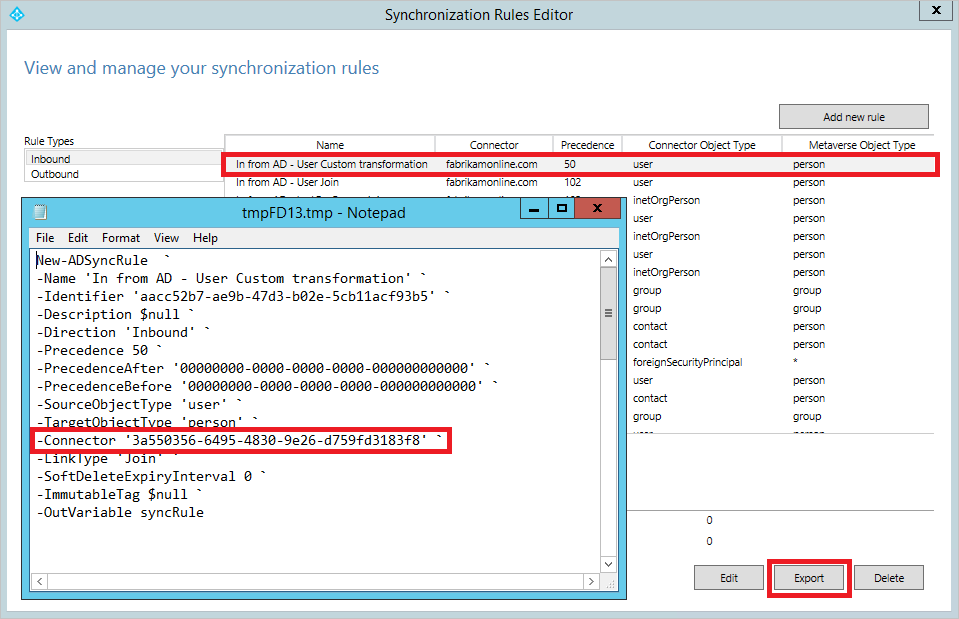

<properties
   pageTitle="Azure AD-verbinden: Upgrade von einer früheren Version | Microsoft Azure"
   description="Erläutert die unterschiedlichen Methoden, auf die neueste Version von Azure Active Directory eine Verbindung herstellen, einschließlich in-situ-Upgrade und Migration Einsatz zu aktualisieren."
   services="active-directory"
   documentationCenter=""
   authors="AndKjell"
   manager="femila"
   editor=""/>

<tags
   ms.service="active-directory"
   ms.devlang="na"
   ms.topic="article"
   ms.tgt_pltfrm="na"
   ms.workload="Identity"
   ms.date="10/12/2016"
   ms.author="billmath"/>

# Azure AD-verbinden: Upgrade von einer früheren Version auf die neueste
In diesem Thema werden die verschiedenen Methoden, die Sie verwenden können, die Installation Azure AD verbinden auf die neueste Version zu aktualisieren. Es empfiehlt sich, dass Sie sich mit den Versionen von Azure AD verbinden aktuellen beibehalten. Im [Schwenken Migration](#swing-migration) beschriebenen Schritte werden auch verwendet, wenn Sie eine umfangreiche Konfiguration ändern.

Wenn Sie von DirSync aktualisieren möchten, finden Sie unter [Upgrade von Azure Active Directory-Synchronisierungstool (DirSync)](./connect/active-directory-aadconnect-dirsync-upgrade-get-started.md) stattdessen.

Es gibt ein paar unterschiedliche Strategien zum upgrade Azure AD verbinden.

Methode | Beschreibung
--- | ---
[Automatische Aktualisierung](active-directory-aadconnect-feature-automatic-upgrade.md) | Dies ist für Kunden mit express-Installation die einfachste Methode.
[In-Place-Aktualisierung](#in-place-upgrade) | Wenn Sie einen einzelnen Server verfügen, aktualisieren Sie die Installation in-situ auf demselben Server.
[Schwenken migration](#swing-migration) | Mit zwei Servern können Sie einen der Server für die neue Version oder Konfiguration vorbereiten und active Server ändern, wenn Sie bereit sind.

Erforderlichen Berechtigungen finden Sie unter [Berechtigungen für die Aktualisierung erforderlich](./connect/active-directory-aadconnect-accounts-permissions.md#upgrade).

## In-Place-Aktualisierung
Ein in-situ-Upgrade funktioniert für das Verschieben von Azure AD synchronisieren oder Azure AD verbinden. Es funktioniert nicht für DirSync oder für eine Lösung mit FIM + Azure AD-Verbinder.

Diese Methode wird empfohlen, wenn Sie einen einzelnen Server und kleiner als ungefähr 100.000 Objekte verfügen. Wenn es Änderungen für die Synchronisierung von Out-of-Box-Regeln und einen vollständigen Import und vollständige Synchronisierung nach dem Upgrade auftreten gibt. Dadurch wird sichergestellt, dass die neue Konfiguration auf alle vorhandenen Objekte im System angewendet wird. Dies kann im Bereich der Synchronisierungs-Engine je nach Anzahl von Objekten ein paar Stunden dauern. Der normalen Delta Synchronisation Scheduler, standardmäßig alle 30 Minuten, wird die App angehalten, aber weiterhin der Synchronisierung von Kennwörtern. Sie sollten, das in-situ-Upgrade ein Wochenende durchzuführen. Wenn es keine Änderungen an der Out-of-Box-Konfiguration für die neue Version von Azure AD verbinden sind, wird eine normale Delta Import/Synchronisierung stattdessen gestartet.  

Wenn Sie Out-of-Box-Synchronisierungsregeln geändert haben, werden diese wieder Standardkonfiguration auf Upgrade festgelegt werden. Um sicherzustellen, dass Ihre Konfiguration zwischen Upgrades gehalten wird, sicherzustellen Sie, dass die Änderungen vorgenommen werden, wie unter [bewährte Methoden zum Ändern der Standard-Konfigurations](active-directory-aadconnectsync-best-practices-changing-default-configuration.md)beschrieben.

## Schwenken migration
Wenn Sie eine komplexe Bereitstellung oder sehr viele Objekte haben, kann es nicht empfehlenswert, führen Sie eine Aktualisierung in-situ-live System sein. Dies kann für einige Kunden dauern mehrere Tage und während dieses Zeitraums keine Änderungen Delta verarbeitet werden. Diese Methode ist auch verwendet werden, wenn Sie umfangreiche Änderungen an der Konfiguration vornehmen möchten, und diese testen, bevor diese in die Cloud verschoben werden soll.

Für diese Szenarios empfiehlt es sich, eine Migration Einsatz verwenden. Sie benötigen (mindestens) zwei Server, der eine aktiv und eine Bereitstellungsserver. Active Server (blaue durchgezogene Linien in der Abbildung unten) ist verantwortlich für die Herstellung der aktiven laden. Der Bereitstellungsserver (Lila gestrichelte Linien in der Abbildung unten) mit der Konfiguration oder neuen Version vorbereitet wird, und wenn Sie vollständig bereit sind, wird dieser Server active geführt. Zum vorherige aktive Server nun mit dem alten Version oder Konfiguration installiert, erfolgt die Bereitstellungsserver und aktualisiert.

Die beiden Server können verschiedene Versionen verwenden. Angenommen, der active Server, den Sie außer Betrieb setzen möchten, können Azure AD synchronisieren und der neue staging Server können Azure AD verbinden. Wenn Sie Einsatz Migration verwenden, um eine neue Konfiguration entwickeln ist es eine gute Idee, den beiden Servern dieselbe Version haben.  

Hinweis: Es wurde festgestellt, dass einige Kunden bevorzugen drei oder vier Servern für dieses Szenario haben. Wenn der Bereitstellungsserver durchgeführt wurde, müssen Sie nicht bei einer [Wiederherstellung](active-directory-aadconnectsync-operations.md#disaster-recovery)einen Sicherungskopie Server. Mit drei oder vier Servern kann eine Reihe von Primär/Standby-Servers durch die neue Version vorbereitet werden um sicherzustellen, dass es gibt immer ein staging-Server bereit sind, übernehmen.

Diese Schritte funktioniert auch zum Verschieben von Azure AD synchronisieren oder eine Lösung mit FIM + Azure AD-Verbinder. Diese Schritte funktionieren nicht für DirSync, aber die gleiche Einsatz Migration (auch als parallele Bereitstellung bezeichnet) Methode mit den Schritten für DirSync finden Sie unter [Upgrade Azure Active Directory (DirSync) zu synchronisieren](./connect/active-directory-aadconnect-dirsync-upgrade-get-started.md).

### Schwenken Migrationsschritte

1. Wenn Sie Azure AD verbinden auf beiden Servern verwenden und nur eine Änderung der Konfiguration ausführen möchten, vergewissern Sie sich Ihr active Server und Bereitstellungsserver beide die gleiche Version verwenden. Die vereinfacht Unterschiede später zu vergleichen. Wenn Sie ein Upgrade von Azure AD synchronisieren sind, müssen diese Server unterschiedliche Versionen. Wenn Sie ein Upgrade von einer älteren Version von Azure AD verbinden werden, es ist eine gute Idee, beginnen Sie mit den beiden Servern über dieselbe Version, aber es ist nicht erforderlich.
2. Wenn Sie einige benutzerdefinierte Konfiguration vorgenommen haben, und der staging-Server keine haben, führen Sie die Schritte unter [benutzerdefinierte Konfiguration von aktiv in Bereitstellungsserver verschieben](#move-custom-configuration-from-active-to-staging-server).
3. Wenn Sie ein Upgrade von einer früheren Version von Azure AD verbinden sind, aktualisieren Sie den Bereitstellungsserver auf die neueste Version. Wenn Sie aus Azure AD synchronisieren verschieben, installieren Sie Azure AD verbinden, auf Ihrem Bereitstellungsserver.
4. Lassen Sie die Synchronisierung-Engine vollständigen Import und vollständige Synchronisierung auf Ihrem Bereitstellungsserver ausführen.
5. Stellen Sie sicher, dass die neue Konfiguration selbst unerwarteten Änderungen mit den Schritten unter **Überprüfen** im [Überprüfen Sie die Konfiguration von einem Server](active-directory-aadconnectsync-operations.md#verify-the-configuration-of-a-server)verursacht hat. Wenn eines Beitrags wird nicht wie erwartet, richtige, ausführen importieren und synchronisieren, und vergewissern Sie sich, bis die Daten gut aussieht. Diese Schritte können im verknüpfte Thema gefunden werden.
6. Wechseln der staging Server als active Server. Dies ist der letzte Schritt **active Server wechseln** in [Überprüfen Sie die Konfiguration von einem Server](active-directory-aadconnectsync-operations.md#verify-the-configuration-of-a-server).
7. Wenn Sie Azure AD verbinden aktualisieren, aktualisieren Sie den Server jetzt in das staging Modus auf die neueste Version. Führen Sie die gleichen Schritte als vor dem Abrufen der Daten und Konfiguration aktualisiert. Bei einem von Azure AD synchronisieren Upgrade, können Sie jetzt deaktivieren und Ihre alten Server außer Betrieb setzen.

### Verschieben von benutzerdefinierten Konfiguration von aktiv auf Bereitstellungsserver
Wenn Sie auf dem aktiven Server Konfiguration Änderungen vorgenommen haben, müssen Sie sicherstellen, dass die gleichen Änderungen auf den Bereitstellungsserver angewendet werden.

Die benutzerdefinierten synchronisieren Regeln, die Sie erstellt haben, können mit PowerShell verschoben werden. Andere Änderungen genauso auf beiden Systemen angewendet werden müssen und nicht migriert werden.

Müssen Sie sicherstellen, was ist so konfiguriert, dass die gleiche Weise wie auf beiden Servern:

- Verbindung mit den gleichen Gesamtstrukturen.
- Alle Domäne und Organisationseinheit filtern.
- Die gleichen optionalen Funktionen, wie z. B. synchronisieren Kennwort und Kennwort abgeschlossenen writebackvorgängen.

**Regeln für das Verschieben**  
Um eine Regel für benutzerdefinierte Synchronisierung verschieben möchten, führen Sie folgende Schritte aus:

1. Öffnen Sie auf dem aktiven Server **Synchronisation Regel-Editor** ein.
2. Wählen Sie die benutzerdefinierte Regel aus. Klicken Sie auf **Exportieren**. Dadurch wird eine Editor-Fenster. Speichern Sie die temporäre Datei mit der Erweiterung PS1 aus. Auf diese Weise ein PowerShell-Skript. Kopieren Sie die Datei ps1, um die Bereitstellungsserver.  

3. Der Verbinder GUID unterscheidet sich auf den Bereitstellungsserver und muss geändert werden. Um die GUID zu gelangen, starten Sie die **Synchronisierung Regel-Editor**, wählen Sie eine der Out-of-Box-Regeln, die das gleiche verbundene System darstellt, und klicken Sie auf **Exportieren**. Ersetzen Sie die GUID in der Datei PS1 durch die GUID aus dem Bereitstellungsserver an.
4. Führen Sie in einer Aufforderung PowerShell PS1-Datei ein. Dadurch wird die Synchronisierung von benutzerdefinierten Regel auf den Bereitstellungsserver erstellt.
5. Wenn Sie mehrere benutzerdefinierte Regeln haben, wiederholen Sie für alle benutzerdefinierten Regeln.

## Nächste Schritte
Erfahren Sie mehr über die [Integration von Ihrem lokalen Identitäten mit Azure Active Directory](active-directory-aadconnect.md).
