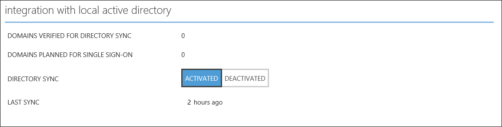
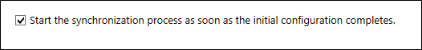
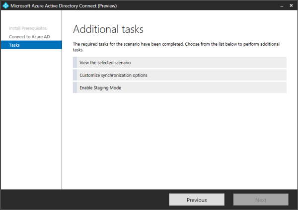

<properties
    pageTitle="Azure AD-verbinden: Nächste Schritte und zum Verwalten von Azure AD verbinden | Microsoft Azure"
    description="Erfahren Sie, wie Sie die standardmäßige Konfiguration und Betriebsaufgaben für Azure AD verbinden erweitern."
    services="active-directory"
    documentationCenter=""
    authors="billmath"
    manager="femila"
    editor="curtand"/>

<tags
    ms.service="active-directory"
    ms.workload="identity"
    ms.tgt_pltfrm="na"
    ms.devlang="na"
    ms.topic="article"
    ms.date="08/08/2016"
    ms.author="billmath"/>

# Nächste Schritte und zum Verwalten von Azure AD-verbinden
Im folgenden sind Betrieb Themen erweiterte, mit die Sie Azure Active Directory herstellen und Anforderungen Ihrer Organisation erfüllen anpassen können.  

## Hinzufügen von Administratoren zusätzliche synchronisieren
Standardmäßig wird nur der Benutzer, der die Installation und die lokale Administratoren die installierten synchronisieren-Engine verwalten können. Suchen Sie nach der Gruppe mit dem Namen ADSyncAdmins auf dem lokalen Server und dieser Gruppe hinzufügen weitere Personen zum Zugreifen auf und Verwalten der Synchronisierungs-Engine kann.

## Zuweisen von Lizenzen für Benutzer von Azure AD Premium und Mobilität für Unternehmen

Nachdem Sie nun die Benutzer in der Cloud synchronisiert wurden, müssen Sie diese eine Lizenz zuweisen, sodass sie mit der Cloud-apps, wie Office 365 vertraut abrufen können.

### Ein Azure AD Premium oder Enterprise Mobilität Suite-Lizenz zuweisen
--------------------------------------------------------------------------------
1. Anmelden Sie bei der Azure-Portal als Administrator.
2. Wählen Sie auf der linken Seite aus **Active Directory**.
3. Doppelklicken Sie auf das Verzeichnis, das die Benutzer enthält, die Sie aktivieren möchten, klicken Sie auf der Seite Active Directory.
4. Wählen Sie am oberen Rand der Seite Verzeichnis **Lizenzen**aus.
5. Klicken Sie auf der Seite Lizenzen wählen Sie Active Directory-Premium oder Enterprise Mobilität Suite aus, und klicken Sie dann auf **zuweisen**.
6. Klicken Sie im Dialogfeld Wählen Sie die Benutzer, denen Sie zu Lizenzen zuweisen möchten, und klicken Sie dann auf das Häkchen-Symbol, um die Änderungen zu speichern.

## Überprüfen den Vorgang geplante Synchronisierung
Wenn Sie den Status einer Synchronisation überprüfen, dass Sie dies tun können, indem Sie im Azure-Portal aktivieren möchten.

### Zur Überprüfung des unidirektionalen Vorgangs
--------------------------------------------------------------------------------
1. Anmelden Sie bei der Azure-Portal als Administrator.
2. Wählen Sie auf der linken Seite aus **Active Directory**.
3. Doppelklicken Sie auf das Verzeichnis, das die Benutzer enthält, die Sie aktivieren möchten, klicken Sie auf der Seite Active Directory.
4. Wählen Sie am oberen Rand der Seite Verzeichnis **Verzeichnisintegration**aus.
5. Klicken Sie unter Integration mit lokalen active Directory-Notiz Uhrzeit der letzten synchronisieren.

## Starten eines Vorgangs geplante Synchronisierung
Wenn Sie eine Synchronisierungsaufgabe ausführen müssen können Sie hierzu über den Azure AD verbinden-Assistenten erneut ausführen.  Sie müssen Ihre Anmeldeinformationen Azure AD-bereitstellen.  Wählen Sie die **Optionen für die Synchronisierung anpassen** Aufgabe im Assistenten und klicken Sie auf Weiter, bis der Assistent. Am Ende stellen Sie sicher, dass das Kontrollkästchen **Starten Sie den Synchronisierungsprozess sofort nach Abschluss der anfängliche Konfiguration** aktiviert ist.

Weitere Informationen zum Verbinden von Azure AD synchronisieren: Scheduler, finden Sie unter [Azure AD verbinden Scheduler](active-directory-aadconnectsync-feature-scheduler.md)

## Weitere Aufgaben, die in Azure AD verbinden verfügbar sind.
Nach der Erstinstallation des Azure AD-Verbindung herstellen können Sie immer Starten des Assistenten erneut über die Seite oder den Desktop Verknüpfung Azure AD verbinden Startmenü.  Beachten Sie, dass erneut mit dem Assistenten, gehen einige neuen Optionen in Form von zusätzliche Aufgaben enthält.  

Die folgende Tabelle enthält eine Zusammenfassung der folgenden Aufgaben und eine kurze Beschreibung für jede von ihnen an.

Zusätzliche Aufgabe | Beschreibung
------------- | ------------- |
Das ausgewählte Szenario anzeigen  |Ermöglicht Ihnen, Ihre aktuelle Azure AD verbinden Lösung anzeigen.  Dies umfasst Allgemeine Einstellungen, synchronisierten Verzeichnissen, synchronisieren Einstellungen.
Anpassen von Optionen für die Synchronisierung | Ermöglicht es Ihnen, ändern die aktuelle Konfiguration einschließlich hinzufügen zusätzliche Active Directory-Gesamtstrukturen zur Konfiguration oder aktivieren Synchronisierungsoptionen wie Benutzer Gruppe, Gerät oder Kennwort schreiben-zurück.
Staging-Modus aktivieren |  Auf diese Weise können Sie Phase Informationen, die später synchronisiert werden, aber nichts exportiert werden in Azure Active Directory oder Active Directory.  So können Sie die Synchronisierung Vorschau anzeigen, bevor sie auftreten.

## Nächste Schritte
Erfahren Sie mehr über die [Integration von Ihrem lokalen Identitäten mit Azure Active Directory](active-directory-aadconnect.md).
