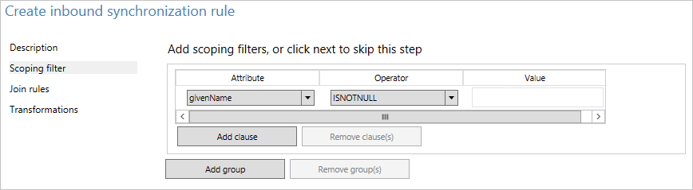
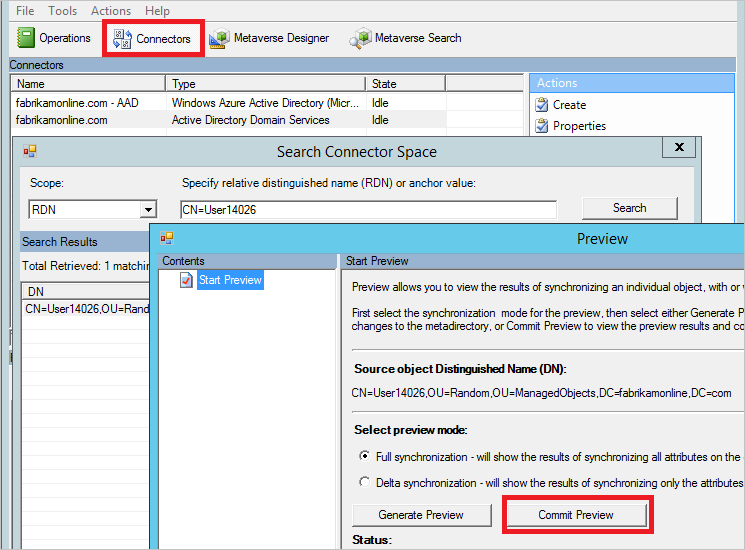
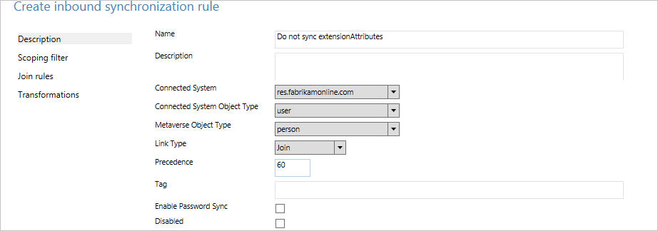

<properties
    pageTitle="Synchronisieren von Azure AD verbinden: zum Ändern der Standard-Konfigurations | Microsoft Azure"
    description="Führt Sie durch eine Änderung an der Konfiguration in Azure AD verbinden synchronisieren zu erstellen."
    services="active-directory"
    documentationCenter=""
    authors="andkjell"
    manager="femila"
    editor=""/>

<tags
    ms.service="active-directory"
    ms.workload="identity"
    ms.tgt_pltfrm="na"
    ms.devlang="na"
    ms.topic="article"
    ms.date="08/31/2016"
    ms.author="billmath"/>

# Synchronisieren von Azure AD verbinden: zum Ändern der Standard-Konfigurations
Der Zweck dieses Themas ist Sie zum Ändern der Standard-Konfigurations in Azure AD verbinden synchronisieren durchzuführen. Es enthält eine schrittweise Anleitung anhand einiger allgemeinen Szenarien. Mit diesem wissen sollten Sie einige einfachen Änderungen an Ihrer eigenen Konfiguration basierend auf Ihrer eigenen Business Regeln vorzunehmen.

## Synchronisierung Regel-Editor
Die Synchronisierung Regel-Editor wird zum Anzeigen und ändern die standardmäßige Konfiguration verwendet. Sie können sie im Menü Start unter der Gruppe **Azure AD verbinden** suchen.  

Wenn Sie es öffnen, wird die Regeln für die Out-of-Box.

### Navigieren im editor
Dropdown-Liste am oberen Rand der-Editor können Sie schnell zu eine bestimmte Regel finden. Wenn die Regeln finden Sie unter Wo finde ich das Attribut ProxyAddresses einbezogen werden soll, würden Sie beispielsweise Dropdown-Liste wie folgt ändern:  
  
Zum Zurücksetzen filtern, und Laden eine frische Konfiguration, drücken Sie **F5** auf der Tastatur ein.

Klicken Sie auf der rechten oberen Ecke müssen Sie eine Schaltfläche **neue Regel hinzufügen**. Diese Schaltfläche wird verwendet, um die eigene benutzerdefinierte Regel erstellen.

Klicken Sie unten müssen Sie die Schaltflächen zum Bearbeiten der auf eine Regel ausgewählten synchronisieren. **Bearbeiten** und **Löschen** kann, was sie erwartet. **Exportieren von** erzeugt ein PowerShell-Skript für die Regel synchronisieren, neu zu erstellen. Mit diesem Verfahren können Sie eine Regel für die Synchronisierung von einem Server auf einen anderen zu verschieben.

## Erstellen Sie Ihrer erste benutzerdefinierte Regel
Die am häufigsten verwendete Änderung ist Änderungen an der Zahlungen Attribut. Die Daten in Ihrem Quellverzeichnis möglicherweise nicht wie in Azure AD. Im Beispiel in diesem Abschnitt soll um sicherzustellen, dass der Vorname des Benutzers immer in die **gemischte Groß-/Kleinschreibung**wird.

### Deaktivieren Sie den scheduler
Der [Scheduler](active-directory-aadconnectsync-feature-scheduler.md) wird standardmäßig alle 30 Minuten ausgeführt. Stellen Sie sicher, dass er nicht gestartet wird, während Sie dafür, Änderungen dass und Problembehandlung bei Ihrem neuen Regeln werden soll. Wenn den Scheduler vorübergehend deaktivieren möchten, beginnen Sie PowerShell, und führen Sie`Set-ADSyncScheduler -SyncCycleEnabled $false`

  

### Erstellen Sie die Regel

1. Klicken Sie auf **neue Regel hinzufügen**.
2. Geben Sie auf der Seite **Beschreibung** die folgenden Schritte aus:  
  
    - Name: Geben Sie einen aussagekräftigen Namen der Regel.
    - Beschreibung: Einige Erläuterung, damit die Person verstehen kann, was für die Regel ist.
    - System verbunden: das System das Objekt im gefunden werden kann. In diesem Fall wählen wir die Active Directory-Connector aus.
    - Verbundenen System/Metaverse Object Type: Wählen **Benutzer-** und **Person** aus.
    - Verknüpfungsart: Ändern Sie diesen Wert für die **Teilnahme an**.
    - Rangfolge: Geben Sie einen Wert, der im System eindeutig ist. Ein unteren numerischer Wert gibt Vorrang an.
    - Kategorie: Lassen Sie leer. Nur Out-of-Box-Regeln von Microsoft sollte dieses Feld mit einem Wert ausgefüllt haben.
3. Geben Sie auf der Seite **Scoping Filter** **Vorname ISNOTNULL**aus.  
  
Dieser Abschnitt wird verwendet, um die Objekte definieren, dass die Regel angewendet werden soll. Wenn leer, wird die Regel auf alle Benutzerobjekte angewendet. Aber würde enthalten Konferenzräumen, Dienstkonten und anderen Benutzerobjekten nicht Personen.
4. Klicken Sie auf die **Teilnahme an Regeln**lassen Sie ihn leer.
5. Ändern Sie auf der Seite **Transformationen** der Wechselkurs des Flusstyps auf **Ausdruck**ein. Wählen Sie die Ziel-Attribut **Vorname**aus, und geben Sie in der Quelle `PCase([givenName])`.
  
Die Synchronisierung-Engine beachtet werden sowohl auf den Namen der Funktion und den Namen für das Attribut. Wenn Sie etwas eingeben, wird eine Warnung, wenn Sie die Regel hinzufügen. Der-Editor können Sie speichern und Vorgang fortsetzen, damit Sie hätten erneut öffnen die Regel und korrigieren Sie die Regel.
6. Klicken Sie auf **Hinzufügen** , um die Regel zu speichern.

Die neue benutzerdefinierte Regel sollte das System mit anderen synchronisieren Regeln sichtbar sein.

### Überprüfen Sie die Änderung
Mit dieser neuen ändern soll um sicherzustellen, dass es wie erwartet funktioniert und Fehlern ist nicht auslösen. Je nach der Anzahl der Objekte, die Sie installiert haben, gibt es zwei verschiedene Verfahren zum Führen Sie diesen Schritt.

1. Führen Sie eine vollständige Synchronisierung auf alle Objekte
2. Führen Sie eine Vorschau und vollständigen Synchronisierung auf ein einzelnes Objekt

Starten Sie über das Startmenü **Synchronisierungsdiensts** . Die Schritte in diesem Abschnitt werden alle dieses Tool.

1. **Vollständige Synchronisieren aller Objekte**  
Wählen Sie am oberen **Verbinder** aus. Identifizieren Sie den Verbinder, die Sie im vorherigen Abschnitt in diesem Fall Active Directory-Domänendiensten eine Änderung vorgenommen, und wählen Sie ihn aus. Wählen Sie Aktionen **Ausführen** , und wählen Sie **Vollständigen Synchronisierung** und auf **OK**.
  
Die Objekte werden im Metaverse jetzt aktualisiert. Nun möchten das Objekt im Metaverse anzuzeigen.

2. **Vorschau und vollständigen Synchronisierung für ein einziges Objekt**  
Wählen Sie am oberen **Verbinder** aus. Identifizieren Sie den Verbinder, die Sie im vorherigen Abschnitt in diesem Fall Active Directory-Domänendiensten eine Änderung vorgenommen, und wählen Sie ihn aus. Wählen Sie die **Suche Verbinder Leerzeichen**aus. Verwenden Sie Bereich, um ein Objekt zu finden, die Sie verwenden, um die Änderung testen möchten. Wählen Sie das Objekt aus, und klicken Sie auf **Vorschau**. Wählen Sie im Bildschirm neu auf **Vorschau abzuschließen**.
  
Die Änderung ist jetzt in der Metaverse übertragen wurde

**Schauen Sie sich das Objekt im metaverse**  
Sie möchten nun wählen Sie ein paar Stichprobe-Objekte, um sicherzustellen, dass der Wert erwartet wird und dass die Regel angewendet. Wählen Sie dann **Metaverse suchen** von oben. Fügen Sie alle Filter, den Sie die relevanten Objekte zu ermitteln müssen. Öffnen Sie im Suchergebnis ein Objekt ein. Schauen Sie sich die Attributwerte aus, und überprüfen Sie auch in der Spalte **Synchronisieren Regeln** , die die Regel angewendet als erwartet.  
  
### Aktivieren Sie die Planung
Ist alles wie erwartet, können Sie den Scheduler erneut aktivieren. Ausführen von PowerShell `Set-ADSyncScheduler -SyncCycleEnabled $true`.

## Andere häufige Attribut Fluss Änderungen an
Im vorhergehenden Abschnitt beschrieben, wie ein Attribut-Verkehr zu ändern. In diesem Abschnitt werden einige weitere Beispiele bereitgestellt. Die schrittweise Anleitung zum Erstellen der Regel synchronisieren wurde verkürzt, aber Sie können die vollständigen Schritte finden Sie im vorherigen Abschnitt.

### Verwenden Sie ein anderes Attribut als Standard
Bei Fabrikam ist es eine Gesamtstruktur, in das lokale Alphabet für Vorname, Nachname und Anzeigename verwendet wird. Die Darstellung lateinische Zeichen diese Attribute kann in den Attributen Erweiterung gefunden werden. Beim Erstellen der globalen Adressliste in Azure AD- und Office 365, die Organisation möchte diese Attribute stattdessen verwendet werden.

Mit einer Standardkonfiguration sieht ein Objekt aus der lokalen Gesamtstruktur wie folgt aus:  

Zum Erstellen einer Regel mit anderen Attribut Zahlungen, führen Sie folgende Schritte aus:

- Starten Sie über das Startmenü **Synchronisierung Regel-Editor** ein.
- **Eingehende** markiertem Links klicken Sie auf die Schaltfläche **neue Regel hinzufügen**.
- Geben Sie einen Namen und eine Beschreibung der Regel. Wählen Sie aus der lokalen Active Directory und den entsprechenden Objekttypen.  **Verknüpfungsart**wählen Sie **Verknüpfung**aus. Wählen Sie für die Rangfolge eine Zahl, die nicht von einer anderen Regel verwendet wird. Die Out-of-Box-Regeln beginnen Sie mit 100, damit in diesem Beispiel wird der Wert 50 verwendet werden kann.

- Lassen Sie Bereich leer (d. h., sollte gelten für alle Benutzerobjekte in der Gesamtstruktur).
- Lassen Sie Verknüpfung Regeln leer (d. h., lassen Sie die Out-of-Box-Regel, die alle Verknüpfungen zu behandeln).
- Erstellen Sie in Transformationen die folgenden Zahlungen aus:  

- Klicken Sie auf **Hinzufügen** , um die Regel zu speichern.
- Wechseln Sie zur **Synchronisierung Dienst-Manager**. Wählen Sie **Verbinder**klicken Sie auf den Verbinder, in dem wir die Regel hinzugefügt. Wählen Sie **Ausführen**und **vollständigen Synchronisierung**. Eine vollständige Synchronisierung wird neu berechnet alle Objekte, die von der aktuellen Regeln aus.

Dies ist das Ergebnis für das gleiche Objekt mit dieser benutzerdefinierten Regel:  

### Länge von Attributen
Zeichenfolge Attribute werden standardmäßig indiziert sein und die maximale Länge 448 Zeichen. Wenn Sie mit den Zeichenfolgenattributen arbeiten, die mehr enthalten möglicherweise, stellen Sie sicher, Folgendes in Attribut illustrieren aufgenommen werden sollen:  
`attributeName` <- `Left([attributeName],448)`

### Ändern der userPrincipalSuffix
Das Attribut UserPrincipalName in Active Directory von den Benutzern nicht immer bekannt und möglicherweise nicht geeignet als die Anmelde-ID Azure AD verbinden Synchronisierungs-Installation-Assistenten ermöglicht auf ein anderes Attribut, beispielsweise e-Mail. Aber in einigen Fällen müssen Sie das Attribut berechnet. Angenommen, hat das Unternehmen Contoso zwei Azure AD-Verzeichnisse durchsuchen, eine für die Herstellung und eine zum Testen. Sie möchten die Benutzer in ihrer Mandanten Test zur Verwendung von einem anderen Suffix in der Anmelde-ID  
`userPrincipalName` <- `Word([userPrincipalName],1,"@") & "@contosotest.com"`

Machen Sie in diesem Ausdruck alles links des ersten @-sign (Word) und mit einer festen Zeichenfolge verketten.

### Konvertieren von mehrwertig in ein einzelner Wert
Einige Attribute in Active Directory sind mehrwertig im Schema, obwohl sie einzelne in Active Directory-Benutzer und Computer bewertet aussehen. Ein Beispiel ist das Beschreibungsattribut an.  
`description` <- `IIF(IsNullOrEmpty([description]),NULL,Left(Trim(Item([description],1)),448))`

In diesem Ausdruck für den Fall, dass das Attribut einen Wert besitzt wir übernehmen das erste Element (Artikel) in das Attribut, entfernen führende und nachfolgende Leerzeichen (Trim), und klicken Sie dann die ersten 448 Zeichen (links) in der Zeichenfolge beibehalten.

### Gehen Sie wie folgt ein Attribut nicht Datenfluss
Hintergrund auf dem Szenario für diesen Abschnitt finden Sie unter [Control das Attribut Ablauf des Nachrichtenflusses](active-directory-aadconnectsync-understanding-declarative-provisioning.md#control-the-attribute-flow-process).

Es gibt zwei Methoden, um ein Attribut nicht Datenfluss aus. Die erste steht im Assistenten zum Installieren und ermöglicht es Ihnen, [Ausgewählte Attribute entfernen](active-directory-aadconnect-get-started-custom.md#azure-ad-app-and-attribute-filtering). Diese Option funktioniert, wenn Sie das Attribut vor nie synchronisiert haben. Jedoch wenn Sie begonnen haben, können Sie dieses Attribut synchronisieren und später mit diesem Feature entfernen, klicken Sie dann die Synchronisierung-Engine stoppt verwalten das Attribut und den vorhandenen Werten Azure AD verbleiben im.

Wenn Sie möchten, entfernen Sie den Wert, der ein Attribut und stellen Sie sicher, dass es in Zukunft nicht übergeben wird, müssen Sie stattdessen eine benutzerdefinierte Regel erstellen.

Bei Fabrikam haben wir erkannt, dass einige der den Attributen, die wir in der Cloud synchronisieren nicht vorhanden sein soll. Stellen Sie sicher, dass diese Attribute aus Azure AD entfernt werden sollen.  

- Erstellen einer neuen Regel für eingehende Synchronisation, und füllen Sie die Beschreibung 
- Attribut Zahlungen vom Typ **Ausdruck** und der Quelle **AuthoritativeNull**zu erstellen. Der literalen **AuthoritativeNull** zeigt an, dass der Wert im Metaverse leer sein sollte, selbst wenn eine niedrigere Rangfolge synchronisieren Regel versucht, den Wert gefüllt wird.

- Speichern Sie die Regel synchronisieren. Starten Sie **Synchronisation-Dienst**, suchen Sie den Verbinder, wählen Sie **Ausführen**und **Vollständigen Synchronisierung**. Dieser Schritt wird neu berechnet alle Attribut Zahlungen aus.
- Überprüfen Sie die gewünschten Änderungen dabei, durch den Verbinder Abstand suchen exportiert werden.

## Nächste Schritte

- Weitere Informationen zum Konfigurationsmodell in [Grundlegendes zu deklarative bereitgestellt](active-directory-aadconnectsync-understanding-declarative-provisioning.md).
- Weitere Informationen zu der Ausdruckssprache in [Grundlegendes zu deklarative Provisioning Ausdrücke](active-directory-aadconnectsync-understanding-declarative-provisioning-expressions.md).

**Themen (Übersicht)**

- [Synchronisieren von Azure AD verbinden: verstehen und Anpassen der Synchronisierung](active-directory-aadconnectsync-whatis.md)
- [Integrieren von Ihrem lokalen Identitäten in Azure Active Directory](active-directory-aadconnect.md)
