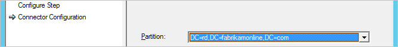
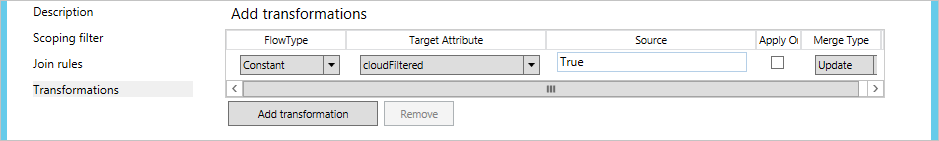
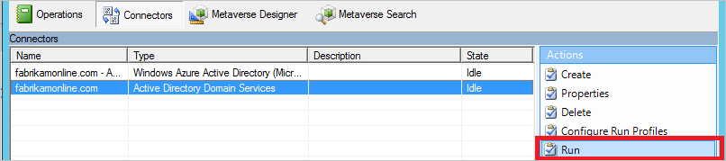

<properties
    pageTitle="Synchronisieren von Azure AD verbinden: Konfigurieren von Filtern | Microsoft Azure"
    description="Erläutert, wie Sie Konfigurieren von Filtern in Azure AD verbinden synchronisieren."
    services="active-directory"
    documentationCenter=""
    authors="andkjell"
    manager="femila"
    editor=""/>

<tags
    ms.service="active-directory"
    ms.workload="identity"
    ms.tgt_pltfrm="na"
    ms.devlang="na"
    ms.topic="article"
    ms.date="09/13/2016"
    ms.author="andkjell;markvi"/>

# Synchronisieren von Azure AD verbinden: Konfigurieren von Filtern
Filtern, können Sie steuern, welche Objekte in Azure AD aus Ihrem lokalen Verzeichnis angezeigt werden soll. Die Standardkonfiguration stattfindet alle Objekte in allen Domänen in den Gesamtstrukturen konfigurierten. Dies ist im Allgemeinen die empfohlene Konfiguration. Mit Office 365-Auslastung, wie etwa Exchange Online und Skype für Unternehmen Endbenutzer nutzbringend eine vollständige globale Adressliste aus, damit sie e-Mails senden und jede Person anrufen können. Bei der Standardkonfiguration würden, die sie mit einer lokalen Implementierung von Exchange oder Lync würde mit der gleichen ausgegeben.

In einigen Fällen ist es erforderlich, um Ihre Änderungen vorgenommen haben, auf die Konfiguration. Es folgen einige Beispiele:

- Sie planen, die [mehrere Azure AD-Verzeichnis Suchtopologie](active-directory-aadconnect-topologies.md#each-object-only-once-in-an-azure-ad-directory)verwenden. Anwenden eines Filters zum Steuern, welche Objekt in einer bestimmten synchronisiert werden sollen müssen Sie Azure AD-Verzeichnis.
- Ausführen eines Pilotprojekts für Azure oder Office 365 ein, und Sie möchten nur eine Teilmenge der Benutzer in Azure Active Directory. In den kleinen Pilotprojekt ist es nicht wichtig, dass eine vollständige globale Adressliste die Funktionen vorzuführen.
- Sie haben viele Dienstkonten und anderen nicht persönliche Konten, die nicht in Azure AD sollen.
- Compliance-Gründen löschen Sie keine Benutzerkonten lokalen. Nur deaktiviert wieder. Aber in Azure AD werden nur aktive Firmen vorhanden sein sollen.

In diesem Artikel beschrieben, wie die verschiedenen Methoden konfigurieren.

> [AZURE.IMPORTANT]Microsoft unterstützt keine Änderung oder des Betriebs außerhalb diese Aktionen formell dokumentierten Azure AD verbinden synchronisieren. Kann eine der folgenden Aktionen in einem inkonsistenten oder nicht unterstützte Zustand des Azure AD verbinden synchronisieren führen und daher Microsoft keinen technischen Support für solche Bereitstellungen bieten.

## Grundlagen und wichtigen Notizen
In Azure AD verbinden synchronisieren können Sie die Filterung zu einem beliebigen Zeitpunkt aktivieren. Wenn Sie bei der standardmäßigen Konfiguration der Verzeichnissynchronisation starten und konfigurieren Sie dann auf Filtern, werden die Objekte, die herausgefiltert werden nicht mehr mit Azure AD synchronisiert. Durch diese Änderung werden alle Objekte in Azure AD, die zuvor synchronisiert wurden, aber dann gefiltert wurden in Azure AD gelöscht.

Bevor Sie beginnen, indem ändert sich in zum Filtern, stellen Sie sicher, dass Sie [den geplanten Vorgang deaktivieren](#disable-scheduled-task) , sodass Sie nicht versehentlich Änderungen exportieren möchten, die Sie nicht noch um richtige werden überprüft haben.

Da Filtern viele Objekte gleichzeitig entfernen kann, um sicherzustellen, dass Ihre neue Filter richtig sind, bevor Sie beginnen, Exportieren von Änderungen in Azure AD werden soll. Nachdem Sie die Konfigurationsschritte abgeschlossen haben, wird empfohlen, dass Sie die [Überprüfungsschritte](#apply-and-verify-changes) ausführen, bevor Sie es exportieren, und nehmen Sie Änderungen an Azure AD.

Zum Schutz von vielen Objekte versehentlich gelöscht werden, ist das Feature [unbeabsichtigte Löschen sperren](active-directory-aadconnectsync-feature-prevent-accidental-deletes.md) standardmäßig aktiviert. Wenn Sie viele Objekte durch einen Filter (standardmäßig 500) löschen möchten, müssen Sie die Schritte in diesem Artikel der löscht zu Azure AD durchlaufen dürfen.

Wenn Sie eine eigene November 2015 ([1.0.9125](active-directory-aadconnect-version-history.md#1091250)), damit eine Änderung an Filterkonfiguration, und verwenden Sie die Synchronisierung von Kennwörtern verwenden, müssen Sie eine vollständige Synchronisierung aller Kennwörter auslösen, nachdem Sie die Konfiguration beendet haben. Schritte zum Auslösen eines Kennworts vollständigen Synchronisierung finden Sie unter [Auslösen einer vollständigen Synchronisierung aller Kennwörter](active-directory-aadconnectsync-implement-password-synchronization.md#trigger-a-full-sync-of-all-passwords). Wenn Sie auf 1.0.9125 oder höher sind, berechnet die reguläre **vollständigen Synchronisierung** Aktion auch wenn Kennwörter synchronisiert werden sollen und dieser zusätzliche Schritt nicht mehr erforderlich ist.

Wenn **Benutzer** Objekte versehentlich aufgrund einer Filterung Fehler in Azure Active Directory gelöscht wurden, können Sie die Benutzerobjekte in Azure AD erstellen, indem Sie Ihre Filterung Konfigurationen entfernen und dann erneut synchronisieren Ihrer Verzeichnisse durchsuchen. Diese Aktion stellt die Benutzer aus dem Papierkorb in Azure Active Directory. Andere Objekttypen können jedoch kann nicht wiederhergestellt werden. Beispielsweise können, wenn Sie versehentlich einer Sicherheitsgruppe löschen und wurde ACL verwendet eine Ressource, die der Gruppe und die zugehörigen ACLs wiederhergestellt werden.

Azure AD verbinden werden nur die Objekte, die er einmal angesehen wird im Bereich werden gelöscht. Wenn vorhanden sind Objekte in Azure AD, die von einem anderen Synchronisierungsmodul erstellt wurden, und diese Objekte sind nicht in den Bereich, Hinzufügen von Filtern führen Sie nicht entfernen. Angenommen, wenn Sie mit einem Dirsync-Server beginnen und er eine vollständige Kopie der Ihr gesamtes Verzeichnis in Azure AD erstellt und Sie einen neuen Azure AD verbinden Synchronisierungsserver parallel mit aktivierter ab dem Beginn Filterung installieren, entfernt es zusätzliche Objekte DirSync erstellte nicht.

Beim Installieren oder aktualisieren Sie auf eine neuere Version von Azure AD-Verbindung herstellen, wird die Filterung Konfiguration beibehalten. Es ist immer eine bewährte Methode, stellen Sie sicher, dass die Konfiguration nicht versehentlich geändert wurde nach einem Upgrade auf eine neuere Version vor dem Ausführen die erste Synchronisierung durchlaufen.

Wenn Sie mehr als einer Gesamtstruktur haben, müssen die in diesem Artikel beschriebenen Filterung Konfigurationen angewendet werden, in jeder Gesamtstruktur (vorausgesetzt, die gleiche Konfiguration für alle von ihnen gewünschten).

### Deaktivieren Sie geplanten Vorgang
Gehen Sie folgendermaßen vor, um die integrierten Scheduler zu deaktivieren, das einen Synchronisierungszyklus alle 30 Minuten:

1. Wechseln Sie zu einer PowerShell auffordern.
2. Führen Sie `Set-ADSyncScheduler -SyncCycleEnabled $False` den Scheduler zu deaktivieren.
3. Nehmen Sie die Änderungen vor, wie es in diesem Artikel beschrieben.
4. Führen Sie `Set-ADSyncScheduler -SyncCycleEnabled $True` den Scheduler erneut aktivieren.

**Wenn Sie das Erstellen einer Azure AD verbinden vor 1.1.105.0 verwenden**  
Gehen Sie folgendermaßen vor, um den geplanten Vorgang zu deaktivieren, der einen Kreis Synchronisation alle 3 Stunden auslöst:

1. Starten Sie über das Startmenü **Taskplaner** .
2. Suchen Sie direkt unter **Aufgabenplanungsbibliothek**Aufgabe **Scheduler Azure AD synchronisieren**, mit der rechten Maustaste und wählen Sie **Deaktivieren**.  
  
3. Jetzt können Sie die Synchronisierung-Engine manuell ausführen, über die **Synchronisierung Dienst-Manager** -Konsole und Konfiguration vorzunehmen.

Nachdem Sie alle Ihre Filterung Änderungen abgeschlossen haben, vergessen Sie nicht, die im Zusammenhang zurück, und **Aktivieren** Sie die Aufgabe erneut.

## Filteroptionen
Die folgenden Arten der Filterung Konfiguration können auf das Tool Verzeichnissynchronisation angewendet werden:

- [**Basierende Gruppe**](active-directory-aadconnect-get-started-custom.md#sync-filtering-based-on-groups): Filtern, basierend auf einer einzelnen Gruppe kann nur auf Erstinstallation mithilfe des Assistenten konfiguriert werden. Es wird in diesem Thema nicht weiter behandelt.

- [**Domäne-basierten**](#domain-based-filtering): Diese Option ermöglicht es Ihnen, welche Domänen auszuwählen, die mit Azure AD synchronisieren. Außerdem können Sie zum Hinzufügen und Entfernen von Domänen aus der Synchronisierungs-Engine-Konfiguration, wenn Sie Änderungen in Ihrer lokalen Infrastruktur vornehmen, nach der Installation von Azure AD verbinden synchronisieren.

- [**Organisationseinheit-Einheit – basierte**](#organizational-unitbased-filtering): Diese Option zum Filtern können Sie auswählen, welche Organisationseinheiten mit Azure AD synchronisieren. Diese Option ist für alle Objekttypen in ausgewählten Organisationseinheiten.

- [**Attribut – basierte**](#attribute-based-filtering): mit dieser Option können Sie Objekte auf der Grundlage Attributwerte für die Objekte zu filtern. Sie können auch verschiedene Filter für andere Objekttypen haben.

Mehrere Filteroptionen können gleichzeitig bearbeiten. Beispielsweise können Sie filtern Organisationseinheit-basierten nur Objekte in einer Organisationseinheit und in der gleichen Zeit Attribut-basierte Filtern zum Filtern von weiteren Objekte enthalten sind. Wenn Sie mehrere Filtermethoden verwenden, mithilfe der Filter eine logische und zwischen den Filter an.

## Domäne-basierten filtern
Dieser Abschnitt enthält Sie mit den Schritten zum Konfigurieren Ihrer Domäne filtern. Wenn Sie hinzugefügt oder entfernt Domänen in Ihrer Gesamtstruktur, nach der Installation von Azure AD verbinden, müssen Sie auch die Filterung Konfiguration zu aktualisieren.

Die bevorzugte Methode zum Filtern Domänen basierendes ändern wird durch Ausführen der Installation-Assistenten, und ändern Sie [Domänen und Organisationseinheiten Filtern festzulegen](active-directory-aadconnect-get-started-custom.md#domain-and-ou-filtering). Der Assistent zum Installieren ist alle Vorgänge, die in diesem Thema dokumentierten automatisieren.

Sie sollten nur diese Schritte ausgeführt, wenn Sie aus irgendeinem Grund der Installationsassistent kann nicht ausgeführt werden.

Domäne basierenden Filterung Konfiguration besteht aus der folgenden Schritte aus:

- [Wählen Sie die Domänen](#select-domains-to-be-synchronized) , die in die Synchronisation einbezogen werden sollen.
- Passen Sie für jede Domäne hinzugefügt und entfernt die [Profile ausführen](#update-run-profiles).
- [Übernehmen, und überprüfen Sie die Änderungen](#apply-and-verify-changes).

### Wählen Sie Domänen synchronisiert werden
**Führen Sie die folgenden Schritte aus, um den Filter Domäne festzulegen:**

1. Melden Sie sich auf dem Server, der Synchronisieren von Azure AD-Verbinden mit einem Konto an, die ein Mitglied der Sicherheitsgruppe **ADSyncAdmins** ist ausgeführt wird.
2. Starten Sie über das Startmenü **Synchronisierungsdiensts** .
3. Wählen Sie **Verbinder** aus, und wählen Sie in der Liste **Verbinder** den Verbinder mit dem Typ **Active Directory-Domänendiensten**. Wählen Sie **Aktionen**die Option **Eigenschaften**aus.  
  
4. Klicken Sie auf **Verzeichnispartitionen konfigurieren**.
5. Wählen Sie in der Liste **Wählen Sie Verzeichnispartitionen** aus, und heben Sie die Auswahl der Domänen, je nach Bedarf. Stellen Sie sicher, dass nur die Partitionen, die Sie synchronisieren möchten, ausgewählt sind.  
  
Wenn Sie Ihrem lokalen geändert haben AD-Infrastruktur und hinzugefügten oder entfernte Domänen aus der Struktur, klicken Sie dann auf die Schaltfläche **Aktualisieren** , um eine aktualisierte Liste abrufen. Wenn Sie aktualisieren, werden Sie Anmeldeinformationen abgefragt. Geben Sie alle Anmeldeinformationen mit Lesezugriff zu Ihrem lokalen Active Directory. Es hat keinen auf den Benutzer, der vorab eingetragenen im Dialogfeld ist.  
  
6. Wenn Sie fertig sind, schließen Sie das Dialogfeld ' **Eigenschaften** ', indem Sie auf **OK**. Wenn Sie Domänen aus der Gesamtstruktur entfernt haben, werden eine Nachricht Popup angezeigt, die besagt, dass eine Domäne entfernt wurde und die Konfiguration bereinigt.
7. Fahren Sie mit der [Ausführen Profile](#update-run-profiles)anpassen.

### Aktualisieren von Profilen ausführen
Wenn Sie Ihre Domäne Filter aktualisiert haben, müssen Sie auch die ausführen Profile aktualisieren.

1. Klicken Sie in der Liste **Verbinder** sicherzustellen Sie, dass der Verbinder, die Sie im vorherigen Schritt geändert ausgewählt ist. Wählen Sie **Aktionen** **Ausführen Profile konfigurieren**.  
  

Sie müssen die folgenden Profile anpassen:

- Vollständige importieren
- Vollständige Synchronisierung
- Delta importieren
- Delta-Synchronisierung
- Exportieren

Führen Sie für jede der fünf Profile die folgenden Schritte aus, für jede Domäne **hinzugefügt** :

1. Wählen Sie das Profil ausführen, und klicken Sie auf **Neuen Schritt**.
2. Wählen Sie auf der Seite **Konfigurieren Schritt** in der Dropdownliste **Typ** den Schritttyp mit demselben Namen wie das Profil, das Sie konfigurieren. Klicken Sie dann auf **Weiter**.  
  
3. Wählen Sie auf der Seite **Connector-Konfiguration** in der Dropdownliste **Partition** den Namen der Domäne, die Sie den Filter für die Domäne hinzugefügt haben.  
  
4. Klicken Sie auf **Fertig stellen**, um das Dialogfeld **Ausführungsprofil konfigurieren** zu schließen.

Führen Sie für jede der fünf Profile für jede Domäne **entfernt** die folgenden Schritte aus:

1. Wählen Sie das Profil ausführen.
2. Wenn der **Wert** für das Attribut **Partition** eine GUID ist, wählen Sie den Schritt ausführen, und klicken Sie auf **Schritt löschen**.  
  

Das Ergebnis sollten, dass jede Domäne, die Sie synchronisieren möchten, die als einen Schritt in jedem Ausführen Profil aufgeführt werden sollen.

Klicken Sie auf **OK**, um das Dialogfeld **Ausführen Profile konfigurieren** zu schließen.

- Um die Konfiguration abzuschließen [Übernehmen, und überprüfen Sie die Änderungen](#apply-and-verify-changes).

## Organisationseinheit-Einheit – basierte filtern
Die bevorzugte Methode zum Filtern Organisationseinheit-basierten geändert wird durch Ausführen der Installation-Assistenten, und ändern Sie [Domänen und Organisationseinheiten Filtern festzulegen](active-directory-aadconnect-get-started-custom.md#domain-and-ou-filtering). Der Assistent zum Installieren ist alle Vorgänge, die in diesem Thema dokumentierten automatisieren.

Sie sollten nur diese Schritte ausgeführt, wenn Sie aus irgendeinem Grund der Installationsassistent kann nicht ausgeführt werden.

**Führen Sie die folgenden Schritte aus, um Organisations-Einheit – basierte Filtern konfigurieren:**

1. Melden Sie sich auf dem Server, der Synchronisieren von Azure AD-Verbinden mit einem Konto an, die ein Mitglied der Sicherheitsgruppe **ADSyncAdmins** ist ausgeführt wird.
2. Starten Sie über das Startmenü **Synchronisierungsdiensts** .
3. Wählen Sie **Verbinder** aus, und wählen Sie in der Liste **Verbinder** den Verbinder mit dem Typ **Active Directory-Domänendiensten**. Wählen Sie **Aktionen**die Option **Eigenschaften**aus.  
  
4. Klicken Sie auf **Verzeichnispartitionen konfigurieren**, wählen Sie die Domäne, die Sie konfigurieren möchten, und klicken Sie dann auf **Container**.
5. Wenn Sie dazu aufgefordert werden, geben Sie alle Anmeldeinformationen mit Lesezugriff zu Ihrem lokalen Active Directory. Es hat keinen auf den Benutzer, der vorab eingetragenen im Dialogfeld ist.
6. Deaktivieren Sie im Dialogfeld **Container wählen Sie** die Organisationseinheiten, die nicht mit der Cloud-Verzeichnis synchronisieren, und klicken Sie dann auf **OK**.  
  
  - Für Windows 10 Computer erfolgreich in Azure Active Directory synchronisiert werden sollte der Container **Computer** ausgewählt werden. Wenn Ihre Domäne verbundene Computer in andere OUs ansässig sind, stellen Sie sicher, dass diese ausgewählt sind.
  - Wenn Sie mehrere Gesamtstrukturen Vertrauensstellungen haben, sollte der **ForeignSecurityPrincipals** Container ausgewählt werden. Diese Container zulässt, gesamtstrukturübergreifenden Sicherheitsgruppen-Mitgliedschaft gelöst werden.
  - Wenn Sie das Gerät abgeschlossenen writebackvorgängen Feature aktiviert haben, sollte die **RegisteredDevices** Organisationseinheit ausgewählt werden. Wenn Sie ein weiteres abgeschlossenen writebackvorgängen Feature verwenden, wie etwa Gruppe abgeschlossenen writebackvorgängen, stellen Sie sicher, dass diese Orte ausgewählt sind.
  - Wählen Sie eine beliebige andere Organisationseinheit, in dem Benutzer, InetOrgPerson, Gruppen, Kontakte und Computer befinden. In der Abbildung befinden all diese in die OU ManagedObjects.
7. Wenn Sie fertig sind, schließen Sie das Dialogfeld ' **Eigenschaften** ', indem Sie auf **OK**.
8. Um die Konfiguration abzuschließen [Übernehmen, und überprüfen Sie die Änderungen](#apply-and-verify-changes).

## Attribut-basierte filtern
Stellen Sie sicher, Sie sind auf der November 2015 ([1.0.9125](active-directory-aadconnect-version-history.md#1091250)) oder höher für diese Schritte für die Arbeit erstellen.

Attribut-basierte Filtern ist die am häufigsten flexible Methode zum Filter-Objekte. Die Leistungsfähigkeit von [deklarativen provisioning](active-directory-aadconnectsync-understanding-declarative-provisioning.md) können Sie um fast jeden Aspekt zu steuern, wann ein Objekt in Azure Active Directory synchronisiert werden sollen.

Filterung angewendet werden sowohl auf der [eingehenden](#inbound-filtering) aus Active Directory zu Metaverse und [ausgehende](#outbound-filtering) aus dem Metaverse zu Azure AD. Es wird empfohlen, zum Anwenden von Filtern auf eingehende, da dies die einfachste Möglichkeit zum Verwalten ist. Ausgehende Filterung darf nur verwendet werden, ist es erforderlich, für die Teilnahme an Objekte aus mehr als einer Gesamtstruktur, damit die Auswertung werden kann.

### Filtern eingehender Nachrichten
Eingehende basierend Filtern ist die standardmäßige Konfiguration verwenden, wobei Objekte gezeigt, Azure AD der Metaverse Attribut CloudFiltered synchronisiert werden nicht auf einen Wert festgelegt sein müssen. Wenn dieses Attribut den Wert **True**festgelegt ist, ist das Objekt nicht synchronisiert. Sie sollten nicht **falsch** standardmäßig festgelegt werden. Um sicherzustellen, dass andere Regeln die Möglichkeit, einen Wert mitwirken haben, sollte dieses Attribut nur die Werte **True** oder **NULL** (nicht vorhanden) aufweisen.

In der eingehenden Filtern verwenden Sie die Potenz des **Bereichs** zu bestimmen, welche Objekte oder sollte nicht synchronisiert werden soll. Dies ist die Stelle, an der Sie Anpassen Ihrer eigenen Organisation Anforderungen anpassen. Das Bereich Modul weist **Gruppe** und **-Klausel** um festzustellen, ob eine Regel synchronisieren im Bereich enthalten sein sollen. Eine **Gruppe** enthält einen oder mehrere **Klausel**. Es gibt ein logisches und zwischen mehreren Klauseln und einer logischen oder mehrere Gruppen aus.

Lassen Sie uns schauen Sie sich ein Beispiel:  
 Dies sollte als gelesen werden **(Abteilung = IT) oder (Abteilung Vertrieb und c = US =)**.

In den Beispielen und die folgenden Schritte aus verwenden Sie das Objekt als Beispiel, aber Sie können dies für alle Objekttypen.

In den folgenden Beispielen die Rangfolgewert beginnen mit 500. Dieser Wert wird sichergestellt, dass diese Regeln nach (geringere Priorität, höheren Zahlenwert) die Out-of-Box-Regeln ausgewertet werden.

#### Negative filtern "kann nicht diese synchronisieren"
Im folgenden Beispiel Sie herausfiltern (nicht synchronisiert) alle Benutzer **extensionAttribute15** haben, in dem den Wert **keine Synchronisierung**.

1. Melden Sie sich auf dem Server, der Synchronisieren von Azure AD-Verbinden mit einem Konto an, die ein Mitglied der Sicherheitsgruppe **ADSyncAdmins** ist ausgeführt wird.
2. Starten Sie über das Startmenü **Synchronisierung Regel-Editor** ein.
3. Stellen Sie sicher, dass **eingehende** ausgewählt ist, und klicken Sie auf **Neue Regel hinzufügen**.
4. Geben Sie der Regel einen beschreibenden Namen, z. B. "*In aus dem Active Directory – Benutzer DoNotSyncFilter*". Wählen der richtigen Struktur, auf **Benutzer** als **CS Objekttyp**und **Person** als **MV Objekttyp**an. Als **Link**wählen Sie **Verknüpfung** aus Vorrang geben Sie einen Wert derzeit nicht von einem anderen Synchronisierung Regel (beispielsweise 500) verwendet, und klicken Sie dann auf **Weiter**.  
  
5. **Scoping Filtern**klicken Sie auf **Gruppe hinzufügen**, klicken Sie auf **Klausel hinzufügen**, und wählen Sie Attribut **ExtensionAttribute15**. Stellen Sie sicher, dass der Operator **gleich** festgelegt ist, und geben Sie im Feld Wert den Wert **keine Synchronisierung** ein. Klicken Sie auf **Weiter**.  
  
6. Lassen Sie die **Teilnahme an** Regeln leer, und klicken Sie dann auf **Weiter**.
7. Klicken Sie auf **Transformation hinzufügen**, wählen Sie aus der **Wechselkurs des Flusstyps** zu **Konstante**, wählen Sie die Ziel-Attribut **CloudFiltered** aus, und geben Sie in das Textfeld Quelle **True**. Klicken Sie auf **Hinzufügen** , um die Regel zu speichern.  

8. Um die Konfiguration abzuschließen [Übernehmen, und überprüfen Sie die Änderungen](#apply-and-verify-changes).

#### Positiv filtern "nur zu synchronisieren diese"
Ausdrücken positive filtern kann schwieriger sein, da müssen Sie auch Objekte in Betracht ziehen, die nicht synchronisiert werden, wie z. B. Konferenzräumen offensichtlich sind.

Die positive Filteroption erfordert zwei Regeln für das synchronisieren. Eine (oder mehrere) mit den richtigen Bereich von Objekten zu synchronisieren und eine zweite Regel alle erfassen Synchronisieren dieser Herausfiltern aller Objekte, die noch nicht als Objekt festgestellt wurden haben die synchronisiert werden soll.

Im folgenden Beispiel synchronisieren Sie nur Benutzerobjekte, bei denen das Attribut Abteilung den Wert **Verkauf**ist.

1. Melden Sie sich auf dem Server, der Synchronisieren von Azure AD-Verbinden mit einem Konto an, die ein Mitglied der Sicherheitsgruppe **ADSyncAdmins** ist ausgeführt wird.
2. Starten Sie über das Startmenü **Synchronisierung Regel-Editor** ein.
3. Stellen Sie sicher, dass **eingehende** ausgewählt ist, und klicken Sie auf **Neue Regel hinzufügen**.
4. Geben Sie der Regel einen aussagekräftigen Namen ein, beispielsweise "*In aus dem Active Directory – User Sales synchronisieren*". Wählen der richtigen Struktur, auf **Benutzer** als **CS Objekttyp**und **Person** als **MV Objekttyp**an. Als **Link**wählen Sie **Verknüpfung** aus Vorrang geben Sie einen Wert derzeit nicht von einem anderen Synchronisierung Regel (beispielsweise 501) verwendet, und klicken Sie dann auf **Weiter**.  
  
5. **Scoping Filter**klicken Sie auf **Gruppe hinzufügen**, klicken Sie auf **Klausel hinzufügen**und wählen Sie Attribut **Abteilung**. Stellen Sie sicher, dass der Operator **gleich** festgelegt ist, und geben Sie im Feld Wert den Wert **Sales** ein. Klicken Sie auf **Weiter**.  
  
6. Lassen Sie die **Teilnahme an** Regeln leer, und klicken Sie dann auf **Weiter**.
7. Klicken Sie auf **Transformation hinzufügen**, wählen Sie aus der **Wechselkurs des Flusstyps** zu **Konstante**, wählen Sie die Ziel-Attribut **CloudFiltered** , und geben Sie in das Textfeld Quelle **False**. Klicken Sie auf **Hinzufügen** , um die Regel zu speichern.  
  
Dies ist eine spezielle Groß-/Kleinschreibung, in dem Sie CloudFiltered explizit auf False festlegen.

    Wir haben nun zum Erstellen der Regel alle erfassen synchronisieren.

8. Geben Sie der Regel einen beschreibenden Namen, z. B. "*In aus dem Active Directory – Filter für alle Benutzer erfassen*". Wählen der richtigen Struktur, auf **Benutzer** als **CS Objekttyp**und **Person** als **MV Objekttyp**an. Klicken Sie als **Link**wählen Sie **Verknüpfung** aus, und geben Sie in der Rangfolge einen Wert, der derzeit nicht von einem anderen Synchronisation Regel (beispielsweise 600) verwendet. Sie haben Vorrang Wert (niedrigere Vorrang) als die vorherige synchronisieren Regel ausgewählt, aber auch etwas Platz nach links, damit wir weitere Filterung synchronisieren Regeln später hinzufügen können, wenn Sie weitere Abteilungen Synchronisierung starten möchten. Klicken Sie auf **Weiter**.  
  
9. Lassen Sie **Scoping Filter** leer, und klicken Sie auf **Weiter**. Ein leerer Filter gibt an, dass die Regel auf alle Objekte angewendet werden soll.
10. Lassen Sie die **Teilnahme an** Regeln leer, und klicken Sie dann auf **Weiter**.
11. Klicken Sie auf **Transformation hinzufügen**, wählen Sie aus der **Wechselkurs des Flusstyps** zu **Konstante**, wählen Sie die Ziel-Attribut **CloudFiltered** aus, und geben Sie in das Textfeld Quelle **True**. Klicken Sie auf **Hinzufügen** , um die Regel zu speichern.  
  
12. Um die Konfiguration abzuschließen [Übernehmen, und überprüfen Sie die Änderungen](#apply-and-verify-changes).

Wenn Sie zu müssen, können Sie weiteren Regeln anwenden des ersten Typs erstellen, in dem Sie weitere Objekte in unseren Synchronisierung einschließen.

### Ausgehende Filterung
In einigen Fällen ist es erforderlich, führen Sie die Filterung erst nach der Objekte im Metaverse beigetreten sind. Es konnte, beispielsweise kann erforderlich sein, schauen Sie sich das e-Mail-Attribut aus der Ressourcengesamtstruktur und das Attribut UserPrincipalName aus der Kontengesamtstruktur, um festzustellen, ob ein Objekt synchronisiert werden sollen. In diesen Fällen erstellen Sie die Filterung für die Regel für ausgehenden.

In diesem Beispiel ändern Sie die Filterung also nur Benutzer, e-Mail- und UserPrincipalName enden mit @contoso.com synchronisiert werden:

1. Melden Sie sich auf dem Server, der Synchronisieren von Azure AD-Verbinden mit einem Konto an, die ein Mitglied der Sicherheitsgruppe **ADSyncAdmins** ist ausgeführt wird.
2. Starten Sie über das Startmenü **Synchronisierung Regel-Editor** ein.
3. Klicken Sie unter **Typ von Regeln**auf **ausgehend**.
4. Suchen Sie die Regel, die mit dem Namen **Out-AAD – Benutzer teilnehmen SOAInAD**. Klicken Sie auf **Bearbeiten**.
5. Das Popup beantworten Sie **Ja** zum Erstellen einer Kopie der Regel.
6. Ändern Sie auf der Seite **Beschreibung** der Rangfolge eine nicht verwendete Wert, beispielsweise 50 ein.
7. Klicken Sie in der linken Navigationsleiste auf **Scoping Filtern** . Klicken Sie auf **fügen-Klausel hinzu**, in Attribut select **e-Mail**, Operator select **ENDSWITH**und Werttyp **@contoso.com**. Klicken Sie auf **fügen-Klausel hinzu**, in dem Attribut select **UserPrincipalName**, Operator select **ENDSWITH**und Werttyp **@contoso.com**.
8. Klicken Sie auf **Speichern**.
9. Um die Konfiguration abzuschließen [Übernehmen, und überprüfen Sie die Änderungen](#apply-and-verify-changes).

## Anwenden und Änderungen überprüfen
Nachdem Sie die Konfiguration Änderungen vorgenommen haben, müssen diese auf die Objekte im System bereits vorhanden angewendet werden. Dies möglicherweise auch, dass Objekte, die zurzeit nicht in der Synchronisierungs-Engine verarbeitet werden sollen und das Modul für die Synchronisierung das Quellsystem erneut aus, um deren Inhalt zu überprüfen lesen muss.

Wenn Sie mithilfe von **Domänen-** oder **Organisationseinheit** Filtern Konfiguration geändert haben, müssen Sie **vollständigen Import** gefolgt von **Delta-Synchronisierung**führen.

Wenn Sie die Konfiguration mit **Attribut** Filtern geändert haben, müssen Sie **vollständigen Synchronisierung**führen.

Führen Sie die folgenden Schritte aus:

1. Starten Sie über das Startmenü **Synchronisierungsdiensts** .
2. Wählen Sie **Verbinder** aus, und wählen Sie in der Liste **Verbinder** den Verbinder, wo vorgenommenen Konfiguration zuvor ändern. Wählen Sie **Aktionen** **Ausführen**.  
  
3. Wählen Sie **Profile ausführen**den Vorgang im vorherigen Abschnitt erwähnt. Wenn Sie zwei Aktionen ausführen müssen, führen Sie die zweite nach Abschluss der ersten Phase (die Spalte **Status** ist **Leerlauf** für den ausgewählten Verbinder).

Nach der Synchronisierung werden alle Änderungen bereitgestellt, damit es exportiert werden. Bevor Sie die Änderungen tatsächlich in Azure AD vornehmen, möchten Sie stellen Sie sicher, dass alle diese Änderungen richtig sind.

1. Starten Sie eine Befehlszeilenprompt, und wechseln Sie zu`%Program Files%\Microsoft Azure AD Sync\bin`
2. Ausführen:`csexport "Name of Connector" %temp%\export.xml /f:x`  
Der Name des Verbinders finden Sie im Synchronisierungsdiensts. Es hat einen Namen, die ähnliche "contoso.com – AAD" für Azure AD.
3. Ausführen:`CSExportAnalyzer %temp%\export.xml > %temp%\export.csv`
4. Sie verfügen nun über eine Datei im %Temp% mit dem Namen export.csv, die in Microsoft Excel untersucht werden kann. Diese Datei enthält alle Änderungen, die exportiert werden sollen.
5. Nehmen Sie die notwendigen Änderungen vor der Daten oder die Konfiguration, und führen Sie diese Schritte erneut (importieren, synchronisieren und überprüfen), bis die Änderungen, die exportiert werden sollen erwartet werden.

Wenn Sie zufrieden sind, exportieren Sie die Änderungen in Azure AD.

1. Wählen Sie **Verbinder** aus, und wählen Sie in der Liste **Verbinder** den Azure AD-Verbinder. Wählen Sie **Aktionen** **Ausführen**.
2. Wählen Sie im Feld **Profile ausführen** **Exportieren**.
3. Wenn Ihre Änderungen Konfiguration viele Objekte zu löschen, wird dann einen Fehler auf den Export, wenn mehr als einen konfigurierten Schwellenwert (standardmäßig 500) belegt. Wenn dieser Fehler angezeigt wird, müssen Sie das Feature [unbeabsichtigte Löschen sperren](active-directory-aadconnectsync-feature-prevent-accidental-deletes.md)vorübergehend zu deaktivieren.

Nun ist es an der Zeit, die den Scheduler erneut aktivieren.

1. Starten Sie über das Startmenü **Taskplaner** .
2. Suchen Sie direkt unter **Aufgabenplanungsbibliothek**Aufgabe **Scheduler Azure AD synchronisieren**, mit der rechten Maustaste und wählen Sie **Aktivieren**.

## Nächste Schritte
Erfahren Sie mehr über die Konfiguration [Azure AD verbinden synchronisieren](active-directory-aadconnectsync-whatis.md) .

Erfahren Sie mehr über die [Integration von Ihrem lokalen Identitäten mit Azure Active Directory](active-directory-aadconnect.md).
