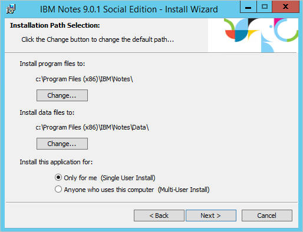

<properties
   pageTitle="Lotus Domino Verbinder | Microsoft Azure"
   description="In diesem Artikel beschreibt das Konfigurieren des Microsoft Lotus Domino Verbinder."
   services="active-directory"
   documentationCenter=""
   authors="AndKjell"
   manager="femila"
   editor=""/>

<tags
   ms.service="active-directory"
   ms.workload="identity"
   ms.tgt_pltfrm="na"
   ms.devlang="na"
   ms.topic="article"
   ms.date="08/30/2016"
   ms.author="billmath"/>

# Lotus Domino Verbinder technische Referenz
In diesem Artikel werden die Lotus Domino Verbinder. Der Artikel bezieht sich auf die folgenden Produkte:

- Microsoft-Identität-Manager 2016 (MIM2016)
- Forefront Identität Manager 2010 R2 (FIM2010R2)
    -   Müssen Update 4.1.3671.0 oder höher [KB3092178](https://support.microsoft.com/kb/3092178)verwenden.

Für MIM2016 und FIM2010R2 wird der Verbinder aus dem [Microsoft Download Center](http://go.microsoft.com/fwlink/?LinkId=717495)zum Download zur Verfügung.

## Übersicht über den Lotus Domino-Connector
Der Verbinder Lotus Domino ermöglicht es Ihnen des Synchronisierungsdiensts mit IBM Lotus Domino-Server integriert werden soll.

Die folgenden Features werden im Hinblick auf hoher Ebene nach der aktuellen Version des Verbinders unterstützt:

Feature | Support
--- | ---
Verbundene Datenquelle | Server: <li>Lotus Domino 8.5.x</li><li>Lotus Domino 9.x</li>Client:<li>Lotus Notes-9.x</li>
Szenarien | <li>Objekt Lifecycle Management</li><li>Verwaltung von Gruppen</li><li>Verwaltung der Kennwörter</li>
Vorgänge | <li>Vollständige und Delta importieren</li><li>Exportieren</li><li>Festlegen und Ihr Kennwort ein, klicken Sie auf HTTP-Kennwort ändern</li>
Schema | <li>Person (Roaming Benutzer Kontakt (Personen ohne Zertifikat))</li><li>Gruppe</li><li>Ressource (Ressource Chatroom, onlinebesprechung)</li><li>E-Mail in der Datenbank</li><li>Dynamische Erkennung von Attributen für unterstützte Objekte</li>

Der Verbinder Lotus Domino verwendet den Lotus Notes-Client zur Kommunikation mit Lotus Domino-Server. Als Folge dieser Abhängigkeit muss einen unterstützten Lotus Notes-Client auf dem Synchronisierungsserver installiert sein. Die Kommunikation zwischen dem Client und auf dem Server wird über die Benutzeroberfläche von Lotus Notes .NET Interop (Interop.domino.dll) implementiert. Diese Schnittstelle erleichtert die die Kommunikation zwischen Microsoft.NET Plattform und Lotus Notes-Client und unterstützt den Zugriff auf Lotus Domino Dokumente und Ansichten. Für den Import Delta ist es auch möglich, dass die systemeigene C++-Schnittstelle (je nach der ausgewählten Delta Import-Methode) verwendet wird.

### Erforderliche Komponenten
Bevor Sie den Verbinder verwenden, stellen Sie sicher, dass Sie für Folgendes auf dem Synchronisierungsserver haben:

- Microsoft .NET 4.5.2 Framework oder höher
- Lotus Notes-Client muss installiert sein, auf dem Synchronisierungsserver
- Der Verbinder Lotus Domino erfordert die standardmäßige Lotus Domino LDAP-Schema-Datenbank (schema.nsf) auf dem Server Domino-Verzeichnis vorhanden sein. Wenn sie nicht vorhanden ist, können Sie es durch Ausführen oder einen Neustart von des LDAP-Diensts auf dem Server Domino installieren.

### Verbundene Datenquelle Berechtigungen
Um die unterstützten Aufgaben im Lotus Domino Verbinder ausführen, müssen Sie Mitglied der folgenden Gruppen sein:

- Vollständige Access-Administratoren
- Administratoren
- Datenbank-Administratoren

Die folgende Tabelle enthält die Berechtigungen, die für jeden Vorgang erforderlich sind:

Vorgang | Zugriffsrechte
--- | ---
Importieren | <li>Öffentliche Dokumente lesen</li><li> Vollständige Access-Administrator (Wenn Sie Mitglied der Administratorgruppe Vollzugriff haben, automatisch stehen Ihnen effektiven Zugriff auf in ACL.)</li>
Exportieren und Festlegen von Kennwörtern | Effektiven Zugriff: <li>Erstellen von Dokumenten</li><li>Löschen von Dokumenten</li><li>Öffentliche Dokumente lesen</li><li>Öffentliche Dokumente schreiben</li><li>Repliziert oder Kopieren von Dokumenten</li>Für Vorgänge exportieren benötigen Sie auch die folgenden Rollen: <li>CreateResource</li><li>GroupCreator</li><li>GroupModifier</li><li>Benutzer</li><li>UserModifier</li>

### Direkte Vorgänge und AdminP
Vorgänge wechseln Sie entweder in das Domino direkt oder durch den Prozess AdminP. Die folgenden Tabellen aller unterstützt Listenobjekte, Vorgänge und, falls zutreffend, die ähnliche Implementierungsmethode:

**Primäre Adressbuch**

Objekt | Erstellen | Aktualisieren | Löschen
--- | --- | --- | ---
Person | AdminP | Direkte | AdminP
Gruppe | AdminP | Direkte | AdminP
MailInDB | Direkte | Direkte | Direkte
Ressource | AdminP | Direkte | AdminP

**Sekundäre Adressbuch**

Objekt | Erstellen | Aktualisieren | Löschen
--- | --- | --- | ---
Person | N/V | Direkte | Direkte
Gruppe | Direkte | Direkte | Direkte
MailInDB | Direkte | Direkte | Direkte
Ressource | N/V | N/V | N/V

Wenn eine Ressource erstellt wurde, wird ein Notes-Dokument erstellt. Wenn eine Ressource gelöscht wird, wird das Notes-Dokument auf ähnliche Weise gelöscht.

### Ports und Protokolle
IBM Lotus Notes-Client und Domino-Servern kommunizieren mit Notizen Remote Prozedur aufrufen (NRPC), in dem NRPC TCP/IP verwendet werden sollen. Der Standardport 1352 ist, aber von den Domino-Administrator geändert werden kann.

### Nicht unterstützt
Die folgenden Vorgänge werden von der aktuellen Version des Verbinders Lotus Domino nicht unterstützt:

- Verschieben von Postfach zwischen Servern.

## Erstellen eines neuen Connectors

### Client-Software-Installation und Konfiguration
Lotus Notes müssen auf dem Server **vor** installiert sein, die der Connector installiert ist.

Wenn Sie installiert haben, stellen Sie sicher, dass Sie einen **Einzelnen Benutzer installieren**können. Die Standardeinstellung **Mit mehreren Benutzern installieren** funktioniert nicht.  

Klicken Sie auf der Seite Features installieren Sie nur die erforderlichen Lotus Notes-Features und **Client einmalige Anmeldung**. Einmalige Anmeldung ist erforderlich, damit der Verbinder zum Domino-Server anmelden können.  

**Hinweis:** Starten Sie Lotus Notes einmal mit einem Benutzer, der auf dem gleichen Server wie das Konto befindet, die Sie als Dienstkonto des Verbinders verwenden. Auch Stellen Sie sicher, dass den Lotus Notes-Client auf dem Server zu schließen. Es kann nicht gleichzeitig ausgeführt werden, die der Verbinder versucht, die Verbindung zum Domino-Server.

### Erstellen Sie Verbinder
Wählen Sie zum Erstellen eines Verbinders Lotus Domino in **Synchronisierungsdiensts** **Management Agent** und **Erstellen**aus. Wählen Sie den Verbinder **Lotus Domino (Microsoft)** aus.  

Wenn Ihre Version von Synchronisierungsdiensts die Möglichkeit bietet, **Architektur**konfigurieren, stellen Sie sicher, dass der Verbinder auf den Standardwert festgelegt ist, auf **Prozess**ausgeführt werden.

### Konnektivität
Klicken Sie auf der Seite Connectivity müssen Sie den Servernamen für Lotus Domino angeben und geben Sie die Anmeldeinformationen.  

Die Eigenschaft Domino-Server unterstützt zwei Formate für den Servernamen ein:

- ServerName
- ServerName/DirectoryName

Das Format **ServerName/DirectoryName** ist das bevorzugte Format für dieses Attribut aus, da sie schneller Antwort bereitstellt, wenn der Verbinder den Domino-Server kontaktiert.

Die bereitgestellte Benutzer-ID-Datei wird in der Datenbank die Konfiguration des Synchronisierungsdiensts gespeichert.

Für den **Import Delta** müssen Sie diese Optionen aus:

- **Keine**. Der Verbinder führt keine Delta Importe aus.
- **Hinzufügen/Aktualisieren**. Der Verbinder Features Delta Import hinzufügen und Aktualisieren von Vorgängen. Zum Löschen ist eine **Vollständige** Importvorgang erforderlich. Dieser Vorgang ist die .net Interop verwenden.
- **Hinzufügen, aktualisieren und löschen**. Der Verbinder Features Delta Import hinzufügen, aktualisieren und Löschvorgängen. Dieser Vorgang ist die systemeigenen C++-Schnittstellen verwenden.

**Schema** Optionen haben Sie die folgenden Optionen aus:

- **Schema Standard**. Der Verbinder erkennt das Schema aus dem Domino-Server. Dies ist die Standardoption.
- **DSML-Schema**. Nur verwendet der Domino-Server das Schema nicht verfügbar gemacht. Klicken Sie dann können Sie eine Datei DSML mit dem Schema erstellen und importieren Sie ihn. Weitere Informationen zum DSML finden Sie unter [OASIS](https://www.oasis-open.org/committees/tc_home.php?wg_abbrev=dsml).

Wenn Sie auf Weiter klicken, werden die Benutzer-ID und Ihr Kennwort ein Konfigurationsparameter überprüft.

### Globale Parameter
Auf der Seite globale Parameter konfigurieren die gewünschte Zeitzone und das Importieren und exportieren die Option Vorgang.  

Der Parameter **Domino Server (Bildschirmdruck)** definiert den Speicherort Ihres Domino-Servers.

Diese Konfigurationsoption ist erforderlich zur Unterstützung von Vorgängen **Delta importieren** , da es sich um die Synchronisierung ermöglicht Dienst Änderungen zwischen den beiden letzten Imports ermitteln.

#### Importeinstellungen, Methode
Die **Vollständige Import Ausführen von** gibt es drei Optionen aus:

- Suchen
- Anzeigen (empfohlen)

Allgemeine, dass die Indizes nicht in Echtzeit aktualisiert werden und die vom Server zurückgegebenen Daten nicht immer korrekt ist, aber **Suche** ist in Domino Indizierung verwenden. Für ein System mit vielen Änderungen diese Option normalerweise funktioniert nicht gut und falsch in einigen Fällen löscht enthält. **Suche** ist jedoch schneller als **Anzeigen**.

**Ansicht** wird empfohlen, da er den richtigen Status des Daten enthält. Es ist etwas langsamer als suchen.

#### Erstellen von virtuellen Contact-Objekte
Die **Besprechungsarbeitsbereich \_Kontaktobjekt** gibt es drei Optionen:

- Keine
- Nicht-Referenz Werte
- Verweis und nicht Verweis Werte

In Domino können die Verweis Attribute vielen verschiedene Formaten zum Verweisen auf andere Objekte enthalten. Verschiedene Variationen, die Verbinder implementiert darstellen können \_wenden Sie sich an Objekte, auch bekannt als **Virtuelle Kontakte** (VC). Dieser Objekte erstellt, sodass sie vorhandene MV Objekte an Besprechung teilnehmen können oder erwarteter als neue Objekte. Auf diese Weise können Attribut Verweise archiviert werden.

Durch das Aktivieren dieser Einstellung und der Inhalt von einer Verweisattribut kein DN-Format ist ein \_Kontaktobjekt wird erstellt. Beispielsweise kann ein Mitgliedsattribut einer Gruppe SMTP-Adressen enthalten. Es kann auch ShortName und andere Attribute in Bezug Attribute vorhanden sein. Wählen Sie in diesem Szenario **Ohne Verweis Werte**ein. Diese Konfiguration ist die am häufigsten verwendeten Einstellung für Domino Implementierungen.

Wenn die Lotus Domino separaten Adressbücher mit unterschiedlichen definierten Namen, das dasselbe Objekt repräsentieren haben konfiguriert ist, ist möglicherweise auch erstellen \_wenden Sie sich an Objekte für alle Bezug Werte, die in einem Adressbuch gefunden werden. Wählen Sie in diesem Szenario die Option **Bezug und ohne Verweis Werte** ein.

Wenn Sie mehrere Werte in das Attribut **FullName** in Domino haben, möchten Sie auch die Erstellung virtueller Kontakte aktivieren, damit Verweise aufgelöst werden können. Beispielsweise kann dieses Attribut mehrere Werte nach einer Hochzeit oder Scheidung verfügen. Aktivieren Sie das Kontrollkästchen **aktivieren... FullName besitzt mehrere Werte** für dieses Szenario.

Durch das Verknüpfen auf den richtigen Attributen, die \_Kontaktobjekte sollte das MV-Objekt hinzugefügt werden.

Diese Objekte weisen VC =\_deren DN Kontakt hinzugefügt.

#### Importieren Sie die Einstellungen, stehen Objekt in Konflikt
**Ausschließen von Konfliktobjekt**

In einer großen Domino Implementierung ist es möglich, mehrere Objekte aufgrund von Replikationsproblemen mit den gleichen DN haben. In diesen Fällen wird der Verbinder zwei Objekte mit anderen UniversalIDs aber gleichen DN angezeigt. Dieser Konflikt würde ein temporäres Objekt erstellt wird, in dem Bereich Verbinder. Der Verbinder kann Objekte ignorieren, die als Replikation Opfer in Domino ausgewählt wurden. Es wird empfohlen, belassen Sie dieses Kontrollkästchen aktiviert ist.

#### Exportieren von Einstellungen
Wenn die Option **AdminP zum Aktualisieren der Verweise verwenden** deaktiviert ist, Exportieren von Bezug Attributen, wie z. B. Mitglied, einen direkten Anruf und verwendet nicht den Prozess AdminP. Verwenden Sie diese Option nur, wenn AdminP nicht konfiguriert wurde, um die referenzielle Integrität zu erhalten.

#### Routing-Informationen
In Domino ist es möglich, dass ein Bezug Attribut Weiterleitung als Suffix auf den definierten Namen eingebetteten Informationen enthält. Beispielsweise kann das Mitgliedsattribut in einer Gruppe enthalten **CN=example/organization@ABC**. Das Suffix @ABC ist die routing-Informationen. Die routing-Informationen wird von Domino verwendet, e-Mails an das richtige Domino System senden sich ein System in einer anderen Organisation handeln. Im Feld Routing-Informationen können Sie die innerhalb der Organisation Umfang der Verbinder verwendet Weiterleiten eines Suffix angeben. Wenn Sie einen der folgenden Werte in einem Bezug Attribut als Suffix gefunden wird, wird die Weiterleitung Informationen aus den Bezug entfernt. Falls das Weiterleitung Suffix nach einem Bezugswert auf einen der diese Werte angegeben, zugeordnet werden kann ein \_Kontaktobjekt wird erstellt. Diese \_Kontaktobjekte mit erstellt werden ** RO=@ ** in den DN eingefügt. Für diese \_Kontakt Objekte die folgenden Attributen werden dürfen dem Beitreten zu einem tatsächlichen Objekt bei Bedarf auch hinzugefügt: \_RoutingName, \_Kontaktname, \_DisplayName und UniversalID.

#### Zusätzliche Adressbücher
Wenn Sie nicht **Directory-Unterstützung** installiert haben, die den Namen des sekundären Adressbücher bereitstellt haben, können Sie diese Adressbücher manuell eingeben.

#### Mehrwertige Transformation
Viele Attribute in Lotus Domino sind mit mehreren Werten. Die entsprechenden Metaverse Attribute sind in der Regel einzelne Werte. Durch den Import und Export-Operation-Option konfiguriert haben, können Sie den Verbinder, um Hilfe bei der betroffenen Attribute die erforderliche Übersetzung aus.

**Exportieren**  
Die Option exportieren Vorgang unterstützt zwei Modi:

- Element anfügen
- Element ersetzen

**Element ersetzen** – bei Auswahl dieser Option wird der Verbinder immer die aktuellen Werte für das Attribut in Domino entfernen und Ersetzen sie mit der angegebenen Werte. Das bereitgestellte bewertet eindeutiges oder mehrwertig werden können.

Beispiel: Das Attribut Anmeldeassistenten eines Objekts Person weist die folgenden Werte:

- CN = Greg Winston/OU=Contoso/O=Americas,NAB=names.nsf
- CN = Johann Smith/OU=Contoso/O=Americas,NAB=names.nsf

Wenn Sie ein neuer Assistenten mit dem Namen **David Alexander** dieses Personenobjekt zugewiesen ist, ist das Ergebnis:

- CN = David Alexander/OU=Contoso/O=Americas,NAB=names.nsf

**Element anfügen** – bei Auswahl dieser Option wird der Verbinder behält die vorhandene Werte für das Attribut in Domino, und fügen neue Werte am oberen Rand der Liste.

Beispiel: Das Attribut Anmeldeassistenten eines Objekts Person weist die folgenden Werte:

- CN = Greg Winston/OU=Contoso/O=Americas,NAB=names.nsf
- CN = Johann Smith/OU=Contoso/O=Americas,NAB=names.nsf

Wenn Sie ein neuer Assistenten mit dem Namen **David Alexander** dieses Personenobjekt zugewiesen ist, ist das Ergebnis:

- CN = David Alexander/OU=Contoso/O=Americas,NAB=names.nsf
- CN = Greg Winston/OU=Contoso/O=Americas,NAB=names.nsf
- CN = Johann Smith/OU=Contoso/O=Americas,NAB=names.nsf

**Importieren**  
Die Option importieren Vorgang unterstützt zwei Modi:

- Standard
- Mehrwertige Einzelwert

**Standard** – Wenn Sie die Standardoption auswählen, werden alle Werte aller Attribute importiert.

**Multivalued Einzelwert** – Wenn Sie diese Option, die ein mehrwertiges Attribut auswählen, wird in ein eindeutiges Attribut konvertiert. Wenn Sie mehr als ein Wert vorhanden ist, wird der Wert oben (dieser Wert ist in der Regel auch die neuesten) verwendet.

Beispiel: Das Attribut Anmeldeassistenten eines Objekts Person weist die folgenden Werte:

- CN = David Alexander/OU=Contoso/O=Americas,NAB=names.nsf
- CN = Greg Winston/OU=Contoso/O=Americas,NAB=names.nsf
- CN = Johann Smith/OU=Contoso/O=Americas,NAB=names.nsf

Die letzte Aktualisierung dieses Attribut ist **David Alexander**. Da die Option importieren Vorgang auf Multivalued Einzelwert festgelegt ist, importiert Verbinder **David Alexander** nur in den Verbinder Abstand fest.

Die Logik, mehrwertige Attribute in eindeutiges Attribute konvertieren gilt nicht das Attribut der Gruppe Mitglied und die Person Fullname Attribut.

So konfigurieren importieren und Exportieren von Transformation auch möglich Regeln für mehrwertig Attribute pro Attribut, als Ausnahme in die globale Regel. Geben Sie diese Option um zu konfigurieren [Objekttyp] aus. [Attributename] in die Textfelder **Ausschluss Attributliste importieren** und **Exportieren von Ausschlusswörterbüchern Attributliste** . Wenn Sie Person.Assistant eingeben, und die globale Kennzeichnung So importieren Sie alle Werte festgelegt ist, wird nur der erste Wert für den Assistenten importiert.

#### Zertifizierer
Alle Organisation/Organisationseinheit Einheiten werden vom Connector aufgeführt. Um die Person Objekte in der primären Adressbuch exportieren können, ist eine Certifier und das Kennwort erforderlich.

Wenn alle Zertifizierer dasselbe Kennwort verfügen, können das **Kennwort für alle Certifers** verwendet werden. Sie können Geben Sie das Kennwort ein, und geben Sie nur die Certifier-Datei.

Wenn Sie nur importieren, müssen Sie keine Zertifizierer angeben.

### Konfigurieren der Bereitstellung Hierarchie
Wenn Sie den Verbinder Lotus Domino konfigurieren, überspringen Sie diese Dialogseite. Der Verbinder Lotus Domino unterstützt keine Hierarchie bereitgestellt.  

### Konfigurieren von Partitionen und Hierarchien
Wenn Sie Partitionen und Hierarchien konfigurieren, müssen Sie das primäre Adressbuch aufgerufen NAB=names.nsf auswählen. Zusätzlich zu den primären Adressbuch können Sie sekundäre Adressbücher auswählen, wenn sie vorhanden sind.  

### Wählen Sie Attribute aus.
Wenn Sie Ihre Attribute konfigurieren, müssen Sie alle Attribute, denen vorangestellt werden, auswählen ** \_MMS\_**. Diese Attribute sind erforderlich, wenn Sie neue Objekte Lotus Domino bereitstellen

## Objekt Lifecycle Management
Dieser Abschnitt enthält eine Übersicht über die verschiedenen Objekte in Domino.

### Person-Objekten
Das Personenobjekt steht für Benutzer in der Organisation und Organisationseinheiten. Zusätzlich zu der Standardattribute kann Domino-Administrator benutzerdefinierte Attribute eines Person-Objekts hinzufügen. Zumindest muss ein Person-Objekt alle erforderlichen Attribute beinhalten. Eine vollständige Liste der erforderlichen Attribute finden Sie unter [Lotus Notes-Eigenschaften](#lotus-notes-properties). Um ein Personenobjekt zu registrieren, müssen die folgenden Vorkenntnisse erfüllt sein:

- Das Adressbuch (names.nsf) definiert und wird die primäre Adressbuch.
- Sie müssen die O/Organisationseinheit Certifier-Id und das Kennwort ein, um einen bestimmten Benutzer in der Organisation zu registrieren / Organisationseinheit.
- Sie müssen eine bestimmte Gruppe von Lotus Notes-Eigenschaften für eine Personenobjekt festlegen. Diese Eigenschaften werden für die Bereitstellung des Personenobjekts verwendet. Weitere Informationen hierzu finden Sie im Abschnitt [Lotus Notes-Eigenschaften](#lotus-notes-properties) weiter unten in diesem Dokument.
- Das ursprüngliche HTTP-Kennwort nach einer Person ist ein Attribut und festlegen, während der Bereitstellung.
- Das Personenobjekt muss eine der folgenden drei unterstützten Typen:
    1. Normal Benutzers, bei dem eine e-Mail-Datei und eine Benutzer-Id-Datei
    2. Roaming-Benutzer (ein normaler Benutzer, die alle roaming Datenbankdateien enthält)
    3. Kontakte (Benutzer mit keine ID-Datei)

Personen (außer Kontakte) können weiteren gruppiert werden in US-Benutzer und internationalen Benutzer gemäß der Definition durch den Wert von der \_MMS\_IDRegType Eigenschaft. Diese Personen verwenden den Notes-Client Zugriff auf Lotus Domino-Server verfügen über eine Notes-Id und einer Personendokument. Wenn sie Notizen e-Mail verwenden, müssen sie auch eine e-Mail-Datei. Der Benutzer muss registriert sein, um aktiv zu werden. Weitere Informationen finden Sie unter:

- [Einrichten von Benutzern von Notizen](http://publib.boulder.ibm.com/infocenter/domhelp/v8r0/index.jsp?topic=/com.ibm.help.domino.admin85.doc/H_SETTING_UP_NOTES_USERS.html)
- [Registrierung Benutzer](http://publib.boulder.ibm.com/infocenter/domhelp/v8r0/index.jsp?topic=/com.ibm.help.domino.admin85.doc/H_REGISTERING_USERS.html)
- [Verwalten von Benutzern](http://publib.boulder.ibm.com/infocenter/domhelp/v8r0/index.jsp?topic=/com.ibm.help.domino.admin85.doc/H_MANAGING_USERS_5151.html)
- [Umbenennen von Benutzern](http://publib.boulder.ibm.com/infocenter/domhelp/v8r0/index.jsp?topic=/com.ibm.help.domino.admin85.doc/H_RENAMING_A_USER_AUTOMATICALLY.html)

All diese Vorgänge werden in Lotus Domino ausgeführt, und klicken Sie dann in des Synchronisierungsdiensts importiert.

### Räume und Ressourcen
Eine Ressource ist eine andere Art von einer Datenbank in Lotus Domino. Ressourcen können Konferenzräumen mit verschiedenen Arten von Geräten wie Projektoren werden. Es gibt Untertypen von Ressourcen, die vom Lotus Domino Connector unterstützt, die durch das Attribut Ressourcenart definiert sind:

Ressourcentyp | Ressourcentyp-Attribut
--- | ---
Raum | 1
Ressource (andere) | 2
Online-Besprechung | 3

Für die Ressource Objekttyp arbeiten ist Folgendes erforderlich:

- Ressourcenreservierung Datenbank sollte in der verbundenen Domino Server bereits vorhanden sind.
- Die Website ist bereits für die Ressource definiert.

Die Datenbank Reservierung von Ressourcen enthält drei Arten von Dokumenten an:

- Website-Profil
- Ressource
- Reservierung

Weitere Informationen zum Einrichten von der Datenbank Reservierung von Ressourcen finden Sie unter [Einrichten der Reservierung von Ressourcen Datenbank](https://www-01.ibm.com/support/knowledgecenter/SSKTMJ_8.0.1/com.ibm.help.domino.admin.doc/DOC/H_SETTING_UP_THE_RESOURCE_RESERVATIONS_DATABASE.html).

**Erstellen, aktualisieren und Löschen von Ressourcen**  
Die Vorgänge erstellen, aktualisieren und löschen werden vom Lotus Domino Connector in der Datenbank Reservierung von Ressourcen ausgeführt. Ressourcen werden als Dokumente in Names.nsf (d. h., die primäre Adressbuch) erstellt. Weitere Details bearbeiten und Löschen von Ressourcen finden Sie unter [Bearbeiten und Löschen von Dokumenten von Ressourcen](http://publib.boulder.ibm.com/infocenter/domhelp/v8r0/index.jsp?topic=/com.ibm.help.domino.admin85.doc/H_EDITING_AND_DELETING_RESOURCE_DOCUMENTS.html).

**Importieren und Exportieren von Ressourcen**  
Die Ressourcen können zu importiert und aus des Synchronisierungsdiensts, wie alle anderen Objekttypen exportiert werden. Wählen Sie den Typ des Objekts während der Konfiguration als Ressource aus. Für den Vorgang erfolgreich exportieren sollten Sie Details für Ressourcenart, Konferenz-Datenbank und Name der Website verfügen.

### E-Mail In Datenbanken
Eine E-Mail In Datenbank ist eine Datenbank, die e-Mails erhalten soll. Es ist ein Lotus Domino-Postfach, das keine bestimmte Lotus Domino Benutzerkonto zugeordnet ist (d. h., es verfügt nicht über eine eigene ID-Datei und Kennwort). Eine e-Mail in Datenbank verfügt über eine eindeutige Benutzer-ID ("Kurzname") erkannt und eine eigene e-Mail-Adresse zugeordnet.

Es ist eine Notwendigkeit ein separates Postfach mit einem eigenen e-Mail-Adresse, die von anderen Benutzern gemeinsam genutzt werden kann (z. B. group@contoso.com), eine e-Mail in Datenbank wird erstellt. Zugriff auf dieses Postfach wird durch deren Access Control List (ACL), gesteuert, die die Namen der Benutzer Notizen, die berechtigt sind enthält, das Postfach zu öffnen.

Eine Liste der erforderlichen Attribute finden Sie im Abschnitt [Erforderliche Attribute](#mandatory-attributes) weiter unten in diesem Artikel.

Wenn Sie eine Datenbank ausgelegt ist, erhalten eine e-Mail, wird ein Dokument E-Mail In der Datenbank in Lotus Domino erstellt. Dieses Dokument muss im Domino-Verzeichnis von jeder Server vorhanden sein, die eine Kopie der Datenbank gespeichert. Eine detaillierte Beschreibung zum Erstellen eines Dokuments e-Mail in der Datenbank finden Sie unter [Erstellen eines Dokuments E-Mail In der Datenbank](http://publib.boulder.ibm.com/infocenter/domhelp/v8r0/index.jsp?topic=/com.ibm.help.domino.admin85.doc/H_CREATING_A_MAILIN_DATABASE_DOCUMENT_FOR_A_NEW_DATABASE_OVERVIEW.html).

Bevor Sie eine E-Mail In Datenbank erstellen, die Datenbank sollte bereits vorhanden sein (sollte erstellt wurden vom Lotus-Administrator) bei dem Domino-Server.

### Verwaltung von Gruppen
Sie erhalten einen detaillierten Überblick über die Verwaltung von Lotus Domino Gruppen von den folgenden Ressourcen:

- [Verwenden von Gruppen](http://publib.boulder.ibm.com/infocenter/domhelp/v8r0/index.jsp?topic=/com.ibm.help.domino.admin85.doc/H_USING_GROUPS_OVER.html)
- [Erstellen einer Gruppe](http://publib.boulder.ibm.com/infocenter/domhelp/v8r0/index.jsp?topic=/com.ibm.help.domino.admin85.doc/H_CREATING_AND_MODIFYING_GROUPS_STEPS_MIDTOPIC_55038956829238418.html)
- [Erstellen und Ändern von Gruppen](http://publib.boulder.ibm.com/infocenter/domhelp/v8r0/index.jsp?topic=/com.ibm.help.domino.admin85.doc/H_CREATING_AND_MODIFYING_GROUPS_STEPS.html)
- [Verwalten von Gruppen](http://publib.boulder.ibm.com/infocenter/domhelp/v8r0/index.jsp?topic=/com.ibm.help.domino.admin85.doc/H_MANAGING_GROUPS_1804.html)
- [Umbenennen einer Gruppe](http://publib.boulder.ibm.com/infocenter/domhelp/v8r0/index.jsp?topic=/com.ibm.help.domino.admin85.doc/H_RENAMING_A_GROUP_STEPS.html)

### Verwaltung der Kennwörter
Es gibt zwei Arten von Kennwörtern, für einen registrierten Lotus Domino-Benutzer:

1. Benutzerkennwort (gespeicherte Benutzer.ID-Datei)
2. Internet / HTTP-Kennwort

Der Verbinder Lotus Domino unterstützt nur Vorgänge mit HTTP-Kennwort an.

Um die Verwaltung der Kennwörter ausführen zu können, sollten Sie die Verwaltung der Kennwörter für die Verbinder im Management Agent-Designer aktivieren. Aktivieren Sie auf der Dialogseite **Erweiterungen konfigurieren** **Verwaltung der Kennwörter aktivieren** , um Verwaltung der Kennwörter zu aktivieren.  

Die folgenden Vorgänge auf Internet-Kennwort Lotus Domino Connector-Unterstützung:

- Festlegen von Kennwörtern: Festlegen von Kennwörtern legt ein neues Kennwort für den HTTP/Internet auf die Benutzer in Domino an. Standardmäßig ist das Konto nicht gesperrte. Klicken Sie auf die WMI-Schnittstelle der Synchronisierungs-Engine wird die Kennzeichnung entsperren bereitgestellt.
- Ändern des Kennworts: In diesem Szenario ein Benutzer möglicherweise möchten Sie das Kennwort ändern oder aufgefordert, das Kennwort nach einer bestimmten Zeit zu ändern. Platzieren Sie für diesen Vorgang ausführen, sowohl (die alte und das neue Kennwort) sind Pflichtfelder. Nachdem geändert haben, wird das neue Kennwort in Lotus Domino aktualisiert.

Weitere Informationen finden Sie unter:

- [Verwenden die Sperrung Internet](http://www.ibm.com/developerworks/lotus/library/domino8-lockout/)
- [Verwalten von Kennwörtern Internet](http://publib.boulder.ibm.com/infocenter/domhelp/v8r0/index.jsp?topic=/com.ibm.help.domino.admin85.doc/H_NOTES_AND_INTERNET_PASSWORD_SYNCHRONIZATION_7570_OVER.html)

## Referenzinformationen
Dieser Abschnitt listet wie Attribut Beschreibungen und Attribut Anforderungen für den Lotus Domino Verbinder.

### Lotus Notes-Eigenschaften
Wenn Sie eine Person Objekte in Ihrem Verzeichnis Lotus Domino bereitstellen, müssen Ihre Objekte eine bestimmte Folge von Eigenschaften mit bestimmten Werten aufgefüllt. Diese Werte sind nur erforderlich für Vorgänge erstellen.

In der folgenden Tabelle werden diese Eigenschaften aufgeführt und enthält eine Beschreibung der.

Eigenschaft | Beschreibung
--- | ---
\_MMS_AltFullName | Das alternative vollständigen Namen des Benutzers.
\_MMS_AltFullNameLanguage | Die Sprache, die zum Angeben des alternativen vollständigen Namens des Benutzers verwendet werden.
\_MMS_CertDaysToExpire | Die Anzahl der Tage ab dem aktuellen Datum an, bevor Sie das Zertifikat läuft ab. Wenn nicht angegeben, ist das Standarddatum zwei Jahren ab dem aktuellen Datum an.
\_MMS_Certifier | Eigenschaft, die den Namen der Certifier Organisationshierarchie enthält. Beispiel: Organisationseinheit = OrganizationUnit, O = Organisation, C = Land.
\_MMS_IDPath | Wenn die Eigenschaft leer ist, wird keine Benutzer-Kennung-Datei lokal auf dem Server synchronisieren erstellt. Die Eigenschaft einen Dateinamen enthält, wird eine Benutzer-ID-Datei im Ordner Madata erstellt. Die Eigenschaft kann auch den vollständigen Pfad enthalten.
\_MMS_IDRegType | Personen können als Kontakte, uns Benutzer und internationale Benutzer klassifiziert werden. In der folgenden Tabelle sind die möglichen Werte aufgeführt: <li>0 - Kontakts</li><li>1 - US-Benutzer</li><li>2 - internationale Benutzer</li>
\_MMS_IDStoreType | Erforderlich-Eigenschaft für USA und internationale Benutzer. Die Eigenschaft enthält eine ganze Zahl, die angibt, ob der Benutzer-ID als Anlage in der Notes-Adressbuch oder in der Person in der e-Mail-Datei gespeichert ist. Ist die Benutzer-ID-Datei eine Anlage im Adressbuch, optional erstellt werden, als eine Datei mit \_MMS_IDPath. <li>Leeren Sie-Speicher-ID-Datei in ID Tresor, keine Kennung-Datei (für Kontakte verwendet).</li><li> 1 - Anlage in der Notes-Adressbuch. Die \_MMS_Password-Eigenschaft muss für Benutzer-ID-Dateien, die Anlagen sind festgelegt werden</li><li>2 - ID in der Person e-Mail-Datei zu speichern. Die \_MMS_UseAdminP muss auf falsch festgelegt sein, damit die e-Mail-Datei, die während der Registrierung Person erstellt werden können. Die \_MMS_Password-Eigenschaft muss für Benutzer Kennung Dateien festgelegt werden.</li>
\_MMS_MailQuotaSizeLimit | Die Anzahl der Megabyte, die für die e-Mail-Dateidatenbank zulässig ist.
\_MMS_MailQuotaWarningThreshold | Die Anzahl der Megabyte, die für die e-Mail-Dateidatenbank zulässig sind, bevor eine Warnung angezeigt wird.
\_MMS_MailTemplateName | E-Mail-Vorlagendatei, die zum Erstellen der E-mail-Datei des Benutzers verwendet wird. Wenn Sie eine Vorlage angegeben ist, wird die e-Mail-Datei mit der angegebenen Vorlage erstellt. Wenn Sie keine Vorlage angeben, wird die Standard-Vorlagendatei zum Erstellen der Datei verwendet.
\_MMS_OU | Optionale Eigenschaft, die der Name der Organisationseinheit unter die Zulassungsstelle ist. Diese Eigenschaft sollte für Kontakte leer sein.
\_MMS_Password | Erforderlich-Eigenschaft für Benutzer. Die Eigenschaft enthält das Kennwort für die Datei Kennung des Objekts.
\_MMS_UseAdminP | True, wenn die e-Mail-Datei durch den Prozess AdminP auf dem Server Domino (in den Exportvorgang asynchrone) erstellt werden soll, sollte Eigenschaft festgelegt werden. Wenn die Eigenschaft auf falsch festgelegt ist, wird die e-Mail-Datei mit dem Benutzer Domino (in den Exportvorgang synchron) erstellt.

Für einen Benutzer mit einer zugeordneten Kennung-Datei die \_MMS_Password-Eigenschaft muss einen Wert enthalten. Für e-Mail-Zugriff über den Lotus Notes-Client müssen die Eigenschaften eines Benutzers laufen und MailFile einen Wert enthalten.

Um e-Mails über einen Webbrowser zugreifen zu können, müssen die folgenden Eigenschaften Werte enthalten:

- MailFile - erforderlich-Eigenschaft, die den Pfad auf dem Server Lotus Domino enthält die e-Mail-Datei gespeichert ist.
- Laufen - erforderlich-Eigenschaft, die den Namen des Lotus Domino-Servers enthält. Dieser Wert ist, den Namen zu verwenden, wenn Sie die Lotus e-Mail-Datei auf dem Server Domino erstellt haben.
- HTTPPassword - optionale Eigenschaft, die das Web Access-Kennwort für das Objekt enthält.

Um den Domino-Server ohne e-Mail-Funktion zugreifen zu können, muss die Eigenschaft HTTPPassword einen Wert enthalten. Die Eigenschaft MailFile und die Eigenschaft laufen können leer sein.

Mit \_MMS_ IDStoreType = 2 (Store-Id in der e-Mail-Datei), die Eigenschaft MailSystem NotesRegistrationclass REG_MAILSYSTEM_INOTES (3) festgelegt ist.

### Erforderliche Attribute
Der Verbinder Lotus Domino unterstützt hauptsächlich diese Objekttypen (Dokumenttypen):

- Gruppe
- E-Mail In der Datenbank
- Person
- Contact (Person mit keine Certifier)
- Ressource

In diesem Abschnitt werden die Attribute aufgeführt, die für jedes unterstützte Objekt so exportieren Sie nach einem Domino-Server erforderlich sind.

Objekttyp | Erforderliche Attribute
--- | ---
Gruppe | <li>Listenname</li>
Primär In der Datenbank | <li>FullName</li><li>MailFile</li><li>Laufen</li><li>MailDomain</li>
Person | <li>Nachname</li><li>MailFile</li><li>ShortName</li><li>\_MMS_Password</li><li>\_MMS_IDStoreType</li><li>\_MMS_Certifier</li><li>\_MMS_IDRegType</li><li>\_MMS_UseAdminP</li>
Contact (Person mit keine Certifier) | <li>\_MMS_IDRegType</li>
Ressource | <li>FullName</li><li>ResourceType</li><li>ConfDB</li><li>ResourceCapacity</li><li>Website</li><li>DisplayName</li><li>MailFile</li><li>Laufen</li><li>MailDomain</li>

## Häufige Probleme und Fragen

### Schema Erkennung funktioniert nicht
Wenn Sie das Schema erkennen können, ist es erforderlich, dass die schema.nsf-Datei auf dem Server Domino vorhanden ist. Diese Datei wird nur angezeigt, wenn LDAP auf dem Server installiert ist. Ist das Schema nicht erkannt werden kann, überprüfen Sie Folgendes:

- Die Datei schema.nsf ist im Stammordner des Domino-Servers vorhanden
- Der Benutzer verfügt über Berechtigungen zum Anzeigen der Datei schema.nsf.
- Erzwingen Sie einen Neustart des LDAP-Servers ein. Öffnen Sie **Lotus Domino-Konsole** und **Feststellen, LDAP-ReloadSchema** -Befehl verwenden Sie, um das Schema neu zu laden.

### Nicht alle sekundären Adressbücher sind sichtbar.
Der Verbinder Domino beruht auf das Feature **Directory Unterstützung** der sekundäre Adressbücher suchen können. Wenn die sekundäre Adressbücher fehlen, überprüfen Sie, sofern das [Directory-Unterstützung](http://publib.boulder.ibm.com/infocenter/domhelp/v8r0/index.jsp?topic=%2Fcom.ibm.help.domino.admin85.doc%2FH_ABOUT_DIRECTORY_ASSISTANCE.html) aktiviert und auf dem Server Domino konfiguriert wurde.

### Benutzerdefinierte Attribute in Domino
Es gibt mehrere Methoden in Domino, um das Schema zu erweitern, sodass es als benutzerdefiniertes Attribut vom Connector verwendet wird.

**Methode 1: Lotus Domino Schema erweitern**

1. Erstellen Sie eine Kopie der Domino Directory Vorlage {PUBNAMES. NTF} nach den folgenden [Schritten](http://publib.boulder.ibm.com/infocenter/domhelp/v8r0/index.jsp?topic=%2Fcom.ibm.help.domino.admin85.doc%2FH_CREATING_A_COPY_OF_THE_DEFAULT_PUBIC_ADDRESS_BOOK_TEMPLATE.html) (Sie sollten nicht anpassen Standard IBM Lotus Domino Verzeichnis Vorlage):
2. Öffnen Sie die Kopie der Domino Directory Dokumentvorlage {"Contoso". NTF}-Vorlage, die im Domino-Designer erstellt wurde, und gehen Sie folgendermaßen vor:
    - Klicken Sie auf freigegebene Elemente, und blenden Sie Unterformulare
    - Doppelklicken Sie auf ${Objektname} InheritableSchema Unterformular (wobei {Objektname} ist der Name des Standard strukturelle Object-Klasse, zum Beispiel: Person).
    - Benennen Sie das Attribut aus, die, das Sie in das Schema {MyPersonAtrribute} und entsprechende dieses Attribut hinzufügen möchten. Erstellen eines Felds durch auswählen im Menü **Erstellen** , und wählen Sie dann im **Feld** .
    - Legen Sie in das Feld hinzugefügt deren Eigenschaften, indem Sie seinen Typ, Formatvorlage, Größe, Schriftart und andere verwandten Parametern im Feld Eigenschaftenfenster ein.
    - Behalten Sie das Attribut standardmäßig gleich als Namen für das Attribut angegebenen Wert (z. B. ist Attributname MyPersonAttribute, den Standardwert mit demselben Namen beibehalten).
    - Speichern Sie das ${Objektname} InheritableSchema Unterformular mit aktualisierten Werte ein.
3. Ersetzen Sie die Vorlage Domino Directory {PUBNAMES. NTF} mit der neuen angepasste Vorlage {"Contoso". NTF} nach den folgenden [Schritten](http://publib.boulder.ibm.com/infocenter/domhelp/v8r0/index.jsp?topic=%2Fcom.ibm.help.domino.admin85.doc%2FH_ABOUT_RULES_FOR_CUSTOMIZING_THE_PUBLIC_ADDRESS_BOOK.html).
4. Schließen Sie Domino Administrator und Domino-Konsole den LDAP-Dienst neu starten und Neuladen des LDAP-Schemas geöffnet werden:
    - Fügen Sie in der Domino-Konsole den Befehl unter **Domino Befehl** Text abgelegt werden, um den LDAP-Dienst - [Vorgang LDAP Neustart]( http://publib.boulder.ibm.com/infocenter/domhelp/v8r0/index.jsp?topic=%2Fcom.ibm.help.domino.admin85.doc%2FH_STARTING_AND_STOPPING_THE_LDAP_SERVER_OVER.html)neu aus.
    - Um LDAP neu zu laden Schema verwenden informieren LDAP-Befehl - informieren LDAP-ReloadSchema
5. Hinzufügen von Person öffnen Domino Administrator und select Registerkarte für Personen und Gruppen finden Sie unter hinzugefügte Attribut in Domino wiedergegeben wird.
6. Öffnen Sie Schema.nsf Registerkarte **Dateien** , und finden Sie unter hinzugefügte Attribut in DominoPerson LDAP-Objektklasse wiedergegeben wird.

**Methode 2: Erstellen Sie einer AuxClass mit benutzerdefinierten Attribut und ordnen Sie Object-Klasse**

1. Erstellen Sie eine Kopie der Domino Directory Vorlage {PUBNAMES. NTF} nach den folgenden [Schritten](http://publib.boulder.ibm.com/infocenter/domhelp/v8r0/index.jsp?topic=%2Fcom.ibm.help.domino.admin85.doc%2FH_CREATING_A_COPY_OF_THE_DEFAULT_PUBIC_ADDRESS_BOOK_TEMPLATE.html) (nie anpassen das standardmäßige IBM Lotus Domino Verzeichnis Vorlage):
2. Öffnen Sie die Kopie der Domino Directory Dokumentvorlage {"Contoso". NTF}-Vorlage, die im Domino-Designer erstellt wurde.
3. Wählen Sie im linken Bereich Code freigegeben, und klicken Sie dann Unterformulare aus.
4. Klicken Sie auf neues Unterformular
5. Gehen Sie wie folgt vor, um die Eigenschaften für das neue Unterformular angeben:
    - Mit dem neuen Unterformular zu öffnen Sie, und wählen Sie Design - Unterformular Eigenschaften
    - Geben Sie neben der Eigenschaft Name einen Namen für die zusätzlichen Object-Klasse – beispielsweise TestSubform aus.
    - Behalten Sie die Optionen-Eigenschaft "Einschließen im Unterformular einfügen... Dialogfeld" aktiviert
    - Deaktivieren Sie die Optionen Eigenschaft "Rendern Pass-through-HTML-Code auf Notizen."
    - Lassen Sie den anderen Eigenschaften gleich, und schließen Sie das Unterformular Eigenschaften.
    - Speichern Sie und schließen Sie das neue Unterformular.
6. Gehen folgendermaßen Sie vor, um ein Feld zum Definieren von zusätzlichen Object-Klasse hinzuzufügen:
    - Öffnen Sie das Unterformular, die, das Sie erstellt haben.
    - Wählen Sie erstellen - Feld.
    - Neben dem Namen auf der Registerkarte Grundlagen im Dialogfeld Feld, geben Sie einen beliebigen Namen ein, beispielsweise: {MyPersonTestAttribute}.
    - Legen Sie in das Feld hinzugefügt deren Eigenschaften, indem Sie dessen Typ, Formatvorlage, Größe, Schriftart und verwandte Eigenschaften auswählen.
    - Behalten Sie das Attribut standardmäßig gleich als Namen für das Attribut angegebenen Wert (z. B. ist Attributname MyPersonTestAttribute, den Standardwert mit demselben Namen beibehalten).
    - Speichern Sie das Unterformular mit aktualisierten Werte, und gehen Sie folgendermaßen vor:
        - Wählen Sie im linken Bereich Code freigegeben, und klicken Sie dann Unterformulare
        - Wählen Sie das neue Unterformular, und wählen Sie Design - Entwurfseigenschaften.
        - Klicken Sie auf der Registerkarte dritte von links, und wählen Sie **weitergeben dieser verboten Entwurf ändern**.
7. Öffnen Sie ${Objektname} ExtensibleSchema Unterformular, (wobei {Objektname} für den Namen der standardmäßigen strukturelle Object-Klasse, beispielsweise – Person ist).
8. Fügen Sie Ressource ein, und wählen Sie das Unterformular (die Sie, beispielsweise – TestSubform erstellt haben), und speichern Sie das Unterformular ${Objektname} ExtensibleSchema.
9. Ersetzen Sie die Vorlage Domino Directory {PUBNAMES. NTF} mit der neuen angepasste Vorlage {"Contoso". NTF} nach den folgenden [Schritten](http://publib.boulder.ibm.com/infocenter/domhelp/v8r0/index.jsp?topic=%2Fcom.ibm.help.domino.admin85.doc%2FH_ABOUT_RULES_FOR_CUSTOMIZING_THE_PUBLIC_ADDRESS_BOOK.html).
10. Schließen Sie Domino Administrator und Domino-Konsole den LDAP-Dienst neu starten und Neuladen des LDAP-Schemas geöffnet werden:
    - Fügen Sie in der Domino-Konsole den Befehl unter **Domino Befehl** Text abgelegt werden, um den LDAP-Dienst - [Vorgang LDAP Neustart](http://publib.boulder.ibm.com/infocenter/domhelp/v8r0/index.jsp?topic=%2Fcom.ibm.help.domino.admin85.doc%2FH_STARTING_AND_STOPPING_THE_LDAP_SERVER_OVER.html)neu aus.
    - Um LDAP-Schema verwenden, informieren LDAP-Befehl **LDAP-ReloadSchema feststellen,**neu zu laden.
11. Domino Administrator öffnen, und wählen Sie Benutzer und Gruppen Registerkarte finden Sie unter hinzugefügte Attribut wirkt sich auf Domino Person hinzufügen (unter andere Registerkarte).
12. Öffnen Sie Schema.nsf Registerkarte **Dateien** , und finden Sie unter TestSubform LDAP-zusätzlichen Objekt Class hinzugefügte Attribut wiedergegeben wird.

**Methode 3: Das benutzerdefinierte Attribut der Klasse ExtensibleObject hinzufügen**

1. Öffnen des Stammverzeichnisses gebracht {Schema.nsf}-Datei
2. Wählen Sie LDAP-Objektklassen aus dem linken Menü unter **Alle Schemadokumente** aus, und klicken Sie auf **Klasse hinzufügen des Objekts** :
3. Geben Sie an der LDAP in Form von {ZzzExtensibleSchema} (wobei Zzz den Namen des Standard strukturelle Object-Klasse, beispielsweise Person ist). Angenommen, um das Schema für die Person Object-Klasse erweitern, bieten Sie LDAP-Namen {PersonExtensibleSchema}.
4. Geben Sie Vorgesetzter Objekt Class an, für die Sie das Schema erweitern möchten. Angenommen, um das Schema für die Person Object-Klasse zu erweitern, bieten Sie Vorgesetzter Class Objektname {DominoPerson}:
5. Geben Sie eine zulässige OID, Object-Klasse entspricht.
6. Wählen Sie erweiterte/benutzerdefinierte Attribute unter obligatorisch oder Optional Attribute vom Typ Felder gemäß der Anforderung aus:
7. Klicken Sie nach der ExtensibleObjectClass erforderlichen Attribute hinzugefügt haben auf **Speichern und schließen**.
8. Eine ExtensibleObjectClass wird für den jeweiligen Standard Object-Klasse mit erweiterten Attributen erstellt.

## Behandlung von Problemen

-   Informationen zum Aktivieren der Protokollierung den Verbinder zur Problembehandlung finden Sie unter [So Enable Tracing ETW für Verbinder](http://go.microsoft.com/fwlink/?LinkId=335731).
