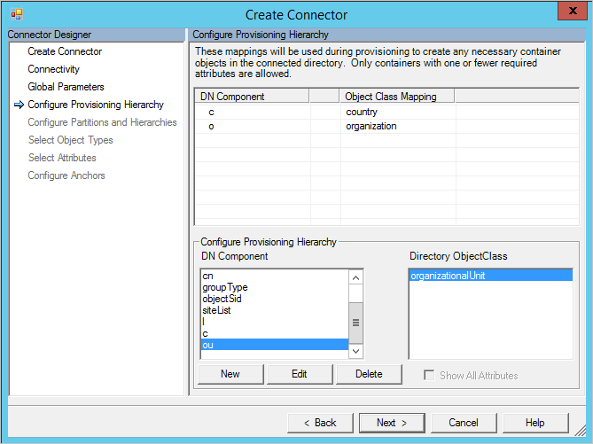
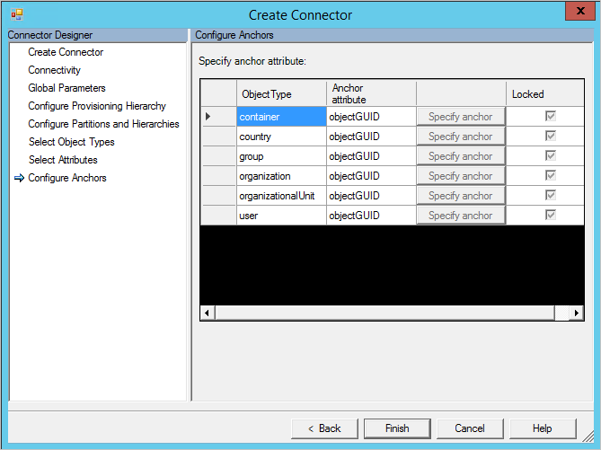

<properties
   pageTitle="Allgemeine LDAP-Verbinder | Microsoft Azure"
   description="Dieser Artikel beschreibt, wie Microsoft allgemeine LDAP-Connector konfigurieren."
   services="active-directory"
   documentationCenter=""
   authors="AndKjell"
   manager="femila"
   editor=""/>

<tags
   ms.service="active-directory"
   ms.workload="identity"
   ms.tgt_pltfrm="na"
   ms.devlang="na"
   ms.topic="article"
   ms.date="08/30/2016"
   ms.author="billmath"/>

# Generische technische LDAP-Connector-Referenz
In diesem Artikel werden die allgemeine LDAP-Verbinder. Der Artikel bezieht sich auf die folgenden Produkte:

- Microsoft-Identität-Manager 2016 (MIM2016)
- Forefront Identität Manager 2010 R2 (FIM2010R2)
    -   Müssen Update 4.1.3671.0 oder höher [KB3092178](https://support.microsoft.com/kb/3092178)verwenden.

Für MIM2016 und FIM2010R2 wird der Verbinder aus dem [Microsoft Download Center](http://go.microsoft.com/fwlink/?LinkId=717495)zum Download zur Verfügung.

Dieses Dokument ist in Bezug auf IETF-RFCs mithilfe des Formats (RFC [RFC-Nummer] / [Kapitel im Dokument RFC]), beispielsweise (RFC 4512/4.3).
Weitere Informationen finden unter http://tools.ietf.org/html/rfc4500 (Sie müssen 4500 durch die richtige Anzahl von RFC ersetzen) haben.

## Übersicht über die allgemeine LDAP-Connector
Die allgemeine LDAP-Connector ermöglicht es Ihnen des Synchronisierungsdiensts mit einem LDAP-v3-Server integriert werden soll.

Bestimmte Vorgänge und Schemaelemente, wie erforderlich ausführen Delta importieren, werden nicht in die IETF-RFCs angegeben. Für diese Vorgänge werden nur explizit angegebene LDAP-Verzeichnissen unterstützt.

Die folgenden Features werden im Hinblick auf hoher Ebene nach der aktuellen Version des Verbinders unterstützt:

Feature | Support
--- | --- |
Verbundene Datenquelle | Der Verbinder wird mit allen LDAP-v3-Servern (RFC 4510 kompatibel) unterstützt. Es wurde mit den folgenden getestet: <li>Microsoft Active Directory Lightweight Directory Services (AD LDS)</li><li>Microsoft Active Directory globalen Katalog AD</li><li>389 Directory-Server</li><li>Apache Directory-Server</li><li>IBM Tivoli DS</li><li>Isode-Verzeichnis</li><li>NetIQ eDirectory</li><li>Novell eDirectory</li><li>DJ öffnen</li><li>DS öffnen</li><li>Offenes LDAP (openldap.org)</li><li>Oracle (zuvor so) Directory Server Enterprise Edition</li><li>RadiantOne virtuelle Verzeichnisserver (VDS)</li><li>So eine Directory-Server</li>**Wichtige Verzeichnisse nicht unterstützt:** <li>Microsoft Active Directory-Domänendiensten (AD DS) [verwenden Sie stattdessen die integrierten Active Directory-Connector]</li><li>Oracle-Internetverzeichnis (OID)</li>
Szenarien   | <li>Objekt Lifecycle Management</li><li>Verwaltung von Gruppen</li><li>Verwaltung der Kennwörter</li>
Vorgänge |Die folgenden Vorgänge werden auf alle LDAP-Verzeichnissen unterstützt: <li>Vollständige importieren</li><li>Exportieren</li>Die folgenden Vorgänge werden nur auf angegebenen Verzeichnisse unterstützt:<li>Delta importieren</li><li>Kennwort festlegen, Ändern des Kennworts</li>
Schema | <li>Schema wird aus dem LDAP-Schema (RFC3673 und RFC4512/4.2) erkannt.</li><li>Unterstützt strukturelle Klassen, Aux Klassen und ExtensibleObject Objekt Class (RFC4512/4.3)</li>

### Unterstützung für Delta importieren und das Kennwort management
Verzeichnisse für Delta importieren und Kennwort Verwaltung unterstützt:

- Microsoft Active Directory Lightweight Directory Services (AD LDS)
    - Alle Vorgänge für den Import Delta unterstützt
    - Festlegen von Kennwörtern unterstützt
- Microsoft Active Directory globalen Katalog AD
    - Alle Vorgänge für den Import Delta unterstützt
    - Festlegen von Kennwörtern unterstützt
- 389 Directory-Server
    - Alle Vorgänge für den Import Delta unterstützt
    - Unterstützt Set-Kennwort und Kennwort ändern
- Apache Directory-Server
    - Delta Import wird nicht unterstützt werden, da für dieses Verzeichnis ein beständiger Änderungsprotokoll nicht vorhanden ist
    - Festlegen von Kennwörtern unterstützt
- IBM Tivoli DS
    - Alle Vorgänge für den Import Delta unterstützt
    - Unterstützt Set-Kennwort und Kennwort ändern
- Isode-Verzeichnis
    - Alle Vorgänge für den Import Delta unterstützt
    - Unterstützt Set-Kennwort und Kennwort ändern
- Novell eDirectory und NetIQ eDirectory
    - Hinzufügen, aktualisieren und Umbenennen Vorgänge für den Import Delta unterstützt
    - Löschen von Vorgängen für den Import Delta wird nicht unterstützt.
    - Unterstützt Set-Kennwort und Kennwort ändern
- DJ öffnen
    - Alle Vorgänge für den Import Delta unterstützt
    - Unterstützt Set-Kennwort und Kennwort ändern
- DS öffnen
    - Alle Vorgänge für den Import Delta unterstützt
    - Unterstützt Set-Kennwort und Kennwort ändern
- Offenes LDAP (openldap.org)
    - Alle Vorgänge für den Import Delta unterstützt
    - Festlegen von Kennwörtern unterstützt
    - Ändern des Kennworts unterstützt nicht
- Oracle (zuvor so) Directory Server Enterprise Edition
    - Alle Vorgänge für den Import Delta unterstützt
    - Unterstützt Set-Kennwort und Kennwort ändern
- RadiantOne virtuelle Verzeichnisserver (VDS)
    - Verwenden Sie müssen Version 7.1.1 oder höher
    - Alle Vorgänge für den Import Delta unterstützt
    - Unterstützt Set-Kennwort und Kennwort ändern
-  So eine Directory-Server
    - Alle Vorgänge für den Import Delta unterstützt
    - Unterstützt Set-Kennwort und Kennwort ändern

### Erforderliche Komponenten
Bevor Sie den Verbinder verwenden, stellen Sie sicher, dass Sie für Folgendes auf dem Synchronisierungsserver haben:

- Microsoft .NET 4.5.2 Framework oder höher

### Erkennen von LDAP-Servers
Der Verbinder beruht auf verschiedene Vorgehensweisen erkennen und den LDAP-Server zu ermitteln. Der Verbinder verwendet die Quadratwurzel DSE, Lieferanten Name/Version, und es untersucht das Schema zum Suchen nach eindeutigen Objekte und Attribute der bekanntermaßen in bestimmten LDAP-Servern vorhanden sind. Diese Daten, wenn gefunden, wird verwendet, um die Konfigurationsoptionen in der Verbinder vorab zu füllen.

### Verbundene Datenquelle Berechtigungen
Zum Ausführen importieren und Exportieren Vorgänge für die Objekte im verbundenen Verzeichnis, müssen das Connector-Konto über die erforderlichen Berechtigungen. Der Verbinder muss Schreibberechtigungen werden sollen, exportieren und Leseberechtigungen importieren können. Konfiguration über die Berechtigung wird in die Management-Verwendung des Ziels Verzeichnis selbst durchgeführt.

### Ports und Protokolle
Der Verbinder verwendet die Port-Nummer, die in der Konfiguration, die standardmäßig 389 für LDAP und 636 für LDAPS wird angegeben.

Damit LDAPS müssen Sie SSL 3.0 oder TLS verwenden. SSL 2.0 wird nicht unterstützt und kann nicht aktiviert werden.

### Erforderlichen Steuerelemente und Funktionen
Die folgenden LDAP-Steuerelemente/Features muss auf dem LDAP-Server für die Verbinder ordnungsgemäß funktioniert zur Verfügung:  
`1.3.6.1.4.1.4203.1.5.3`Wahrheitswert Filter

Der Filters Wahrheitswert häufig nicht gemeldet ist von LDAP-Verzeichnissen unterstützt und möglicherweise werden auf der **Seite obersten** unter **Obligatorisch Features nicht gefunden**. Hiermit wird in LDAP-Abfragen, beispielsweise beim Importieren von mehreren Objekttypen **oder** Filter zu erstellen. Wenn Sie mehrere Objekttyp importiert werden können, unterstützt LDAP-Server dieses Feature.

Wenn Sie ein Verzeichnis verwenden, ist ein eindeutiger Bezeichner für den Anker muss der folgende auch verfügbar (siehe Abschnitt [Konfigurieren Anker werden](#configure-anchors) später in diesem Artikel Weitere Informationen) haben:  
`1.3.6.1.4.1.4203.1.5.1`Alle Betrieb Attribute

Wenn das Verzeichnis weitere Objekte enthält als Aufrufen von Verzeichnis dargestellt werden können, empfiehlt es Seitennavigation verwenden. Für die Seitennavigation entwickelt, benötigen Sie eine der folgenden Optionen aus:

**Option 1:**  
`1.2.840.113556.1.4.319`pagedResultsControl

**Option 2:**  
`2.16.840.1.113730.3.4.9`VLVControl  
`1.2.840.113556.1.4.473`SortControl

Wenn beide Optionen in der Connectorkonfiguration aktiviert sind, wird PagedResultsControl verwendet.

`1.2.840.113556.1.4.417`ShowDeletedControl

ShowDeletedControl wird nur mit der USNChanged Delta Importmethode zum gelöschte Objekten verdeckt werden sollen.

Der Verbinder versucht, die Optionen vorhanden, auf dem Server zu erkennen. Wenn die Optionen nicht erkannt werden können, ist eine Warnung in den Connectoreigenschaften auf der globalen Seite vorhanden. Nicht alle LDAP-Servern präsentieren alle Steuerelemente/Features unterstützten und auch wenn diese Warnung vorhanden ist, wird der Verbinder problemloses arbeiten.

### Delta importieren
Delta Import ist nur verfügbar, wenn ein Verzeichnis Support erkannt wurde. Die folgenden Methoden werden aktuell verwendet:

- LDAP-Accesslog. Finden Sie unter [http://www.openldap.org/doc/admin24/overlays.html#Access Protokollierung](http://www.openldap.org/doc/admin24/overlays.html#Access Logging)
- LDAP-Changelog. Finden Sie unter [http://tools.ietf.org/html/draft-good-ldap-changelog-04](http://tools.ietf.org/html/draft-good-ldap-changelog-04)
- Zeitstempel. Für Novell/NetIQ eDirectory, der Verbinder wird mit Datum/Uhrzeit der letzten abgerufen erstellt und Objekte aktualisiert. Novell/NetIQ eDirectory bietet keine, dass eine Entsprechung bedeutet, dass gelöschte Objekte abgerufen. Diese Option kann auch verwendet werden, wenn keine anderen Delta importieren-Methode auf dem LDAP-Server aktiv ist. Diese Option ist nicht mehr Objekte importieren gelöscht.
- USNChanged. Siehe: [https://msdn.microsoft.com/library/ms677627.aspx](https://msdn.microsoft.com/library/ms677627.aspx)

### Nicht unterstützt
Die folgenden LDAP-Features werden nicht unterstützt:

- LDAP-verweisen zwischen Servern (RFC 4511/4.1.10)

## Erstellen eines neuen Connectors
Wählen Sie zum Erstellen eines Verbinders generische LDAP-in **-Synchronisierungsdiensts** **Management Agent** und **Erstellen**aus. Wählen Sie die **Allgemeine LDAP (Microsoft)** Verbinder aus.

### Konnektivität
Klicken Sie auf der Seite Connectivity müssen Sie die Informationen Host, Anschluss und Bindung angeben. Je nach der ausgewählten, zusätzliche Bindung ist möglicherweise Informationen in den folgenden Abschnitten angegeben werden.

- Die Verbindungstimeout-Einstellung wird nur für die erste Verbindung auf dem Server verwendet, wenn das Schema zu erkennen.
- Wenn die Bindung ist anonym, dann weder Benutzername / Kennwort noch Zertifikat verwendet werden.
- Geben Sie für andere Bindungen, Informationen auf entweder in Benutzername / Kennwort ein, oder wählen Sie ein Zertifikat.
- Wenn Sie zum Authentifizieren Kerberos verwenden, bieten Sie auch die Bereich/Domäne des Benutzers.

Das **Attribut Aliases** Textfeld wird für Attribute definiert das Schema mit RFC4522 Syntax verwendet. Diese Attribute nicht ermittelt werden, während das Schema Erkennung und der Connector benötigt Hilfe, um diese Attribute zu bestimmen. Beispielsweise werden die folgenden benötigt, um im Feld Aliase Attribut, um das Attribut UserCertificate als binäre Attribut ordnungsgemäß zu identifizieren eingegeben werden:

`userCertificate;binary`

Im folgenden finden ein Beispiel für wie dieser Konfiguration aussehen könnte:

Aktivieren Sie das Kontrollkästchen **Betrieb Attributen, die im Schema einbeziehen** , auch einbeziehen von Attributen, die vom Server erstellt. Hierzu gehören Attributen, wie etwa wenn das Objekt erstellt wurde, und Zeitpunkt der letzten Aktualisierung.

Wählen Sie **einschließen extensible Attribute im Schema** aus, wenn extensible Objekte (RFC4512/4.3) verwendet werden, und Aktivieren dieser Option ermöglicht jedes Attribut für alle Objekt verwendet werden. Durch Auswahl dieser Option sind das Schema sehr großen angezeigt, sodass es sei denn, das verbundene Verzeichnis dieses Feature verwendet empfohlen wird, bleiben die Option deaktiviert sein.

### Globale Parameter
Klicken Sie auf der Seite globale Parameter konfigurieren Sie den DN zum Änderungsprotokoll Delta und zusätzliche LDAP-Features. Die Seite ist vorab eingetragenen mit den Informationen, die vom LDAP-Server.

Im oberen Bereich werden Informationen, die vom Server selbst, z. B. den Namen des Servers. Der Verbinder auch überprüft, ob die obligatorische Steuerelemente in die Stamm-DSE vorhanden sind. Wenn diese Steuerelemente nicht aufgeführt sind, wird eine Warnung angezeigt. Einige LDAP-Verzeichnissen nicht alle Features der Stamm-DSE anbieten, und es ist möglich, dass der Verbinder problemloses funktioniert, auch wenn eine Warnung vorhanden ist.

Die Kontrollkästchen **Steuerelemente unterstützt** das Verhalten für bestimmte Vorgänge gesteuert wird:

- Mit Strukturansicht ' löschen ', wird eine Hierarchie gelöscht mit einem LDAP-Anruf. Mit Struktur löschen, die Option nicht ausgewählt ist wird der Verbinder eine wiederholte Löschung, bei Bedarf.
- Seitenweise Ergebnisse ausgewählt wird der Verbinder eine seitenweise importieren mit der Größe angegeben haben, klicken Sie auf die Schritte ausführen.
- Die VLVControl und SortControl ist eine Alternative zu den PagedResultsControl zum Lesen von Daten aus dem LDAP-Verzeichnis.
- Wenn Sie alle drei Optionen (PagedResultsControl, VLVControl und SortControl) und dann der Verbinder alle Objekt in einem Vorgang importiert, die ist ein großer Verzeichnis treten möglicherweise deaktiviert sind.
- ShowDeletedControl wird nur verwendet, wenn die Delta Import-Methode USNChanged ist.

Das Änderungsprotokoll DN ist naming Kontext Änderungsprotokoll Delta, beispielsweise untersuchten **Cn = Changelog**. Dieser Wert muss angegeben werden, führen Sie die Delta importieren können.

Im folgenden finden eine Liste der standardmäßigen Änderungsprotokoll DNS-Einträge:

Verzeichnis | Delta Änderungsprotokoll
--- | ---
Microsoft AD LDS und AD globalen Katalog | Automatisch erkannt. USNChanged.
Apache Directory-Server | Nicht verfügbar.
Verzeichnis 389 | Änderungsprotokoll. Standardwert verwenden: **Cn = Changelog**
IBM Tivoli DS | Änderungsprotokoll. Standardwert verwenden: **Cn = Changelog**
Isode-Verzeichnis | Änderungsprotokoll. Standardwert verwenden: **Cn = Changelog**
Novell/NetIQ eDirectory | Nicht verfügbar. Zeitstempel. Der Verbinder verwendet zuletzt aktualisiert Datum/Zeit hinzugefügt und Datensätze aktualisiert.
Öffnen DJ grundlegenden Regeln | Änderungsprotokoll.  Standardwert verwenden: **Cn = Changelog**
Offenes LDAP | Access-Protokoll. Standardwert verwenden: **Cn = Accesslog**
Oracle DSEE | Änderungsprotokoll. Standardwert verwenden: **Cn = Changelog**
RadiantOne VDS | Virtuelle Verzeichnis. Abhängig von Verzeichnis mit VDS verbunden ist.
So eine Directory-Server | Änderungsprotokoll. Standardwert verwenden: **Cn = Changelog**

Das Kennwortattribut ist der Name des das Attribut aus das der Verbinder verwendet werden sollen, können Sie das Kennwort im Kennwort ändern festlegen und Kennwort set-Vorgänge.
Dieser Wert ist standardmäßig auf **Kennwort** festlegen, jedoch kann geändert werden, wenn für ein bestimmtes LDAP-System erforderlich.

Klicken Sie in der Liste zusätzliche Partitionen ist es möglich, zusätzliche Namespaces nicht automatisch erkannt hinzuzufügen. Mit dieser Einstellung kann beispielsweise verwendet werden, wenn mehrere Server zusammensetzt logischen Cluster, die alle gleichzeitig importiert werden soll. Wie Active Directory können mehrere Domänen in einer Gesamtstruktur haben, aber alle Domänen ein Schema freigeben, können die gleiche eines simulierten durch zusätzliche Namespaces in diesem Feld eingeben. Jeder Namespace kann aus verschiedenen Servern importieren und weiteren konfiguriert ist, klicken Sie auf der Seite Partitionen konfigurieren und Hierarchien. Verwenden Sie STRG + EINGABETASTE, um eine neue Zeile zu erhalten.

### Konfigurieren der Bereitstellung Hierarchie
Diese Seite wird verwendet, die DN Komponente, beispielsweise Organisationseinheit, auf das Objekt, das bereitgestellt werden sollen, beispielsweise OrganizationalUnit zuordnen.

Provisioning Hierarchie konfiguriert wurde, können Sie den Verbinder, um eine Struktur bei Bedarf automatisch erstellen konfigurieren. Angenommen, es ist ein Namespace dc = Contoso, dc com- und eine neue Objekt Cn = = Helmut, Organisationseinheit = Seattle, c = US, dc = Contoso, dc = com bereitgestellt wird, und klicken Sie dann der Verbinder kann ein Objekt vom Typ Land für USA und eine OrganizationalUnit für Seattle erstellen, wenn die noch nicht im Verzeichnis vorhanden sind.

### Konfigurieren von Partitionen und Hierarchien
Wählen Sie alle Namespaces mit Objekten, den, die Sie importieren und exportieren möchten, klicken Sie auf der Seite Partitionen und Hierarchien.

Für jeden Namespace ist es auch möglich, Connectivity-Einstellungen konfiguriert werden, die auf dem Bildschirm Connectivity angegebenen Werte außer Kraft setzen möchten. Wenn diese Werte auf ihren Standardwert leer gelassen werden, werden die Informationen auf dem Bildschirm Connectivity verwendet.

Es ist es möglich, welche Container und Organisationseinheiten der Verbinder aus importieren und Exportieren in sollte auszuwählen.

### Anker werden konfigurieren
Diese Seite immer einen vorkonfigurierten Wert enthalten und kann nicht geändert werden. Wenn der Server Hersteller identifiziert wurde, kann der Anker mit einem unveränderlich Attribut, beispielsweise die GUID für ein Objekt gefüllt werden. Wenn es nicht erkannt wurde oder bekannt ist, dass keine unveränderlich Attribut, wird der Verbinder dn (distinguished Name) als Anker verwendet.

Im folgenden finden eine Liste der LDAP-Servern und den Anker verwendet wird:

Verzeichnis | Ankerattribut
--- | ---
Microsoft AD LDS und AD globalen Katalog | Objekt-GUID
389 Directory-Server | DN
Apache-Verzeichnis | DN
IBM Tivoli DS | DN
Isode-Verzeichnis | DN
Novell/NetIQ eDirectory | GUID
Öffnen DJ grundlegenden Regeln | DN
Offenes LDAP | DN
Oracle ODSEE | DN
RadiantOne VDS | DN
So eine Directory-Server | DN

## Andere Notizen
Dieser Abschnitt enthält Informationen Aspekte, die für diesen Connector spezifisch sind oder anderen Gründen beachtet werden.

### Delta importieren
Das Wasserzeichen Delta in geöffneten LDAP ist UTC-Datum/Uhrzeit. Daher müssen die Uhr zwischen FIM Synchronisierungsdiensts und der geöffneten LDAP-synchronisiert werden. Wenn dies nicht der Fall ist, wird möglicherweise einige Einträge im Änderungsprotokoll Delta weggelassen werden.

Der Import Delta erkennt für Novell eDirectory keine Objekt löschen. Aus diesem Grund ist es erforderlich, zum Ausführen eines vollständigen Imports regelmäßig, um alle gelöschten Objekte zu finden.

Verzeichnisse durchsuchen, mit dem ein Delta Änderungsprotokoll, die auf Datum/Uhrzeit basiert, wird dringend empfohlen zum Ausführen eines vollständigen Imports periodischen vorkommen. Dieses Verfahren kann die Synchronisierung-Engine zum Suchen und Dissimilarities zwischen dem LDAP-Server und in dem Bereich Verbinder gerade befinden.

## Behandlung von Problemen

-   Informationen zum Aktivieren der Protokollierung den Verbinder zur Problembehandlung finden Sie unter [So Enable Tracing ETW für Verbinder](http://go.microsoft.com/fwlink/?LinkId=335731).
