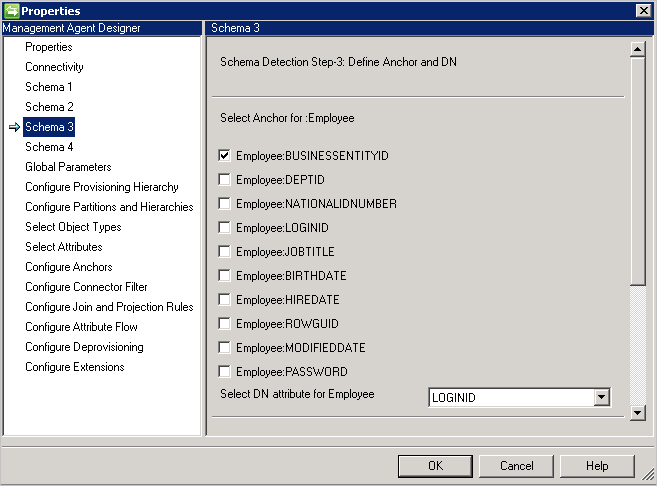
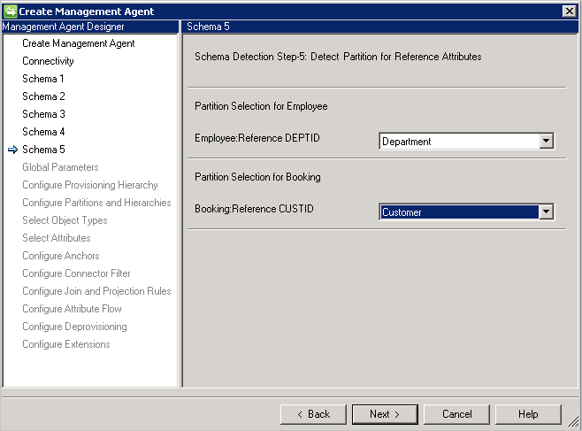
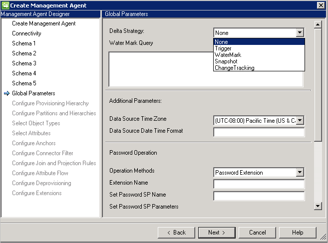
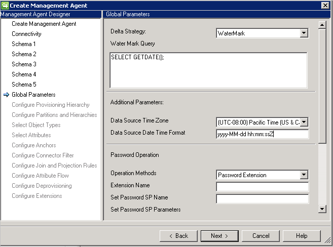
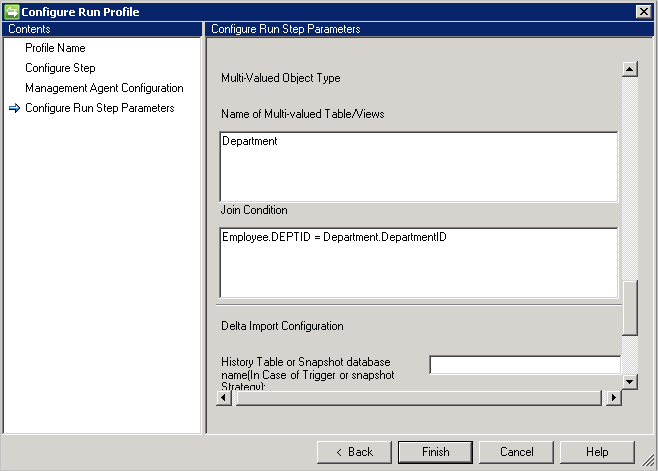
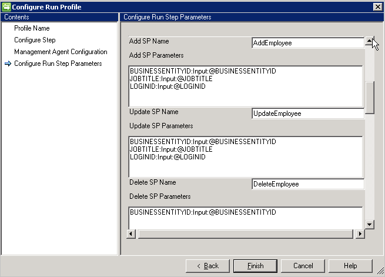

<properties
   pageTitle="Allgemeine SQL-Verbinder | Microsoft Azure"
   description="In diesem Artikel werden die allgemeinen des Microsoft SQL-Connector konfigurieren."
   services="active-directory"
   documentationCenter=""
   authors="AndKjell"
   manager="femila"
   editor=""/>

<tags
   ms.service="active-directory"
   ms.workload="identity"
   ms.tgt_pltfrm="na"
   ms.devlang="na"
   ms.topic="article"
   ms.date="08/30/2016"
   ms.author="billmath"/>

# Generische technische Verbinder SQL-Referenz

In diesem Artikel werden die allgemeinen SQL-Verbinder. Der Artikel bezieht sich auf die folgenden Produkte:

- Microsoft-Identität-Manager 2016 (MIM2016)
- Forefront Identität Manager 2010 R2 (FIM2010R2)
    -   Müssen Update 4.1.3671.0 oder höher [KB3092178](https://support.microsoft.com/kb/3092178)verwenden.

Für MIM2016 und FIM2010R2 wird der Verbinder aus dem [Microsoft Download Center](http://go.microsoft.com/fwlink/?LinkId=717495)zum Download zur Verfügung.

Um diesen Connector in Aktion sehen zu können, finden Sie unter [Schrittweise generische SQL-Verbinder](active-directory-aadconnectsync-connector-genericsql-step-by-step.md) .

## Übersicht über generische SQL-Connector

Allgemeine SQL-Connector ermöglicht es Ihnen des Synchronisierungsdiensts mit einem Datenbanksystem integriert werden soll, die ODBC-Konnektivität bietet.  

Die folgenden Features werden im Hinblick auf hoher Ebene nach der aktuellen Version des Verbinders unterstützt:

Feature | Support
--- | ---
Verbundene Datenquelle | Der Verbinder ist für alle 64-Bit-ODBC-Treiber unterstützt. Es wurde mit den folgenden getestet: <li>Microsoft SQL Server und SQL Azure</li><li>IBM DB2-10.x</li><li>IBM DB2-9.x</li><li>Oracle 10 und 11 g</li><li>MySQL 5.x</li>
Szenarien   | <li>Objekt Lifecycle Management</li><li>Verwaltung der Kennwörter</li>
Vorgänge | <li>Vollständiger Import und Delta importieren, exportieren</li><li>Für den Export: Hinzufügen, aktualisieren, löschen und ersetzen</li><li>Kennwort festlegen, Ändern des Kennworts</li>
Schema | <li>Dynamische Erkennung von Objekten und Attributen</li>

### Erforderliche Komponenten
Bevor Sie den Verbinder verwenden, stellen Sie sicher, dass Sie für Folgendes auf dem Synchronisierungsserver haben:

- Microsoft .NET 4.5.2 Framework oder höher
- 64-Bit-ODBC-Client-Treiber

### Berechtigungen in der verbundenen Datenquelle
Zum Erstellen oder Ausführen der unterstützten Aufgaben im Allgemeinen SQL-Connector, benötigen Sie Folgendes:

- db_datareader
- db_datawriter

### Ports und Protokolle
Die Ports für den ODBC-Treiber für die Arbeit erforderlich ist finden Sie in der Dokumentation des Herstellers der Datenbank.

## Erstellen eines neuen Connectors
Wählen Sie zum Erstellen eines Verbinders generische SQL in **Synchronisierungsdiensts** **Management Agent** und **Erstellen**aus. Wählen Sie den Verbinder **generische SQL (Microsoft)** aus.

### Konnektivität
Der Verbinder verwendet eine ODBC DSN-Datei für Konnektivität. Erstellen Sie die DSN-Datei mit **ODBC-Datenquellen** finden Sie im Startmenü unter **Verwaltung**. Erstellen Sie im Verwaltungstool eine **Datei-DSN** , sodass es den Verbinder bereitgestellt werden kann.

Der Bildschirm Connectivity ist der erste beim Erstellen einer neuen generische SQL-Verbinder. Sie müssen zuerst die folgenden Informationen angeben:

- DSN-Dateipfad
- Authentifizierung
    - Benutzername
    - Kennwort

Die Datenbank sollte eine der folgenden Authentifizierungsmethoden unterstützen:

- **Windows-Authentifizierung**: die Authentifizierung Datenbank verwendet die Windows-Anmeldeinformationen zur Überprüfung des Benutzers. Das Benutzername/Kennwort angegeben wird verwendet, um die Authentifizierung mit der Datenbank. Dieses Konto benötigt Berechtigungen für die Datenbank.
- **SQL-Authentifizierung**: die Authentifizierung Datenbank verwendet das Benutzername/Kennwort eine Connectivity-Bildschirms definiert, um mit der Datenbank herstellen. Wenn Sie den Benutzer Namen/Kennwrt in die DSN-Datei speichern möchten, haben die Anmeldeinformationen auf dem Bildschirm Connectivity bereitgestellten Vorrang vor.
- **Authentifizierung Azure SQL-Datenbank**: Weitere Informationen finden Sie unter [Verbinden mit SQL Datenbank durch Verwenden von Azure Active Directory-Authentifizierung](..\sql-database\sql-database-aad-authentication.md).

**DN ist Anker**: Wenn Sie diese Option auswählen, wird der DN auch als das Ankerattribut verwendet. Für eine einfache Implementierung verwendet werden kann, aber auch weist die folgende Einschränkung:

-   Connector unterstützt nur einen Objekttyp. Daher können keine Attribute Verweis nur desselben Typs verweisen.

**Exporttyp: Objekt ersetzen**: während des Exportvorgangs, wenn Sie nur einige Attribute geändert haben, das gesamte Objekt mit allen Attributen wird exportiert und das vorhandene Objekt ersetzt.

### Schema 1 (erkennen Objekttypen)
Auf dieser Seite überschreiten Sie konfigurieren, wie der Verbinder aufgewendet wird, um die unterschiedlichen Objekttypen in der Datenbank zu finden.

Jeder Objekttyp als Partition präsentiert und konfiguriert ist eine weitere **Partitionen konfigurieren**und Hierarchien.

**Verfahren zum Nachweis Objekttyp**: der Verbinder unterstützt diese Objekt Typ Erkennungsmethoden.

- **Festwert**: Geben Sie die Liste der Objekttypen mit einer durch Trennzeichen getrennte Liste. Beispiel: `User,Group,Department`.  

- **Tabelle/Ansicht/gespeicherte Prozedur**: Geben Sie den Namen der Tabelle, Sicht, gespeicherte Prozedur, und klicken Sie dann den Namen der Spalte, die die Liste der Objekttypen bereitstellt. Wenn Sie eine gespeicherte Prozedur verwenden, dann auch Parameter angeben dafür im Format **[Name]: [Richtung]: [Wert]**. Bieten Sie jeden Parameter in einer separaten Zeile (verwenden Sie STRG + EINGABETASTE, um eine neue Zeile zu erhalten).  

- **SQL-Abfrage**: mit dieser Option können Sie eine SQL-Abfrage angeben, die eine einzelne Spalte mit Objekttypen, beispielsweise gibt `SELECT [Column Name] FROM TABLENAME`. Die zurückgegebene Spalte muss vom Typ "String" (Varchar) sein.

### Schema 2 (erkennen Attributtypen)
Auf dieser Seite überschreiten Sie konfigurieren, wie die Namen der Attribute und Typen vertraut sind, erkannt werden. Die Konfigurationsoptionen sind für jede Objekttyp auf der vorherigen Seite erkannt aufgelistet.

**Verfahren zum Nachweis Attribut Type**: der Verbinder unterstützt diese Attribut Typ Erkennungsmethoden mit jeder erkannten Objekttyp klicken Sie im Bildschirm Schema 1.

- **Tabelle/Ansicht/gespeicherte Prozedur**: Geben Sie den Namen der Tabelle, Sicht, gespeicherte Prozedur, die verwendet werden soll, um die Namen der zu finden. Wenn Sie eine gespeicherte Prozedur verwenden, dann auch Parameter angeben dafür im Format **[Name]: [Richtung]: [Wert]**. Bieten Sie jeden Parameter in einer separaten Zeile (verwenden Sie STRG + EINGABETASTE, um eine neue Zeile zu erhalten). Um die Namen der in einem mehrwertigen Attribut zu erkennen, geben Sie eine kommagetrennte Liste der Tabellen oder Sichten aus. Mehrwertige Szenarien werden nicht unterstützt Wenn über- und untergeordneten Tabelle dieselben Spaltennamen haben.
- **SQL-Abfrage**: mit dieser Option können Sie eine SQL-Abfrage angeben, die eine einzelne Spalte mit Namen von Attributen, beispielsweise gibt `SELECT [Column Name] FROM TABLENAME`. Die zurückgegebene Spalte muss vom Typ "String" (Varchar) sein.

### Schema 3 (Anker definieren und DN)
Auf dieser Seite können Sie die Anker und DN-Attribut für jeden erkannten Objekttyp konfigurieren. Wählen Sie mehrere Attribut, um den Anker eindeutig zu machen.

- Mehrwertige und boolesche Attribute sind nicht aufgelistet.
- Dasselbe Attribut kann nicht für DN und Anker, verwendet, es sei denn, **DN ist Anker** auf der Seite Connectivity ausgewählt ist.
- Wenn auf der Seite Connectivity **DN ist Anker** ausgewählt ist, ist dieser Seite DN-Attribut erforderlich. Dieses Attribut würde auch als das Ankerattribut verwendet werden.

### Schema 4 (definieren Attributtyp, Verweis und Richtung)
Auf dieser Seite können Sie das Attribut Type, z. B. Integer, Binary, oder Boolesch und Richtung für jedes Attribut konfigurieren. Alle Attribute Seite **Schema 2** werden einschließlich mehrwertige Attribute aufgeführt.

- **Datentyp**: verwendet, um das Attribut Type auf diese Typen von der Synchronisierungs-Engine bekannte zuzuordnen. Standardmäßig desselben Typs verwenden, wie in der SQL-Schema erkannt werden, aber DateTime und verweisen sind nicht einfach erkannt werden kann. Für diejenigen müssen Sie **DateTime** oder **Verweis**angeben.
- **Richtung**: Sie können die Richtung Attribut importieren, exportieren oder ImportExport festlegen. ImportExport ist standardmäßig aktiviert.

Hinweise:

- Ist eine Art Attribut nicht der Verbinder erkannt werden kann, wird den String-Datentyp verwendet.
- **Geschachtelt Tabellen** können als einspaltige Datenbanktabellen angesehen werden. Oracle speichert die Zeilen einer Tabelle geschachtelte in keiner bestimmten Reihenfolge an. Beim Abrufen der verschachtelten Tabelle in eine PL/SQL-Variable werden die Zeilen aufeinander folgenden tiefgestellte Zeichen, beginnend mit 1 angegeben. Die bietet Ihnen Array-ähnliche Zugriff auf einzelne Zeilen.
- **VARRYS** werden in der Verbinder nicht unterstützt.

### Schema 5 (definieren Partition für Verweis Attribute)
Auf dieser Seite konfigurieren Sie für alle Bezug Attribute welcher Partition (Objekttyp) auf ein Attribut bezieht.

Wenn Sie **DN ist Anker**verwenden, müssen Sie denselben Objekttyp als verwenden, die, denen Sie aus verweisen. Sie können nicht auf einen anderen Objekttyp verweisen.

### Globale Parameter
Die Seite globale Parameter wird verwendet, um die Delta importieren, Datum/Uhrzeit-Format und Kennwortmethode konfigurieren.

Allgemeine SQL-Connector unterstützt die folgenden Methoden für den Import Delta an:

- **Auslösen**: finden Sie unter [Delta Ansichten mithilfe von Triggern generieren](https://technet.microsoft.com/library/cc708665.aspx).
- **Wasserzeichen**: eine generische Ansatz, die mit jeder Datenbank verwendet werden kann. Die Abfrage Wasserzeichen ist vorab eingetragenen basierend auf den Hersteller der Datenbank. Eine Spalte Wasserzeichen muss in jeder Tabelle/Ansicht verwendet vorhanden sein. Diese Spalte muss fügt nachverfolgen und Updates zu den Tabellen als und ihm abhängigen (mehrere Werte oder untergeordneten) Tabellen. Die Uhr zwischen Synchronisierungsdiensts und dem Datenbankserver müssen synchronisiert werden. Wenn dies nicht der Fall ist, wird möglicherweise einige Einträge importieren Delta weggelassen werden.  
Einschränkung:
    - Wasserzeichen Strategie unterstützt keine Unterstützung Gelöschte Objekte.
- **Snapshot**: (kann nur mit Microsoft SQL Server) [Generieren von Delta Ansichten, die mithilfe von Momentaufnahmen](https://technet.microsoft.com/library/cc720640.aspx)
- **Das Änderungsprotokoll**: (kann nur mit Microsoft SQL Server) [über die Änderungsnachverfolgung](https://msdn.microsoft.com/library/bb933875.aspx)  
Einschränkungen:
    - Anker und DN-Attribut muss Teil des Primärschlüssels für das ausgewählte Objekt in der Tabelle.
    - SQL-Abfrage wird beim Importieren und Exportieren mit Änderungsprotokoll muss nicht unterstützt.

**Zusätzliche Parameter**: Geben Sie die Datenbank Serverzeitzone, die angibt, wo sich Ihre Datenbankserver befindet. Dieser Wert wird verwendet, um die verschiedenen Formate von Datum und Uhrzeit Attributen zu unterstützen.

Der Verbinder speichert immer Datum und Datum / Uhrzeit im UTC-Format. Um ordnungsgemäß konvertiert das Datum und Uhrzeit, die Zeitzone des Datenbankservers und das Format verwendet werden muss angegeben werden. Das Format sollte in .net Format ausgedrückt werden.

Während des Exportvorgangs muss jedes Datumsattribut, Uhrzeit des Verbinders in UTC-Zeitformat bereitgestellt werden.

**Kennwort-Konfiguration**: der Verbinder bietet Kennwort Synchronisierung Funktionen und unterstützt festlegen und ändern Sie das Kennwort ein.

Der Verbinder bietet zwei Methoden zur Unterstützung der Synchronisierung von Kennwörtern:

- **Gespeicherte Prozedur**: Diese Methode erfordert zwei gespeicherte Prozeduren zur Unterstützung von festlegen und ändern das Kennwort ein. Geben Sie alle Parameter für das Hinzufügen und ändern Sie des Vorgangs Kennwort in **Kennwort SP festlegen** und **Ändern von Kennwort SP** Parameter Hilfethemas als pro gezeigten Beispiel.

- **Kennwort Erweiterung**: Diese Methode erfordert Kennwort Erweiterung DLL (Sie müssen den Namen der Erweiterung DLL bereitstellen, der die [IMAExtensible2Password](https://msdn.microsoft.com/library/microsoft.metadirectoryservices.imaextensible2password.aspx) Schnittstelle implementiert). Kennwort Erweiterungsassembly muss Erweiterung Ordner platziert werden, damit der Verbinder die DLL zur Laufzeit laden kann.

Sie können auch die Verwaltung der Kennwörter auf der Seite **Konfigurieren Erweiterung** aktivieren.

### Konfigurieren von Partitionen und Hierarchien
Wählen Sie auf der Seite Partitionen und Hierarchien alle Objekttypen aus. Jeder Objekttyp ist eine eigene Partition.

Sie können auch auf der Seite **Connectivity** oder **Globale Parameter** definierten Werte außer Kraft setzen.

### Anker werden konfigurieren
Diese Seite ist schreibgeschützt, da die Verankerung bereits definiert wurde. Das ausgewählte Ankerattribut immer mit den Objekttyp, um sicherzustellen, dass sie über Objekttypen eindeutige bleibt angefügt.

## Konfigurieren der Schrittparameter ausführen
Diese Schritte sind in den Profilen ausführen, klicken Sie auf den Verbinder konfiguriert. Führen Sie diese Konfigurationen das eigentliche importieren und Exportieren von Daten aus.

### Vollständige und Delta importieren
Generische SQL-Connector-Support vollständigen und Delta Importieren mithilfe der folgenden Methoden:

- Tabelle
- Ansicht
- Gespeicherte Prozedur
- SQL-Abfrage

**Tabelle/Sicht**  
Importieren von mehrwertigen Attribute eines Objekts müssen Sie den Namen der Tabellenansicht durch Kommas getrennte **Namen von mehrwertigen** Tabelle/Ansichten und entsprechenden Verknüpfung Bedingungen in der **Join-Bedingung** der übergeordneten Tabelle zur Verfügung zu stellen.

Beispiel: Das Employee-Objekt und seine mehrwertige Attribute importieren möchten. Es gibt zwei Tabellen, Mitarbeiter (Hauptfenster Tabelle) und Abteilung (mehrere Werte) aus.
Gehen Sie wie folgt vor:

- Typ **Mitarbeiter** in der **Tabelle/Ansicht/SP**.
- Geben Sie in **Name des mehrwertigen Tabelle/Ansichten**Abteilung ein.
- Geben Sie die Join-Bedingung zwischen Mitarbeiter und Abteilung **Join-Bedingung**, beispielsweise `Employee.DEPTID=Department.DepartmentID`.

**Gespeicherten Prozeduren**  

- Wenn Sie viele Daten haben, empfiehlt es sich mit Ihrer gespeicherten Prozeduren Seitenumbruch implementieren.
- Für die gespeicherte Prozedur zur Unterstützung von Seitenumbruch müssen Sie starten und beenden Index angeben. Siehe: [effizient Paging durch große Datenmengen](https://msdn.microsoft.com/library/bb445504.aspx).
- @StartIndexund @EndIndex werden zum Zeitpunkt der Ausführung mit entsprechenden Seitengröße, die so konfiguriert ist, klicken Sie auf **Schritt konfigurieren** Seite ersetzt. Angenommen, wenn der Verbinder erste Seite und die Seitengröße abruft festgelegt ist 500, in solchen @StartIndex wäre 1 und @EndIndex 500. Diese Werte zu erhöhen, wenn Verbinder nachfolgenden Seiten und ändern Sie ruft die @StartIndex & @EndIndex Wert.
- Um parametrisierte gespeicherte Prozedur ausführen möchten, geben Sie die Parameter in `[Name]:[Direction]:[Value]` Format. Geben Sie jeden Parameter in einer separaten Zeile (STRG + EINGABETASTE zum Abrufen einer neuen Zeile) ein.
- Generische SQL-Connector unterstützt auch Importvorgang aus verknüpften Servers in Microsoft SQL Server. Wenn Sie Informationen aus einer Tabelle in verknüpfte Server abgerufen werden sollen, sollte Tabelle im gewünschten Format bereitgestellt werden:`[ServerName].[Database].[Schema].[TableName]`
- Allgemeine SQL-Connector unterstützt nur die Objekte, die ähnlichen Struktur (sowohl alias Namen und Datentyp) zwischen Schritte und das Schema Erkennung ausgeführt haben. Wenn aus Schema und bereitgestellten Informationen in Schritt Ausführen des ausgewählten Objekts abweicht, kann SQL-Connector nicht unterstützt diese Art von Szenarien.

**SQL-Abfrage**  

- Mehrere Resultset Abfragen nicht unterstützt.
- SQL-Abfrage unterstützt der Seitenumbruch und Bereitstellen von Anfang und Ende Index als Variable zur Unterstützung von Seitenumbruch.

### Delta importieren

Delta Importkonfiguration erfordert einige weitere Konfiguration im Vergleich mit vollständigen Import.

- Wenn Sie den auslösen oder Momentaufnahme Ansatz zum Nachverfolgen von Änderungen Delta auswählen, geben Sie dann Verlaufstabelle oder Momentaufnahme Datenbank im Dialogfeld **Verlaufstabelle oder des Datenbanknamens Momentaufnahme** .
- Sie müssen außerdem Join-Bedingung zwischen Verlauf und übergeordneten Tabelle, zum Beispiel bereitstellen`Employee.ID=History.EmployeeID`
- Um die Transaktion in der übergeordneten Tabelle aus der Verlaufstabelle verfolgen zu können, müssen Sie den Namen der Spalte angeben, der die Informationen zum Vorgang (hinzufügen, aktualisieren und löschen) enthält.
- Wenn Sie Wasserzeichen Delta Änderungen nachverfolgen auswählen, geben Sie dann den Namen der Spalte, der die Operation Informationen im **Wasser als Spaltennamen**enthält.
- Die Spalte **Typattribut ändern** ist für den Änderungstyp erforderlich. In dieser Spalte wird eine Änderung, die in der primären Tabelle oder eine Tabelle mit mehreren Werten in einen Änderungstyp, in der Ansicht Delta tritt zugeordnet. In dieser Spalte kann enthalten den Änderungstyp Modify_Attribute für Attribut Ebene ändern oder eine hinzufügen, ändern oder löschen ändern des Typs für einen Änderungstyp auf Objektebene. Wenn sie etwas anderes als den Standardwert hinzufügen, ändern, oder löschen, und Sie können diese Werte mit dieser Option definieren.

### Exportieren

Allgemeine SQL-Connector-Unterstützung mit vier unterstützten Methoden exportieren:

- Tabelle
- Ansicht
- Gespeicherte Prozedur
- SQL-Abfrage

**Tabelle/Sicht**  
Wenn Sie die Option Tabelle/Sicht auswählen, generiert der Verbinder die jeweiligen Abfragen, um den Export auszuführen.

**Gespeicherten Prozeduren**  

Wenn Sie die gespeicherte Prozedur Option auswählen, ist der Export drei verschiedene gespeicherte Prozeduren einfügen, aktualisieren und Löschen von Operationen erforderlich.

- **SP-Name hinzufügen**: Diese SP ausgeführt wird, wenn alle Objekt um Verbinder für die Einfügemarke in der jeweiligen Tabelle geht.
- **SP-Name aktualisieren**: Diese SP ausgeführt wird, wenn alle Objekt um Verbinder für die Aktualisierung in der jeweiligen Tabelle geht.
- **SP-Name löschen**: Diese SP ausgeführt wird, wenn alle Objekt um Verbinder in der jeweiligen Tabelle zum Löschen geht.
- Attribut aus dem Schema als Parameterwert für die gespeicherte Prozedur verwendete ausgewählt. Beispielsweise `EmployeeName: INPUT: @EmployeeName` (EmployeeName im Schema Verbinder ausgewählt ist, und der Verbinder ersetzt den entsprechenden Wert während der Export)
- Geben Sie zum Ausführen parametrisierte gespeicherte Prozedur Parameter in `[Name]:[Direction]:[Value]` Format. Geben Sie jeden Parameter in einer separaten Zeile (STRG + EINGABETASTE zum Abrufen einer neuen Zeile) ein.

**SQL-Abfrage**  

Wenn Sie die SQL-Abfrage-Option auswählen, ist der Export drei verschiedene Abfragen, einfügen, aktualisieren und Löschen von Operationen erforderlich.

- **Abfrage einfügen**: Diese Abfrage ausgeführt wird, wenn alle Objekt um Verbinder für die Einfügemarke in der jeweiligen Tabelle geht.
- **Abfrage aktualisieren**: Diese Abfrage ausgeführt wird, wenn alle Objekt um Verbinder für die Aktualisierung in der jeweiligen Tabelle geht.
- **Löschabfrage**: Diese Abfrage ausgeführt wird, wenn alle Objekt um Verbinder in der jeweiligen Tabelle zum Löschen geht.
- Attribut aus dem Schema verwendet, beispielsweise als Parameterwert auf die Abfrage ausgewählt`Insert into Employee (ID, Name) Values (@ID, @EmployeeName)`

## Behandlung von Problemen

-   Informationen zum Aktivieren der Protokollierung den Verbinder zur Problembehandlung finden Sie unter [So Enable Tracing ETW für Verbinder](http://go.microsoft.com/fwlink/?LinkId=335731).
