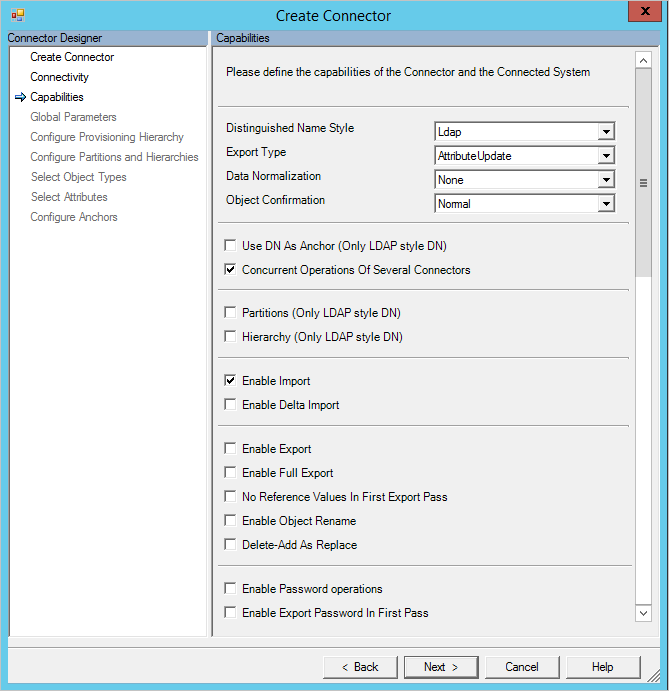

<properties
   pageTitle="PowerShell Verbinder | Microsoft Azure"
   description="In diesem Artikel beschreibt das Konfigurieren des Microsoft Windows PowerShell-Verbinder."
   services="active-directory"
   documentationCenter=""
   authors="AndKjell"
   manager="femila"
   editor=""/>

<tags
   ms.service="active-directory"
   ms.workload="identity"
   ms.tgt_pltfrm="na"
   ms.devlang="na"
   ms.topic="article"
   ms.date="08/30/2016"
   ms.author="billmath"/>

# <a name="windows-powershell-connector-technical-reference"></a>Technische Referenz zu Windows PowerShell-Connector
In diesem Artikel werden die Windows PowerShell-Verbinder. Der Artikel bezieht sich auf die folgenden Produkte:

- Microsoft-Identität-Manager 2016 (MIM2016)
- Forefront Identität Manager 2010 R2 (FIM2010R2)
    -   Müssen Update 4.1.3671.0 oder höher [KB3092178](https://support.microsoft.com/kb/3092178)verwenden.

Für MIM2016 und FIM2010R2 wird der Verbinder aus dem [Microsoft Download Center](http://go.microsoft.com/fwlink/?LinkId=717495)zum Download zur Verfügung.

## <a name="overview-of-the-powershell-connector"></a>Übersicht über den PowerShell-Verbinder
Der Verbinder PowerShell ermöglicht es Ihnen in des Synchronisierungsdiensts die anbieten von Windows PowerShell APIs basierend auf externe Systeme integrieren. Der Verbinder stellt eine Verbindung zwischen der Funktionen des extensible Connectivity Anruf-basierten Management Agent, 2 (ECMA2) Framework und Windows PowerShell. Weitere Informationen zu den ECMA Framework finden Sie unter den [Extensible Connectivity 2.2 Management Agent Bezug](https://msdn.microsoft.com/library/windows/desktop/hh859557.aspx).

### <a name="prerequisites"></a>Erforderliche Komponenten
Bevor Sie den Verbinder verwenden, stellen Sie sicher, dass Sie für Folgendes auf dem Synchronisierungsserver haben:

- Microsoft .NET 4.5.2 Framework oder höher
- Windows PowerShell 2.0, 3.0 oder 4.0

Die Ausführungsrichtlinie auf dem Server-Synchronisierungsdiensts muss konfiguriert sein, um den Verbinder, um das Ausführen von Windows PowerShell-Skripts zu ermöglichen. Wenn die Skripts den Verbinder ausgeführt werden digital signiert, die Ausführungsrichtlinie konfigurieren, indem Sie diesen Befehl ausführen:  
`Set-ExecutionPolicy -ExecutionPolicy RemoteSigned`

## <a name="create-a-new-connector"></a>Erstellen eines neuen Connectors
Zum Erstellen eines Verbinders Windows PowerShell im Synchronisierungsdienst müssen Sie eine Reihe von Windows PowerShell-Skripts bereitstellen, die die angefordert von des Synchronisierungsdiensts Schritte ausführen. Variiert abhängig von der Datenquelle herstellen und die benötigten Funktionen, die Skripts, die Sie implementieren müssen. In diesem Abschnitt werden die beiden Skripts implementiert werden kann, und wenn sie erforderlich sind.

Der Windows PowerShell-Verbinder soll die Skripts innerhalb der Datenbank Synchronisierungsdiensts zu speichern. Es ist möglich, Skripts auszuführen, die im Dateisystem gespeichert sind, ist es einfacher, den Textkörper der einzelnen Skripts direkt in zur Konfiguration des Verbinders einfügen.

Wählen Sie zum Erstellen eines Verbinders PowerShell in **Synchronisierungsdiensts** **Management Agent** und **Erstellen**aus. Wählen Sie den Verbinder **PowerShell (Microsoft)** aus.


### <a name="connectivity"></a>Konnektivität
Bereitstellen Sie Konfigurationsparameter für das Herstellen einer Verbindung mit einem remote-System. Diese Werte sind sicher durch den Dienst Synchronisierung gespeichert und Ihre Windows PowerShell-Skripts zur Verfügung gestellt, wenn der Verbinder ausgeführt wird.


Sie können die folgenden Connectivity-Parameter konfigurieren:

**Konnektivität**

Parameter | Standardwert | Zweck
--- | --- | ---
Server | <Blank> | Servername, der der Verbinder eine Verbindung herstellen soll.
Domäne | <Blank> | Domäne der Anmeldeinformationen für die Verwendung der gespeichert werden soll, wenn der Verbinder ausgeführt wird.
Benutzer | <Blank> | Der Benutzername der Anmeldeinformationen für die Verwendung der gespeichert werden soll, wenn der Verbinder ausgeführt wird.
Kennwort | <Blank> | Kennwort der Anmeldeinformationen für die Verwendung der gespeichert werden soll, wenn der Verbinder ausgeführt wird.
Identitätswechsel Verbinder | Falsch | Der Wert true, führt des Synchronisierungsdiensts der Windows PowerShell-Skripts im Zusammenhang mit der angegebenen Anmeldeinformationen an. Wenn möglich, wird empfohlen, dass der **$Credentials** für jede übergebene Parameter ist Skript statt Identitätswechsel verwendet wird. Weitere Informationen zu weiteren Berechtigungen, die erforderlich sind, um diese Option zu verwenden, finden Sie unter [Zusätzliche Konfiguration für den Identitätswechsel](#additional-configuration-for-impersonation).
Benutzerprofil zu laden, wenn die Identität | Falsch | Weist Windows so konfigurieren, laden das Benutzerprofil des Verbinders Anmeldeinformationen während Identitätswechsel. Wenn der Identitätswechsel Benutzer ein roaming Profil hat, wird der Verbinder das roaming Profil nicht geladen. Weitere Informationen zum zusätzliche Berechtigungen, die für diesen Parameter verwenden, finden Sie unter [Zusätzliche Konfiguration für den Identitätswechsel](#additional-configuration-for-impersonation)erforderlich sind.
Melden Sie sich Typ aus, wenn die Identität | Keine | Geben Sie während der Identitätswechsel Anmeldung. Weitere Informationen finden Sie in der [DwLogonType] [ dw] Dokumentation.
Nur signierte Skripts | Falsch | Wenn der Wert true, der Windows PowerShell-Verbinder wird überprüft, ob jedes Skript eine gültige digitale Signatur enthält. Ist der Wert false, sicherstellen Sie, dass die Synchronisierungsdiensts des Windows PowerShell Ausführung Serverrichtlinie RemoteSigned oder nicht eingeschränkt.

**Allgemeine Modul**  
Der Verbinder können Sie ein freigegebenes Windows PowerShell-Modul in der Konfiguration zu speichern. Wenn der Verbinder ein Skript ausgeführt wird, wird das Windows PowerShell-Modul im Dateisystem extrahiert, damit sie von jedem Skript importiert werden kann.

Skripts importieren, exportieren und Synchronisierung von Kennwörtern wird das allgemeine Modul des Verbinders MAData Ordner extrahiert. Für das Schema, Überprüfung, Hierarchie- und Partition Discovery-Skripts wird das allgemeine Modul in den Ordner "% Temp%" extrahiert. In beiden Fällen wird das extrahierte allgemeine Modul Skript gemäß der Einstellung für allgemeine Modul Skriptnamen bezeichnet.

Um ein Modul mit dem Namen FIMPowerShellConnectorModule.psm1 aus dem Ordner MAData zu laden, verwenden Sie die folgende Anweisung aus:`Import-Module (Join-Path -Path [Microsoft.MetadirectoryServices.MAUtils]::MAFolder -ChildPath "FIMPowerShellConnectorModule.psm1")`

Um ein Modul mit dem Namen FIMPowerShellConnectorModule.psm1 aus dem Ordner "% Temp%" zu laden, verwenden Sie die folgende Anweisung aus:`Import-Module (Join-Path -Path $env:TEMP -ChildPath "FIMPowerShellConnectorModule.psm1")`

**Parameter-Überprüfung**  
Das Skript Überprüfung ist eine optionale Windows PowerShell-Skript, die verwendet werden kann, um sicherzustellen, dass Connector-Konfigurationsparameter vom Administrator bereitgestellte gültig sind. Überprüfung Server, Verbindungsanmeldeinformationen und Connectivity-Parameter sind allgemeine Verwendungen des Skripts Überprüfung auf. Das Skript Überprüfung heißt nach den folgenden Registerkarten und Dialogfelder geändert werden:

- Konnektivität
- Globale Parameter
- Partitionskonfiguration

Das Validierungsskript empfängt die folgenden Parameter aus der Verbinder an:

Namen | Datentyp | Beschreibung
--- | --- | ---
ConfigParameterPage | [ConfigParameterPage][cpp] | Die Konfigurationsregisterkarte oder ein Dialogfeld, in dem die Anforderung zur Überprüfung ausgelöst wurde.
ConfigParameters | [KeyedCollection] [ keyk] [Zeichenfolge, [ConfigParameter][cp]] | Die Tabelle der der Konfigurationsparameter für den Verbinder.
Anmeldeinformationen | [PSCredential][pscred] | Enthält alle Anmeldeinformationen, die vom Administrator eingegeben haben, klicken Sie auf die Registerkarte Konnektivität.

Das Skript Überprüfung sollte ein einzelnes ParameterValidationResult Objekt in der Verkaufspipeline zurückgeben.

**Schema-Suche**  
Das Schema Discovery-Skript ist obligatorisch. Dieses Skript gibt die Objekttypen und Attribute Attribut Einschränkungen, bei der Attributflussregeln Konfigurieren des Synchronisierungsdiensts verwendet. Das Schema Discovery-Skript wird ausgeführt, während der Erstellung der Verbinder und des Verbinders Schema auffüllt. Es wird auch von der Aktion Schema aktualisieren im Synchronisierung-Manager verwendet.

Das Schema Discovery-Skript empfängt die folgenden Parameter aus der Verbinder an:

Namen | Datentyp | Beschreibung
--- | --- | ---
ConfigParameters | [KeyedCollection] [ keyk] [Zeichenfolge, [ConfigParameter][cp]] | Die Tabelle der der Konfigurationsparameter für den Verbinder.
Anmeldeinformationen | [PSCredential][pscred] | Enthält alle Anmeldeinformationen, die vom Administrator eingegeben haben, klicken Sie auf die Registerkarte Konnektivität.

Das Skript muss ein einzelnes [Schema] zurückgeben[ schema] Objekt der Verkaufspipeline. Das Schemaobjekt besteht [] [ schemaT] Objekte, die Objekttypen darstellen (zum Beispiel: Benutzer und Gruppen). Das Objekt enthält eine Auflistung von [SchemaAttribute] [ schemaA] Objekte, die die Attribute darstellen (zum Beispiel: Vorname, Nachname und Postanschrift) vom Typ.

**Zusätzliche Parameter**  
Zusätzlich zu den Einstellungen für die standard-Konfiguration können Sie zusätzliche benutzerdefinierte Konfiguration Einstellungen definieren, die für die Instanz der Verbinder spezifisch sind. Diese Parameter können angegeben werden, bei der Verbinder, rechten oder ausführen Schritt Ebenen und die entsprechenden Windows PowerShell-Skript zugegriffen. Benutzerdefinierte Konfiguration Einstellungen in der Datenbank-Synchronisierungsdiensts im nur-Text-Format gespeichert werden können, oder sie möglicherweise verschlüsselt werden. Des Synchronisierungsdiensts automatisch verschlüsselt und entschlüsselt secure Konfigurations-Einstellungen bei Bedarf.

Um benutzerdefinierte Konfiguration Einstellungen angeben möchten, trennen Sie den Namen der einzelnen Parameter durch ein Semikolon (;) ein.

Um benutzerdefinierte Konfiguration Einstellungen aus einem Skript zugreifen zu können, müssen Sie den Namen mit einem Unterstrich suffix ( \_ ) und den Bereich des Parameters (Global, Partition oder RunStep). Verwenden Sie zum Beispiel für den Zugriff auf die globale FileName-Parameter dieser Codeausschnitt:`$ConfigurationParameters["FileName_Global"].Value`

### <a name="capabilities"></a>Funktionen
Die Registerkarte Funktionen Management Agent-Designer definiert das Verhalten und die Funktionalität des Verbinders an. Die auf dieser Registerkarte vorgenommene Auswahl können nicht geändert werden, wenn der Verbinder erstellt wurde. Diese Tabelle listet die Videofunktionen Einstellungen.



Funktion | Beschreibung |
--- | --- |
[Distinguished Name der Formatvorlage][dnstyle] | Zeigt an, wenn der Verbinder definierte Namen unterstützt und wenn Ja, was in der Formatvorlage.
[Exporttyp][exportT] | Bestimmt den Typ der Objekte, die das Skript exportieren angezeigt werden. <li>AttributeReplace – enthält den vollständigen Satz von Werten für ein mehrwertiges Attribut aus, wenn das Attribut geändert wird.</li><li>AttributeUpdate – enthält nur die Deltas mit einem mehrwertigen Attribut aus, wenn das Attribut geändert wird.</li><li>MultivaluedReferenceAttributeUpdate - umfasst einen vollständigen Satz von Werten für mehrwertig Attribute ohne Verweis und nur Deltas für mehrwertig Bezug Attributen.</li><li>ObjectReplace – enthält alle Attribute eines Objekts, wenn eine Änderungen Attribut</li>
[Normalisierung von Daten][DataNorm] | Weist das Synchronisierungsdiensts Anker Attribute normalisieren, bevor diese Skripts zur Verfügung gestellt werden.
[Objekt Bestätigung][oconf] | Konfiguriert das Verhalten ausstehend importieren in des Synchronisierungsdiensts. <li>Normal – Standardverhalten, die über importieren bestätigt werden alle exportierte Änderungen erwartet</li><li>NoDeleteConfirmation – ist beim Löschen eines Objekts, es keine ausstehende importieren generiert.</li><li>NoAddAndDeleteConfirmation – ist wenn ein Objekt erstellt oder gelöscht haben, wird es keine ausstehende importieren generiert.</li>
Verwenden von DN als Anker | Wenn der Distinguished Name der Formatvorlage LDAP festgelegt ist, ist das Ankerattribut für den Verbinder Abstand auch den definierten Namen ein.
Der Verbinder mehrere gleichzeitige Vorgänge | Wenn das Kontrollkästchen aktiviert ist, können mehrere Windows PowerShell-Verbinder gleichzeitig ausgeführt werden.
Partitionen | Wenn das Kontrollkästchen aktiviert ist, unterstützt der Verbinder mehrere Partitionen und Partition Discovery.
Hierarchie | Wenn das Kontrollkästchen aktiviert ist, unterstützt der Verbinder hierarchische Struktur einer LDAP-Formatvorlage.
Import aktivieren | Wenn aktiviert, wird der Verbinder Daten über Skripts importieren importiert.
Delta Import aktivieren | Wenn das Kontrollkästchen aktiviert ist, kann der Verbinder Deltas aus den Skripts importieren anfordern.
Export aktivieren | Wenn aktiviert, werden der Verbinder Daten über exportieren Skripts exportiert.
Vollständigen Export aktivieren | Wenn das Kontrollkästchen aktiviert ist, unterstützen die Skripts exportieren exportieren den gesamten Verbinder Abstand. Um diese Option verwenden zu können, muss exportieren aktivieren auch geprüft werden soll.
Keine Verweis Werte In der ersten exportieren Durchgang | Wenn aktiviert, werden in einer zweiten exportieren Übergabe Bezug Attribute exportiert.
Objekt umbenennen aktivieren | Wenn das Kontrollkästchen aktiviert ist, können die definierte Namen geändert werden.
Löschen hinzufügen, wie ersetzen | Wenn aktiviert, löschen – Hinzufügen von Vorgängen als eine einzige Ersetzung exportiert werden.
Aktivieren Sie das Kennwortvorgänge | Wenn das Kontrollkästchen aktiviert ist, werden Kennwort Synchronisierung Skripts unterstützt.
Exportieren von Kennwort im ersten Schritt aktivieren | Wenn aktiviert, werden Kennwörter festgelegt, während der Bereitstellung exportiert, wenn das Objekt erstellt wird.

### <a name="global-parameters"></a>Globale Parameter
Die Registerkarte Globale Parameter im Management Agent-Designer können Sie der Windows PowerShell-Skripts konfigurieren, die indem Sie den Verbinder ausgeführt werden. Sie können auch globale Werte für benutzerdefinierte Konfiguration Einstellungen, klicken Sie auf die Registerkarte Konnektivität definiert konfigurieren.

**Partition-Suche**  
Eine Partition ist einem separaten Namespace innerhalb einer freigegebenen Schemas. In Active Directory beträgt jeder Domäne beispielsweise eine Partition innerhalb einer Gesamtstruktur. Eine Partition ist die logische Gruppierung für den Import und export. Import und Export besitzen Partition, wie ein Kontext und alle Vorgänge in diesem Zusammenhang geschieht. Partitionen eine Hierarchie im LDAP darstellen sollen. Der distinguished Name einer Partition wird in importieren verwendet, um sicherzustellen, dass alle zurückgegebenen Objekte innerhalb des Gültigkeitsbereichs einer Partition sind. Der definierte Partitionsname wird auch während der Bereitstellung von Metaverse zu den Abstand Verbinder verwendet, bestimmt die Partition, der ein Objekt während des Exportvorgangs zugeordnet werden soll.

Das Partition Discovery-Skript empfängt die folgenden Parameter aus der Verbinder an:

Namen | Datentyp | Beschreibung
--- | --- | ---
ConfigParameters  | [KeyedCollection][keyk][Zeichenfolge, [ConfigParameter][cp]] | Die Tabelle der der Konfigurationsparameter für den Verbinder.
Anmeldeinformationen | [PSCredential][pscred] | Enthält alle Anmeldeinformationen, die vom Administrator eingegeben haben, klicken Sie auf die Registerkarte Konnektivität.

Das Skript muss entweder eine einzelne [Partition] zurückgeben[ part] Objekt oder eine Liste [T] der Partitionsobjekte an der Verkaufspipeline.

**Hierarchie-Suche**  
Das Hierarchie Discovery-Skript wird nur verwendet, wenn der Distinguished Name der Formatvorlage Videofunktionen LDAP ist. Das Skript wird verwendet, um ermöglichen es Ihnen zu navigieren, und wählen Sie eine Reihe von Container, die als gilt in oder außerhalb des Bereichs für den Import und export. Das Skript sollte nur eine Liste der Knoten zur Verfügung, die direkt untergeordnete Elemente des Stammknotens an das Skript angegeben sind.

Das Hierarchie Discovery-Skript empfängt die folgenden Parameter aus der Verbinder an:

Namen | Datentyp | Beschreibung
--- | --- | ---
ConfigParameters | [KeyedCollection][keyk][Zeichenfolge, [ConfigParameter][cp]] | Die Tabelle der der Konfigurationsparameter für den Verbinder.
Anmeldeinformationen | [PSCredential][pscred] | Enthält alle Anmeldeinformationen, die vom Administrator eingegeben haben, klicken Sie auf die Registerkarte Konnektivität.
ParentNode | [Einem HierarchyNode][hn] | Die Quadratwurzel Knoten der Hierarchie unter der das Skript direkt untergeordnete Elemente zurückgeben soll.

Das Skript muss entweder ein einzelnes untergeordnetes einem HierarchyNode-Objekt oder eine Liste [T] der untergeordneten einem HierarchyNode Objekte zurück an der Verkaufspipeline.

#### <a name="import"></a>Importieren
Verbinder, die Importvorgänge unterstützen müssen drei Skripts implementieren.

**Beginnen Sie mit der importieren**  
Das beginnen Sie mit der Import-Skript wird am Anfang eines Schritts Import ausführen ausgeführt. In diesem Schritt können Sie eine Verbindung mit der Quellsystem herstellen und führen Sie die vorbereitenden Schritte vor dem Importieren von Daten aus dem verbundenen System.

Das Beginn importieren Skript empfängt die folgenden Parameter aus der Verbinder an:

Namen | Datentyp | Beschreibung
--- | --- | ---
ConfigParameters | [KeyedCollection][keyk][Zeichenfolge, [ConfigParameter][cp]] | Die Tabelle der der Konfigurationsparameter für den Verbinder.
Anmeldeinformationen | [PSCredential][pscred] | Enthält alle Anmeldeinformationen, die vom Administrator eingegeben haben, klicken Sie auf die Registerkarte Konnektivität.
OpenImportConnectionRunStep | [OpenImportConnectionRunStep][oicrs] | Hinweis Das Skript über die Art des Import ausführen (Delta oder Vollversion) Partition, Hierarchie, Wasserzeichen und erwarteten Seitenformat an.
Datentypen | [Schema][schema] | Schema für den Verbinder Abstand, der importiert werden.

Das Skript muss Zurückgeben eines einzelnen [OpenImportConnectionResults] [ oicres] Objekt in der Verkaufspipeline, beispielsweise:`Write-Output (New-Object Microsoft.MetadirectoryServices.OpenImportConnectionResults)`

**Importieren von Daten**  
Das Skript importieren Daten wird von der Verbinder aufgerufen, bis das Skript zeigt an, dass es keine weiteren Daten sind zu importieren. Der Windows PowerShell-Verbinder verfügt über ein Seitenformat 9.999 Objekte. Wenn Ihr Skript mehr als 9.999 Objekte für den Import zurückgibt, müssen Sie die Seitennavigation unterstützen. Der Verbinder macht, eine benutzerdefinierte Data-Eigenschaft, dass Sie zu einem Speicher ein Wasserzeichen verwenden können, dass jedes Mal, wenn das Skript importieren Daten aufgerufen wird, wird Ihr Skript Importieren der Objekte, die an der Stelle fortgesetzt.

Das Skript importieren Daten empfängt die folgenden Parameter aus der Verbinder an:

Namen | Datentyp | Beschreibung
--- | --- | ---
ConfigParameters | [KeyedCollection][keyk][Zeichenfolge, [ConfigParameter][cp]] | Die Tabelle der der Konfigurationsparameter für den Verbinder.
Anmeldeinformationen | [PSCredential][pscred] | Enthält alle Anmeldeinformationen, die vom Administrator eingegeben haben, klicken Sie auf die Registerkarte Konnektivität.
GetImportEntriesRunStep | [ImportRunStep][irs] | Enthält das Wasserzeichen (CustomData), das während verwendet werden kann seitenweise Importe und Delta importiert.
OpenImportConnectionRunStep | [OpenImportConnectionRunStep][oicrs] | Hinweis Das Skript über die Art des Import ausführen (Delta oder Vollversion) Partition, Hierarchie, Wasserzeichen und erwarteten Seitenformat an.
Datentypen | [Schema][schema] | Schema für den Verbinder Abstand, der importiert werden.

Das Importieren Datenskript muss eine Liste schreiben [[CSEntryChange][csec]] Objekt in der Verkaufspipeline. Diese Sammlung besteht CSEntryChange Attributen, die zu importierenden jedes Objekt darstellen. Während einer vollständigen Import ausführen sollte diese Sammlung eine vollständige Reihe von CSEntryChange Objekten haben, alle Attribute für jedes Objekt. Während einer Delta importieren sollte das Objekt CSEntryChange entweder enthalten die Attribut Ebene Deltazeichen für jedes Objekt zu importieren oder eine vollständige Darstellung der Objekte, die (Ersetzungsmodus) geändert wurden.

**Ende importieren**  
Nach Abschluss des Importvorgangs ausführen führen Sie das Skript Ende zu importieren. Dieses Skript sollte alle Aufräumen Aufgaben erforderlich (beispielsweise schließen Verbindungen mit Systemen) und Antworten auf Fehler ausführen.

Das Ende importieren Skript empfängt die folgenden Parameter aus der Verbinder an:

Namen | Datentyp | Beschreibung
--- | --- | ---
ConfigParameters | [KeyedCollection][keyk][Zeichenfolge, [ConfigParameter][cp]] | Die Tabelle der der Konfigurationsparameter für den Verbinder.
Anmeldeinformationen | [PSCredential][pscred] | Enthält alle Anmeldeinformationen, die vom Administrator eingegeben haben, klicken Sie auf die Registerkarte Konnektivität.
OpenImportConnectionRunStep | [OpenImportConnectionRunStep][oicrs] | Hinweis Das Skript über die Art des Import ausführen (Delta oder Vollversion) Partition, Hierarchie, Wasserzeichen und erwarteten Seitenformat an.
CloseImportConnectionRunStep | [CloseImportConnectionRunStep][cecrs] | Hinweis Das Skript über den Grund dafür, dass, den der Import eingestellt wurde.

Das Skript muss Zurückgeben eines einzelnen [CloseImportConnectionResults] [ cicres] Objekt in der Verkaufspipeline, beispielsweise:`Write-Output (New-Object Microsoft.MetadirectoryServices.CloseImportConnectionResults)`

#### <a name="export"></a>Exportieren
Der Import-Architektur des Verbinders identisch, Verbinder, die exportieren unterstützen müssen drei Skripts implementieren.

**Beginnen Sie mit der exportieren**  
Das beginnen Sie mit der Export-Skript wird am Anfang eines Schritts Export ausführen ausgeführt. In diesem Schritt können Sie eine Verbindung mit der Quellsystem herstellen und alle vorbereitenden Schritte vor dem Exportieren von Daten in der verbundenen System durchführen.

Das Beginn exportieren Skript empfängt die folgenden Parameter aus der Verbinder an:

Namen | Datentyp | Beschreibung
--- | --- | ---
ConfigParameters | [KeyedCollection][keyk][Zeichenfolge, [ConfigParameter][cp]] | Die Tabelle der der Konfigurationsparameter für den Verbinder.
Anmeldeinformationen | [PSCredential][pscred] | Enthält alle Anmeldeinformationen, die vom Administrator eingegeben haben, klicken Sie auf die Registerkarte Konnektivität.
OpenExportConnectionRunStep | [OpenExportConnectionRunStep][oecrs] | Hinweis Das Skript über den Typ der Export ausführen (Delta oder Vollversion) Partition, Hierarchie- und erwarteten Seitenformat an.
Datentypen | [Schema][schema] | Schema für den Verbinder Abstand, der exportiert werden.

Das Skript sollte keine Ausgabe nicht in der Verkaufspipeline zurück.

**Exportieren von Daten**  
Des Synchronisierungsdiensts Ruft das Skript Daten exportieren so oft wie erforderlich sind, um alle ausstehenden Exporte verarbeitet wird. Wenn der Verbinder Platz Weitere ausstehenden Exporte als Seitengröße des Verbinders aufweist, möglicherweise das Exportieren Datenskript werden mehrmals und oftmals mehrmals für dasselbe Objekt aufgerufen.

Das Exportieren Datenskript empfängt die folgenden Parameter aus der Verbinder an:

Namen | Datentyp | Beschreibung
--- | --- | ---
ConfigParameters | [KeyedCollection][keyk][Zeichenfolge, [ConfigParameter][cp]] | Die Tabelle der der Konfigurationsparameter für den Verbinder.
Anmeldeinformationen | [PSCredential][pscred] | Enthält alle Anmeldeinformationen, die vom Administrator eingegeben haben, klicken Sie auf die Registerkarte Konnektivität.
CSEntries | IList[CSEntryChange][csec] | Liste aller Verbinder Leerzeichen Objekte mit ausstehenden Exporte während dieser Phase verarbeitet werden.
OpenExportConnectionRunStep | [OpenExportConnectionRunStep][oecrs] | Hinweis Das Skript über den Typ der Export ausführen (Delta oder Vollversion) Partition, Hierarchie- und erwarteten Seitenformat an.
Datentypen | [Schema][schema] | Schema für den Verbinder Abstand, der exportiert werden.

Das Exportieren Datenskript muss eine [PutExportEntriesResults] zurückgeben[ peeres] der Verkaufspipeline Objekt. Dieses Objekt muss nicht Ergebnis Informationen für jeden exportierten Verbinder einbezogen werden sollen, es sei denn, tritt ein Fehler oder eine Änderung an das Ankerattribut. Wenn Sie beispielsweise ein PutExportEntriesResults-Objekt in der Verkaufspipeline zurück:`Write-Output (New-Object Microsoft.MetadirectoryServices.PutExportEntriesResults)`

**Ende-exportieren**  
Nach Abschluss des Exports ausführen, das auszuführende Skript Ende exportieren. Dieses Skript sollte alle Aufräumen Aufgaben erforderlich (beispielsweise schließen Verbindungen mit Systemen) und Antworten auf Fehler ausführen.

Das Ende exportieren Skript empfängt die folgenden Parameter aus der Verbinder an:

Namen | Datentyp | Beschreibung
--- | --- | ---
ConfigParameters | [KeyedCollection][keyk][Zeichenfolge, [ConfigParameter][cp]] | Die Tabelle der der Konfigurationsparameter für den Verbinder.
Anmeldeinformationen | [PSCredential][pscred] | Enthält alle Anmeldeinformationen, die vom Administrator eingegeben haben, klicken Sie auf die Registerkarte Konnektivität.
OpenExportConnectionRunStep | [OpenExportConnectionRunStep][oecrs] | Hinweis Das Skript über den Typ der Export ausführen (Delta oder Vollversion) Partition, Hierarchie- und erwarteten Seitenformat an.
CloseExportConnectionRunStep | [CloseExportConnectionRunStep][cecrs] | Hinweis Das Skript über den Grund dafür, dass, den der Export beendet wurde.

Das Skript sollte keine Ausgabe nicht in der Verkaufspipeline zurück.

#### <a name="password-synchronization"></a>Synchronisierung von Kennwörtern
Windows PowerShell-Verbinder können als Ziel für das Änderungen/Zurücksetzen von Kennwörtern verwendet werden.

Das Kennwort Skript empfängt die folgenden Parameter aus der Verbinder an:

Namen | Datentyp | Beschreibung
--- | --- | ---
ConfigParameters | [KeyedCollection][keyk][Zeichenfolge, [ConfigParameter][cp]] | Die Tabelle der der Konfigurationsparameter für den Verbinder.
Anmeldeinformationen | [PSCredential][pscred] | Enthält alle Anmeldeinformationen, die vom Administrator eingegeben haben, klicken Sie auf die Registerkarte Konnektivität.
Partition | [Partition][part] | Verzeichnispartition, die die CSEntry ist.
CSEntry | [CSEntry][cse] | Connector-Eintrag für das Objekt, das ist erhalten ein Kennwort ändern oder zurücksetzen.
Vorgangstyp | Zeichenfolge | Gibt an, ob der Vorgang ein Zurücksetzen (**Kennwort setzen**) oder eine Änderung (**Kennwort ändern**).
PasswordOptions | [PasswordOptions][pwdopt] | Kennzeichen, die angeben, das gewünschte Kennwort zurücksetzen Verhalten. Für diesen Parameter ist nur verfügbar, wenn Vorgangstyp **Kennwort setzen**ist.
OldPassword | Zeichenfolge | Aufgefüllt mit des Objekts altes Kennwort für das Kennwort geändert wird. Für diesen Parameter ist nur verfügbar, wenn Vorgangstyp **Kennwort ändern**.
NewPassword | Zeichenfolge | Aufgefüllt mit des Objekts Neues Kennwort ein, das das Skript festgelegt werden sollen.

Das Skript Kennwort wird nicht erwartet in der Windows PowerShell-Verkaufspipeline Ergebnisse zurückgegeben. Wenn das Kennwort Skript ein Fehler auftritt, sollte das Skript eine der folgenden Ausnahmen des Synchronisierungsdiensts über das Problem informiert auslösen:

- [PasswordPolicyViolationException] [ pwdex1] – ausgelöst, wenn das Kennwort nicht die Kennwortrichtlinien im verbundenen System erfüllt.
- [PasswordIllFormedException] [ pwdex2] – wird ausgelöst, wenn das Kennwort nicht für das verbundene System zulässig ist.
- [PasswordExtension] [ pwdex3] – für alle anderen Fehler in das Skript Kennwort ausgelöst.

## <a name="sample-connectors"></a>Beispiel für Verbinder
Eine vollständige Übersicht der verfügbaren Stichprobe Verbinder, finden Sie unter [Windows PowerShell Verbinder Stichprobe Verbinder Auflistung][samp].

## <a name="other-notes"></a>Andere Notizen

### <a name="additional-configuration-for-impersonation"></a>Zusätzliche Konfiguration für den Identitätswechsel
Erteilen Sie, dass der Benutzer, der die folgenden Berechtigungen auf dem Server-Synchronisierungsdiensts Identitätswechsel möglich:

Lesezugriff auf die folgenden Registrierungsschlüssel:

- HKEY_USERS\\\Software\Microsoft\PowerShell [SynchronizationServiceServiceAccountSID]
- HKEY_USERS\\\Environment [SynchronizationServiceServiceAccountSID]

Führen Sie für die Ermittlung der Sicherheits-ID (SID) des Synchronisierungsdiensts Dienstkontos folgende PowerShell Befehle aus:

```
$account = New-Object System.Security.Principal.NTAccount "<domain>\<username>"
$account.Translate([System.Security.Principal.SecurityIdentifier]).Value
```

Lesezugriff auf die folgenden System Dateiordner:

- %ProgramFiles%\Microsoft Forefront Identität Manager\2010\Synchronization Service\Extensions
- %ProgramFiles%\Microsoft Forefront Identität Manager\2010\Synchronization Service\ExtensionsCache
- %ProgramFiles%\Microsoft Forefront Identität Manager\2010\Synchronization Service\MaData\\{ConnectorName}

Geben Sie den Namen der Windows PowerShell-Verbindung für den Platzhalter {ConnectorName}.

## <a name="troubleshooting"></a>Behandlung von Problemen

-   Informationen zum Aktivieren der Protokollierung den Verbinder zur Problembehandlung finden Sie unter [So Enable Tracing ETW für Verbinder](http://go.microsoft.com/fwlink/?LinkId=335731).

<!--Reference style links - using these makes the source content way more readable than using inline links-->
[cpp]: https://msdn.microsoft.com/library/windows/desktop/microsoft.metadirectoryservices.configparameterpage.aspx
[keyk]: https://msdn.microsoft.com/library/ms132438.aspx
[cp]: https://msdn.microsoft.com/library/windows/desktop/microsoft.metadirectoryservices.configparameter.aspx
[pscred]: https://msdn.microsoft.com/library/system.management.automation.pscredential.aspx
[schema]: https://msdn.microsoft.com/library/windows/desktop/microsoft.metadirectoryservices.schema.aspx
[schemaT]: https://msdn.microsoft.com/library/windows/desktop/microsoft.metadirectoryservices.schematype.aspx
[schemaA]: https://msdn.microsoft.com/library/windows/desktop/microsoft.metadirectoryservices.schemaattribute.aspx
[dnstyle]: https://msdn.microsoft.com/library/windows/desktop/microsoft.metadirectoryservices.madistinguishednamestyle.aspx
[exportT]: https://msdn.microsoft.com/library/windows/desktop/microsoft.metadirectoryservices.maexporttype.aspx
[DataNorm]: https://msdn.microsoft.com/library/windows/desktop/microsoft.metadirectoryservices.manormalizations.aspx
[oconf]: https://msdn.microsoft.com/library/windows/desktop/microsoft.metadirectoryservices.maobjectconfirmation.aspx
[dw]: https://msdn.microsoft.com/library/windows/desktop/aa378184.aspx
[part]: https://msdn.microsoft.com/library/windows/desktop/microsoft.metadirectoryservices.partition.aspx
[hn]: https://msdn.microsoft.com/library/windows/desktop/microsoft.metadirectoryservices.hierarchynode.aspx
[oicrs]: https://msdn.microsoft.com/library/windows/desktop/microsoft.metadirectoryservices.openimportconnectionrunstep.aspx
[cecrs]: https://msdn.microsoft.com/library/windows/desktop/microsoft.metadirectoryservices.closeexportconnectionrunstep.aspx
[oicres]: https://msdn.microsoft.com/library/windows/desktop/microsoft.metadirectoryservices.openimportconnectionresults.aspx
[cecrs]: https://msdn.microsoft.com/library/windows/desktop/microsoft.metadirectoryservices.closeexportconnectionrunstep.aspx
[cicres]: https://msdn.microsoft.com/library/windows/desktop/microsoft.metadirectoryservices.closeimportconnectionresults.aspx
[oecrs]: https://msdn.microsoft.com/library/windows/desktop/microsoft.metadirectoryservices.openexportconnectionrunstep.aspx
[irs]: https://msdn.microsoft.com/library/windows/desktop/microsoft.metadirectoryservices.importrunstep.aspx
[cse]: https://msdn.microsoft.com/library/windows/desktop/microsoft.metadirectoryservices.csentry.aspx
[csec]: https://msdn.microsoft.com/library/windows/desktop/microsoft.metadirectoryservices.csentrychange.aspx
[peeres]: https://msdn.microsoft.com/library/windows/desktop/microsoft.metadirectoryservices.putexportentriesresults.aspx
[pwdopt]: https://msdn.microsoft.com/library/windows/desktop/microsoft.metadirectoryservices.passwordoptions.aspx
[pwdex1]: https://msdn.microsoft.com/library/windows/desktop/microsoft.metadirectoryservices.passwordpolicyviolationexception.aspx
[pwdex2]: https://msdn.microsoft.com/library/windows/desktop/microsoft.metadirectoryservices.passwordillformedexception.aspx
[pwdex3]: https://msdn.microsoft.com/library/windows/desktop/microsoft.metadirectoryservices.passwordextensionexception.aspx
[samp]: http://go.microsoft.com/fwlink/?LinkId=394291
