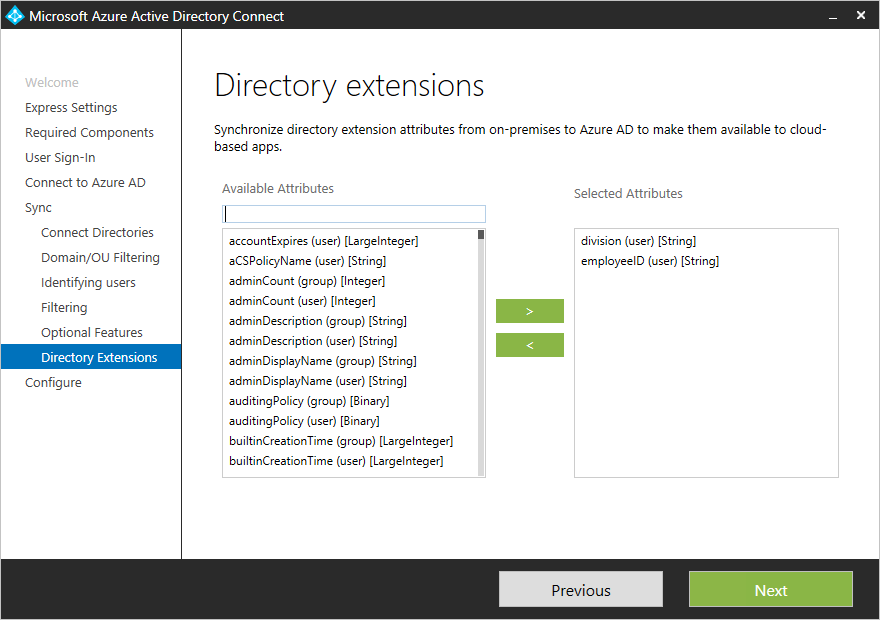
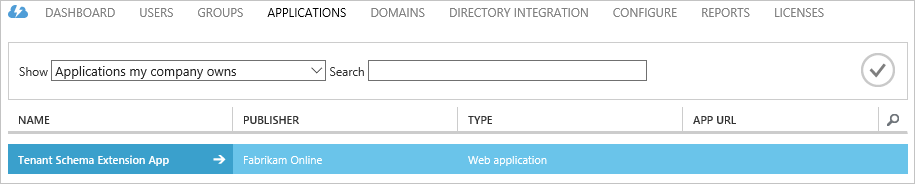
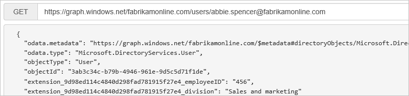

<properties
   pageTitle="Synchronisieren von Azure AD verbinden: Directory-Erweiterungen | Microsoft Azure"
   description="In diesem Thema werden die Funktion für die Directory-Erweiterungen in Azure AD-Verbindung herstellen."
   services="active-directory"
   documentationCenter=""
   authors="AndKjell"
   manager="femila"
   editor=""/>

<tags
   ms.service="active-directory"
   ms.devlang="na"
   ms.topic="article"
   ms.tgt_pltfrm="na"
   ms.workload="identity"
   ms.date="08/19/2016"
   ms.author="billmath"/>

# Synchronisieren von Azure AD verbinden: Directory-Erweiterungen
Verzeichnis Extensions können Sie das Schema aus dem lokalen Active Directory in Azure AD mit Ihrer eigenen Attributen zu erweitern. Dieses Feature können Sie Verarbeitung von Attributen, die Sie zum Verwalten von lokalen weiterhin LOB-apps zu erstellen. Diese Attribute können über [Azure AD Graph Directory Erweiterungen](https://msdn.microsoft.com/Library/Azure/Ad/Graph/howto/azure-ad-graph-api-directory-schema-extensions) oder [Microsoft Graph](https://graph.microsoft.io/)genutzt werden. Sie können die Attribute verfügbar sind, mithilfe von [Azure AD Graph-Explorer](https://graphexplorer.cloudapp.net) und [Microsoft Graph-Explorer](https://graphexplorer2.azurewebsites.net/) anzeigen.

Zurzeit verbraucht keine Office 365 Arbeitsbelastung diese Attribute.

Sie konfigurieren, welche zusätzlichen Attribute, die Sie im Assistenten zum Installieren von benutzerdefinierten Einstellungen Pfad synchronisieren möchten.
 die Installation zeigt die folgenden Attributen, die Kandidaten gültig sind:

- Benutzer- und Objekttypen
- Eindeutiges Attribute: Zeichenfolge "," Boolean "," Integer "," Binärzahl
- Mehrwertige Attribute: String, Binary

Die Liste der Attribute wird aus dem Cache erstellt während der Installation von Azure AD verbinden gelesen. Wenn Sie mit zusätzlichen Attributen Active Directory-Schema erweitert haben, die [Schema muss aktualisiert werden,](active-directory-aadconnectsync-installation-wizard.md#refresh-directory-schema) bevor diese neue Attribute sichtbar sind.

Ein Objekt kann bis zu 100 Directory Erweiterungen Attribute aufweisen. Maximale Länge ist 250 Zeichen. Wenn ein Attributwert länger ist, ist von der Synchronisierung-Engine abgeschnitten.

Während der Installation von Azure AD verbinden ist eine Anwendung registriert, wenn diese Attribute verfügbar sind. Sie können diese Anwendung Azure-Portal anzeigen.  

Diese Attribute sind jetzt über Graph erhältlich:  

Die Attribute werden mit der Erweiterung mit dem Präfix\_{AppClientId}\_. Die AppClientId hat den gleichen Wert für alle Attribute in Ihrem Verzeichnis Azure AD-.

## Nächste Schritte
Erfahren Sie mehr über die Konfiguration [Azure AD verbinden synchronisieren](active-directory-aadconnectsync-whatis.md) .

Erfahren Sie mehr über die [Integration von Ihrem lokalen Identitäten mit Azure Active Directory](active-directory-aadconnect.md).
